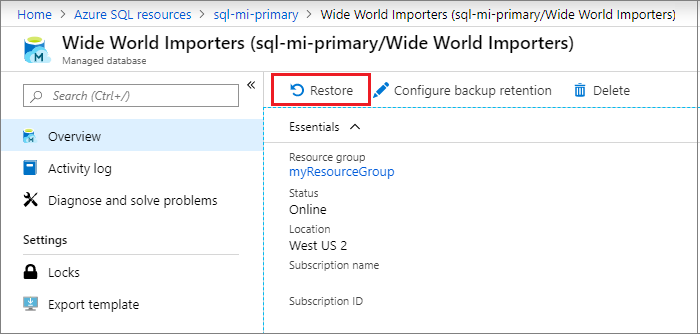
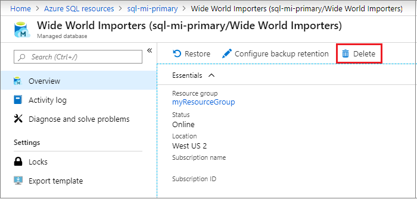

# Restore a SQL managed instance database to a previous point in time

Point-in-time restore (PITR) enables you to create a database as a copy of another database at some point in time in the past. This article describes how to perform a point-in-time restore of a database in a managed instance.

Point-in-time restore can be used in recovery scenarios, such as incidents caused by errors, incorrectly loaded data, deletion of crucial data, and other issues as well as simply for testing or auditing purposes. Depending on your database settings, backup files are kept for a period between 7 and 35 days.

Point-in-time restore can be used to:

1. Restore a database from an existing database.
1. Restore a database from a deleted database.

Additionally, with a managed instance, point-in-time restore can be used to: 

1. Restore a database to the same managed instance.
1. Restore a database to another managed instance.


> [!NOTE]
> Point-in-time restore of a whole managed instance is not possible. What is possible, and explained in this article, is point-in-time restore of a database hosted on a managed instance.


## Limitations

When restoring to another managed instance, both instances must be in the same subscription and region. Cross-region and cross-subscription restores are not currently supported.

> [!WARNING]
> Be careful with the storage size of your managed instance – depending on size of restoring data, you may run out of instance storage. If there is not enough space for restored data, use an alternative approach.

The following table shows point-in-time recovery scenarios for managed instance:

|           |Restore existing DB| Restore existing DB|Restore dropped DB| Restore dropped DB|
|:----------|:----------|:----------|:----------|:----------|
|Destination| Same MI|Another MI |Same MI|Another MI |
|Azure portal| Yes|No |No|No|
|Azure CLI|Yes |Yes |No|No|
|PowerShell| Yes|Yes |Yes|Yes|


## Restore existing database

Restore an existing database to the same instance using the Azure portal, Powershell, or the Azure CLI. Restore a database to another instance using Powershell or Azure CLI by specifying the target managed instance and resource group properties. If these parameters are not specified, by default the database will be restored to the existing instance. Restoring to another instance is not currently supported through the Azure portal. 

# [Portal](#tab/azure-portal)

1. Sign into the [Azure portal](https://portal.azure.com). 
1. Navigate to your managed instance and select the database you want to restore. 
1. Select **Restore** on the database page. 

    

1. On the **Restore** page, select the point for the date and time in history you want to restore the database to.
1. Select **Confirm** to restore your database. This starts the restore process, which creates a new database and is populated with data from the original database at the desired point in time. For more information about the recovery process, see [recovery time](sql-database-recovery-using-backups.md#recovery-time). 

1. Find managed instance
1. Select database you want to restore
1. On database screen, click Restore action
1. On Restore screen, select date and time of point in history to which you are restoring database
1. After confirming, restore process will start and, depending on size of database, new database will be created and populated with data from the original database at the desired point in time. For duration of restore process check recovery using backups article.


# [PowerShell](#tab/azure-powershell)

If you don't already have Azure PowerShell installed, see [install the Azure PowerShell module](https://docs.microsoft.com/powershell/azure/install-az-ps).

To restore the database using PowerShell, update the parameters with your values and run the following command:

```powershell-interactive
$subscriptionId = "<Subscription ID>"
$resourceGroupName = "<Resource group name>"
$managedInstanceName = "<Managed instance name>"
$databaseName = "<Source-database>"
$pointInTime = "2018-06-27T08:51:39.3882806Z"
$targetDatabase = "<Name of new database to be created>"
 
Get-AzSubscription -SubscriptionId $subscriptionId
Select-AzSubscription -SubscriptionId $subscriptionId
 
Restore-AzSqlInstanceDatabase -FromPointInTimeBackup `
                              -ResourceGroupName $resourceGroupName `
                               -InstanceName $managedInstanceName `
                               -Name $databaseName `
                               -PointInTime $pointInTime `
                               -TargetInstanceDatabaseName $targetDatabase `
```

To restore the database to another managed instance, set the target resource group name and target managed instance name.  

```powershell-interactive
$targetResourceGroupName = "<Resource group of target managed instance>"
$targetInstanceName = "<Target managed instance name>"

Restore-AzSqlInstanceDatabase -FromPointInTimeBackup `
                              -ResourceGroupName $resourceGroupName `
                              -InstanceName $managedInstanceName `
                              -Name $databaseName `
                              -PointInTime $pointInTime `
                              -TargetInstanceDatabaseName $targetDatabase `
                              -TargetResourceGroupName $targetResourceGroupName `
                              -TargetInstanceName $targetInstanceName 
```

For details, see [Restore-AzSqlInstanceDatabase](https://docs.microsoft.com/powershell/module/az.sql/restore-azsqlinstancedatabase).


# [Azure CLI](#tab/azure-cli)

If you don't already have the Azure CLI installed, see [Install the Azure CLI](/cli/azure/install-azure-cli?view=azure-cli-latest).

To restore the database using the Azure CLI, update the parameters with your values and run the following command:


```azurecli-interactive
az sql midb restore -g mygroupname --mi myinstancename |
-n mymanageddbname --dest-name targetmidbname --time "2018-05-20T05:34:22"
```


To restore the database to another managed instance, set the target resource group name and target managed instance name.  

```azurecli-interactive
az sql midb restore -g mygroupname --mi myinstancename -n mymanageddbname |
       --dest-name targetmidbname --time "2018-05-20T05:34:22" |
       --dest-resource-group mytargetinstancegroupname |
       --dest-mi mytargetinstancename
```

For detailed explanation of available parameters, see [managed instance CLI](https://docs.microsoft.com/cli/azure/sql/midb?view=azure-cli-latest#az-sql-midb-restore). 

---

## Restore a deleted database 
 
Restoring a deleted database can only be done with PowerShell. The database can be restored to the same instance, or another instance. 

To restore a deleted database using PowerShell, update the parameters with your values and run the following command:

```powershell-interactive
$subscriptionId = "<Subscription ID"
Get-AzSubscription -SubscriptionId $subscriptionId
Select-AzSubscription -SubscriptionId $subscriptionId

$resourceGroupName = "<Resource group name>"
$managedInstanceName = "<Managed instance name>"
$deletedDatabaseName = "<Source database name>"

$deleted_db = Get-AzSqlDeletedInstanceDatabaseBackup -ResourceGroupName $resourceGroupName `
            -InstanceName $managedInstanceName -DatabaseName $deletedDatabaseName 

$pointInTime = "2018-06-27T08:51:39.3882806Z"
$properties = New-Object System.Object
$properties | Add-Member -type NoteProperty -name CreateMode -Value "PointInTimeRestore"
$properties | Add-Member -type NoteProperty -name RestorePointInTime -Value $pointInTime
$properties | Add-Member -type NoteProperty -name RestorableDroppedDatabaseId -Value $deleted_db.Id
```

To restore the deleted database to another instance,  change the resource group name and managed instance name.

The location parameter should match the location of the resource group and managed instance.

```powershell-interactive
$resourceGroupName = "<Second resource group name>"
$managedInstanceName = "<Second managed instance name>"

$location = "West Europe"

$restoredDBName = "WorldWideImportersPITR"
$resource_id = "subscriptions/$subscriptionId/resourceGroups/$resourceGroupName/providers/Microsoft.Sql/managedInstances/$managedInstanceName/databases/$restoredDBName"

New-AzResource -Location $location -Properties $properties 
        -ResourceId $resource_id -ApiVersion "2017-03-01-preview" -Force
```

## Overwrite existing database 
 
To overwrite an existing database, you must also:

1. DROP the existing database that you want to overwrite.
1. Rename the point-in-time restored database to the name of the database that was dropped. 


### DROP original database 
 
Dropping the database can be done with the Azure portal, PowerShell, or the Azure CLI. 

You can also drop the database by connecting to the managed instance directly, launching SQL Server Management Studio (SSMS) and running the below Transact-SQL (T-SQL) command.

```sql
DROP DATABASE WorldWideImporters;
```

Use one of the following methods to connect to your managed instance database: 

- [VM method](https://docs.microsoft.com/en-us/azure/sql-database/sql-database-managed-instance-configure-vm)
- [Point-to-site](https://docs.microsoft.com/en-us/azure/sql-database/sql-database-managed-instance-configure-p2s)
- [Public endpoint](https://docs.microsoft.com/en-us/azure/sql-database/sql-database-managed-instance-public-endpoint-configure)

# [Portal](#tab/azure-portal)

In the Azure portal, select the database from the managed instance and select **Delete**.

   

# [PowerShell](#tab/azure-powershell)

Use the following PowerShell command to drop an existing database from a managed instance: 

```powershell
$resourceGroupName = "<Resource group name>"
$managedInstanceName = "<Managed instance name>"
$databaseName = "<Source database>"

Remove-AzSqlInstanceDatabase -Name $databaseName -InstanceName $managedInstanceName -ResourceGroupName $resourceGroupName
```

# [Azure CLI](#tab/azure-cli)

Use the following Azure CLI command to drop an existing database from a managed instance: 

```azurecli-interactive
az sql midb delete -g mygroupname --mi myinstancename -n mymanageddbname
```

---


### ALTER new database name to original

Connect directly to the managed instance, launch SQL Server Management Studio, and then execute the following Transact-SQL (T-SQL) query to change the name of the restored database to that of the dropped database you intended to overwrite. 


```sql
ALTER WorldWideImportersPITR MODIFY NAME = WorldWideImporters;
```


Use one of the following methods to connect to your managed instance database: 

- [VM method](https://docs.microsoft.com/en-us/azure/sql-database/sql-database-managed-instance-configure-vm)
- [Point-to-site](https://docs.microsoft.com/en-us/azure/sql-database/sql-database-managed-instance-configure-p2s)
- [Public endpoint](https://docs.microsoft.com/en-us/azure/sql-database/sql-database-managed-instance-public-endpoint-configure)

## Next steps

Learn about [long-term retention](sql-database-long-term-retention.md) and [automated backups](sql-database-automated-backups.md). 