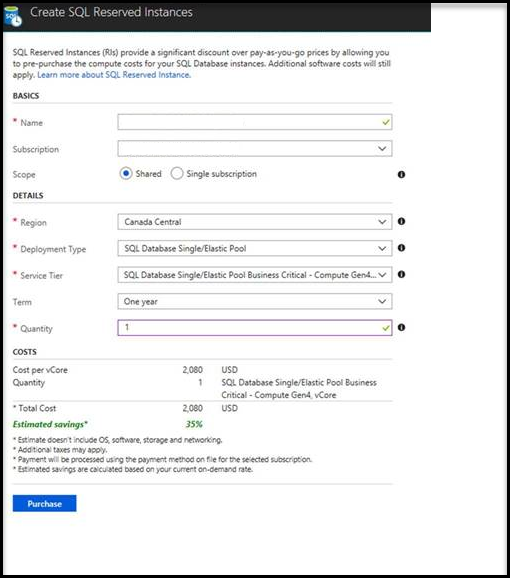

# Prepay for SQL Database instances with SQL Reserved Instances

Prepay for Azure SQL Database instances and save money with SQL Reserved Instances. For more information, see [SQL Reserved Instances offering](https://azure.microsoft.com/pricing/).

You can buy Azure reserved instances in the [Azure portal](https://portal.azure.com). To buy a Reserved Instance:
-	You must be in an Owner role for at least one Enterprise or Pay-As-You-Go subscription.
-	For Enterprise subscriptions, Reserved Instance purchases must be enabled in the [EA portal](https://ea.azure.com).
-   For Cloud Solution Provider (CSP) program only the admin agents or sales agents can purchase the reserved instances.

[!IMPORTANT]
You must use one of the methods described below to identify the correctly VM size for a reservation purchase.

## Determine the right SQL size before purchase

???

## Buy a SQL Reserved Instance
1. Sign in to the [Azure portal](https://portal.azure.com).
2. Select **All services** > **Reservations**.
3. Select **Add** and then in the Select Product Type pane, select **SQL Database** to purchase a new SQL Reserved Instance.
4. Fill in the required fields. Running VM instances that match the attributes you select qualify to get the Reserved Instance discount. The actual number of your VM instances that get the discount depend on the scope and quantity selected.

    | Field      | Description|
    |:------------|:--------------|
    |Name        |The name of this Reserved Instance.| 
    |Subscription|The subscription used to pay for the Reserved Instance. The payment method on the subscription is charged the upfront costs for the Reserved Instance. The subscription type must be an enterprise agreement (offer number: MS-AZR-0017P) or Pay-As-You-Go (offer number: MS-AZR-0003P). For an enterprise subscription, the charges are deducted from the enrollment's monetary commitment balance or charged as overage. For Pay-As-You-Go subscription, the charges are billed to the credit card or invoice payment method on the subscription.|    
    |Scope       |The Reserved Instance’s scope can cover one subscription or multiple subscriptions (shared scope). If you select: <ul><li>Single subscription - The Reserved Instance discount is applied to SQL Database instances in this subscription. </li><li>Shared - The Reserved Instance discount is applied to SQL Database instances running in any subscriptions within your billing context. For enterprise customers, the shared scope is the enrollment and includes all subscriptions (except dev/test subscriptions) within the enrollment. For Pay-As-You-Go customers, the shared scope is all Pay-As-You-Go subscriptions created by the account administrator.</li></ul>|
    |Region      |The Azure region that’s covered by the Reserved Instance.|    
    |Deployment Type|The SQL deployment type that you want to buy the reservation for.|
    |Service Tier|The service tier for the SQL Database Instances.
    |Term        |One year or three years.|
    |Quantity    |The number of instances being purchased within the Reserved Instance. The quantity is the number of running SQL Database instances that can get the billing discount. For example, if you are running 10 SQL Database instances in the East US, then you would specify quantity as 10 to maximize the benefit for all running machines. |

    

5. Review the cost of the Reserved Instance in the **Costs** section.
6. Select **Purchase**.
7. Select **View this Reservation** to see the status of your purchase.

## Next steps 
The Reserved Instance discount is applied automatically to the number of SQL Database instances that match the Reserved Instance scope and attributes. You can update the scope of the Reserved Instance through [Azure portal](https://portal.azure.com), PowerShell, CLI or through the API. 

To learn how to manage a reserved instance, see [Manage reserved instances in Azure](../billing/billing-manage-reserved-vm-instance.md).

To learn more about Azure reserved instances, see the following articles:

- [What are Azure Reserved Instances?](../billing/billing-save-compute-costs-reservations.md)
- [Manage reserved instances in Azure](../billing/billing-manage-reserved-vm-instance.md)
- [Understand how the reserved instance discount is applied](../billing/billing-understand-vm-reservation-charges.md)
- [Understand reserved instance usage for your Pay-As-You-Go subscription](../billing/billing-understand-reserved-instance-usage.md)
- [Understand reserved instance usage for your Enterprise enrollment](../billing/billing-understand-reserved-instance-usage-ea.md)
- [Windows software costs not included with reserved instances](../billing/billing-reserved-instance-windows-software-costs.md)
- [Reserved instances in Partner Center Cloud Solution Provider (CSP) program](https://docs.microsoft.com/partner-center/azure-reservations)

## Need help? Contact support

If you still have further questions, [contact support](https://portal.azure.com/?#blade/Microsoft_Azure_Support/HelpAndSupportBlade) to get your issue resolved quickly.

