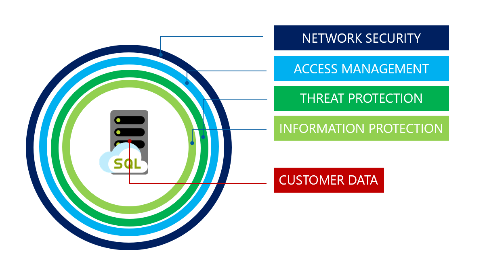
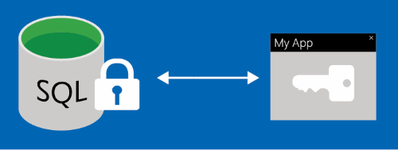

# An overview of Azure SQL Database security capabilities

This article outlines the basics of securing the data tier of an application using Azure SQL Database. The security strategy described follows the layered defense-in-depth approach as shown in the picture below, and moves from the outside in:

## Network security

Microsoft Azure SQL Database provides a relational database service for cloud and enterprise applications. To help protect customer data, firewalls prevent network access to the database server until access is explicitly granted based on IP address or Azure Virtual network traffic origin.

### IP firewall rules

IP firewall rules grant access to databases based on the originating IP address of each request. For more information, see [Overview of Azure SQL Database and Azure Synapse Analytics firewall rules](sql-database-firewall-configure.md).

### Virtual network firewall rules

[Virtual network service endpoints](../virtual-network/virtual-network-service-endpoints-overview.md) extend your virtual network connectivity over the Azure backbone and enable Azure SQL Database to identify the virtual network subnet that traffic originates from. To allow traffic to reach Azure SQL Database, use the SQL [service tags](../virtual-network/security-overview.md) to allow outbound traffic through Network Security Groups.

[Virtual network rules](sql-database-vnet-service-endpoint-rule-overview.md) enable Azure SQL Database to only accept communications that are sent from selected subnets inside a virtual network.

> [!NOTE]
> Controlling access with firewall rules does *not* apply to **a managed instance**. For more information about the networking configuration needed, see [connecting to a managed instance](sql-database-managed-instance-connect-app.md)

## Access management

> [!IMPORTANT]
> Managing databases and database servers within Azure is controlled by your portal user account's role assignments. For more information on this article, see [Role-based access control in Azure portal](../role-based-access-control/overview.md).

### Authentication

Authentication is the process of proving the user is who they claim to be. Azure SQL Database supports two types of authentication:

- **SQL authentication**:

    SQL database authentication refers to the authentication of a user when connecting to [Azure SQL Database](sql-database-technical-overview.md) using username and password. During the database server creation for the database, a "Server admin" login with a username and password must be specified. Using these credentials, a “server admin” can authenticate to any database on that database server as the database owner. After that, additional SQL logins and users can be created by the server admin, which enable users to connect using username and password.

- **Azure Active Directory authentication**:

    Azure Active Directory authentication is a mechanism of connecting to [Azure SQL Database](sql-database-technical-overview.md) and [Azure Synapse Analytics](../synapse-analytics/sql-data-warehouse/sql-data-warehouse-overview-what-is.md) by using identities in Azure Active Directory (Azure AD). Azure AD authentication allows administrators to centrally manage the identities and permissions of database users along with other Microsoft services in one central location. This includes the minimization of password storage and enables centralized password rotation policies.

     A server admin called the **Active Directory administrator** must be created to use Azure AD authentication with SQL Database. For more information, see [Connecting to SQL Database By Using Azure Active Directory Authentication](sql-database-aad-authentication.md). Azure AD authentication supports both managed and federated accounts. The federated accounts support Windows users and groups for a customer domain federated with Azure AD.

    Additional Azure AD authentication options available are [Active Directory Universal Authentication for SQL Server Management Studio](sql-database-ssms-mfa-authentication.md) connections including [Multi-Factor Authentication](../active-directory/authentication/concept-mfa-howitworks.md) and [Conditional Access](sql-database-conditional-access.md).

> [!IMPORTANT]
> Managing databases and servers within Azure is controlled by your portal user account's role assignments. For more information on this article, see [Role-based access control in Azure portal](../role-based-access-control/overview.md). Controlling access with firewall rules does *not* apply to **a managed instance**. Please see the following article on [connecting to a managed instance](sql-database-managed-instance-connect-app.md) for more information about the networking configuration needed.

## Authorization

Authorization refers to the permissions assigned to a user within an Azure SQL Database, and determines what the user is allowed to do. Permissions are controlled by adding user accounts to [database roles](/sql/relational-databases/security/authentication-access/database-level-roles) and assigning database-level permissions to those roles or by granting the user certain [object-level permissions](/sql/relational-databases/security/permissions-database-engine). For more information, see [Logins and users](sql-database-manage-logins.md)

As a best practice, create custom roles when needed. Add users to the role with the least privileges required to do their job function. Do not assign permissions directly to users. The server admin account is a member of the built-in db_owner role, which has extensive permissions and should only be granted to few users with administrative duties. For Azure SQL Database applications, use the [EXECUTE AS](/sql/t-sql/statements/execute-as-clause-transact-sql) to specify the execution context of the called module or use [Application Roles](/sql/relational-databases/security/authentication-access/application-roles) with limited permissions. This practice ensures that the application that connects to the database has the least privileges needed by the application. Following these best practices also fosters separation of duties.

### Row-level security

Row-Level Security enables customers to control access to rows in a database table based on the characteristics of the user executing a query (for example, group membership or execution context). Row-Level Security can also be used to implement custom Label-based security concepts. For more information, see [Row-Level security](/sql/relational-databases/security/row-level-security).

## Threat protection

SQL Database secures customer data by providing auditing and threat detection capabilities.

### SQL auditing in Azure Monitor logs and Event Hubs

SQL Database auditing tracks database activities and helps to maintain compliance with security standards by recording database events to an audit log in a customer-owned Azure storage account. Auditing allows users to monitor ongoing database activities, as well as analyze and investigate historical activity to identify potential threats or suspected abuse and security violations. For more information, see Get started with [SQL Database Auditing](sql-database-auditing.md).  

### Advanced Threat Protection

Advanced Threat Protection is analyzing your SQL Server logs to detect unusual behavior and potentially harmful attempts to access or exploit databases. Alerts are created for suspicious activities such as SQL injection, potential data infiltration, and brute force attacks or for anomalies in access patterns to catch privilege escalations and breached credentials use. Alerts are viewed from the  [Azure Security Center](https://azure.microsoft.com/services/security-center/), where the details of the suspicious activities are provided and recommendations for further investigation given along with actions to mitigate the threat. Advanced Threat Protection can be enabled per server for an additional fee. For more information, see [Get started with SQL Database Advanced Threat Protection](sql-database-threat-detection.md).

## Information protection and encryption

### Transport Layer Security TLS (Encryption-in-transit)

SQL Database secures customer data by encrypting data in motion with [Transport Layer Security](https://support.microsoft.com/help/3135244/tls-1-2-support-for-microsoft-sql-server).

Sql Server enforces encryption (SSL/TLS) at all times for all connections. This ensures all data is encrypted "in transit" between the client and server irrespective of the setting of **Encrypt** or **TrustServerCertificate** in the connection string.

As a best practice, recommend that in your application's connection string you specify an encrypted connection and _**not**_ trust the server certificate. This forces your application to verify the server certificate and thus prevents your application from being vulnerable to man in the middle type attacks.

For example when using the ADO.NET driver this is accomplished via  **Encrypt=True** and **TrustServerCertificate=False**. If you obtain your connection string from the Azure portal, it will have the correct settings.

> [!IMPORTANT]
> Note that some non-Microsoft drivers may not use TLS by default or rely on an older version of TLS (<1.2) in order to function. In this case SQL Server still allows you to connect to your database. However, we recommend that you evaluate the security risks of allowing such drivers and application to connect to SQL Database, especially if you store sensitive data.
>
> For further information about TLS and connectivity, see [TLS considerations](sql-database-connect-query.md#tls-considerations-for-sql-database-connectivity)

### Transparent Data Encryption (Encryption-at-rest)

[Transparent Data Encryption (TDE) for Azure SQL Database](transparent-data-encryption-azure-sql.md) adds a layer of security to help protect data at rest from unauthorized or offline access to raw files or backups. Common scenarios include datacenter theft or unsecured disposal of hardware or media such as disk drives and backup tapes. TDE encrypts the entire database using an AES encryption algorithm, which doesn’t require application developers to make any changes to existing applications.

In Azure, all newly created SQL databases are encrypted by default and the database encryption key is protected by a built-in server certificate.  Certificate maintenance and rotation are managed by the service and requires no input from the user. Customers who prefer to take control of the encryption keys can manage the keys in [Azure Key Vault](../key-vault/key-vault-secure-your-key-vault.md).

### Key management with Azure Key Vault

[Bring Your Own Key](transparent-data-encryption-byok-azure-sql.md) (BYOK) support for [Transparent Data Encryption](/sql/relational-databases/security/encryption/transparent-data-encryption) (TDE) allows customers to take ownership of key management and rotation using [Azure Key Vault](../key-vault/key-vault-secure-your-key-vault.md), Azure’s cloud-based external key management system. If the database's access to the key vault is revoked, a database cannot be decrypted and read into memory. Azure Key Vault provides a central key management platform, leverages tightly monitored hardware security modules (HSMs), and enables separation of duties between management of keys and data to help meet security compliance requirements.

### Always Encrypted (Encryption-in-use)

[Always Encrypted](/sql/relational-databases/security/encryption/always-encrypted-database-engine) is a feature designed to protect sensitive data stored in specific database columns from access (for example, credit card numbers, national identification numbers, or data on a _need to know_ basis). This includes database administrators or other privileged users who are authorized to access the database to perform management tasks, but have no business need to access the particular data in the encrypted columns. The data is always encrypted, which means the encrypted data is decrypted only for processing by client applications with access to the encryption key.  The encryption key is never exposed to SQL and can be stored either in the [Windows Certificate Store](sql-database-always-encrypted.md) or in [Azure Key Vault](sql-database-always-encrypted-azure-key-vault.md).

### Dynamic data masking

SQL Database dynamic data masking limits sensitive data exposure by masking it to non-privileged users. Dynamic data masking automatically discovers potentially sensitive data in Azure SQL Database and provides actionable recommendations to mask these fields, with minimal impact on the application layer. It works by obfuscating the sensitive data in the result set of a query over designated database fields, while the data in the database is not changed. For more information, see [Get started with SQL Database dynamic data masking](sql-database-dynamic-data-masking-get-started.md).

## Security management

### Vulnerability assessment

[Vulnerability assessment](sql-vulnerability-assessment.md) is an easy to configure service that can discover, track, and help remediate potential database vulnerabilities with the goal to proactively improve overall database security. Vulnerability assessment (VA) is part of the advanced data security (ADS) offering, which is a unified package for advanced SQL security capabilities. Vulnerability assessment can be accessed and managed via the central SQL ADS portal.

### Data discovery & classification

Data discovery & classification (currently in preview) provides advanced capabilities built into Azure SQL Database for discovering, classifying, labeling, and protecting the sensitive data in your databases. Discovering and classifying your utmost sensitive data (business/financial, healthcare, personal data, etc.) can play a pivotal role in your organizational Information protection stature. It can serve as infrastructure for:

- Various security scenarios, such as monitoring (auditing) and alerting on anomalous access to sensitive data.
- Controlling access to, and hardening the security of, databases containing highly sensitive data.
- Helping meet data privacy standards and regulatory compliance requirements.

For more information, see [Get started with data discovery & classification](sql-database-data-discovery-and-classification.md).

### Compliance

In addition to the above features and functionality that can help your application meet various security requirements, Azure SQL Database also participates in regular audits, and has been certified against a number of compliance standards. For more information, see the [Microsoft Azure Trust Center](https://gallery.technet.microsoft.com/Overview-of-Azure-c1be3942) where you can find the most current list of SQL Database compliance certifications.

## Next steps

- For a discussion of the use of logins, user accounts, database roles, and permissions in SQL Database, see [Manage logins and user accounts](sql-database-manage-logins.md).
- For a discussion of database auditing, see [SQL Database auditing](sql-database-auditing.md).
- For a discussion of threat detection, see [SQL Database threat detection](sql-database-threat-detection.md).
