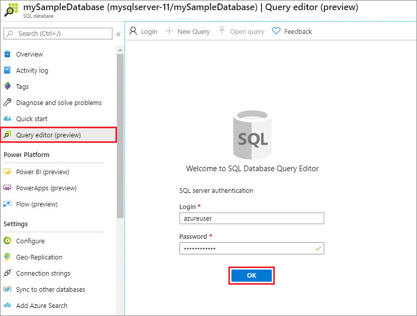

# Quickstart: Create an Azure SQL Database single database

In this quickstart, you use the Azure portal, a PowerShell script, or an Azure CLI script to create a single Azure SQL Database. You then query the database using **Query editor** in the Azure portal. 

A [single database](sql-database-single-database.md) is the quickest and simplest deployment option for Azure SQL Database. You manage a single database within a [logical SQL server](sql-database-servers.md), which is inside an [Azure resource group](../azure-resource-manager/management/overview.md) in a specified Azure region. In this quickstart, you create a new resource group and logical SQL server for the new database.

You can create a single database in the *provisioned* or *serverless* compute tier. A provisioned database is pre-allocated a fixed amount of compute resources, including CPU and memory, and uses one of two [purchasing models](sql-database-purchase-models.md). This quickstart creates a provisioned database using the [vCore-based](sql-database-service-tiers-vcore.md) purchasing model, but you can also choose a [DTU-based](sql-database-service-tiers-DTU.md) model. 

The serverless compute tier is only available in the vCore-based purchasing model, and has an auto-scaled range of compute resources, including CPU and memory. To create a single database in the serverless compute tier, see [Create a serverless database](sql-database-serverless.md#create-new-database-in-serverless-compute-tier).

## Prerequisite

- An active Azure subscription. If you don't have one, [create a free account](https://azure.microsoft.com/free/). 

## Create a single database

[!INCLUDE [sql-database-create-single-database](includes/sql-database-create-single-database.md)]

## Query the database

Once your database is created, you can use the built-in **Query editor** in the Azure portal to connect to the database and query the data.

1. In the portal, search for and select **SQL databases**, and then select your database from the list.
1. On the **SQL Database** page for your database, select **Query editor (preview)** in the left menu.
1. Enter your server admin login information, and select **OK**.
   
   

1. Enter the following query in the **Query editor** pane.

   ```sql
   SELECT TOP 20 pc.Name as CategoryName, p.name as ProductName
   FROM SalesLT.ProductCategory pc
   JOIN SalesLT.Product p
   ON pc.productcategoryid = p.productcategoryid;
   ```

1. Select **Run**, and then review the query results in the **Results** pane.

   

1. Close the **Query editor** page, and select **OK** when prompted to discard your unsaved edits.

## Clean up resources

Keep the resource group, server, and single database to go on to the next steps, and learn how to connect and query your database with different methods.

When you're finished using these resources, you can delete the resource group you created, which will also delete the server and single database within it.

### [Portal](#tab/azure-portal)

To delete **myResourceGroup** and all its resources using the Azure portal:

1. In the portal, search for and select **Resource groups**, and then select **myResourceGroup** from the list.
1. On the resource group page, select **Delete resource group**.
1. Under **Type the resource group name**, enter *myResourceGroup*, and then select **Delete**.

### [Azure CLI](#tab/azure-cli)

To delete the resource group and all its resources, run the following Azure CLI command, using the name of your resource group:

```azurecli-interactive
az group delete --name <your resource group>
```

### [PowerShell](#tab/azure-powershell)

To delete the resource group and all its resources, run the following PowerShell cmdlet, using the name of your resource group:

```azurepowershell-interactive
Remove-AzResourceGroup -Name <your resource group>
```

---

## Next steps

[Connect and query](sql-database-connect-query.md) your database using different tools and languages:
> [!div class="nextstepaction"]
> [Connect and query using SQL Server Management Studio](sql-database-connect-query-ssms.md)
> 
> [Connect and query using Azure Data Studio](/sql/azure-data-studio/quickstart-sql-database?toc=/azure/sql-database/toc.json)
