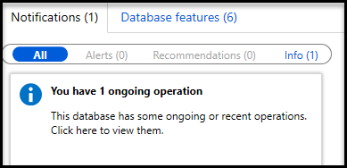
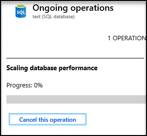

# Scale single database resources in Azure SQL Database

<<<<<<< HEAD
This article describes how to scale the compute and storage resources available for a single database in the provisioned compute tier. Alternatively, the [serverless (preview) compute tier](sql-database-serverless.md) provides compute auto-scaling and bills per second for compute used.
=======
This article describes how to scale the compute and storage resources available for a single database in the provisioned compute tier. 
>>>>>>> 1a6a646aa504bc928739bac430da3c816e015075

[!INCLUDE [updated-for-az](../../includes/updated-for-az.md)]
> [!IMPORTANT]
> The PowerShell Azure Resource Manager module is still supported by Azure SQL Database, but all future development is for the Az.Sql module. For these cmdlets, see [AzureRM.Sql](https://docs.microsoft.com/powershell/module/AzureRM.Sql/). The arguments for the commands in the Az module and in the AzureRm modules are substantially identical.

## Change compute size (vCores or DTUs)

After initially picking the number of vCores or DTUs, you can scale a single database up or down dynamically based on actual experience using the [Azure portal](sql-database-single-databases-manage.md#manage-an-existing-sql-database-server), [Transact-SQL](https://docs.microsoft.com/sql/t-sql/statements/alter-database-transact-sql?view=azuresqldb-current#examples-1), [PowerShell](/powershell/module/az.sql/set-azsqldatabase), the [Azure CLI](/cli/azure/sql/db#az-sql-db-update), or the [REST API](https://docs.microsoft.com/rest/api/sql/databases/update).

The following video shows dynamically changing the service tier and compute size to increase available DTUs for a single database.

> [!VIDEO https://channel9.msdn.com/Blogs/Azure/Azure-SQL-Database-dynamically-scale-up-or-scale-down/player]
>

> [!IMPORTANT]
> Under some circumstances, you may need to shrink a database to reclaim unused space. For more information, see [Manage file space in Azure SQL Database](sql-database-file-space-management.md).

### Impact of changing service tier or rescaling compute size

Changing the service tier or compute size of a single database mainly involves the service performing the following steps:

1. Create new compute instance for the database  

    A new compute instance for the database is created with the requested service tier and compute size. For some combinations of service tier and compute size changes, a replica of the database must be created in the new compute instance which involves copying data and can strongly influence the overall latency. Regardless, the database remains online during this step, and connections continue to be directed to the database in the original compute instance.

2. Switch routing of connections to new compute instance

    Existing connections to the database in the original compute instance are dropped. Any new connections are established to the database in the new compute instance. For some combinations of service tier and compute size changes, database files are detached and reattached during the switch.  Regardless, the switch can result in a brief service interruption when the database is unavailable generally for less than 30 seconds and often for only a few seconds. If there are long running transactions running when connections are dropped, the duration of this step may take longer in order to recover aborted transactions. [Accelerated Database Recovery](sql-database-accelerated-database-recovery.md) can reduce the impact from aborting long running transactions.

> [!IMPORTANT]
> No data is lost during any step in the workflow.

### Latency of changing service tier or rescaling compute size

The latency to change the service tier or rescale the compute size of a single database or elastic pool is parameterized as follows:

|Service tier|Basic single database,</br>Standard (S0-S1)|Basic elastic pool,</br>Standard (S2-S12), </br>Hyperscale, </br>General Purpose single database or elastic pool|Premium or Business Critical single database or elastic pool|
|:---|:---|:---|:---|
|**Basic single database,</br> Standard (S0-S1)**|&bull; &nbsp;Constant time latency independent of space used</br>&bull; &nbsp;Typically, less than 5 minutes|&bull; &nbsp;Latency proportional to database space used due to data copying</br>&bull; &nbsp;Typically, less than 1 minute per GB of space used|&bull; &nbsp;Latency proportional to database space used due to data copying</br>&bull; &nbsp;Typically, less than 1 minute per GB of space used|
|**Basic elastic pool, </br>Standard (S2-S12), </br>Hyperscale, </br>General Purpose single database or elastic pool**|&bull; &nbsp;Latency proportional to database space used due to data copying</br>&bull; &nbsp;Typically, less than 1 minute per GB of space used|&bull; &nbsp;Constant time latency independent of space used</br>&bull; &nbsp;Typically, less than 5 minutes|&bull; &nbsp;Latency proportional to database space used due to data copying</br>&bull; &nbsp;Typically, less than 1 minute per GB of space used|
|**Premium or Business Critical single database or elastic pool**|&bull; &nbsp;Latency proportional to database space used due to data copying</br>&bull; &nbsp;Typically, less than 1 minute per GB of space used|&bull; &nbsp;Latency proportional to database space used due to data copying</br>&bull; &nbsp;Typically, less than 1 minute per GB of space used|&bull; &nbsp;Latency proportional to database space used due to data copying</br>&bull; &nbsp;Typically, less than 1 minute per GB of space used|

> [!TIP]
> To monitor in-progress operations, see: [Manage operations using the SQL REST API](https://docs.microsoft.com/rest/api/sql/operations/list), [Manage operations using CLI](/cli/azure/sql/db/op), [Monitor operations using T-SQL](/sql/relational-databases/system-dynamic-management-views/sys-dm-operation-status-azure-sql-database) and these two PowerShell commands: [Get-AzSqlDatabaseActivity](/powershell/module/az.sql/get-azsqldatabaseactivity) and [Stop-AzSqlDatabaseActivity](/powershell/module/az.sql/stop-azsqldatabaseactivity).

### Cancelling service tier changes or compute rescaling operations

A service tier change or compute rescaling operation can be canceled.

#### Azure portal

In the database overview blade, navigate to **Notifications** and click on the tile indicating there is an ongoing operation:



Next, click on the button labeled **Cancel this operation**.



#### PowerShell

From a PowerShell command prompt, set the `$ResourceGroupName`, `$ServerName`, and `$DatabaseName`, and then run the following command:

```PowerShell
$OperationName = (az sql db op list --resource-group $ResourceGroupName --server $ServerName --database $DatabaseName --query "[?state=='InProgress'].name" --out tsv)
if(-not [string]::IsNullOrEmpty($OperationName))
    {
        (az sql db op cancel --resource-group $ResourceGroupName --server $ServerName --database $DatabaseName --name $OperationName)
        "Operation " + $OperationName + " has been canceled"
    }
    else
    {
        "No service tier change or compute rescaling operation found"
    }
```

### Additional considerations when changing service tier or rescaling compute size

- If you are upgrading to a higher service tier or compute size, the database max size does not increase unless you explicitly specify a larger size (maxsize).
- To downgrade a database, the database used space must be smaller than the maximum allowed size of the target service tier and compute size.
- When downgrading from **Premium** to the **Standard** tier, an extra storage cost applies if both (1) the max size of the database is supported in the target compute size, and (2) the max size exceeds the included storage amount of the target compute size. For example, if a P1 database with a max size of 500 GB is downsized to S3, then an extra storage cost applies since S3 supports a max size of 500 GB and its included storage amount is only 250 GB. So, the extra storage amount is 500 GB – 250 GB = 250 GB. For pricing of extra storage, see [SQL Database pricing](https://azure.microsoft.com/pricing/details/sql-database/). If the actual amount of space used is less than the included storage amount, then this extra cost can be avoided by reducing the database max size to the included amount.
- When upgrading a database with [geo-replication](sql-database-geo-replication-portal.md) enabled, upgrade its secondary databases to the desired service tier and compute size before upgrading the primary database (general guidance for best performance). When upgrading to a different, upgrading the secondary database first is required.
- When downgrading a database with [geo-replication](sql-database-geo-replication-portal.md) enabled, downgrade its primary databases to the desired service tier and compute size before downgrading the secondary database (general guidance for best performance). When downgrading to a different edition, downgrading the primary database first is required.
- The restore service offerings are different for the various service tiers. If you are downgrading to the **Basic** tier, there is a lower backup retention period. See [Azure SQL Database Backups](sql-database-automated-backups.md).
- The new properties for the database are not applied until the changes are complete.

### Billing during compute rescaling

You are billed for each hour a database exists using the highest service tier + compute size that applied during that hour, regardless of usage or whether the database was active for less than an hour. For example, if you create a single database and delete it five minutes later your bill reflects a charge for one database hour.

## Change storage size

### vCore-based purchasing model

- Storage can be provisioned up to the max size limit using 1GB increments. The minimum configurable data storage is 5 GB
- Storage for a single database can be provisioned by increasing or decreasing its max size using the
 [Azure portal](https://portal.azure.com), [Transact-SQL](https://docs.microsoft.com/sql/t-sql/statements/alter-database-transact-sql?view=azuresqldb-current#examples-1), [PowerShell](/powershell/module/az.sql/set-azsqldatabase), the [Azure CLI](/cli/azure/sql/db#az-sql-db-update), or the [REST API](https://docs.microsoft.com/rest/api/sql/databases/update).
- SQL Database automatically allocates 30% of additional storage for the log files and 32GB per vCore for TempDB, but not to exceed 384GB. TempDB is located on an attached SSD in all service tiers.
- The price of storage for a single database is the sum of data storage and log storage amounts multiplied by the storage unit price of the service tier. The cost of TempDB is included in the vCore price. For details on the price of extra storage, see [SQL Database pricing](https://azure.microsoft.com/pricing/details/sql-database/).

> [!IMPORTANT]
> Under some circumstances, you may need to shrink a database to reclaim unused space. For more information, see [Manage file space in Azure SQL Database](sql-database-file-space-management.md).

### DTU-based purchasing model

- The DTU price for a single database includes a certain amount of storage at no additional cost. Extra storage beyond the included amount can be provisioned for an additional cost up to the max size limit in increments of 250 GB up to 1 TB, and then in increments of 256 GB beyond 1 TB. For included storage amounts and max size limits, see [Single database: Storage sizes and compute sizes](sql-database-dtu-resource-limits-single-databases.md#single-database-storage-sizes-and-compute-sizes).
- Extra storage for a single database can be provisioned by increasing its max size using the Azure portal, [Transact-SQL](https://docs.microsoft.com/sql/t-sql/statements/alter-database-transact-sql?view=azuresqldb-current#examples-1), [PowerShell](/powershell/module/az.sql/set-azsqldatabase), the [Azure CLI](/cli/azure/sql/db#az-sql-db-update), or the [REST API](https://docs.microsoft.com/rest/api/sql/databases/update).
- The price of extra storage for a single database is the extra storage amount multiplied by the extra storage unit price of the service tier. For details on the price of extra storage, see [SQL Database pricing](https://azure.microsoft.com/pricing/details/sql-database/).

> [!IMPORTANT]
> Under some circumstances, you may need to shrink a database to reclaim unused space. For more information, see [Manage file space in Azure SQL Database](sql-database-file-space-management.md).

## P11 and P15 constraints when max size greater than 1 TB

More than 1 TB of storage in the Premium tier is currently available in all regions except: China East, China North, Germany Central, Germany Northeast, West Central US, US DoD regions, and US Government Central. In these regions, the storage max in the Premium tier is limited to 1 TB. The following considerations and limitations apply to P11 and P15 databases with a maximum size greater than 1 TB:

- If the max size for a P11 or P15 database was ever set to a value greater than 1 TB, then can it only be restored or copied to a P11 or P15 database.  Subsequently, the database can be rescaled to a different compute size provided the amount of space allocated at the time of the rescaling operation does not exceed max size limits of the new compute size.
- For active geo-replication scenarios:
  - Setting up a geo-replication relationship: If the primary database is P11 or P15, the secondary(ies) must also be P11 or P15; lower compute size are rejected as secondaries since they are not capable of supporting more than 1 TB.
  - Upgrading the primary database in a geo-replication relationship: Changing the maximum size to more than 1 TB on a primary database triggers the same change on the secondary database. Both upgrades must be successful for the change on the primary to take effect. Region limitations for the more than 1-TB option apply. If the secondary is in a region that does not support more than 1 TB, the primary is not upgraded.
- Using the Import/Export service for loading P11/P15 databases with more than 1 TB is not supported. Use SqlPackage.exe to [import](sql-database-import.md) and [export](sql-database-export.md) data.

## Next steps

For overall resource limits, see [SQL Database vCore-based resource limits - single databases](sql-database-vcore-resource-limits-single-databases.md) and [SQL Database DTU-based resource limits - elastic pools](sql-database-dtu-resource-limits-single-databases.md).
