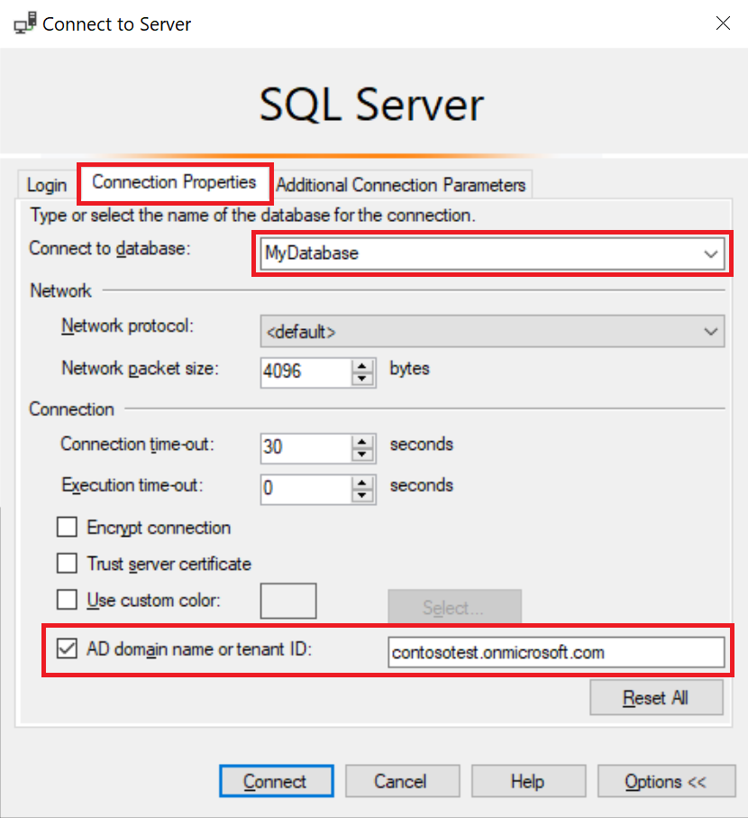
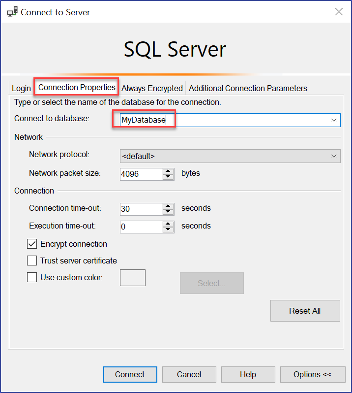

# Using Multi-factor AAD authentication

Azure SQL Database, Azure Managed Instance, and Azure Synapse Analytics support connections from SQL Server Management Studio (SSMS) using *Azure Active Directory - Universal with MFA* authentication. This article discusses the differences between the various authentication options, and also the limitations associated with using Universal Authentication.

**Download the latest SSMS** - On the client computer, download the latest version of SSMS, from [Download SQL Server Management Studio (SSMS)](https://msdn.microsoft.com/library/mt238290.aspx).

For all the features discussed in this article, use at least July 2017, version 17.2. The most recent connection dialog box, should look similar to the following image:

    

## The five authentication options  

Active Directory Universal Authentication supports the two non-interactive authentication methods:
    - `Azure Active Directory - Password` authentication
    - `Azure Active Directory - Integrated` authentication

There are two non-interactive authentication models as well, which can be used in many different applications (ADO.NET, JDCB, ODC, etc.). These two methods never result in pop-up dialog boxes:

- `Azure Active Directory - Password`
- `Azure Active Directory - Integrated`

The interactive method that also supports Azure multi-factor authentication (MFA) is: `Active Directory - Universal with MFA`

Azure MFA helps safeguard access to data and applications while meeting user demand for a simple sign-in process. It delivers strong authentication with a range of easy verification options (phone call, text message, smart cards with pin, or mobile app notification), allowing users to choose the method they prefer. Interactive MFA with Azure AD can result in a pop-up dialog box for validation.

For a description of Multi-Factor Authentication, see [Multi-Factor Authentication](../active-directory/authentication/multi-factor-authentication.md).
For configuration steps, see [Configure Azure SQL Database multi-factor authentication for SQL Server Management Studio](sql-database-ssms-mfa-authentication-configure.md).

### Azure AD domain name or tenant ID parameter

Beginning with [SSMS version 17](https://docs.microsoft.com/sql/ssms/download-sql-server-management-studio-ssms), users that are imported into the current Active Directory from other Azure Active Directories as guest users, can provide the Azure AD domain name, or tenant ID when they connect. Guest users include users invited from other Azure ADs, Microsoft accounts such as outlook.com, hotmail.com, live.com, or other accounts like gmail.com. This information, allows **Active Directory Universal with MFA Authentication** to identify the correct authenticating authority. This option is also required to support Microsoft accounts (MSA) such as outlook.com, hotmail.com, live.com, or non-MSA accounts. All these users who want to be authenticated using Universal Authentication must enter their Azure AD domain name or tenant ID. This parameter represents the current Azure AD domain name or tenant ID,  the Azure Server is linked with. For example, if Azure Server is associated with Azure AD domain `contosotest.onmicrosoft.com` where user `joe@contosodev.onmicrosoft.com` is hosted as an imported user from Azure AD domain `contosodev.onmicrosoft.com`, the domain name required to authenticate this user is `contosotest.onmicrosoft.com`. When the user is a native user of the Azure AD linked to Azure Server, and is not an MSA account, no domain name or tenant ID is required. To enter the parameter (beginning with SSMS version 17.2), in the **Connect to Database** dialog box, complete the dialog box, selecting **Active Directory - Universal with MFA** authentication, click **Options**, complete the **User name** box, and then click the **Connection Properties** tab. Check the **AD domain name or tenant ID** box, and provide authenticating authority, such as the domain name (**contosotest.onmicrosoft.com**) or the GUID of the tenant ID.  
   

If you are running SSMS 18.x or later, The AD domain name or tenant ID is no longer needed for guest users because 18.x or later automatically recognizes it.

   

### Azure AD business to business support

Azure AD users that are supported for Azure AD B2B scenarios as guest users (see [What is Azure B2B collaboration](../active-directory/active-directory-b2b-what-is-azure-ad-b2b.md)) can connect to SQL Database and Azure Synapse only as part of members of a group created in current Azure AD and mapped manually using the Transact-SQL `CREATE USER` statement in a given database. For example, if `steve@gmail.com` is invited to Azure AD `contosotest` (with the Azure AD domain `contosotest.onmicrosoft.com`), an Azure AD group, such as `usergroup` must be created in the Azure AD that contains the `steve@gmail.com` member. Then, this group must be created for a specific  database (that is, MyDatabase) by Azure AD SQL admin or Azure AD DBO  by executing a Transact-SQL `CREATE USER [usergroup] FROM EXTERNAL PROVIDER` statement. After the database user is created, then the user `steve@gmail.com` can log in to `MyDatabase` using the SSMS authentication option `Active Directory – Universal with MFA support`. The usergroup, by default, has only the connect permission and any further data access that will need to be granted in the normal way. Note that user `steve@gmail.com` as a guest user must check the box and add the AD domain name `contosotest.onmicrosoft.com` in the SSMS **Connection Property** dialog box. The **AD domain name or tenant ID** option is only supported for the Universal with MFA connection options, otherwise it is greyed out.

## Universal Authentication limitations

- SSMS and SqlPackage.exe are the only tools currently enabled for MFA through Active Directory Universal Authentication.
- SSMS version 17.2, supports multi-user concurrent access using Universal Authentication with MFA. Version 17.0 and 17.1, restricts a login for an instance of SSMS using Universal Authentication to a single Azure Active Directory account. To log in as another Azure AD account, you must use another instance of SSMS. (This restriction is limited to Active Directory Universal Authentication; you can log in to different server using Active Directory Password Authentication, Active Directory Integrated Authentication, or SQL Server Authentication).
- SSMS supports Active Directory Universal Authentication for Object Explorer, Query Editor, and Query Store visualization.
- SSMS version 17.2 provides DacFx Wizard support for Export/Extract/Deploy Data database. Once a specific user is authenticated through the initial authentication dialog using Universal Authentication, the DacFx Wizard functions the same way it does for all other authentication methods.
- The SSMS Table Designer does not support Universal Authentication.
- There are no additional software requirements for Active Directory Universal Authentication except that you must use a supported version of SSMS.  
- The Active Directory Authentication Library (ADAL) version for Universal authentication was updated to its latest ADAL.dll 3.13.9 available released version. See [Active Directory Authentication Library 3.14.1](https://www.nuget.org/packages/Microsoft.IdentityModel.Clients.ActiveDirectory/).  

## Next steps

- For configuration steps, see [Configure Azure SQL Database multi-factor authentication for SQL Server Management Studio](sql-database-ssms-mfa-authentication-configure.md).
- Grant others access to your database: [SQL Database Authentication and Authorization: Granting Access](sql-database-manage-logins.md)  
- Make sure others can connect through the firewall: [Configure a server-level firewall rule using the Azure portal](sql-database-configure-firewall-settings.md)  
- [Configure and manage Azure Active Directory authentication with SQL Database or Azure Synapse](../azure-sql/database/aad-authentication-configure.md)  
- [Microsoft SQL Server Data-Tier Application Framework (17.0.0 GA)](https://www.microsoft.com/download/details.aspx?id=55088)  
- [SQLPackage.exe](https://docs.microsoft.com/sql/tools/sqlpackage)  
- [Import a BACPAC file to a new Azure SQL Database](../sql-database/sql-database-import.md)  
- [Export an Azure SQL database to a BACPAC file](../azure-sql/database/database-export.md)  
- C# interface [IUniversalAuthProvider Interface](https://msdn.microsoft.com/library/microsoft.sqlserver.dac.iuniversalauthprovider.aspx)  
- When using **Active Directory- Universal with MFA** authentication, ADAL tracing is available beginning with [SSMS 17.3](https://docs.microsoft.com/sql/ssms/download-sql-server-management-studio-ssms). Off by default, you can turn on ADAL tracing by using the **Tools**, **Options** menu, under **Azure Services**, **Azure Cloud**, **ADAL Output Window Trace Level**, followed by enabling **Output**  in the **View** menu. The traces are available in the output window when selecting **Azure Active Directory option**.  
