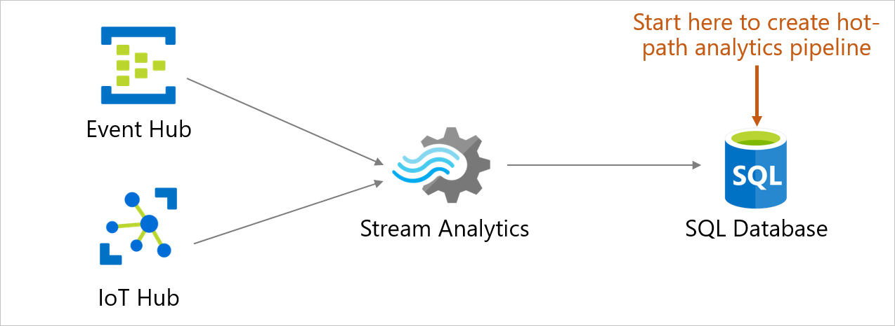
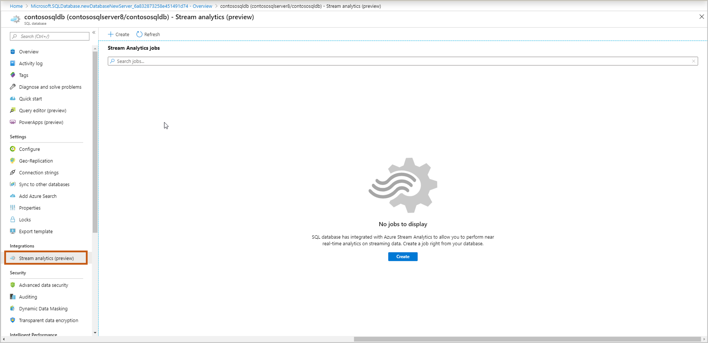
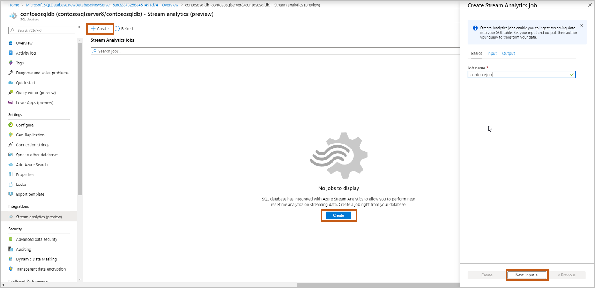
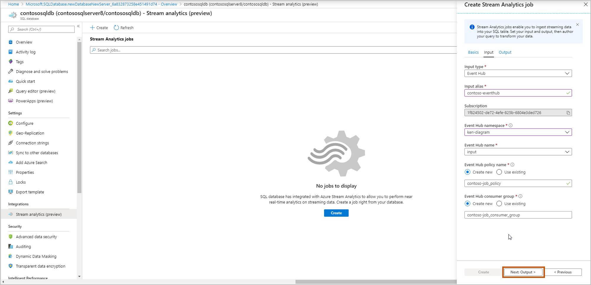
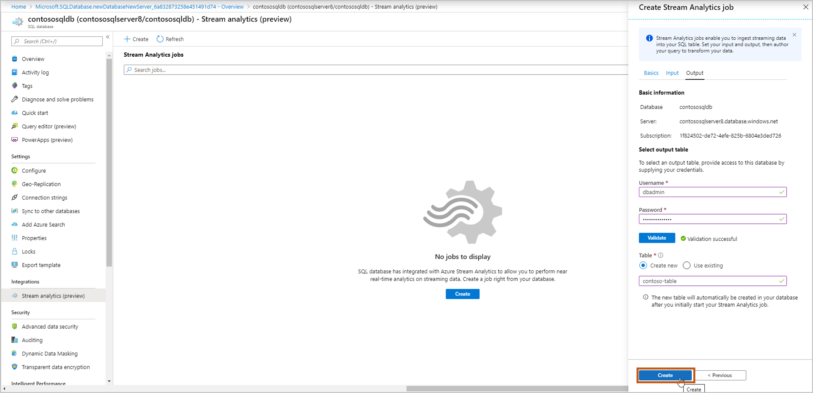
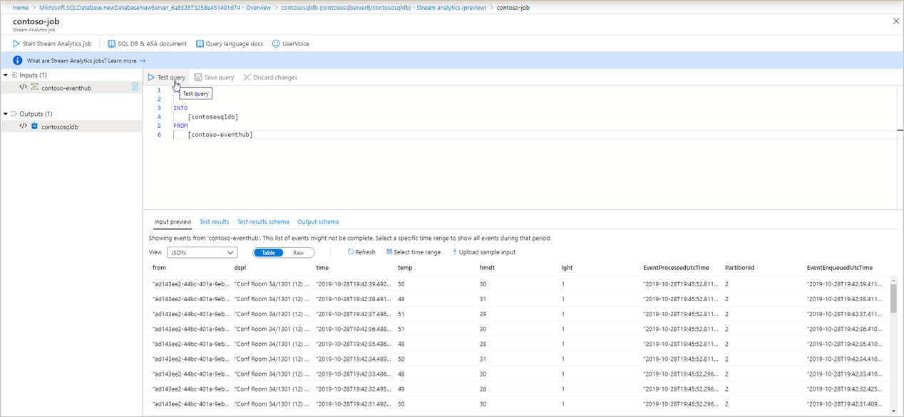
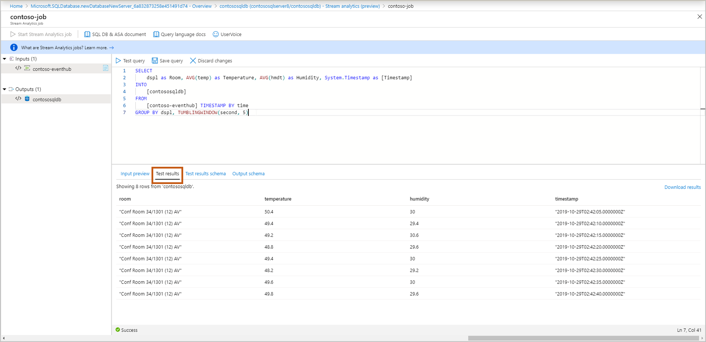
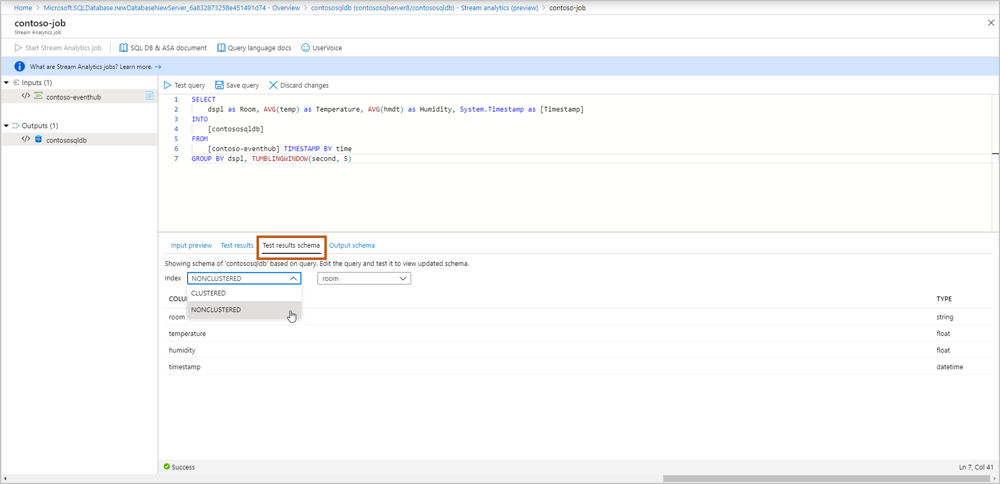
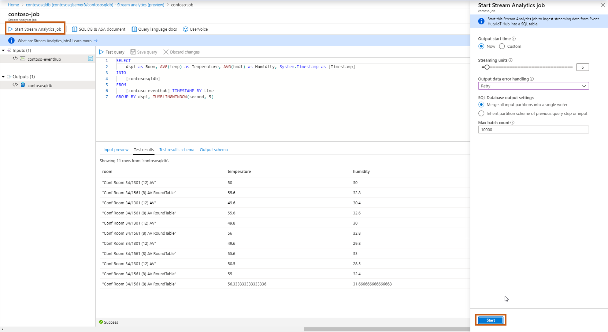
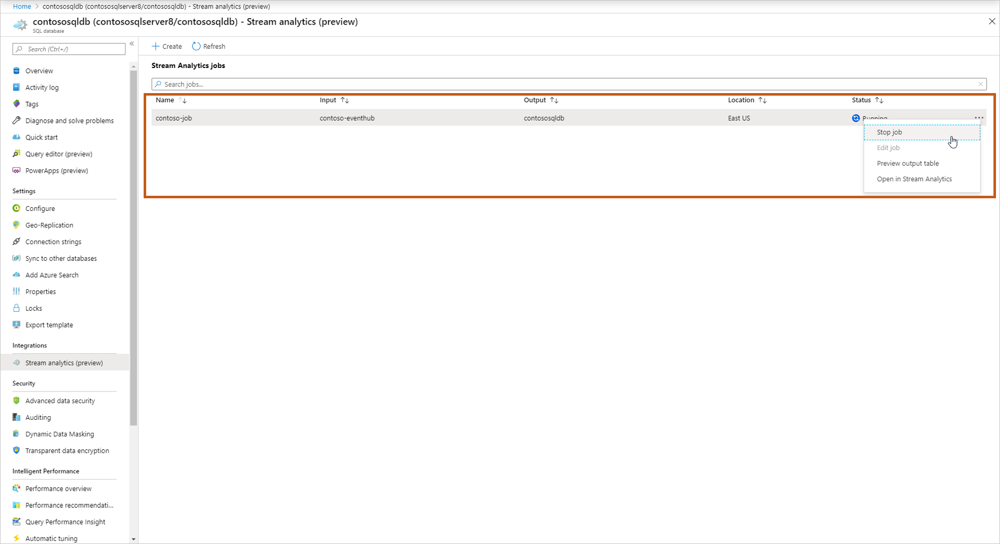

# Stream your data into SQL Database using Stream analytics integration (preview) in the Azure portal

Users can now ingest, process, view, and analyze real-time streaming data into a table directly from a SQL database in the Azure portal using [Azure Stream Analytics](../stream-analytics/stream-analytics-introduction.md). This experience enables a wide variety of scenarios such as connected car, remote monitoring, fraud detection, and many more. In the Azure portal, you can select an events source (Event Hub/IoT Hub), view incoming real-time events, and select a table to store events. You can also write Stream Analytics Query Language queries in the portal to transform incoming events and store them in the selected table. This new entry point is in addition to the creation and configuration experiences that already exist in Stream Analytics. This experience starts from the context of your database, enabling you to quickly set up a Stream Analytics job and navigate seamlessly between the Azure SQL Database and Stream Analytics experiences.

**Key benefits**:

- Minimum context switching: You can start from a SQL Database in the portal and start ingesting real-time data into a table without switching to any other service. 
- Reduced number of steps: The context of your database and table is used to pre-configure a Stream Analytics job.
- Additional ease of use with preview data: Preview incoming data from the events source (Event Hub/IoT Hub) in the context of selected table 

## Prerequisites

To complete the steps in this article, you need the following resources:

- An Azure subscription. If you don't have an Azure subscription, [create a free account](https://azure.microsoft.com/free/). 
- A SQL database. For details, see [Create a single database in Azure SQL Database](sql-database-single-database-get-started.md).
- A firewall rule allowing your computer to connect to the Azure SQL server. For details, see [Create a server-level firewall rule](sql-database-server-level-firewall-rule.md).

## Configure your SQL database to receive streaming data

1. Sign in to the Azure portal. 
2. Navigate to your SQL database where you want to ingest your streaming data. Select **Stream analytics (preview)**. 

    

3. To start ingesting your streaming data into this SQL database, select **Create** and give a name to your streaming job, and then select **Next: Input**. 

    

4. Enter your events source details, and then select **Next: Output**.

    - **Input type**: Event Hub/IoT Hub
    - **Input alias**: Enter a name to identify your events source 
    - **Subscription**: Same as SQL Database subscription 
    - **Event Hub namespace**: Name for namespace 
    - **Event Hub name**: Name of event hub within selected namespace 
    - **Event Hub policy name** (Default to create new): Give a policy name 
    - **Event Hub consumer group** (Default to create new): Give a consumer group name
           - We recommend that you create a consumer group and a policy for each new Azure Stream Analytics job that you create from here. Consumer groups allow only five concurrent readers, so providing a dedicated consumer group for each job will avoid any errors that might arise from exceeding that limit. A dedicated policy allows you to rotate your key or revoke permissions without impacting other resources.

    

5. Select which table you want to ingest your streaming data into. Once done, select **Create**.
   - **Username**, **Password**: Enter your credentials for SQL server authentication. Select **Validate**.
   - **Table**: Select **Create new** or **Use existing**. In this flow, let’s select **Create**. This will create a new table when you start the stream Analytics job.

    

6. A query page opens with following details:

  - Your **Input** (input events source) from which you will ingest data  
  - Your **Output** (output table) which will store transformed data 
  - Sample [SAQL query](../stream-analytics/stream-analytics-stream-analytics-query-patterns.md) with SELECT statement. 
  - **Input preview**: Shows snapshot of latest incoming data from input events source.  
    - The serialization type in your data is automatically detected (JSON/CSV). You can manually change it as well to JSON/CSV/AVRO. 
    - You can preview incoming data in the Table format or Raw format. 
    - If your data shown isn't current, select **Refresh** to see the latest events. 
    - Select **Select time range** to test your query against a specific time range of incoming events. 
    - Select **Upload sample input** to test your query by uploading a sample JSON/CSV file. For more information about testing a SAQL query, see [Test an Azure Stream Analytics job with sample data](../stream-analytics/stream-analytics-test-query.md). 

    

  - **Test results**: Select **Test query** and you can see the results of your streaming query 

    

  - **Test results schema**: Shows the schema of the results of your streaming query after testing. Make sure the test results schema matches with your output schema. 

    

  - **Output schema**: This contains schema of the table you selected in step 5 (new or existing).
    - Create new: If you selected this option in step 5, you won’t see the schema yet until you start the streaming job. When creating a new table, select the appropriate table index. For more information about table indexing, see [Clustered and Nonclustered Indexes Described](/sql/relational-databases/indexes/clustered-and-nonclustered-indexes-described/).
    - Use existing: If you selected this option in step 5, you will see the schema of selected table. 
 
7. After you are done authoring & testing the query, select **Start Stream Analytics job** to start ingesting transformed data into the SQL table. Once you finalize the following fields, **start** the job. 
   - Output start time: This defines the time of the first output of the job 
          - Now: The job will start now.
          - Custom: The job will start now. Schedule which data to process. For more information, see [How to start an Azure Stream Analytics job](../stream-analytics/start-job.md).
   - Throughput: This defines the throughput performance when you're loading data into SQL Azure Database using Azure Stream Analytics. For more information, see [Azure Stream Analytics output to Azure SQL Database](../stream-analytics/stream-analytics-sql-output-perf.md). 
   - Output data error handling:
          - Retry: When an error occurs, Azure Stream Analytics retries writing the event indefinitely until the write succeeds. There is no timeout for retries. Eventually all subsequent events are blocked from processing by the event that is retrying. This option is the default output error handling policy. 
          - Drop: Azure Stream Analytics will drop any output event that results in a data conversion error. The dropped events cannot be recovered for reprocessing later. All transient errors (for example, network errors) are retried regardless of the output error handling policy configuration. 
    
    For more information about output error handling, see [Output error policies in Azure Stream Analytics](../stream-analytics/stream-analytics-output-error-policy.md). 

    

8. Once you start the job, you will see the Running job in the list, and you can take following actions: 
   - **Start/stop the job**: If the job is running, you can stop the job. If the job is stopped, you can start the job. 
   - **Edit job**: You can edit the query. If you want to do more changes to the job ex, add more inputs/outputs, then open the job in Stream Analytics. Edit option is disabled when the job is running. 
   - **Preview output table**: You can preview the table in SQL query editor. 
   - **Open in Stream Analytics**: Open the job in Stream Analytics service to view monitoring, debugging details of the job. 

    

### Next steps

- [Azure Stream Analytics documentation](https://docs.microsoft.com/azure/stream-analytics/).
- [Azure Stream Analytics solution patterns](../stream-analytics/stream-analytics-solution-patterns.md)
