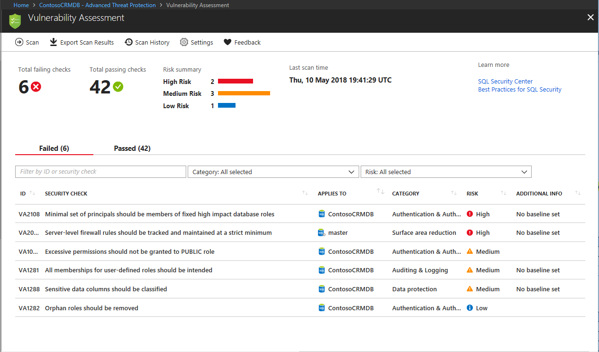
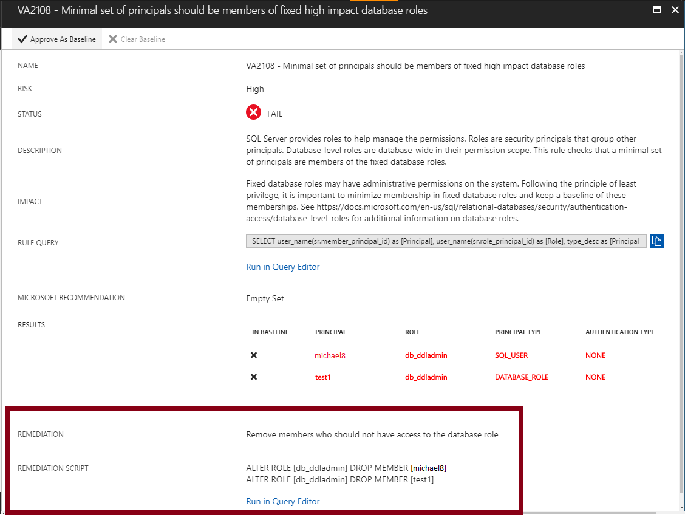
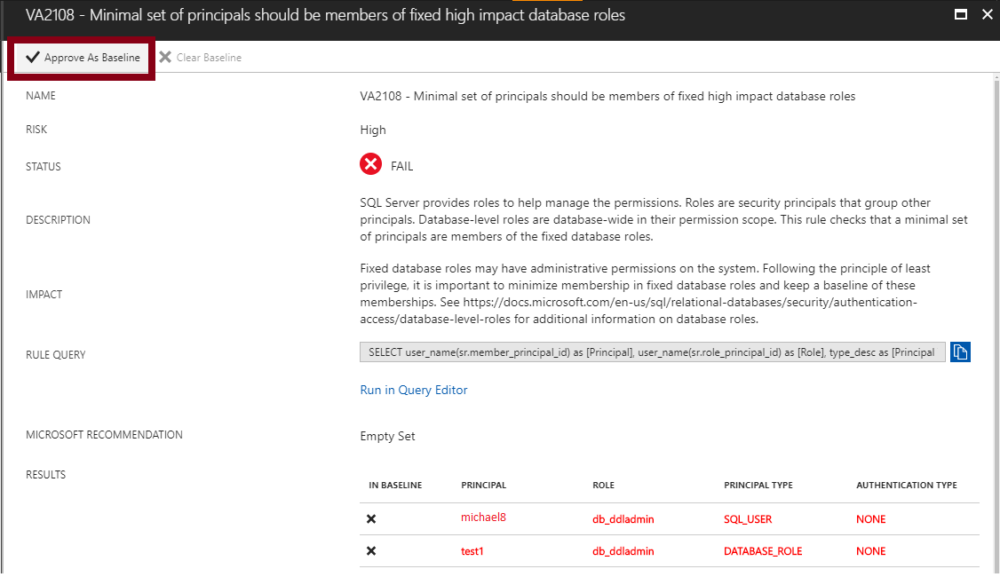

# SQL Vulnerability Assessment

SQL Vulnerability Assessment is an easy to configure service that can discover, track, and help you remediate potential database vulnerabilities. Use it to proactively improve your database security. 

Vulnerability Assessment is part of the [SQL Advanced Threat Protection](sql-advanced-protection.md) (ATP) offering, which is a unified package for advanced SQL security capabilities. Vulnerability Assessment can be accessed and managed via the central SQL ATP portal.

## Vulnerability Assessment features  
SQL Vulnerability Assessment (VA) is a service that provides visibility into your security state, and includes actionable steps to resolve security issues, and enhance your database security. It can help you:  
- Meet compliance requirements that require database scan reports.  
- Meet data privacy standards.  
- Monitor a dynamic database environment where changes are difficult to track.  

VA is a scanning service built into the Azure SQL Database service. The service employs a knowledge base of rules that flag security vulnerabilities and highlight deviations from best practices, such as misconfigurations, excessive permissions, and unprotected sensitive data. The rules are based on Microsoft’s best practices, and focus on the security issues that present the biggest risks to your database and its valuable data. These rules also represent many of the requirements from various regulatory bodies to meet their compliance standards.  

Results of the scan include actionable steps to resolve each issue and provide customized remediation scripts where applicable. An assessment report can be customized for your environment, by setting an acceptable baseline for permission configurations, feature configurations, and database settings.   

## Implementing VA  
The following steps implement VA on SQL Database.  

## 1. Run a scan  
Get started with VA by navigating to Vulnerability Assessment (Preview) setting in your Azure SQL Database pane. Start by configuring a storage account where your scan results will be stored. For information about storage accounts, see [About Azure storage accounts](../storage/common/storage-create-storage-account.md). Once storage is configured, click **Scan** to scan your database for vulnerabilities.  
  
  > [!NOTE]   
  > The scan is lightweight and safe. It takes a few seconds to run, and is entirely read-only. It does not make any changes to your database.  

## 2. View the report  
When your scan is complete, your scan report is automatically displayed in the Azure portal. The report presents an overview of your security state; how many issues were found, and their respective severities. Results include warnings on deviations from best practices, as well as a snapshot of your security-related settings, such as database principals and roles and their associated permissions. The scan report also provides a map of sensitive data discovered in your database, and includes recommendations of the built-in methods available to protect it.  
  

## 3. Analyze the results and resolve issues  
Review your results, and determine which findings in the report are true security issues in your environment. Drill down to each failed result to understand the impact of the finding, and why each security check failed. Use the actionable remediation information provided by the report to resolve the issue.  
    

## 4. Set your baseline  
As you review your assessment results, you can mark specific results as being an acceptable Baseline in your environment. The baseline is essentially a customization of how the results are reported. Results that match the baseline are considered as passing in subsequent scans. Once you have established your baseline security state, VA only reports on deviations from the baseline, and you can focus your attention on the relevant issues.  
  

## 5. Run a new scan to see your customized tracking report  
After you complete setting up your Rule Baselines, run a new scan to view the customized report. VA now reports only the security issues that deviate from your approved baseline state.  
  

VA can now be used to monitor that your database maintains a high level of security at all times, and that your organizational policies are met. If compliance reports are required, VA reports can be helpful to facilitate the compliance process.  

## Next steps  

- Learn more about [SQL Advanced Threat Protection](sql-advanced-threat-protection.md)
- Learn more about [Data Discovery & Classification](sql-database-data-discovery-and-classification.md)
