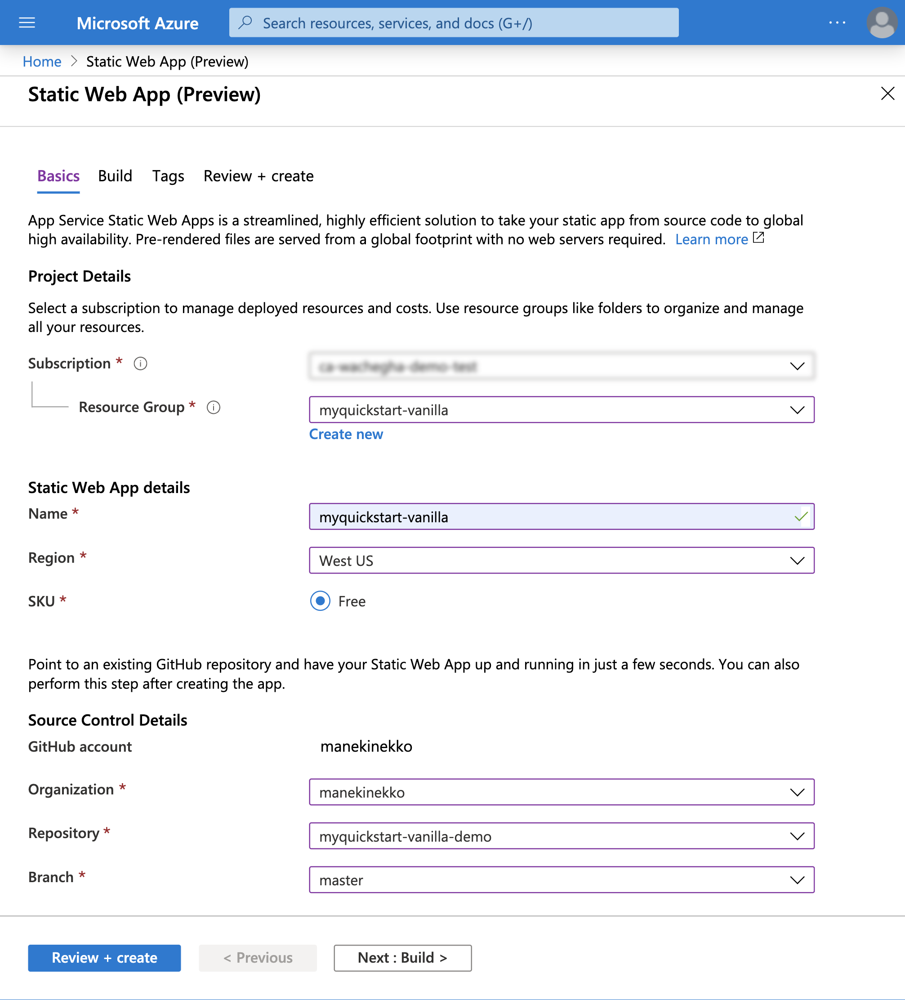
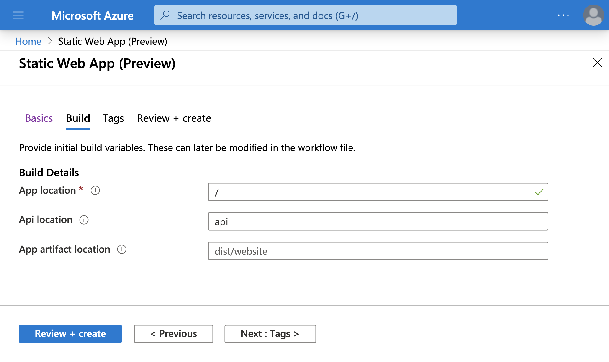
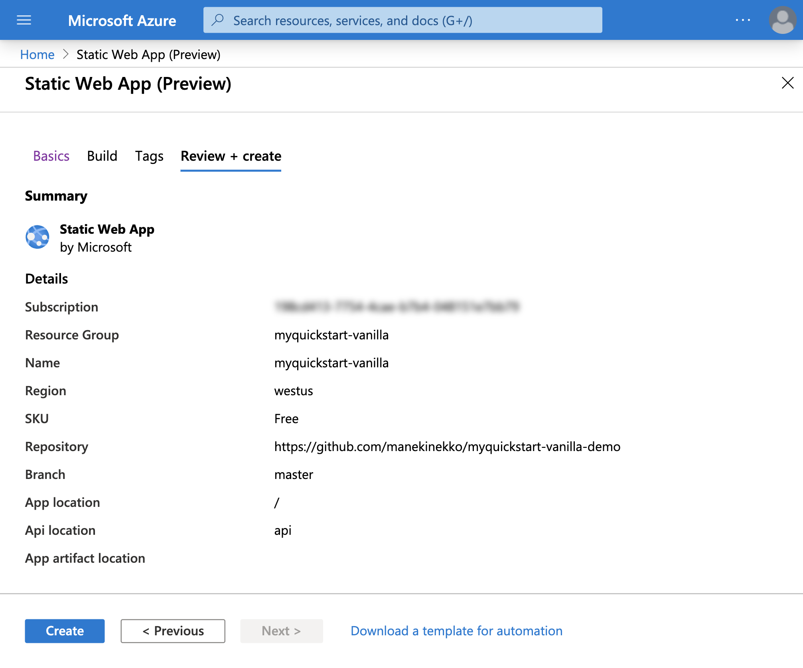

<!---Recommended: Removal all the comments in this template before you sign-off or merge to master.--->

# Add an API to App Service Static Apps with Azure Functions

Get started with App Service Static Apps by adding a Serverless API to your static application using Azure Functions. After testing the code locally, you will deploy it to the serverless environment using App Service Static Apps.

## Prerequisites

- An Azure account with an active subscription. [Create an account for free](https://azure.microsoft.com/free/?WT.mc_id=A261C142F).
- Completion of [previous step](#TODO)
- [Node.js](https://nodejs.org/), Active LTS, and Maintenance LTS versions (10.14.1 recommended). Use the node --version command to check your version.
- The [Azure Functions Core Tools](https://docs.microsoft.com/azure/azure-functions/functions-run-local#v2) version 2.7.2254 or a later 2.x version.
- The [Azure CLI](https://docs.microsoft.com/cli/azure/install-azure-cli) version 2.0.81 or later.
- Make sure Git is [available on your computer](https://git-scm.com/book/en/v2/Getting-Started-Installing-Git). 

### Prerequisite check

- In a terminal or command window, run `func --version` to check that the Azure Functions Core Tools are version 2.7.2254 or later.
- Run `az --version` to check that the Azure CLI version is 2.0.81 or later.
- Run `az login` to sign in to Azure and verify an active subscription.


## Create a repository 

Navigate to https://github.com/staticwebdev/angular-basic/generate and create a new GitHub project called *myquickstart-angular* using this template.


Next, clone this repository locally using the `git clone` command.

```bash
git clone git@github.com:[YOUR_GITHUB_ACCOUNT]/myquickstart-angular.git
```

## Create a local function project


Run the `func init` command, as follows, to create a functions project in a folder named *api* with the JavaScript runtime:

```bash
func init api --javascript 
```

Then, navigate into the project folder: 

```bash
cd api
```
This folder contains various files for the project, including configurations files named [local.settings.json](https://docs.microsoft.com/azure/azure-functions/functions-run-local#local-settings-file) and [host.json](https://docs.microsoft.com/azure/azure-functions/functions-host-json).

Add a function to your project by using the following command, where the `--name` argument is the unique name of your function (HttpExample) and the `--template` argument specifies the function's trigger (HTTP), and the language type.

```bash
func new --name HttpExample --template "HTTP trigger" --language javascript 
```

`func new` creates a subfolder matching the function name that contains a code file appropriate to the project's chosen language and a configuration file named *function.json*.

You need then to commit and push your changes to the remote git repository.

```bash
git add -A 
git commit -m "feat: add backend app" 
git push origin master 
```


## Create static app on Azure Portal 




1. Navigate to the [portal](https://portal.azure.com/?feature.canmodifystamps=true&feature.customportal=false&WebsitesExtension=canary&feature.fastmanifest=false&nocdn=force&websitesextension_functionsnext=true&feature.fullscreenblades=true&microsoft_azure_marketplace_ItemHideKey=StaticApp#create/Microsoft.StaticApp) 
1. Select your subscription 
1. Select or create an Azure resource group 
1. Name: **myquickstart-angular**
1. Select region 
1. Choose the "Free" SKU 
1. Click Sign in with GitHub 
1. Choose your GitHub organization 
1. Choose your GitHub repository: **myquickstart-angular**
1. Choose your default GitHub branch you would like to build, for example: **master**
1. Click "**Next: Build**" 



On the build details screen:

1. App location: ./ 
1. Api location:  **api** 
1. App artifact location: **dist/myquickstart-angular**
1. Click **Review + create**



1. Click **Create**
1. Wait for deployment to finish 
1. Navigate to `https://github.com/[YOUR_GITHUB_ACCOUNT]/myquickstart-angular/actions?query=workflow%3A"Azure+Pages+CI%2FCD"`
1. Make sure the build is successful


The deployed API will be available at `https://[STATIC_APP_NAME].staticsitescanary.net/api/[FUNCTION_NAME]`. You can access the API endpoint by using the `cURL` command or your browser (for GET requests).

```bash
curl "https://blue-plant-008fa9804.staticsitescanary.net/api/HttpExample?name=Azure"

Hello Azure
```


## Clean up resources

In the preceding steps, you created Azure resources in a resource group. If you don't expect to need these resources in the future, you can delete them by deleting the resource group.

From the Azure portal menu or **Home** page, select **Resource groups**, and on the **Resource groups** page, select **myResourceGroup**.

On the **myResourceGroup** page, make sure that the listed resources are the ones you want to delete.

Select **Delete**, type **myResourceGroup** in the text box, and then select **Delete**.

## Next steps

Advance to the next article to learn how to create...
> [!div class="nextstepaction"]
> [Next steps button](./)
