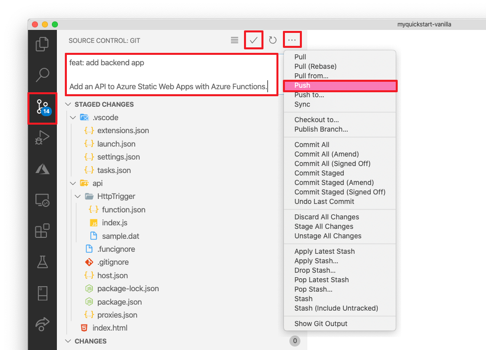
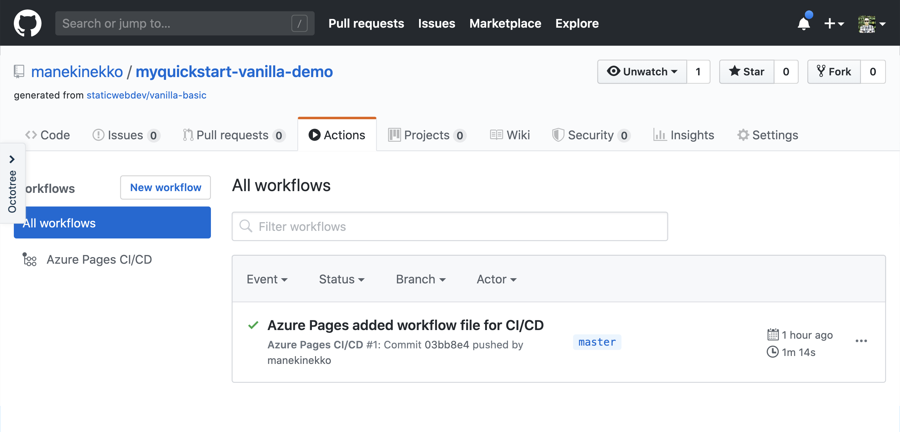

# Add an API to Azure Static Web Apps with Azure Functions

Get started with Azure Static Web Apps by adding a Serverless API to your static application using Azure Functions. After testing the code locally, you will deploy it to the serverless environment using Azure Static Web Apps.

## Prerequisites

Before you get started, make sure you have the following requirements in place:
- An Azure account with an active subscription. [Create an account for free](https://azure.microsoft.com/free/?WT.mc_id=A261C142F).
- [Visual Studio Code](https://code.visualstudio.com/) on one of the [supported platforms](https://code.visualstudio.com/docs/supporting/requirements#_platforms).
- The [Azure Functions extension](https://marketplace.visualstudio.com/items?itemName=ms-azuretools.vscode-azurefunctions) for Visual Studio Code.
- [Live Server Visual Studio Code](https://marketplace.visualstudio.com/items?itemName=ritwickdey.LiveServer) extension.

## Create a repository 

Navigate to https://github.com/staticwebdev/vanilla-basic and create a new GitHub project called *myquickstart-vanilla* using this template.


Once your project is created, you can use Visual Studio Code to clone a Git repository with the **Git: Clone** command in the Command Palette (`Cmd +  Shift + P` on Mac and `Ctrl + Shift + P` on Windows). You would then paste that URL into the **Git: Clone prompt**.


To get the GitHub project's URL, click on **Clone or download** green button, then copy the HTTPS URL.


## Create your local project

In this section, you use Visual Studio Code to create a local Azure Functions project in your chosen language. Later in this article, you'll publish your function code to Azure.

1. Inside the **myquickstart-vanilla** project create, a sub-folder called **api**.

> You can give this folder any name.

2. Choose the Azure icon in the Activity bar, then in the **Functions** area, select the **Create new project**... icon.


3. Choose **Browse**, then select the **api** folder as the directory location for your project workspace and choose **Select**.


4. Provide the following information at the prompts:

    - **Select a language for your function project**: Choose `JavaScript`.
    - **Select a template for your project's first function**: Choose `HTTP trigger`.
    - **Provide a function name**: Type `GetMessage`.
    - **Authorization level**: Choose `Anonymous`, which enables anyone to call your function endpoint. To learn about authorization level, see [Authorization keys](https://docs.microsoft.com/azure/azure-functions/functions-bindings-http-webhook-trigger#authorization-keys).

5. Using this information, Visual Studio Code generates an Azure Functions project with an HTTP trigger. You can view the local project files in the Explorer. To learn more about files that are created, see [Generated project files](https://docs.microsoft.com/azure/azure-functions/functions-develop-vs-code#generated-project-files).

6. You should have the following project structure.

```bash
├── api
│   ├── GetMessage
│   │   ├── function.json
│   │   ├── index.js
│   │   └── sample.dat
│   ├── host.json
│   ├── local.settings.json
│   ├── package.json
│   └── proxies.json
├── index.html
├── readme.md
└── styles.css

2 directories, 10 files
```

7. Update the `GetMessage` function under `api/GetMessage/index.js` with:

```JavaScript
module.exports = async function (context, req) {
  context.res = {
    body: { 
      text: "Hello from the API" 
    }
  };
};
```

8. Update the `GetMessage` configuration under `api/GetMessage/function.json` with:

```json
{
  "bindings": [
    {
      "authLevel": "anonymous",
      "type": "httpTrigger",
      "direction": "in",
      "name": "req",
      "methods": [
        "get"
      ],
      "route": "message"
    },
    {
      "type": "http",
      "direction": "out",
      "name": "res"
    }
  ]
}
```

## Run the function locally

Visual Studio Code integrates with [Azure Functions Core Tools](https://docs.microsoft.com/azure/azure-functions/functions-run-local) to let you run this project on your local development computer before you publish to Azure.

1. To call your function, press F5 to start the function app project. Output from Core Tools is displayed in the **Terminal** panel.

2. If you haven't already installed Azure Functions Core Tools, select **Install** at the prompt. When the Core Tools are installed, your app starts in the **Terminal** panel. You can see the URL endpoint of your HTTP-triggered function running locally.


3. With Core Tools running, navigate to the following URL to execute a GET request.

   http://localhost:7071/api/message

4. A response is returned, which looks like the following in a browser:


After you've verified that the function runs correctly on your local computer, it's time to call the API from the Vanilla JavaScript application.

### Call the API from the application

<!-- include proxy config docs -->
[!INCLUDE [](./static-web-apps-local-proxy.md)]

1. Update the content of the `index.html` with the following code that will fetch the text from the API function and how it on the screen:

```html
<!DOCTYPE html>
<html lang="en">

<head>
  <meta charset="UTF-8">
  <meta name="viewport" content="width=device-width, initial-scale=1.0">
  <link rel="stylesheet" href="styles.css">
  <title>Vanilla JavaScript App</title>
</head>

<body>
  <main>
    <h1>Vanilla JavaScript App</h1>
    <p>Loading message from the API: <b id="name">...</b></p>
  </main>

  <script>
    (async function() {
      let { text } = await( await fetch(`/api/message`)).json();
      document.querySelector('#name').textContent = text;
    }())
  </script>
</body>

</html>
```

2. With Core Tools running, use the [Live Server](https://marketplace.visualstudio.com/items?itemName=ritwickdey.LiveServer) Visual Studio Code extension to serve the `index.html` and open it a in browser.


> You can use other HTTP servers or proxies to serve the `index.html` file. Accessing the `index.html` from `file:///` will not work.

### Commit and push your changes to GitHub

Using Visual Studio Code, commit and push your changes to the remote git repository.




## Create static app on Azure Portal 


On the Static Web App home screen:

1. Navigate to the [Azure Static Web Apps](https://portal.azure.com/?feature.canmodifystamps=true&feature.customportal=false&WebsitesExtension=canary&feature.fastmanifest=false&nocdn=force&websitesextension_functionsnext=true&feature.fullscreenblades=true&microsoft_azure_marketplace_ItemHideKey=StaticApp#create/Microsoft.StaticApp) 
1. **Subscription**: Select your subscription 
1. **Resource Group**: Select or create an Azure resource group 
1. **Name**: Type `myquickstart-vanilla`
1. **Region**: Select region 
1. **SKU**: Choose the `Free` SKU 
1. **GitHub Account**: Click **Sign in with GitHub** 
1. **Organization**: Choose your GitHub organization 
1. **Repository**: Choose your GitHub repository: **myquickstart-vanilla**
1. **Branch**: Choose your default GitHub branch you would like to build, for example: **master**
1. Click "**Next: Build >**" 


On the build details screen:

1. **App location**: Type `./` 
1. **Api location**: Type `api` (this is the name of the API folder we created in the previous step)
1. **App artifact location**: Leave empty
1. Click **Review + create**


1. Click **Create**
1. Wait for deployment to finish 
1. Navigate to `https://github.com/<YOUR_GITHUB_ACCOUNT>/myquickstart-vanilla/actions?query=workflow%3A"Azure+Pages+CI%2FCD"`
1. Make sure the build is successful



The deployed API will be available at `https://<STATIC_APP_NAME>.staticsitescanary.net/api/<FUNCTION_OR_ROUTE_NAME>`.


You can access the API endpoint by using the `cURL` command or your browser (for GET requests).

```bash
curl "https://thankful-water-0eb4bc604.staticsitescanary.net/api/message"
```

Or you can directly access your Azure Static Web App at https://thankful-water-0eb4bc604.staticsitescanary.net and check the result on the screen.


## Clean up resources

In the preceding steps, you created Azure resources in a resource group. If you don't expect to need these resources in the future, you can delete them by deleting the resource group.

From the Azure portal menu or **Home** page, select **Resource groups**, and on the **Resource groups** page, select **myResourceGroup**.

On the **myResourceGroup** page, make sure that the listed resources are the ones you want to delete.

Select **Delete**, type **myResourceGroup** in the text box, and then select **Delete**.

## Next steps

Advance to the next article to learn how to create...
> [!div class="nextstepaction"]
> [Next steps button](./)
