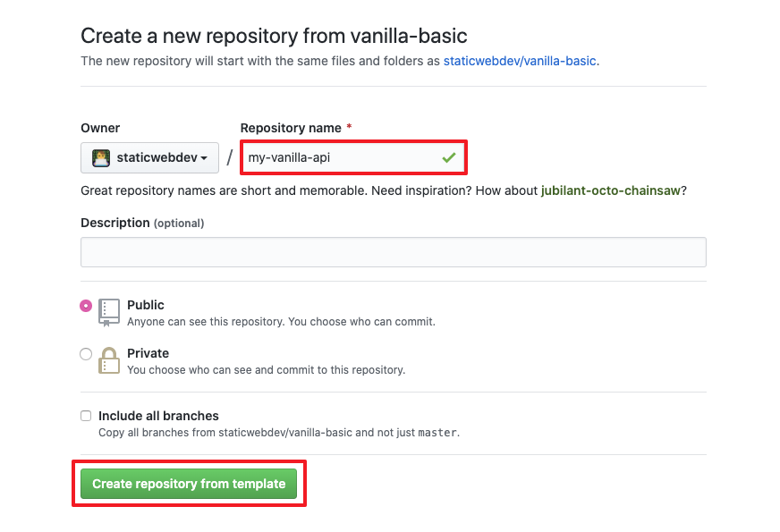
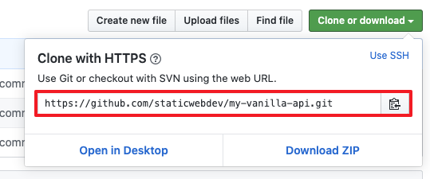
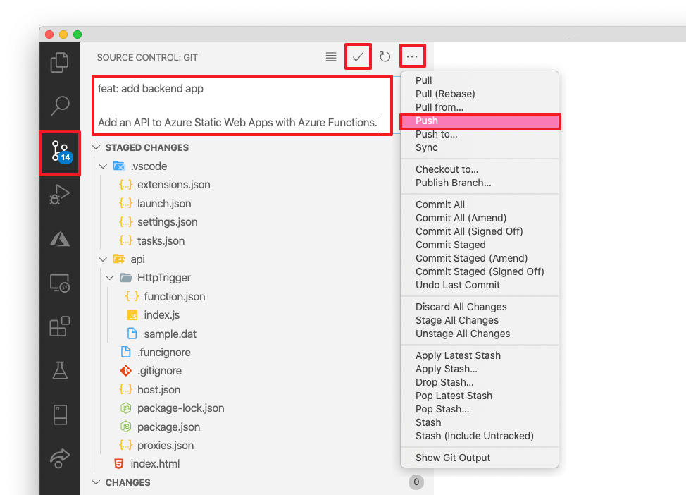
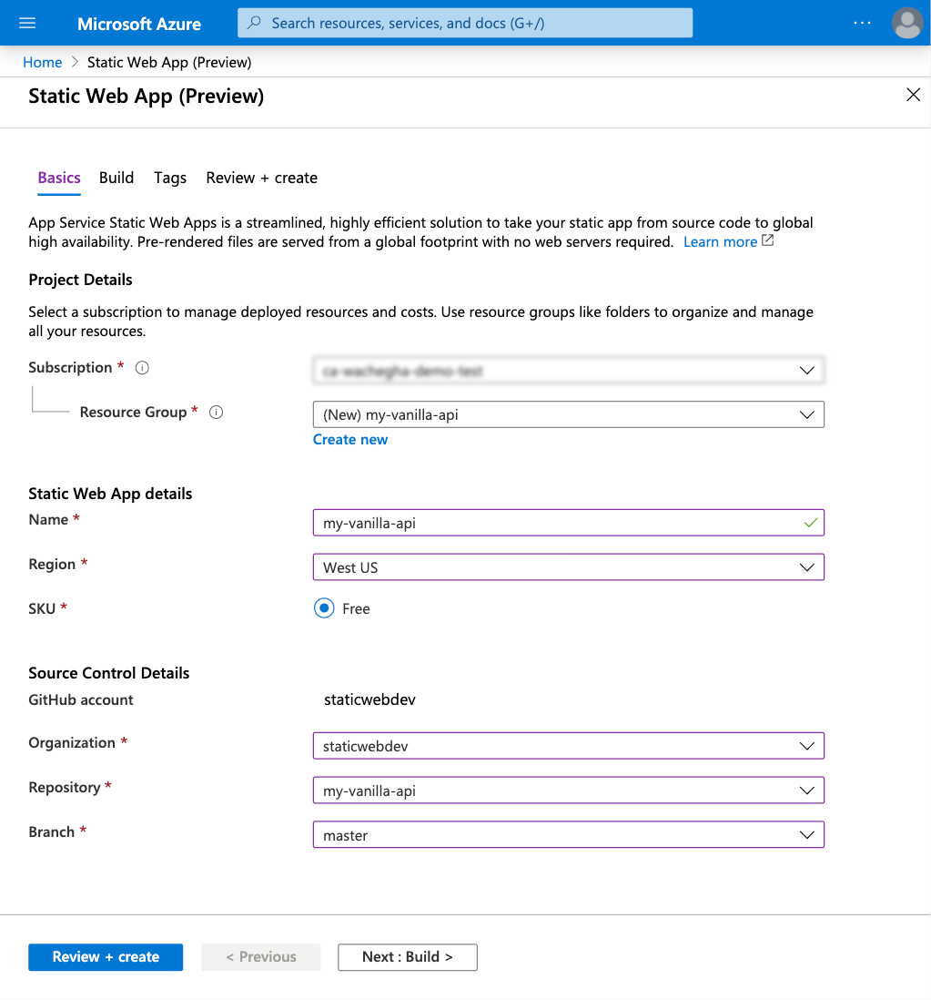
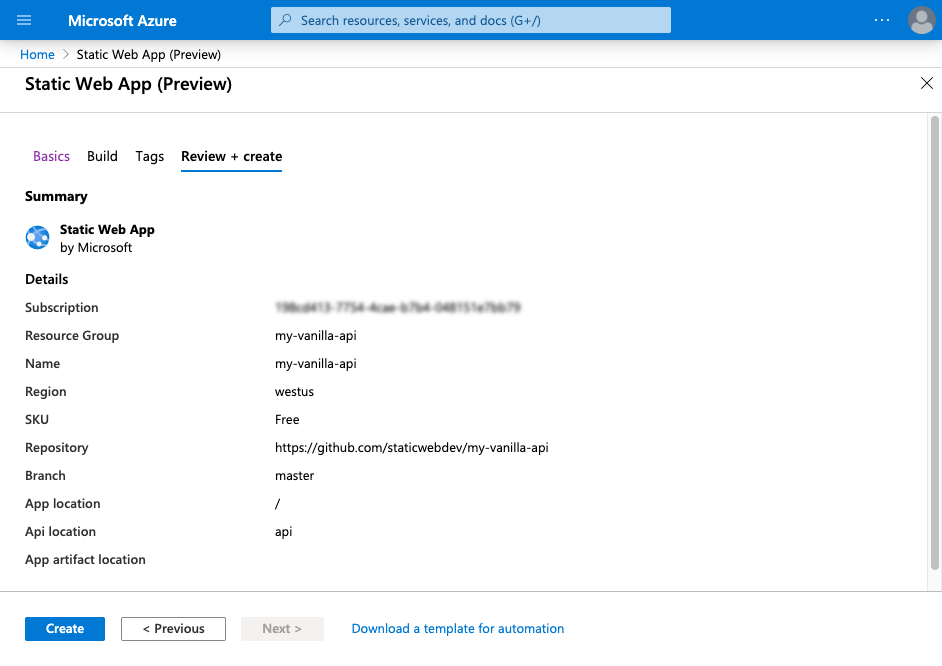
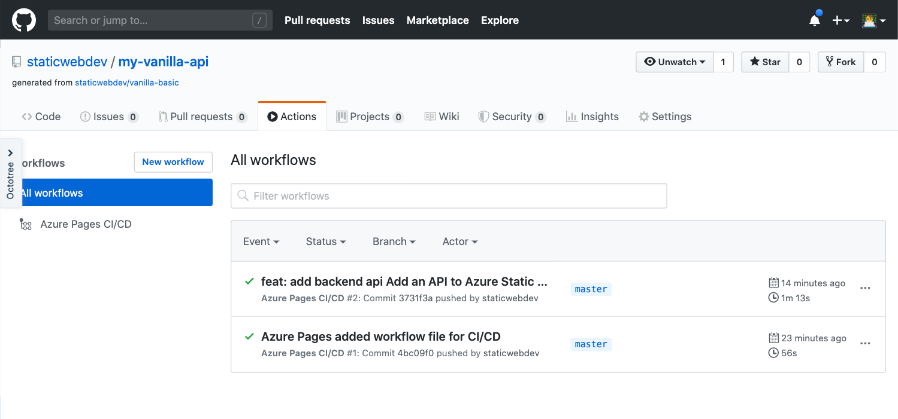
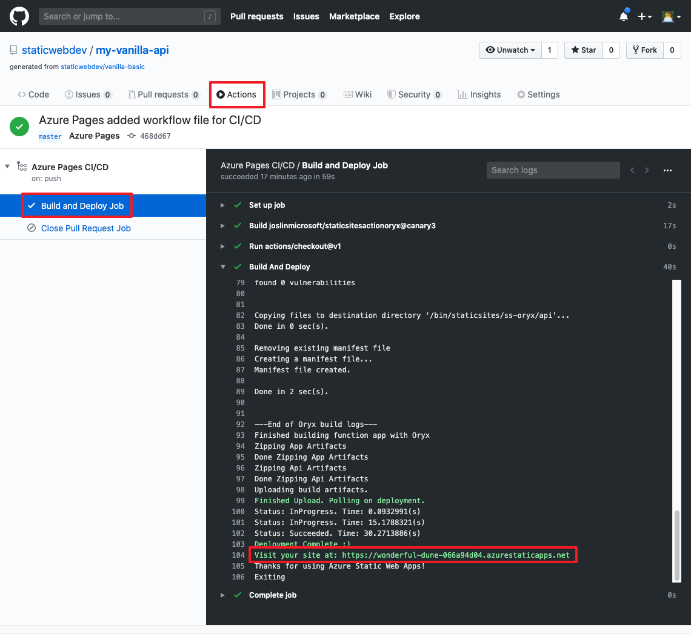

# Add an API to Azure Static Web Apps with Azure Functions

Adding serverless APIs to Azure Static Web Apps is possible via integration with Azure Functions. This article demonstrates how to add and deploy an API to an Azure Static Web Apps site.

## Prerequisites

- Azure account with an active subscription. [Create an account for free](https://azure.microsoft.com/free).
- [Visual Studio Code](https://code.visualstudio.com/)
- [Azure Functions extension](https://marketplace.visualstudio.com/items?itemName=ms-azuretools.vscode-azurefunctions) for Visual Studio Code
- [Live Server Visual Studio Code](https://marketplace.visualstudio.com/items?itemName=ritwickdey.LiveServer) extension.

## Create a git repository 

The following steps demonstrate how to create a new repository and clone the files to your machine.

1. Navigate to https://github.com/staticwebdev/vanilla-basic/generate to create a new repository
1. In the _Repository name_ box, enter **my-vanilla-api**
1. Click **Create repository from template**



Once your project is created, you can use Visual Studio Code to clone the Git repository.

 1. Press **F1** to open command in the command palette.
 1. Paste the URL into the _Git: Clone_ prompt, and press **Enter**.





## Create your local project

In this section, you use Visual Studio Code to create a local Azure Functions project. Later, you publish the Functions app to Azure.

1. Inside the _my-vanilla-api_ project, create a sub-folder named **api**.

[!NOTE]
> You can give this folder any name. We are using `api` as an example.

2. Press **F1** to open the command pallatte
3. Type **Azure Functions: Create New Project...**
4. Press **Enter**


5. Choose **Browse**
6. Select the **api** folder as the directory for your project workspace
7. Choose **Select**


8. Provide the following information at the prompts:

    - _Select a language for your function project_: Choose **JavaScript**
    - _Select a template for your project's first function_: Choose **HTTP trigger**
    - _Provide a function name_: Type **GetMessage**
    - _Authorization level_: Choose **Anonymous**, which enables anyone to call your function endpoint.
        - To learn about authorization levels, see [Authorization keys](../azure-functions/functions-bindings-http-webhook-trigger.md#authorization-keys).

9. Using this information, Visual Studio Code generates an Azure Functions project with an HTTP trigger.
    - You can view the local project files in Visual Studio Code's explorer window.
    - To learn more about files that are created, see [Generated project files](https://docs.microsoft.com/azure/azure-functions/functions-develop-vs-code#generated-project-files).

10. Your app should now have a project structure similar to this example.

```files
├── api
│   ├── GetMessage
│   │   ├── function.json
│   │   ├── index.js
│   │   └── sample.dat
│   ├── host.json
│   ├── local.settings.json
│   ├── package.json
│   └── proxies.json
├── index.html
├── readme.md
└── styles.css
```

11. Next, update the `GetMessage` function under _api/GetMessage/index.js_ with the following code.

```JavaScript
module.exports = async function (context, req) {
  context.res = {
    body: { 
      text: "Hello from the API" 
    }
  };
};
```

12. Update the `GetMessage` configuration under `api/GetMessage/function.json` with the following settings.

```json
{
  "bindings": [
    {
      "authLevel": "anonymous",
      "type": "httpTrigger",
      "direction": "in",
      "name": "req",
      "methods": [
        "get"
      ],
      "route": "message"
    },
    {
      "type": "http",
      "direction": "out",
      "name": "res"
    }
  ]
}
```
With the above settings, the API endpoint is:

- Triggered with an HTTP request is made to the function
- Available to all requests regardless of authentication status
- Exposed via the _/api/message_ route
## Run the function locally

Visual Studio Code integrates with [Azure Functions Core Tools](https://docs.microsoft.com/azure/azure-functions/functions-run-local) to let you run this project on your local development computer before you publish to Azure.

1. Run the function by pressing **F5** to start the Functions app, and the Core Tools output is displayed in the _Terminal_ panel.

2. If Azure Functions Core Tools isn't already installed, select **Install** at the prompt.

    When the Core Tools are installed, your app starts in the _Terminal_ panel. As a part of the output, you can see the URL endpoint of your HTTP-triggered function running locally.


3. With Core Tools running, navigate to the following URL to execute a `GET` request.

   <http://localhost:7071/api/message>

4. A response is returned, which looks like the following in the browser:


After you've verified that the function runs correctly, you can now call the API from the JavaScript application.

### Call the API from the application

1. TODO: include local proxy config docs once they are ready

```
[!INCLUDE [](./static-web-apps-local-proxy.md)]
```

2. Next, update the content of the _index.html_ file with the following code to fetch the text from the API function and display it on the screen:

```html
<!DOCTYPE html>
<html lang="en">

<head>
  <meta charset="UTF-8">
  <meta name="viewport" content="width=device-width, initial-scale=1.0">
  <link rel="stylesheet" href="styles.css">
  <title>Vanilla JavaScript App</title>
</head>

<body>
  <main>
    <h1>Vanilla JavaScript App</h1>
    <p>Loading message from the API: <b id="name">...</b></p>
  </main>

  <script>
    (async function() {
      let { text } = await( await fetch(`/api/message`)).json();
      document.querySelector('#name').textContent = text;
    }())
  </script>
</body>

</html>
```

With Core Tools running, use the [Live Server](https://marketplace.visualstudio.com/items?itemName=ritwickdey.LiveServer) Visual Studio Code extension to serve the _index.html_ file and open it a in browser. 

3. Press **F1** and choose **Live Server: Open with Live Server**.


[!NOTE]
> You can use other HTTP servers or proxies to serve the `index.html` file. Accessing the `index.html` from `file:///` will not work.

### Commit and push your changes to GitHub

Using Visual Studio Code, commit and push your changes to the remote git repository.

1. Pressing **F1** to open the command pallatte
1. Type **Git: Commit All**
1. Add a commit message
1. Type in **Git: push**




## Create static app in the Azure Portal 



1. Navigate to the [Azure portal](https://portal.azure.com)
1. Type **Static Web Apps** in the top search bar
1. Click on **Static Web Apps**
1. Click **Add**
- Select your _Azure subscription_
- Select or create a new _Resource Group_
- Name the app **my-vanilla-ap-**.
- Select _Region_ closest to you
- Select the **Free** _SKU_
- Click the **Sign-in with GitHub** button and authenticate with GitHub
- Select your preferred _Organization_
- Select **my-vanilla-api** from the _Repository_ drop-down
- Select **master** from the _Branch_ drop-down
- Click the **Next: Build >** button to edit the build configuration


Next, add the following the build details.

1. **App location**: Type `./` 
1. Enter **api** in the _Api location_ box
    - This is the name of the API folder created in the previous step.
1. Clear the default value out of the _App artifact location_, leaving the box empty
1. Click **Review + create**

| Setting | Description             | Required |
| -------- | ----------------------- |
|  App location | The location of the static application source code | Yes |
|  Api location | The location of the API backend. This points to the root folder of the Azure Functions App project (optional) | No |
|  App artifact location | The location of of the build output folder. Some front-end JavaScript frameworks have a build step that places production files in a folder. This setting points to the build output folder. | No |



1. Click **Create**
1. Wait for deployment to finish (this may take a minute)
1. Navigate to `https://github.com/<YOUR_GITHUB_ACCOUNT>/my-vanilla-api/actions?query=workflow%3A"Azure+Pages+CI%2FCD"`
1. Make sure the build is successful



The deployed API will be available at `https://<STATIC_APP_NAME>.azurestaticapps.net/api/<FUNCTION_OR_ROUTE_NAME>`.



You can access the API endpoint by using the `cURL` command or your browser (for GET requests).

```bash
curl "https://thankful-water-0eb4bc604.staticsitescanary.net/api/message"
```

Or you can directly access your Azure Static Web App at https://thankful-water-0eb4bc604.staticsitescanary.net and check the result on the screen.

## Clean up resources

When you continue to the next step, you'll need to keep all your resources in place. Otherwise, you can use the following steps to delete the Azure Static Web App and its related resources to avoid incurring any further costs.

1. Navigate to the [Azure portal](https://portal.azure.com)
1. In the top search bar, type **Resource groups**
1. Click **Resource groups** 
1. Select **myResourceGroup**
1. On the _myResourceGroup_ page, make sure that the listed resources are the ones you want to delete.
1. Select **Delete**
1. Type **myResourceGroup** in the text box
1. Select **Delete**.

To learn more about Azure Static Web Apps costs, see [Estimating costs](https://docs.microsoft.com/azure/?product=featured).

## Next steps


> [!div class="nextstepaction"]
> [Configure environment variables](./environment-variables.md)
