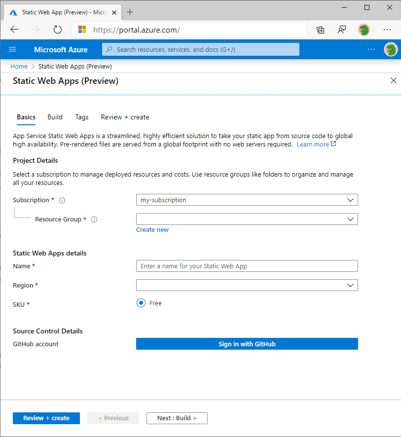
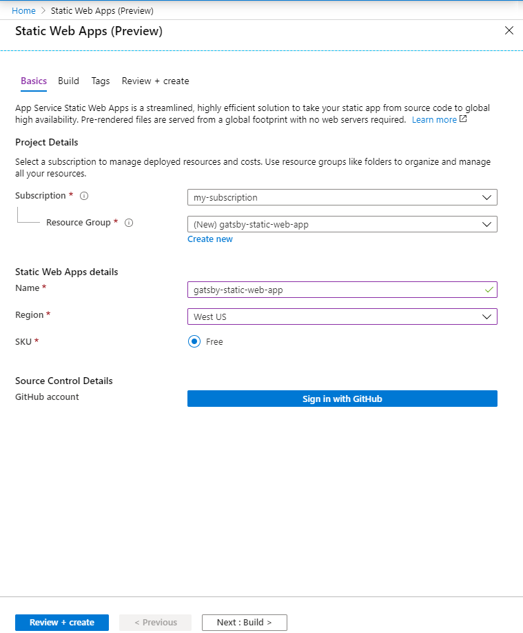
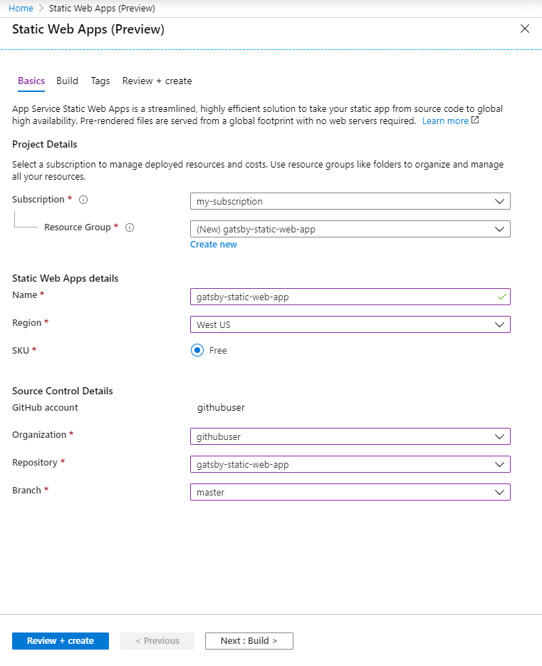
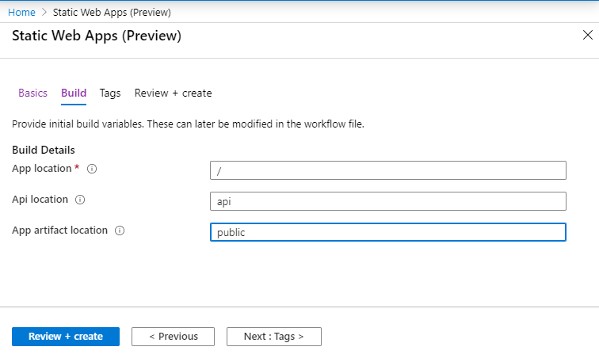
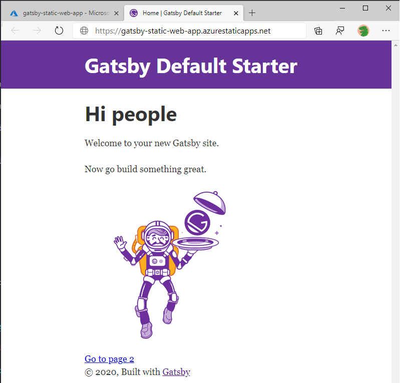

# Tutorial: Publish a Gatsby site to Azure Static Web Apps

This article demonstrates how to create and deploy a [Gatsby](https://gatsbyjs.org) web application to [Azure Static Web Apps](overview.md). The final result is a new Static Web Apps site (with the associated GitHub Actions) that give you control over how the app is built and published.

In this tutorial, you learn how to:

> [!div class="checklist"]
>
> - Create a Gatsby app
> - Setup an Azure Static Web Apps site
> - Deploy the Gatsby app to Azure

[!INCLUDE [quickstarts-free-trial-note](../../includes/quickstarts-free-trial-note.md)]

## Prerequisites

- An Azure account with an active subscription. If you don't have one, you can [create an account for free](https://azure.microsoft.com/free/).
- A GitHub account. If you don't have one, you can [create an account for free](https://github.com/join).
- [Node.js](https://nodejs.org) installed.

## Create a Gatsby App

Create a Gatsby app using the Gatsby Command Line Interface (CLI):

1. Open a terminal
1. Use the [npx](https://www.npmjs.com/package/npx) tool to create a new app with the Gatsby CLI. This may take a few minutes.

   ```bash
   npx gatsby new static-web-app
   ```

1. Navigate to the newly created app

   ```bash
   cd static-web-app
   ```

1. Initialize a git repo

   ```bash
   git init
   git add -A
   git commit -m "initial commit"
   ```

## Push your application to GitHub

You need to have a repository on GitHub to create a new Azure Static Web Apps resource.

1. Create a blank GitHub repository (don't create a README) from [https://github.com/new](https://github.com/new) named **gatsby-static-web-app**.

1. Next, add the GitHub repository you just created as a remote to your local repo. Make sure to add your GitHub username in place of the `<YOUR_USER_NAME>` placeholder in the following command.

   ```bash
   git remote add origin https://github.com/<YOUR_USER_NAME>/gatsby-static-web-app
   ```

1. Push your local repository up to GitHub.

   ```bash
   git push --set-upstream origin master
   ```

## Deploy your web app

The following steps show you how to create a new static site app and deploy it to a production environment.

### Create the application

1. Navigate to the [Azure portal](https://portal.azure.com).

1. Select **Create a Resource** and search for **Static Web Apps**.

   

1. For _Subscription_, accept the subscription that is listed or select a new one from the drop-down list.

1. In _Resource group_, select **New**. In _New resource group name_, enter **gatsby-static-web-app** and select **OK**.

1. Next, provide a globally unique name for your app in the **Name** box. Valid characters include `a-z`, `A-Z`, `0-9` and `-`. This value is used as the URL prefix for your Static Web App in the format of `https://<YOUR_APP_NAME>.azurestaticapps.net`.

1. For _Region_, select an available region close to you.

1. For _SKU_, select **Free**.

   

1. Click the **Sign in with GitHub** button.

1. Select the **Organization** under which you created the repository.

1. Select the **gatsby-static-web-app** as the _Repository_ .

1. For the _Branch_ select **master**.

   

### Build

Next, add configuration settings that the build process uses to build your app.

1. To configure the settings of the step in GitHub Actions, set the _App location_ to **/**.

1. Set _App artifact location_ to **public**.

   A value for _API location_ isn't necessary as you aren't deploying an API at the moment.

   

### Review and create

1. Click the **Review + Create** button to verify the details are all correct.

1. Click **Create** to start the creation of the App Service Static Web App and provision a GitHub Action for deployment.

1. Once the deployment completes click, **Go to resource**.

1. On the resource screen, click the _URL_ link to open your deployed application. You may need to wait a minute or two for the GitHub Action to complete.

   

## Clean up resources

[!INCLUDE [static-web-apps-cleanup-resource](../../includes/static-web-apps-cleanup-resource.md)]

## Next steps

> [!div class="nextstepaction"]
> [Add a custom domain](custom-domain.md)
