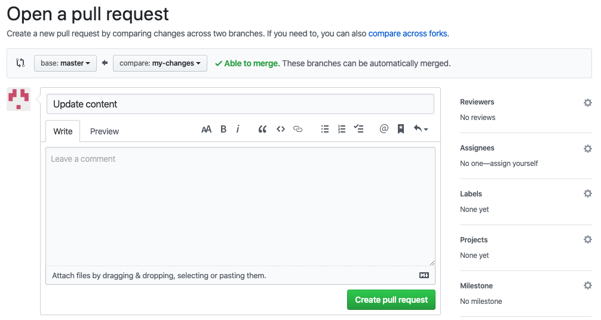

# Review pull requests in pre-production environments in App Service Static Apps

This article demonstrates how to use pre-production environments to review changes to applications deployed with [Azure Static Web Apps](overview.md).

A pre-production environment is a fully-functional staged version of your application that includes changes not available in production. Generated from GitHub pull requests, staged apps work and behave just as they would in production allowing you to perform reviews before pushing to production.

Multiple pre-production environments can co-exist at the same time when using Azure Static Web Apps. Each time you create a pull request on GitHub, a staged version with your changes is deployed to a distinct pre-production environment.

There are many benefits of using pre-production environments. For example, you can:
- Review visual changes more easily, for examples changes to CSS
- Demonstrate the changes to your team
- Compare different versions of your application
- Validate changes using acceptance tests
- Perform sanity checks before deploying to production

## Prerequisites

- An existing GitHub repository configured with Azure Static Web Apps. See [Building your first static app](getting-started.md) if you don't have one.

## Make a change

Begin by making a change either to a local clone of your repository or directly on GitHub. If you make changes locally, you need to commit your changes and push them up to GitHub. Alternatively, you can make the change directly on GitHub as shown in the following steps.

1. Navigate to your project repository on GitHub, then click on the **Branch** button to create a new branch.

    

    Type in a branch name and click on **Create branch**.

1. Go to your _app_ folder and make a content change. For example, you can change a title or paragraph. Once you found the file you want to edit, click on **Edit** to make the change.
    
    

1. After you make the changes, click on **Commit changes** to commit your changes to the branch.

    

## Create a pull request

Next, create a pull request from this change. If you made the change locally, make sure to push your branch to remote.

1. Open the **Pull request** tab of your project on GitHub:

    

1. Click on the **Compare & pull request** button of your branch.

1. You can optionally fill-in some details about your changes, then click on **Create pull request**.
    

As common for the regular GitHub workflow for pull requests, you can assign reviewers and add comments to discuss your changes if needed.

> [!NOTE]
> You can make multiple changes by pushing new commits to your branch. The pull request is then automatically updated to reflect all changes.
 
## Review changes

After the pull request is created, the [GitHub Actions](https://github.com/features/actions) deployment workflow runs and deploys your changes to a pre-production environment.

Once the workflow is finished, the GitHub bot adds a comment to your pull request which contains the URL of the pre-production environment. You can click on this link to see your staged changes.

Click on the generated URL to see the changes.

If you take a closer look at the URL, you can see that it's composed like this: `https://<SUBDOMAIN-PULL_REQUEST_ID>.<AZURE_REGION>.azurestaticapps.net`.

For a given pull request, the URL remains the same even if you push new updates. In addition to the URL staying constant, the same pre-production environment is reused for the life of the pull request.

## Publish changes 

When the pull request is accepted and you are satisfied with the current staged version of your application, the final step is to publish your changes to production.

Click on **Merge pull request**:

Merging copies your changes to the `master` branch (the "production" branch). Then, the deployment workflow starts on the `master` branch and the changes are live after your application has rebuilt. To verify the changes in production,  open your production URL to launch the live version of the website.

## Limitations

Staged versions of your application are currently accessible publicly by their URL, even if your GitHub repository is private.

> [!WARNING]
> Be careful when publishing sensitive content to staged versions, as access to pre-production environments are not restricted.

## Next steps

> [!div class="nextstepaction"]
> [Setup a custom domain](custom-domain.md)
