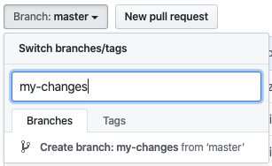

# Review pull requests in pre-production environments in App Service Static Apps

This article demonstrates how to use pre-production environments to review pull requests changes in web applications deployed with [Azure App Service Static Apps](overview.md).

#### What are pre-production environments?

A pre-production environment is a fully functional deployed environment using the latest code changes not yet available on your production environment, for example from a pull request. It works and behaves just like how your production would do with these changes, allowing to perform sanity checks and catch issues before pushing these changes to your actual production environment.

Multiple pre-production environments can co-exist at the same time when using Azure App Service Static Apps. Each time you create a pull request on GitHub, a staged version with your changes will be deployed on a distinct pre-production environment.

There are many benefits of using pre-production environments. For example, you can:
- Review visual changes more easily, for examples CSS modifications
- Demonstrate the changes to your team
- Compare different versions of your application
- Validate changes using acceptance tests
- Perform sanity checks before production deployment

## Prerequisites

- An existing GitHub repository configured with Azure App Service Static Apps. See [Building your first static app](getting-started.md) if you don't have one.

## Make a change

The first step is to make some changes to your content and commit those changes. You can do this on a local clone of your project repository, or directly on GitHub:

1. Navigate to your project repository on GitHub website, then click on the **Branch** button to create a new branch:

    

    Type in a branch name and click on **Create branch**.

1. Go to your `app` folder and make a content change. For example, you can change a title or paragraph. Once you found the file you want to edit, click on **Edit** to make the changes:
    
    

1. After you made the changes, click on **Commit changes** to commit your changes to the branch:

    

## Create a pull request

Now we will create a pull request from this change. If you made the change locally, don't forget to push your branch to remote.

1. Open the **Pull request** tab of your project on GitHub:

    

1. Click on the **Compare & pull request** button of your branch.

1. You can optionally fill-in some details about your changes, then click on **Create pull request**.
    

This is the regular GitHub workflow for pull requests, you can assign reviewers and add comments to discuss your changes if needed.

> [!NOTE]
> You can make multiple changes by pushing new commits to your branch. The pull request will be automatically updated to reflect those changes.
 
## Review changes

After the pull request is created, the [GitHub Actions](https://github.com/features/actions) deployment workflow will run and deploy your changes to a pre-production environment.

The GitHub bot adds a comment to your pull request once the workflow is finished, containing the URL of the pre-production environment to see your staged changes:

Click on this URL to see the changes.

If you take a closer look at the URL, you can see that it's composed like this: `https://SUBDOMAIN-PULL_REQUEST_ID.AZURE_REGION.staticsitescanary.net`.

For a given pull request, the URL will always stay the same even if you push new updates. The same pre-production environment will be reused for the deployment.

## Publish changes 

When the pull request is accepted and you are satisfied with the current staged version of your application, the final step is to publish your changes to production.

Click on **Merge pull request**:

This will merge your changes to the `master` branch (the "production" branch). The deployment workflow will start and the changes will be live after your application has rebuilt. You can then open your production URL to see the changes.

## Limitations

Staged versions of your application are currently accessible publicly by their URL, even if your GitHub repository is private.

> [!WARNING]
> Be careful when publishing sensitive content to staged versions, as it is currently not possible to restrict their access.

## Next steps

Advance to the next article to learn how to connect and disconnect an App Service Static App from a GitHub repository:

> [!div class="nextstepaction"]
> [Setup a custom domain in App Service Static Apps](custom-domain.md)
