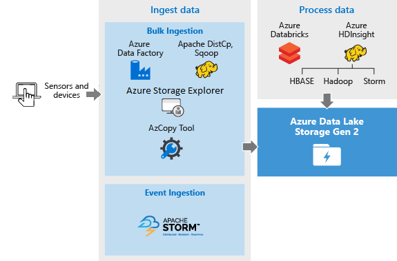
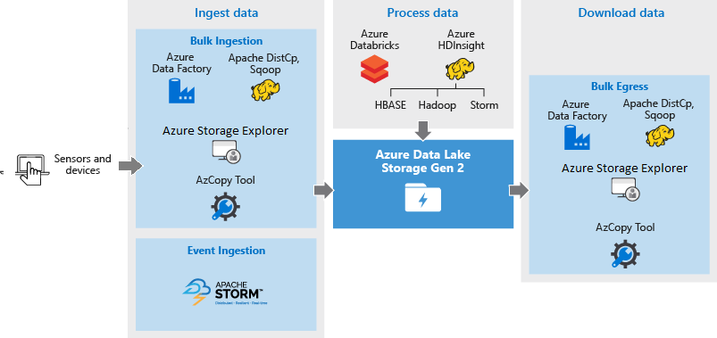
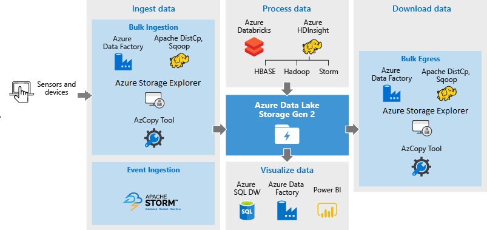

# Using Azure Data Lake Storage Gen2 for big data requirements

There are four key stages in big data processing:

> [!div class="checklist"]
> * Create a Data Lake Gen2 storage account
> * Ingest data into the account
> * Secure the data
> * Process the data
> * Visualize the data
> * Download the data

In this article, we look at these stages with respect to Azure Data Lake Storage Gen2 to understand the options and tools available to meet your big data needs.

## Create a Data Lake Gen2 storage account

First, create your account.

## Ingest data into Data Lake Storage Gen2

Ingesting large amounts of data into a data store, at real-time or in batches
This section highlights the different sources of data and the different ways in which that data can be ingested into a Data Lake Storage Gen2 account.

### Ad hoc data

This represents smaller data sets that are used for prototyping a big data application. There are different ways of ingesting ad hoc data depending on the source of the data.

| Data Source | Ingest it using |
| --- | --- |
| Local computer |<ul> <li>[Storage Explorer](https://azure.microsoft.com/features/storage-explorer/)</ul> |
| Azure Storage Blob |<ul> <li>[Azure Data Factory](../../data-factory/connector-azure-data-lake-store.md)</li> <li>[AzCopy tool](../common/storage-use-azcopy-v10.md)</li><li>[DistCp running on HDInsight cluster](data-lake-storage-use-distcp.md)</li> </ul> |

### Streamed data

This represents data that can be generated by various sources such as applications, devices, sensors, etc. This data can be ingested into Data Lake Storage Gen2 by a variety of tools. These tools will usually capture and process the data on an event-by-event basis in real-time, and then write the events in batches into Data Lake Storage Gen2 so that they can be further processed.

Following are tools that you can use:

* [Azure HDInsight Storm](../../hdinsight/storm/apache-storm-write-data-lake-store.md) - You can write data directly to Data Lake Storage Gen2 from the Storm cluster.

### Relational data

You can also source data from relational databases. Over a period of time, relational databases collect huge amounts of data which can provide key insights if processed through a big data pipeline. You can use the following tools to move such data into Data Lake Storage Gen2.

* [Azure Data Factory](../../data-factory/copy-activity-overview.md)

### Web server log data (upload using custom applications)

This type of dataset is specifically called out because analysis of web server log data is a common use case for big data applications and requires large volumes of log files to be uploaded to Data Lake Storage Gen2. You can use any of the following tools to write your own scripts or applications to upload such data.

* [Azure Data Factory](../../data-factory/copy-activity-overview.md)

For uploading web server log data, and also for uploading other kinds of data (e.g. social sentiments data), it is a good approach to write your own custom scripts/applications because it gives you the flexibility to include your data uploading component as part of your larger big data application. In some cases this code may take the form of a script or simple command line utility. In other cases, the code may be used to integrate big data processing into a business application or solution.

### Data associated with Azure HDInsight clusters

Most HDInsight cluster types (Hadoop, HBase, Storm) support Data Lake Storage Gen2 as a data storage repository. HDInsight clusters access data from Azure Storage Blobs (WASB). For better performance, you can copy the data from WASB into a Data Lake Storage Gen2 account associated with the cluster. You can use the following tools to copy the data.

* [Apache DistCp](data-lake-storage-use-distcp.md)
* [AzCopy tool](../common/storage-use-azcopy-v10.md)
* [Azure Data Factory](../../data-factory/connector-azure-data-lake-store.md)

### Data stored in on-premises or IaaS Hadoop clusters

Large amounts of data may be stored in existing Hadoop clusters, locally on machines using HDFS. The Hadoop clusters may be in an on-premises deployment or may be within an IaaS cluster on Azure. There could be requirements to copy such data to Azure Data Lake Storage Gen2 for a one-off approach or in a recurring fashion. There are various options that you can use to achieve this. Below is a list of alternatives and the associated trade-offs.

| Approach | Details | Advantages | Considerations |
| --- | --- | --- | --- |
| Use Azure Data Factory (ADF) to copy data directly from Hadoop clusters to Azure Data Lake Storage Gen2 |[ADF supports HDFS as a data source](../../data-factory/connector-hdfs.md) |ADF provides out-of-the-box support for HDFS and first class end-to-end management and monitoring |Requires Data Management Gateway to be deployed on-premises or in the IaaS cluster |
| Use Distcp to copy data from Hadoop to Azure Storage. Then copy data from Azure Storage to Data Lake Storage Gen2 using appropriate mechanism. |You can copy data from Azure Storage to Data Lake Storage Gen2 using: <ul><li>[Azure Data Factory](../../data-factory/copy-activity-overview.md)</li><li>[AzCopy tool](../common/storage-use-azcopy-v10.md)</li><li>[Apache DistCp running on HDInsight clusters](data-lake-storage-use-distcp.md)</li></ul> |You can use open-source tools. |Multi-step process that involves multiple technologies |

### Really large datasets

For uploading datasets that range in several terabytes, using the methods described above can sometimes be slow and costly. In such cases, you can use the options below.

* **Using Azure ExpressRoute**. Azure ExpressRoute lets you create private connections between Azure datacenters and infrastructure on your premises. This provides a reliable option for transferring large amounts of data. For more information, see [Azure ExpressRoute documentation](../../expressroute/expressroute-introduction.md).

## Secure data that is stored in Data Lake Storage Gen2

Put your security content here.

## Process data that is stored in Data Lake Storage Gen2

Once the data is available in Data Lake Storage Gen2 you can run analysis on that data using the supported big data applications. Currently, you can use Azure HDInsight and Azure Databricks to run data analysis jobs on the data stored in Data Lake Storage Gen2.

For an example, see [Use Azure Data Lake Storage Gen2 with Azure HDInsight clusters](https://docs.microsoft.com/azure/hdinsight/hdinsight-hadoop-use-data-lake-storage-gen2).

## Download data that is stored in Data Lake Storage Gen2

You might also want to download or move data from Azure Data Lake Storage Gen2 for scenarios such as:

* Move data to other repositories to interface with your existing data processing pipelines. For example, you might want to move data from Data Lake Storage Gen2 to Azure SQL Database or on-premises SQL Server.
* Download data to your local computer for processing in IDE environments while building application prototypes.

In such cases, you can use any of the following options:

* [Azure Data Factory](../../data-factory/copy-activity-overview.md)
* [Apache DistCp](data-lake-storage-use-distcp.md)

## Visualize data that is stored in Data Lake Storage Gen2

You can use a mix of services to create visual representations of data stored in Data Lake Storage Gen2.

* You can start by using [Azure Data Factory to move data from Data Lake Storage Gen2 to Azure SQL Data Warehouse](../../data-factory/copy-activity-overview.md)
* After that, you can [integrate Power BI with Azure SQL Data Warehouse](../../sql-data-warehouse/sql-data-warehouse-get-started-visualize-with-power-bi.md) to create visual representation of the data.
