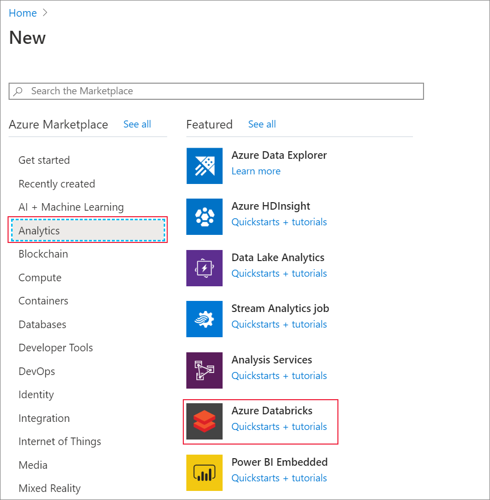
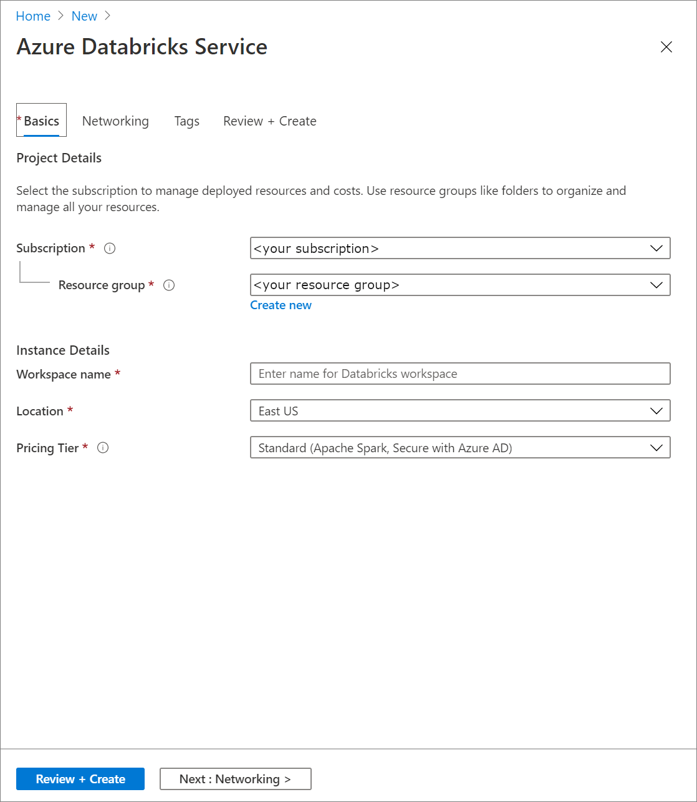

# Tutorial: Use events with Azure Data Lake Storage Gen2

This tutorial shows you how to blah.

In this tutorial, you will:

> [!div class="checklist"]
> * Task here.
> * Taske here.
> * Task here.

If you don’t have an Azure subscription, create a [free account](https://azure.microsoft.com/free/?WT.mc_id=A261C142F) before you begin.

## Prerequisites

* Create an Azure Data Lake Storage Gen2 account.

  See [Create an Azure Data Lake Storage Gen2 account](data-lake-storage-quickstart-create-account.md).

* Make sure that your user account has the [Storage Blob Data Contributor role](https://docs.microsoft.com/azure/storage/common/storage-auth-aad-rbac) assigned to it.

* Install AzCopy v10. See [Transfer data with AzCopy v10](https://docs.microsoft.com/azure/storage/common/storage-use-azcopy-v10?toc=%2fazure%2fstorage%2fblobs%2ftoc.json)

* Create a service principal. See [How to: Use the portal to create an Azure AD application and service principal that can access resources](https://docs.microsoft.com/azure/active-directory/develop/howto-create-service-principal-portal).

  There's a couple of specific things that you'll have to do as you perform the steps in that article.

  :heavy_check_mark: When performing the steps in the [Assign the application to a role](https://docs.microsoft.com/azure/active-directory/develop/howto-create-service-principal-portal#assign-the-application-to-a-role) section of the article, make sure to assign the **Storage Blob Data Contributor** role to the service principal.

  > [!IMPORTANT]
  > Make sure to assign the role in the scope of the Data Lake Storage Gen2 storage account. You can assign a role to the parent resource group or subscription, but you'll receive permissions-related errors until those role assignments propagate to the storage account.

  :heavy_check_mark: When performing the steps in the [Get values for signing in](https://docs.microsoft.com/azure/active-directory/develop/howto-create-service-principal-portal#get-values-for-signing-in) section of the article, paste the tenant ID, app ID, and password values into a text file. You'll need those soon.

## Create an Azure Databricks workspace

In this section, you create an Azure Databricks workspace using the Azure portal.

1. In the Azure portal, select **Create a resource** > **Analytics** > **Azure Databricks**.

    

2. Under **Azure Databricks Service**, provide the values to create a Databricks workspace.

    

    Provide the following values:

    |Property  |Description  |
    |---------|---------|
    |**Workspace name**     | Provide a name for your Databricks workspace        |
    |**Subscription**     | From the drop-down, select your Azure subscription.        |
    |**Resource group**     | Specify whether you want to create a new resource group or use an existing one. A resource group is a container that holds related resources for an Azure solution. For more information, see [Azure Resource Group overview](../../azure-resource-manager/resource-group-overview.md). |
    |**Location**     | Select **West US 2**. Feel free to select another public region if you prefer.        |
    |**Pricing Tier**     |  Choose between **Standard** or **Premium**. For more information on these tiers, see [Databricks pricing page](https://azure.microsoft.com/pricing/details/databricks/).       |

3. The account creation takes a few minutes. To monitor the operation status, view the progress bar at the top.

4. Select **Pin to dashboard** and then select **Create**.

## Create a Spark cluster in Databricks

1. In the Azure portal, go to the Databricks workspace that you created, and then select **Launch Workspace**.

2. You are redirected to the Azure Databricks portal. From the portal, select **New** > **Cluster**.

    

3. In the **New cluster** page, provide the values to create a cluster.

    

    Accept all other default values other than the following:

    * Enter a name for the cluster.
    * Create a cluster with **5.1** runtime.
    * Make sure you select the **Terminate after 120 minutes of inactivity** checkbox. Provide a duration (in minutes) to terminate the cluster, if the cluster is not being used.

4. Select **Create cluster**. Once the cluster is running, you can attach notebooks to the cluster and run Spark jobs.

For more information on creating clusters, see [Create a Spark cluster in Azure Databricks](https://docs.azuredatabricks.net/user-guide/clusters/create.html).

## Create storage account file system

In this section, you create a notebook in Azure Databricks workspace and then run code snippets to configure the storage account.

1. In the [Azure portal](https://portal.azure.com), go to the Azure Databricks workspace you created, and then select **Launch Workspace**.

2. In the left pane, select **Workspace**. From the **Workspace** drop-down, select **Create** > **Notebook**.

    

3. In the **Create Notebook** dialog box, enter a name for the notebook. Select **Scala** as the language, and then select the Spark cluster that you created earlier.

    

    Select **Create**.

4. Copy and paste the following code block into the first cell, but don't run this code yet.

   ```scala
   spark.conf.set("fs.azure.account.auth.type.<storage-account-name>.dfs.core.windows.net", "OAuth")
   spark.conf.set("fs.azure.account.oauth.provider.type.<storage-account-name>.dfs.core.windows.net", "org.apache.hadoop.fs.azurebfs.oauth2.ClientCredsTokenProvider")
   spark.conf.set("fs.azure.account.oauth2.client.id.<storage-account-name>.dfs.core.windows.net", "<appID>")
   spark.conf.set("fs.azure.account.oauth2.client.secret.<storage-account-name>.dfs.core.windows.net", "<password>")
   spark.conf.set("fs.azure.account.oauth2.client.endpoint.<storage-account-name>.dfs.core.windows.net", "https://login.microsoftonline.com/<tenant-id>/oauth2/token")
   spark.conf.set("fs.azure.createRemoteFileSystemDuringInitialization", "true")
   dbutils.fs.ls("abfss://<file-system-name>@<storage-account-name>.dfs.core.windows.net/")
   spark.conf.set("fs.azure.createRemoteFileSystemDuringInitialization", "false")

   ```

    > [!NOTE]
    > This code block directly accesses the Data Lake Gen2 endpoint by using OAuth, but there are other ways to connect the Databricks workspace to your Data Lake Storage Gen2 account. For example, you could mount the file system by using OAuth or use a direct access with Shared Key. <br>To see examples of these approaches, see the [Azure Data Lake Storage Gen2](https://docs.azuredatabricks.net/spark/latest/data-sources/azure/azure-datalake-gen2.html) article on the Azure Databricks Website.

5. In this code block, replace the `storage-account-name`, `appID`, `password`, and `tenant-id` placeholder values in this code block with the values that you collected when you created the service principal. Set the `file-system-name` placeholder value to whatever name you want to give the file system.

    > [!NOTE]
    > In a production setting, consider storing your authentication key in Azure Databricks. Then, add a look up key to your code block instead of the authentication key. After you've completed this quickstart, see the [Azure Data Lake Storage Gen2](https://docs.azuredatabricks.net/spark/latest/data-sources/azure/azure-datalake-gen2.html) article on the Azure Databricks Website to see examples of this approach.

6. Press the **SHIFT + ENTER** keys to run the code in this block.

## Generate a widget

Introduction

1. Step 1.
2. Step 2.

## Create the table structure in Databricks

Introduction

1. Step 1.
2. Step 2.

## Ingest starter data

Introduction

1. Step 1.
2. Step 2.

## Create a function

Introduction

1. Step 1.
2. Step 2.

## Create an event subscription

Introduction

1. Step 1.
2. Step 2.

## Test it all out

Introduction

1. Step 1.
2. Step 2.

## Clean up resources

When they're no longer needed, delete the resource group and all related resources. To do so, select the resource group for the storage account and select **Delete**.

## Next steps

> [!div class="nextstepaction"] 
> [Next step goes here](data-lake-storage-tutorial-extract-transform-load-hive.md)
