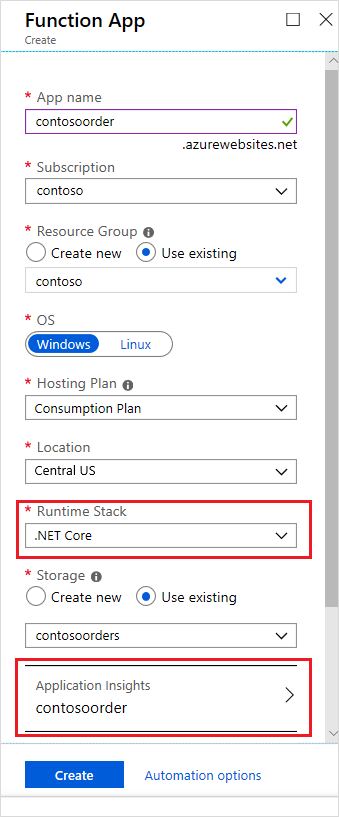
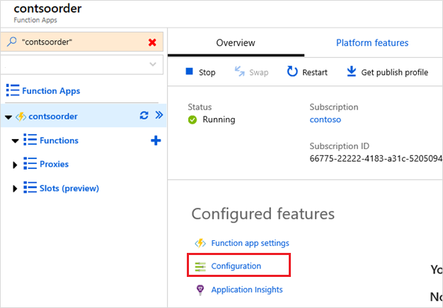
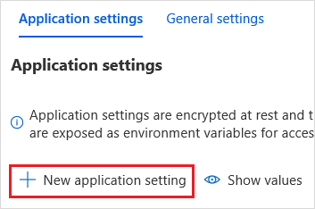
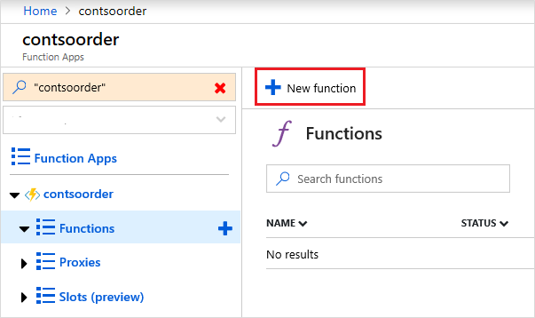

# Tutorial: Use events with Azure Data Lake Storage Gen2

This tutorial shows you how to blah.

In this tutorial, you will:

> [!div class="checklist"]
> * Task here.
> * Taske here.
> * Task here.

If you don’t have an Azure subscription, create a [free account](https://azure.microsoft.com/free/?WT.mc_id=A261C142F) before you begin.

## Prerequisites

* Create a storage account that has a hierarchical namespace (Azure Data Lake Storage Gen2). This tutorial uses a storage account named `contosoorders`.

  See [Create an Azure Data Lake Storage Gen2 account](data-lake-storage-quickstart-create-account.md).

* Make sure that your user account has the [Storage Blob Data Contributor role](https://docs.microsoft.com/azure/storage/common/storage-auth-aad-rbac) assigned to it.

* Create a service principal. See [How to: Use the portal to create an Azure AD application and service principal that can access resources](https://docs.microsoft.com/azure/active-directory/develop/howto-create-service-principal-portal).

  There's a couple of specific things that you'll have to do as you perform the steps in that article.

  :heavy_check_mark: When performing the steps in the [Assign the application to a role](https://docs.microsoft.com/azure/active-directory/develop/howto-create-service-principal-portal#assign-the-application-to-a-role) section of the article, make sure to assign the **Storage Blob Data Contributor** role to the service principal.

  > [!IMPORTANT]
  > Make sure to assign the role in the scope of the Data Lake Storage Gen2 storage account. You can assign a role to the parent resource group or subscription, but you'll receive permissions-related errors until those role assignments propagate to the storage account.

  :heavy_check_mark: When performing the steps in the [Get values for signing in](https://docs.microsoft.com/azure/active-directory/develop/howto-create-service-principal-portal#get-values-for-signing-in) section of the article, paste the tenant ID, app ID, and password values into a text file. You'll need those soon.

* Create an Azure Databricks service and cluster. This tutorial uses a service named `contoso-orders` and a cluster named `customer-order-cluster`.

  See [Quickstart: Analyze data in Azure Data Lake Storage Gen2 by using Azure Databricks](data-lake-storage-quickstart-create-databricks-account.md).

* Install AzCopy v10. See [Transfer data with AzCopy v10](https://docs.microsoft.com/azure/storage/common/storage-use-azcopy-v10?toc=%2fazure%2fstorage%2fblobs%2ftoc.json)

## Add initial data to the storage account

1. Open Storage explorer.
2. Create a container named "data". Put screenshot here.
3. Create a folder named input and then a subfolder named full.
4. Create a csv file that contains this information:

   ```
   InvoiceNo,StockCode,Description,Quantity,InvoiceDate,UnitPrice,CustomerID,Country
   536365,85123A,WHITE HANGING HEART T-LIGHT HOLDER,6,12/1/2010 8:26,2.55,17850,United Kingdom
   ```
5. Open storage explorer and copy this file to the input/full directory.

## Create and populate delta databricks tables

In this section, you create a notebook in Azure Databricks workspace and then run code snippets to set up the customer table in the storage account.

1. In the [Azure portal](https://portal.azure.com), go to the Azure Databricks workspace you created, and then select **Launch Workspace**.

2. In the left pane, select **Workspace**. From the **Workspace** drop-down, select **Create** > **Notebook**.

    

3. In the **Create Notebook** dialog box, enter a name for the notebook. Select **Python** as the language, and then select the Spark cluster that you created earlier.

    

    Select **Create**.

4. Copy and paste the following code block into the first cell, but don't run this code yet.

    ```Python
    spark.conf.set("fs.azure.account.auth.type", "OAuth")
    spark.conf.set("fs.azure.account.oauth.provider.type", "org.apache.hadoop.fs.azurebfs.oauth2.ClientCredsTokenProvider")
    spark.conf.set("fs.azure.account.oauth2.client.id", "<appId")
    spark.conf.set("fs.azure.account.oauth2.client.secret", "<password>")
    spark.conf.set("fs.azure.account.oauth2.client.endpoint", "https://login.microsoftonline.com/<tenant>/oauth2/token")
    spark.conf.set("fs.azure.createRemoteFileSystemDuringInitialization", "true")

    adlsPath = 'abfss://data@contosoorders.dfs.core.windows.net/'
    inputPath = adlsPath + dbutils.widgets.get('source_file')
    customerTablePath = adlsPath + 'delta-tables/customers'
    ```

5. In this code block, replace the `appId`, `password`, `tenant` placeholder values in this code block with the values that you collected while completing the prerequisites of this tutorial.

6. Press the **SHIFT + ENTER** keys to run the code in this block.

7. Copy and paste the following code block into a different cell, then press the **SHIFT + ENTER** keys to run the code in this block. This code configures the structure of your databricks delta table and then loads some initial data from the csv file that you uploaded earlier.

   ```Python
   dbutils.widgets.text('source_file', "", "Source File")

   from pyspark.sql.types import StructType, StructField, DoubleType, IntegerType, StringType


   inputSchema = StructType([
   StructField("InvoiceNo", IntegerType(), True),
   StructField("StockCode", StringType(), True),
   StructField("Description", StringType(), True),
   StructField("Quantity", IntegerType(), True),
   StructField("InvoiceDate", StringType(), True),
   StructField("UnitPrice", DoubleType(), True),
   StructField("CustomerID", IntegerType(), True),
   StructField("Country", StringType(), True)
   ])

   rawDataDF = (spark.read
    .option("header", "true")
    .schema(inputSchema)
    .csv(adlsPath + 'input/full')
   )

   (rawDataDF.write
     .mode("overwrite")
     .format("delta")
     .saveAsTable("customer_data", path=customerTablePath))
   ```

8. After this code block successfully runs, remove this code block from your notebook. You no longer need it.

## Upsert data to delta table

1. Copy and paste the following code block into a different cell, but don't run this cell.

   ```Python
   upsertDataDF = (spark
     .read
     .option("header", "true")
     .csv(inputPath)
   )
   upsertDataDF.createOrReplaceTempView("customer_data_to_upsert")
   ```

   This code uploads and inserts data from a csv file identified by the widget that you added earlier. We'll populate that widget by using a function app when the event is triggered.

## Create a function app

1. In the upper corner of the workspace, choose the people icon, and then choose **User settings**.

   

2. Click the **Generate new token**, and then click **Generate**.

   Make sure to copy to the token to safe place. You'll need this later.
  
3. Select the **Create a resource** button found on the upper left-hand corner of the Azure portal, then select **Compute > Function App**.

   

4. Configure the function app

   

5. Add configuration variables.

   

6. Choose the **New application setting** button to add settings.

   

   Add the following settings by using this approach:

   |Setting name | Value |
   |----|----|
   |**DBX_INSTANCE**| The region of your databricks workspace. For example: `westus2.azuredatabricks.net`|
   |**DBX_PAT**| The personal access token that you generated earlier. |
   |**DBX_JOB_ID**|The identifier of the running job. In our case, this value is `1`.|

7. In the overview page of the function app, click the **New function** button.

   

8. Choose **Http Trigger**.

   The **New Function** pane appears.

9. In the **New Function** pane, name the function **UpsertOrder**, and then click the **Create** button.

10. Replace the contents of the code file with this code:

   ```cs
   using "Microsoft.Azure.EventGrid"
   using "Newtonsoft.Json"
   using Microsoft.Azure.EventGrid.Models;
   using Newtonsoft.Json;
   using Newtonsoft.Json.Linq;

   private static HttpClient httpClient = new HttpClient();

   public static async Task Run(EventGridEvent eventGridEvent, ILogger log)
   {
       log.LogInformation("Event Subject: " + eventGridEvent.Subject);
       log.LogInformation("Event Topic: " + eventGridEvent.Topic);
       log.LogInformation("Event Type: " + eventGridEvent.EventType);
       log.LogInformation(eventGridEvent.Data.ToString());

       if (eventGridEvent.EventType == "Microsoft.Storage.BlobCreated" || eventGridEvent.EventType == "Microsoft.Storage.FileRenamed") {
           var fileData = ((JObject)(eventGridEvent.Data)).ToObject<StorageBlobCreatedEventData>();
           if (fileData.Api == "FlushWithClose") {
               log.LogInformation("Triggering Databricks Job for file: " + fileData.Url);
               var fileUrl = new Uri(fileData.Url);
               var httpRequestMessage = new HttpRequestMessage {
                   Method = HttpMethod.Post,
                   RequestUri = new Uri(String.Format("https://{0}/api/2.0/jobs/run-now", System.Environment.GetEnvironmentVariable("DBX_INSTANCE", EnvironmentVariableTarget.Process))),
                   Headers = { 
                       { System.Net.HttpRequestHeader.Authorization.ToString(), "Bearer " + System.Environment.GetEnvironmentVariable("DBX_PAT", EnvironmentVariableTarget.Process)},
                       { System.Net.HttpRequestHeader.ContentType.ToString(), "application/json" }
                   },
                   Content = new StringContent(JsonConvert.SerializeObject(new {
                       job_id = System.Environment.GetEnvironmentVariable("DBX_JOB_ID", EnvironmentVariableTarget.Process),
                       notebook_params = new {
                           source_file = String.Join("", fileUrl.Segments.Skip(2))
                       }
                   }))
                };
               var response = await httpClient.SendAsync(httpRequestMessage);
               response.EnsureSuccessStatusCode();
           }
       }  
   }
   ```

## Ingest starter data

Introduction

1. Step 1.
2. Step 2.

## Create a function

Introduction

1. Step 1.
2. Step 2.

## Create an event subscription

Introduction

1. Step 1.
. Step 2.

## Test it all out

Introduction

1. Step 1.
2. Step 2.

## Clean up resources

When they're no longer needed, delete the resource group and all related resources. To do so, select the resource group for the storage account and select **Delete**.

## Next steps

> [!div class="nextstepaction"] 
> [Next step goes here](data-lake-storage-tutorial-extract-transform-load-hive.md)
