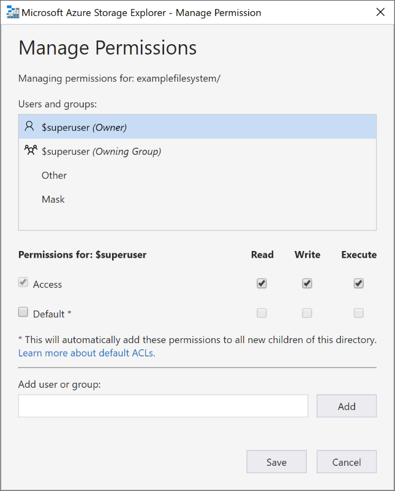

# How to: Set file and directory level permissions using Azure Storage explorer

Files stored in a storage account which has the hierarchical namespace enabled support fine grain permissions and access control list management. Allowing you to control access to your data and information at lower levels. This article shows how to set file and directory level permissions, using an access control list, through the desktop version of Azure Storage explorer. 

## Pre-requisites

In order to best achieve this, we require that you complete our [Azure Storage explorer quickstart](data-lake-storage-explorer.md). This ensures your storage account will be in the most appropriate state (filesystem created and data uploaded to filesystem).

## Managing access

You can set permissions at the root of your filesystem. To do so, right-click your filesystem, and select **Manage Permissions**.

This wil bring up the **Manage Permission** prompt.

The **Manage Access** prompt will allow you to manage permissions for owner and the owners group as well as adding new users to the access control list for whom you can then manage permissions.

In order to add a new user or group to the access control list, select the **Add user or group** box and enter the corresponding AAD entry you wish to add to the list, then select **Add**.

The user or group will now appear in the **Users and groups:** field, allowing you to begin managing their permissions.

> [!NOTE]
> It is a best practice, and recommended, to create a security group in AAD and maintain permissions on the group rather than individual users. For details on this recommendation, as well as other best practices, see [best practices for data lake storage gen2](data-lake-storage-best-practices.md).

There are two categories of permissions you can assign: access permissions and default permissions.

* **Access permissions**: Access permissions control access to an object. Files and directories both have access permissions.

* **Default permissions**: A template of permissions associated with a directory that determine the access permissions for any child items that are created under that directory. Files do not have default permissions.

Within both of these categories, there are three permissions you can then assign on files or directories: **Read**, **Write**, and **Execute**.

>[!NOTE]
> Making selections here will not set permissions on any currently existing item inside the directory. You must go to each individual item and set the permissions manually, if it already exists.

You can manage permissions on individual directories as well as individual files, allowing you fine grain access control. The process for managing permissions on directories and files is the same as described above. Right-click the file or directory you wish to manage permissions on, and follow the same process.

## Next steps

In this how-to, you learned how to set permissions on files and directories using **Azure Storage Explorer**. To learn about permissions, including default permissions, access permissions, and their behavior, continue to our conceptual article on the subject.

> [!div class="nextstepaction"]
> [Access control in Azure Data Lake Storage Gen2](data-lake-storage-access-control.md)