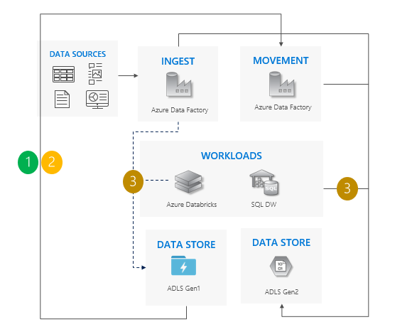

---
title: Migrate Azure Data Lake Storage from Gen1 to Gen2
description: Migrate Azure Data Lake Storage from Gen1 to Gen2.
author: normesta
ms.topic: conceptual
ms.author: normesta
ms.date: 12/05/2019
ms.service: storage
ms.subservice: data-lake-storage-gen2
---

# Migrate Azure Data Lake Storage from Gen1 to Gen2

You can migrate your data, workloads, and applications from Data Lake Storage Gen1 to Data Lake Storage Gen2.

Data Lake Storage Gen2 is Microsoft's latest Data Lake Storage repository. It combines Gen1 features such as file system semantics, directory and file level security, and scale with low-cost, tiered storage, high availability/disaster recovery capabilities from Azure Blob Storage. 

To learn more, see [Azure Data Lake Storage](https://azure.microsoft.com/services/storage/data-lake-storage/).

> [!NOTE]
> For easier reading, this article uses the term *Gen1* to refer to Azure Data Lake Storage Gen1, and the term *Gen2* to refer to Azure Data Lake Storage Gen2.

## Gen1 to Gen2 road map

To migrate to Gen2, we recommend the following path.

:heavy_check_mark: Step 1: Assess whether to migrate

:heavy_check_mark: Step 2: Prepare to migrate

:heavy_check_mark: Step 3: Migrate data

:heavy_check_mark: Step 4: Update workloads and applications

> [!NOTE]
> There's no way to convert a Gen1 account into Gen2 because these accounts run in separate services.

### Step 1: Assess whether to migrate

:one: &nbsp;&nbsp;Learn about the [Data Lake Storage Gen2 offering](https://azure.microsoft.com/services/storage/data-lake-storage/); it's benefits, costs, and general architecture. 

:two: &nbsp;&nbsp;[Compare the capabilities](#gen1-gen2-feature-comparison) of Gen1 with those of Gen2. 

:three: &nbsp;&nbsp;Review a list of [known issues](data-lake-storage-known-issues.md) to gauge product state and stability and assess any gaps.

:four: &nbsp;&nbsp;If you're interested in leveraging blob storage features, review the [current level of support](https://docs.microsoft.com/azure/storage/blobs/data-lake-storage-multi-protocol-access?toc=%2fazure%2fstorage%2fblobs%2ftoc.json#blob-storage-feature-support) for those features.

:five: &nbsp;&nbsp;Review the current state of [Azure ecoysystem support](https://docs.microsoft.com/azure/storage/blobs/data-lake-storage-multi-protocol-access?toc=%2fazure%2fstorage%2fblobs%2ftoc.json#azure-ecosystem-support) to ensure that services that your solutions depend upon support  Gen2.

### Step 2: Prepare to migrate

:one: &nbsp;&nbsp;Identify the data sets that you'll migrate.

:two: &nbsp;&nbsp;Determine the impact that a migration will have on your business.

:three: &nbsp;&nbsp;Create a migration plan. We recommend any of these [migration patterns](#migration-patterns).

### Step 3: Migrate data

:one: &nbsp;&nbsp;[Create a storage account](data-lake-storage-quickstart-create-account.md) and enable the hierarchical namespace feature. 

:two: &nbsp;&nbsp;Migrate data by using the data transfer tool that you've chosen.

:three: &nbsp;&nbsp;[Assign role-based access control (RBAC) roles](../common/storage-auth-aad-rbac-portal.md) to security principles. 

:four: &nbsp;&nbsp;Optionally [apply file and folder level security](data-lake-storage-access-control.md).

### Step 4: Update workloads and applications

:one: &nbsp;&nbsp;Configure [services in your workloads](data-lake-storage-integrate-with-azure-services.md) to point to your Gen2 endpoint. 

:two: &nbsp;&nbsp;Update applications to use Gen2 APIs. See guides for [.NET](data-lake-storage-directory-file-acl-dotnet.md), [Java](data-lake-storage-directory-file-acl-java.md), [Python](data-lake-storage-directory-file-acl-python.md), and [REST](https://docs.microsoft.com/rest/api/storageservices/data-lake-storage-gen2). 

:three: &nbsp;&nbsp;Update scripts to use Data Lake Storage Gen2 [PowerShell cmdlets](data-lake-storage-directory-file-acl-powershell.md), and [Azure CLI commands](data-lake-storage-directory-file-acl-cli.md).

:four: &nbsp;&nbsp;Search for URI references that contain the string `adl://` in code files, or in Databricks notebooks, Apache Hive HQL files or any other file used as part of your workloads. 

:five: &nbsp;&nbsp;Replace these references with the [Gen2 formatted URI](data-lake-storage-introduction-abfs-uri.md) of your new storage account. For example: the Gen1 URI: `adl://mydatalakestore.azuredatalakestore.net/mydirectory/myfile` might become `abfss://myfilesystem@mydatalakestore.dfs.core.windows.net/mydirectory/myfile`. 

<a id="gen1-gen2-feature-comparison" />

## Gen1 vs Gen2 capabilities

This table compares the capabilities of Gen1 to that of Gen2.

|Area |Gen1   |Gen2 |
|---|---|---|
|Data organization|Hierarchical namespace File and folder support|Hierarchical namespace File and folder support |
|Geo-redundancy| LRS| LRS, ZRS, GRS, RA-GRS |
|Authentication|AAD managed identity Service principals|AAD managed identity Service principals Shared Access Key|
|Authorization|Management - RBAC Data – ACLs|Management – RBAC Data -  ACLs, RBAC |
|Encryption – Data at rest|Server side – with service managed or customer managed keys|Server side – with service managed or customer managed keys|
|VNET Support|VNET Integration|Service Endpoints|
|Developer experience|REST APIs, SDKs, Powershell|REST APIs Roadmap – SDKs, Powershell for Blob Operations(In public preview)|
|Diagnostic logs|Classic logs Azure Monitor integrated|Roadmap – Classic logs (In public preview) Azure monitor integration – timeline TBD|
|Ecosystem|HDInsight (3.6), Azure Databricks (3.1 and above), SQL DW, ADF|HDInsight (3.6, 4.0), Azure Databricks (5.1 and above), SQL DW, ADF|

<a id="migration-patterns" />

## Gen1 to Gen2 patterns

Choose a migration pattern, and then modify that pattern as needed.

|||
|---|---|
|**Lift and Shift**|The simplest pattern. Ideal if your data pipelines can afford downtime.|
|**Incremental copy**|Similar to *lift and shift*, but with less downtime. Ideal for large amounts of data that take longer to copy.|
|**Dual pipeline**|Ideal for pipelines that can't afford any downtime.|
|**Bidirectional sync**|Similar to *dual pipeline*, but with a more phased approach that is suited for more complicated pipelines.|

Let's take a closer look at each pattern.
 
### Lift and shift pattern

This is the simplest pattern. It's ideal for data pipelines that can afford downtime.

The general pattern is as follows:

:one: &nbsp;&nbsp;Stop all writes to Gen1.

:two: &nbsp;&nbsp;Move data from Gen1 to Gen2.

:three: &nbsp;&nbsp;Point ingest operations and workloads to Gen2.

:four: &nbsp;&nbsp;Decommission Gen1.

> [!TIP]
> For data transfer, we recommend [Azure Data Factory](https://docs.microsoft.com/azure/data-factory/connector-azure-data-lake-storage). ACLs copy with the data.

### Incremental copy pattern

This pattern is similar to the *lift and shift* pattern, but with less downtime. You'll stop writes to Gen1 only after all data is copied to Gen2. This pattern is useful for large amounts of data that take longer to copy.

The general pattern is as follows:

:one: &nbsp;&nbsp;Start moving data from Gen1 to Gen2.

:two: &nbsp;&nbsp;Incrementally copy new data from Gen1.

:three: &nbsp;&nbsp;After all data is copied, stop all writes to Gen1, and point workloads to Gen2.

:four: &nbsp;&nbsp;Decommission Gen1.

> [!TIP]
> For data transfer, we recommend [Azure Data Factory](https://docs.microsoft.com/azure/data-factory/connector-azure-data-lake-storage). ACLs copy with the data.

### Dual pipeline pattern

Use this pattern for pipelines that can't afford any downtime.   

The general pattern is as follows:

:one: &nbsp;&nbsp;Move data from Gen1 to Gen2.

:two: &nbsp;&nbsp;Ingest new data to both Gen1 and Gen2.

:three: &nbsp;&nbsp;Point workloads to Gen2.

:four: &nbsp;&nbsp;Stop all writes to Gen1 and then decommission Gen1.

> [!TIP]
> For data transfer, we recommend [Azure Data Factory](https://docs.microsoft.com/azure/data-factory/connector-azure-data-lake-storage). ACLs copy with the data.

### Bi-directional sync pattern

This pattern is similar to the *dual pipeline* pattern, but it's more ideally suited for complicated pipelines that require Gen1 and Gen2 side-by-side support during migration.

The general pattern is as follows:

:one: &nbsp;&nbsp;Set up bidirectional replication between Gen1 and Gen2.

:two: &nbsp;&nbsp;Incrementally move ingest and compute workloads to Gen2.

:three: &nbsp;&nbsp;When all moves are complete, stop all writes to Gen1 and turn off bidirectional replication.

:four: &nbsp;&nbsp;Decommission Gen1.

> [!TIP]
> For bidirectional data transfer, we recommend [WanDisco](https://docs.wandisco.com/bigdata/wdfusion/adls/). It offers a repair feature for existing data.

## Next steps

- Learn about the various parts of setting up security for a storage account. See [Azure Storage security guide](../common/storage-security-guide.md).
- Optimize the performance for your Data Lake Store. See [Optimize Azure Data Lake Storage Gen2 for performance](data-lake-storage-performance-tuning-guidance.md)
- Review the best practices for managing your Data Lake Store. See [Best practices for using Azure Data Lake Storage Gen2](data-lake-storage-best-practices.md)

