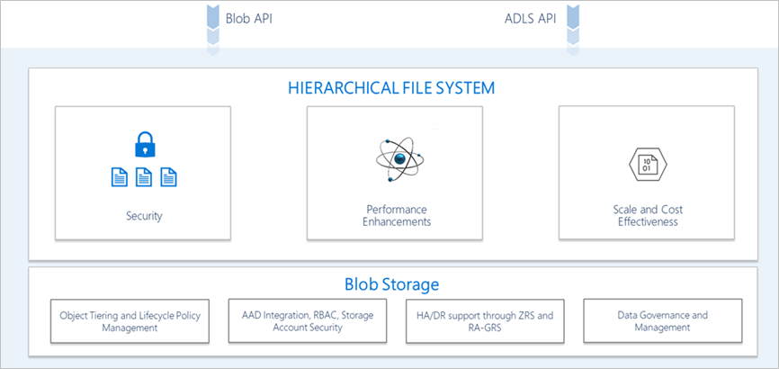

# Multi-protocol access on Azure Data Lake Storage

Blob APIs now work with accounts that have a hierarchical namespace. This unlocks the ecosystem of tools, applications, and services, as well as several Blob Storage features to accounts that have a hierarchical namespace.

Until recently, you might have had to maintain separate storage solutions for object storage and analytics storage. That's because Azure Data Lake Storage Gen2 had limited ecosystem support. It also had limited access to Blob service features such as diagnostic logging. A fragmented storage solution is hard to maintain because you have to move data between accounts to accomplish various scenarios. You no longer have to do that.

With multi-protocol access on Data Lake Storage, you can work with your data by using the ecosystem of tools, applications, and services. This also includes third-party tools and applications. You can point them to accounts that have a hierarchical namespace without having to modify them. These applications work *as is* even if they call Blob APIs, because Blob APIs can now operate on data in accounts that have a hierarchical namespace.

Blob Storage features such as [diagnostic logging](../common/storage-analytics-logging.md), [access tiers](storage-blob-storage-tiers.md), and [Blob Storage lifecycle management policies](storage-lifecycle-management-concepts.md) now work with accounts that have a hierarchical namespace. Therefore, you can enable hierarchical namespaces on your blob Storage accounts without losing access to these important features. 

> [!NOTE]
> Multi-protocol access on Data Lake Storage is generally available and is available in all regions. Some Azure services or blob storage features enabled by multi-protocol access remain in preview. See the tables in each section of this article for more information. 

## How multi-protocol access on data lake storage works

Blob APIs and Data Lake Storage Gen2 APIs can operate on the same data in storage accounts that have a hierarchical namespace. Data Lake Storage Gen2 routes Blob APIs through the hierarchical namespace so that you can get the benefits of first class directory operations and POSIX-compliant access control lists (ACLs). 

 

Existing tools and applications that use the Blob API gain these benefits automatically. Developers won't have to modify them. Data Lake Storage Gen2 consistently applies directory and file-level ACLs regardless of the protocol that tools and applications use to access the data. 

## Feature, tool, and Azure service ecosystem support

Multi-protocol access on Data Lake Storage enables you to use more Blob Storage features, more tools and APIs, and connect with in an increasing number of Azure services. 

Even though multi-protocol access on Data Lake Storage is generally available, support for some features, tools and services remain in preview or are not yet supported. This table summarizes Data Lake Storage Gen2 support for Blob Storage features, tools, and Azure services.  The items that appear in this table will change over time as support for Blob Storage features continues to expand. 

### Blob Storage features

[!INCLUDE [storage-data-lake-blob-feature-support](../../../includes/storage-data-lake-blob-feature-support.md)]

### Tools and SDKs

[!INCLUDE [storage-data-lake-tool-support](../../../includes/storage-data-lake-tool-support.md)]

### Azure service ecosystem

[!INCLUDE [storage-data-lake-service-ecosystem-support](../../../includes/storage-data-lake-service-ecosystem-support.md)]

## Next steps

* To review specific issues, see [Known Issues](data-lake-storage-known-issues.md#known-issues).

* For a complete list of supported services, see [Integrate Azure Data Lake Storage with Azure services](data-lake-storage-integrate-with-azure-services.md)

