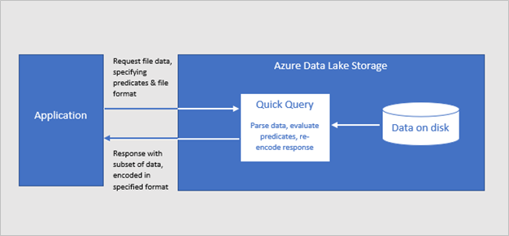

# Azure Data Lake Storage Quick Query (Preview)

Azure Data Lake Storage is the storage service for creating enterprise Data Lakes in Azure. Quick query (Preview) is a new capability for Azure Data Lake Storage that enables applications and analytics frameworks to dramatically optimize data processing by retrieving only the subset of data that they require. This reduces the time and processing power that's required to gain critical insights into your data.

> [!NOTE]
> The quick query feature is in public preview, and is available in the region1, region2, and region3 regions. To review limitations, see the [Known issues](data-lake-storage-known-issues) article. To enroll in the preview, see [this form](https://aka.ms/adlsquickquerypreview). 

## Quick query optimizes data processing

Data processing applications and analytics frameworks consume structured and semi-structured data in a variety of file formats (For example: CSV, Json, and Parquet). Often times, these applications apply filtering logic so that only the data that meets certain criteria is used to calculate a particular aggregated value. Typically, an application retrieves **all** of the data from a file, parses the data, applies filtering criteria, and calculates the aggregated value. This pattern, essentially designed to remove unneeded data, incurs a significant compute cost. 

Quick query accepts filtering *predicates* which enables your applications to filter rows and columns at the moment when data is read from disk. Only the data that meets the conditions of the predicate is transferred over the network to the application. This significantly reduces network latency and compute cost.  

Your applications can use a reduced SQL grammar to specify the row filter predicates and column projections of a quick query request. A request can process only one file. Therefore, advanced relational features of SQL, such as joins and group by aggregates, aren't supported. Quick query supports CSV, Json and Parquet formatted data as input to each request.

The following diagram illustrates how applications use quick query to process data

The quick query feature isn't limited to Data Lake Storage. It's completely compatible with the blobs in storage accounts that don't have a hierarchical namespace enabled on them. This means that you can gain achieve the same reduction in network latency and compute costs when you process data that you already have stored as blobs in storage accounts.

## Improved performance and a reduced compute cost

Analysis of the input/output patterns for analytics workloads reveal that applications typically require only 20% of the data that they read to perform any given calculation. This statistic is true even after applying techniques such as [partition pruning](https://docs.microsoft.com/azure/hdinsight/hdinsight-hadoop-optimize-hive-query#hive-partitioning). This means that 80% of that data is needlessly transferred across the network, parsed, and filtered by the application. This impacts the performance of your application. 

You'll reduce the cost of transferring data by filtering unwanted data at the source. Your application can provision a fewer number of smaller Virtual Machines (VM) to By not having to parse and filter unneeded data, your application can provision a fewer number of smaller Virtual Machines (VM) to do the work. The CPU load of parsing and filtering unwanted data results in application having to provision a greater number and larger VMs in order to do their work. By trading this compute load off to Quick Query, applications are able to realize significant cost savings.

## Feature costs

Due to the increased compute load within the ADLS service, Quick Query’s pricing model differs from the normal ADLS transaction model. Quick Query charges a cost for the amount of data scanned as well as a cost for the amount of data returned to the caller.

Despite the change to the billing model, Quick Query’s pricing is designed to lower the total cost of ownership for a workload, given the reduction in the much more expensive VM costs.

## Next steps

The following articles describe some of the main concepts of ADLS Quick Query and how to integrate it into your applications:

- Sign up to participate in the ADLS Quick Query preview	
- How to filter data with ADLS Quick Query in .NET
- ADLS Quick Query SQL language reference
- ADLS Quick Query REST API reference

## Questions

- "Quick Query" is the name of a feature (not a brand, product, or app), so we should not capitalize the name. What about something more descriptive of the capability in the title?
- I thought that the form approach was going away. I thought that features can ship only when there is a Portal experience for enabling the feature.
- We have a .NET client application example, but what about non-developers? How does a data analyst use this feature in a tool such as Data bricks, HD Insight, or Power BI?
- I removed the promise of being available in all regions by GA as promises are a no go in content.

