# Analyze data in Azure Data Lake Storage Gen2 by using Power BI

In this article you will learn how to use Power BI Desktop to analyze and visualize data stored in Azure Data Lake Storage Gen2.

## Prerequisites

Before you begin this tutorial, you must have the following:

> [!div class="checklist"]
> * An Azure subscription. See [Get Azure free trial](https://azure.microsoft.com/pricing/free-trial/).
> * A storage account that has a hierarchical namespace. Follow [these](data-lake-storage-quickstart-create-account) instructions to create one.
> This article assumes that you've created an account named `myadlsg2`.
> * A sample data file named `Drivers.txt` located in your storage account.
> You can download this sample from [Azure Data Lake Git Repository](https://github.com/Azure/usql/tree/master/Examples/Samples/Data/AmbulanceData
Drivers.txt), and then upload that file to your storage account.

## Install the preview version of Power BI Desktop

This version contains the Azure Data Lake Storage Gen2 (Beta) Connector. This version is supported only on x64 architectures of the Windows operating system.

1. Click [here](https://contosoblobstoragev2.blob.core.windows.net/adlsg2connector/PBIDesktop_x64.msi) to download the MSI installer for the preview version of Power BI Desktop.
2. Run the MSI installer and follow the instructions in the setup wizard.

   > [!NOTE]
   > If you experience issues with the installer, extract the **SkipVerification.zip** file from [this](https://nam06.safelinks.protection.outlook.com/?url=https%3A%2F%2F1drv.ms%2Fu%2Fs!AmfmHLh2qqs6w7QdBu-EehW5CEfJhw&data=02%7C01%7Cbensack%40microsoft.com%7C5d0308b717dd48bdc82608d6c74a5cd9%7C72f988bf86f141af91ab2d7cd011db47%7C1%7C0%7C636915519528922797&sdata=WvnHLfO9nNnvVDXxFWN4I0Ji7UBv6oIovyBwQxFibqw%3D&reserved=0) location onto your local computer. Then, run the **SkipVerficiation.bat** file. After the script completes, try running the MSI installer again.

## Create a report in Power BI Desktop

1. Launch Power BI Desktop on your computer.
2. From the **Home** ribbon, click **Get Data**, and then click **More**.
3. In the **Get Data** dialog box, click **Azure**, click **Azure Data Lake Store Gen2 (Beta)**, and then click **Connect**.

    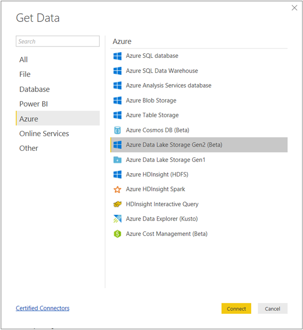

4. If you see a dialog box about the connector being in a development phase, opt to continue.

5. In the **Azure Data Lake Store** dialog box, provide the URL to your Data Lake Storage Gen2 account file system endpoint, and then click **OK**.

    

6. In the next dialog box, click **Sign** in to sign into your storage account. You will be redirected to your organization's sign in page. Follow the prompts to sign into the account.

    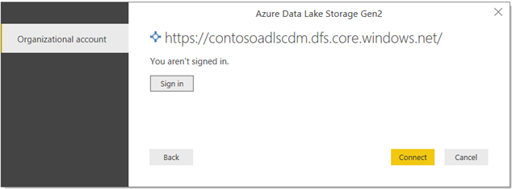

7. After you have successfully signed in, click **Connect**.

    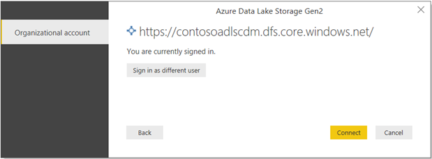

8. The next dialog box shows the available file systems and the file that you uploaded to your storage account. Verify the information, and then click **Load**.

    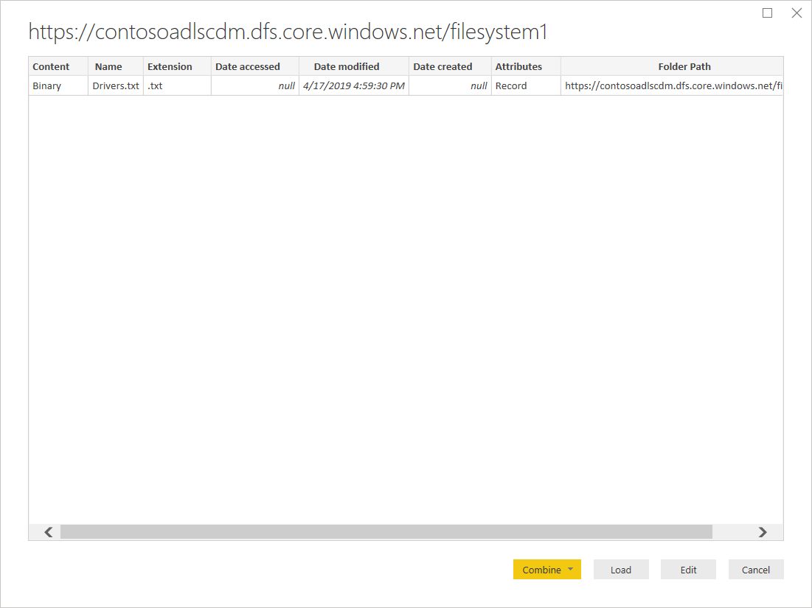

9. After the data has been successfully loaded into Power BI, you will see the following fields in the **Fields** tab.

    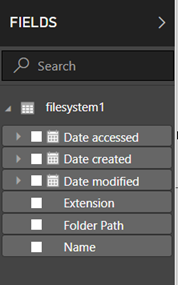

    However, to visualize and analyze the data, we prefer the data to be available per the following fields.

    

    In the next steps, we will update the query to convert the imported data in the desired format.

10. From the **Home** ribbon, click **Edit Queries**.

    

11. In the **Query Editor**, under the **Content** column, click **Binary**. The file will automatically be detected as CSV and you should see an output as shown below. Your data is now available in a format that you can use to create visualizations.

    

12. From the **Home** ribbon, click **Close** and **Apply**, and then click **Close** and **Apply**.

    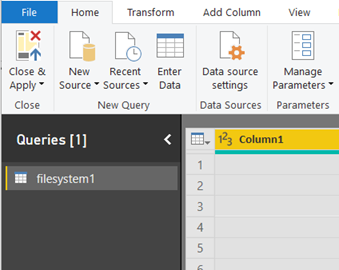

13. Once the query is updated, the **Fields** tab will show the new fields available for visualization.

    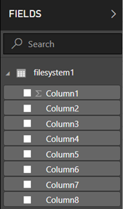

14. Let us create a pie chart to represent the drivers in each city for a given country. To do so, make the following selections.

    From the **Visualizations** tab, click the symbol for a pie chart.

    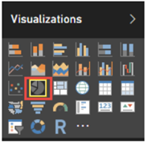

    The columns that we are going to use are Column 4 (name of the city) and Column 7 (name of the country). Drag these columns from **Fields** tab to **Visualizations** tab as shown below.

    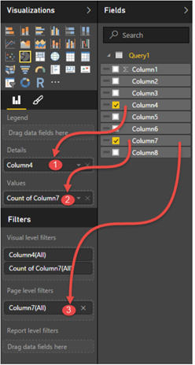

    The pie chart should now resemble like the one shown below.

    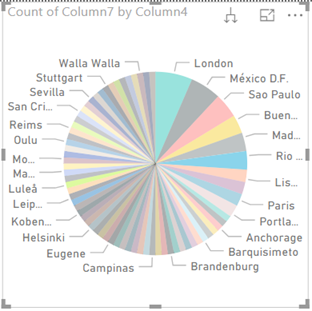

15. By selecting a specific country from the page level filters, you can now see the number of drivers in each city of the selected country. For example, under the **Visualizations** tab, under **Page level filters**, select **Brazil**.

    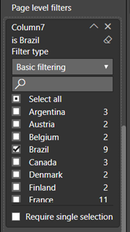

16. The pie chart is automatically updated to display the drivers in the cities of Brazil.

    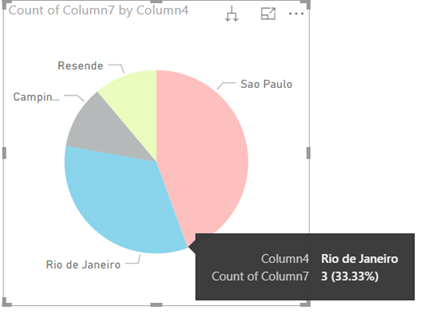

17. From the **File** menu, click **Save** to save the visualization as a Power BI Desktop file.

## Publish report to Power BI service

Once you have created the visualizations in Power BI Desktop, you can share it with others by publishing it to the Power BI service. For instructions on how to do that, see [Publish from Power BI Desktop](https://powerbi.microsoft.com/documentation/powerbi-desktop-upload-desktop-files/).

## See also

* [Analyze data in Data Lake Storage Gen1 using Data Lake Analytics](../data-lake-analytics/data-lake-analytics-get-started-portal.md)