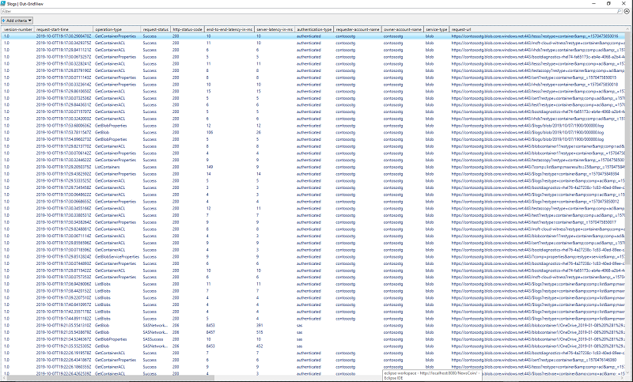

# Troubleshoot Latency using Storage Analytics Logs

Diagnosing and troubleshooting is a key skill for building and supporting client applications with Microsoft Azure Storage.

Because of the distributed nature of an Azure application, diagnosing and troubleshooting both errors and performance issues may be more complex than in traditional environments.

The following steps demonstrate how to identify & troubleshoot Latency Issues using Azure Storage Analytic Logs, and optimize the client application.

## Recommended Steps

1. Download the Storage Analytics Logs.

2. Use the following PowerShell Script to convert the raw format logs into tabular format:

   ```Powershell
   $Columns = 
        (   "version-number",
            "request-start-time",
            "operation-type",
            "request-status",
            "http-status-code",
            "end-to-end-latency-in-ms",
            "server-latency-in-ms",
            "authentication-type",
            "requester-account-name",
            "owner-account-name",
            "service-type",
            "request-url",
            "requested-object-key",
            "request-id-header",
            "operation-count",
            "requester-ip-address",
            "request-version-header",
            "request-header-size",
            "request-packet-size",
            "response-header-size",
            "response-packet-size",
            "request-content-length",
            "request-md5",
            "server-md5",
            "etag-identifier",
            "last-modified-time",
            "conditions-used",
            "user-agent-header",
            "referrer-header",
            "client-request-id"
        )

   $logs = Import-Csv “REPLACE THIS WITH FILE PATH” -Delimiter ";" -Header $Columns

   $logs | Out-GridView -Title "Storage Analytic Log Parser"
   ```

3. The script will launch a GUI window where you can filter the information by columns, as shown below.

   
 
4. Narrow down the log entries based on “operation-type”, and look for the log entry created during the issue's time frame.

   

5. During the time when the issue occured, the following values are important:

   * Operation-type = GetBlob
   * request-status = SASNetworkError
   * End-to-End-Latency-In-Ms = 8453
   * Server-Latency-In-Ms = 391

   End-to-End Latency is calculated using the following equation:

   * End-to-End Latency = Server-Latency + Client Latency

   Calculate the Client Latency using the log entry:

   * Client Latency = End-to-End Latency – Server-Latency

          * Example: 8453 – 391 = 8062ms

   The following table provides information about the high latency OperationType and RequestStatus results:

   |   |RequestStatus=<br>Success|RequestStatus=<br>(SAS)NetworkError|Recommendation|
   |---|---|---|---|
   |GetBlob|Yes|No|Follow Step 6|
   |GetBlob|No|Yes|Follow Step 7|
   |PutBlob|Yes|No|Follow Step 8|
   |PutBlob|No|Yes|Follow Step 9|

## Status Results

### GetBlob Operation: RequestStatus = Success

In a **GetBlob Operation** with **RequestStatus = Success**, check the following values as mentioned in Step 5:

* End-to-End Latency
* Server-Latency
* Client-Latency

If **Max Time** is spent in **Client-Latency**, this indicates that Azure Storage is spending a large volume of time writing data to the client. This delay indicates a Client-Side Issue.

**Recommendation:**

* Investigate the code in your client.
* Use Wireshark, Microsoft Message Analyzer, or Tcping to investigate network connectivity issues from the client. 

### GetBlob Operation: RequestStatus = (SAS)NetworkError

In a **GetBlob Operation** with **RequestStatus = (SAS)NetworkError**, check the following values as mentioned in Step 5:

* End-to-End Latency
* Server-Latency
* Client-Latency

If **Max Time** is spent in **Client-Latency**, the most common issue is that the client is disconnecting before a timeout expires in the storage service.

**Recommendation:**

* Investigate the code in your client to understand why and when the client disconnects from the storage service.
* se Wireshark, Microsoft Message Analyzer, or Tcping to investigate network connectivity issues from the client. 

### Put Operation: RequestStatus = Success

In a **Put Operation** with **RequestStatus = Success**, check the following values as mentioned in Step 5:

* End-to-End Latency
* Server-Latency
* Client-Latency

If **Max Time** is spent in **Client-Latency**, this indicates that the Client is taking more time to send data to the Azure Storage. This delay indicates a Client-Side Issue.

**Recommendation:**

* Investigate the code in your client.
* Use Wireshark, Microsoft Message Analyzer, or Tcping to investigate network connectivity issues from the client. 

### Put Operation: RequestStatus = (SAS)NetworkError

In a PutBlob Operation with RequestStatus = (SAS)NetworkError, check the following values as mentioned in Step 5:

* End-to-End Latency
* Server-Latency
* Client-Latency

If **Max Time** is spent in **Client-Latency**, the most common issue is that the client is disconnecting before a timeout expires in the storage service.

**Recommendation:**

* Investigate the code in your client to understand why and when the client disconnects from the storage service.
* Use Wireshark, Microsoft Message Analyzer, or Tcping to investigate network connectivity issues from the client. 