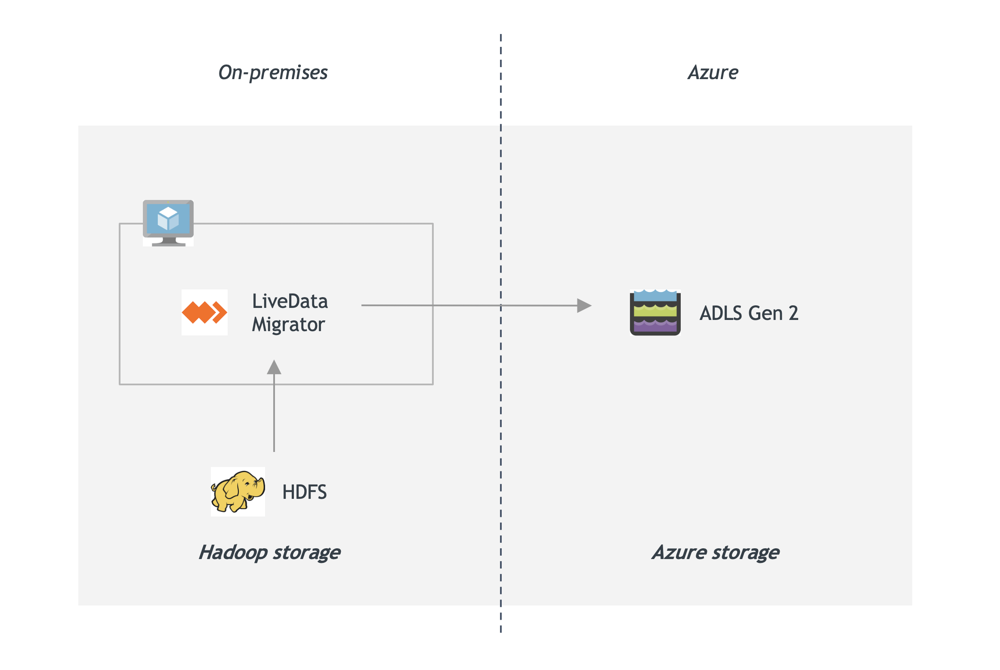

# Meet demanding migration requirements with WANdisco LiveData Migrator for Azure

Migrate on-premises Hadoop data to Azure Data Lake Storage by using [WANdisco LiveData Platform](https://docs.wandisco.com/live-data-platform/docs/landing/) to reduce business risk and cost overruns and take full advantage of Azure services. Eliminate the need for application downtime, remove the chance of data loss, and ensure data consistency even while operations continue on-premises. WANdisco LiveData Platform uses a unique, wide-area network capable consensus engine to achieve data consistency, and to conduct data replication at scale while applications can continue to modify the data under replication. Use this platform to:

- Rapidly **provision a LiveData service** that supports simple and advanced migration needs.
- **Reduce the cost and risk** of bringing your business-critical data to [Azure Data Lake Storage](https://docs.microsoft.com/azure/storage/blobs/data-lake-storage-introduction).
- **Continue to run** your on-premises big data operations while migration is in progress.

Unlike migrating data _offline_ by [copying static information to Azure Data Box](https://docs.microsoft.com/azure/storage/blobs/data-lake-storage-migrate-on-premises-hdfs-cluster), or by using Hadoop tools like [DistCp](https://hadoop.apache.org/docs/current/hadoop-distcp/DistCp.html), you can maintain full operation of your business systems during _online_ migration with WANdisco LiveData Platform. Keep your big data environments operating even while moving their data to Azure.

## Migrate big data faster without risk

The first service of WANdisco LiveData Platform is [LiveData Migrator for Azure](https://www.wandisco.com/products/livedata-migrator-for-azure); a turnkey solution for migrating actively used data from on-premises environments to Azure storage. LiveData Migrator for Azure is provisioned and managed entirely from the Azure portal or Azure CLI, and operates alongside your Hadoop cluster on-premises without any configuration change, application modifications, or service restarts to begin migrating data immediately.

Big data migrations can be complex and challenging. Moving petabytes of information without disrupting business operations has been impossible to achieve with offline data copy technologies. [LiveData Migrator for Azure](https://www.wandisco.com/products/livedata-migrator-for-azure) offers simple deployment and can establish a LiveData Service with continuous data migration and replication while applications read, write, and modify the data being migrated.

Performing a migration is as simple as these three steps:

1. Provision the LiveData Migrator instance from the Azure portal to your on-premises Hadoop cluster. No cluster change or downtime is needed, and applications can continue to operate.

2. Define the target Azure Data Lake Storage Gen2-enabled storage account.

3. Define the location of the data that you want to migrate, for example: `/user/hive/warehouse`, and start the migration.

Monitor your migration progress through standard Azure tooling including the Azure CLI and Azure portal, and continue to use your on-premises environment throughout.

## Replicate data under active change

Large-scale migrations of on-premises data lakes to Azure need application testing and validation. Being able to do this without the risk of introducing data changes that will create multiple sources of truth that cannot be easily reconciled is critical to eliminating risk and minimizing the cost of moving to Azure. [LiveData Plane for Azure](https://www.wandisco.com/products/livedata-plane-for-azure) uses WANdisco's coordination engine technology to overcome these concerns.

Keep your data consistent across on-premises Hadoop clusters and Azure storage with LiveData Plane after initial migration:

1. Provision LiveData Plane on-premises and in Azure, starting from the Azure portal. No application changes are required.
2. Configure replication rules that cover that data locations that you want to keep consistent, for example: `/user/contoso/sales/region/WA`.
3. Run applications that access and modify data in either location as a Hadoop-compatible file system as you need.

LiveData Plane keeps your data consistent without imposing significant overhead on cluster operation or application performance. Modify or ingest data while all changes are replicated consistently.

## Key features of WANdisco LiveData Platform

- **Data consistency**: Solve the challenges of migrating large data volumes between environments and keeping those data consistent across storage systems throughput migration, even while they are under continual change. Employ WANdisco's unique, wide-area network capable consensus engine directly in Azure to achieve data consistency and to migrate data with consistency guarantees throughout data changes.

- **Maintain operations**: Because applications can continue to create, modify, read, and delete data during migration, there is no need to disrupt business operations or introduce an outage window just to migrate big data to Azure. Continue to operate applications, analytics infrastructure, ingest jobs, and other processing.

- **Validate outcomes**: End-to-end validation that your data can be used effectively once migrated to Azure requires that you run production application workloads against them. Only a LiveData Service provides this without introducing the risk of data divergence, by maintaining data consistency regardless of whether change occurs at the source or target of your migration. Test and validate application behavior without risk or change to your processes and systems.

- **Reduce complexity**: Eliminate the need to create and manage scheduled jobs to copy data by migrating data through automation. Use the deep integration with Azure as a control plane to manage and monitor migration progress, including selective data replication, Hive metadata, data security and confidentiality.

- **Efficiency**: Maintain high throughput and performance, and scale to big data volumes easily. With control of bandwidth consumption, you can ensure that you can meet your migration goals without impacting other system operations.

## Next steps

- [LiveData Migrator](https://docs.wandisco.com/live-data-platform/docs/landing/) for Azure is used like any other Azure resource, and is available in preview now. Consult WANdisco's documentation for LiveData Migrator to understand the [prerequisites](https://docs.wandisco.com/live-data-platform/docs/prereq/), plan your migration, and complete a large-scale migration rapidly with LiveData Migrator.

- Access the [LiveData Migrator preview](https://portal.azure.com/#create/wandisco.ldm-previewpublic-preview) in the Azure Marketplace now to get started.