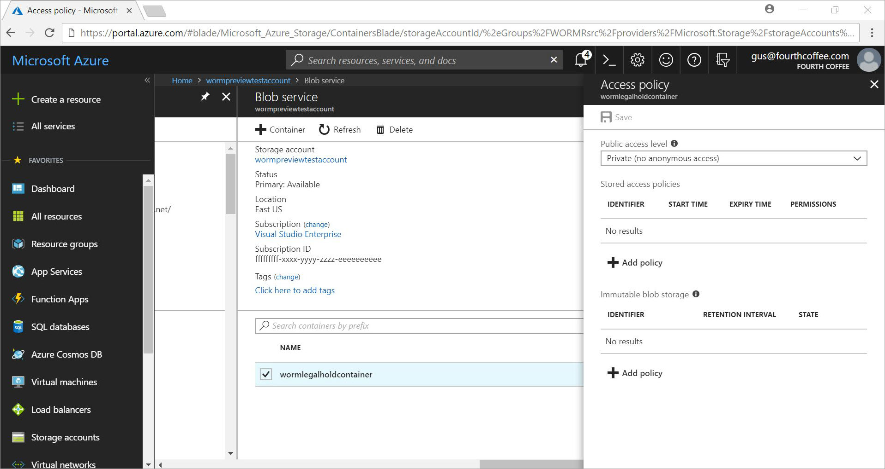
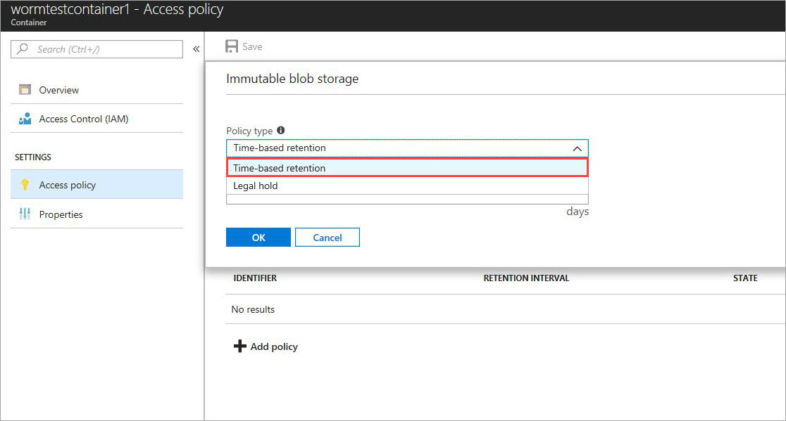
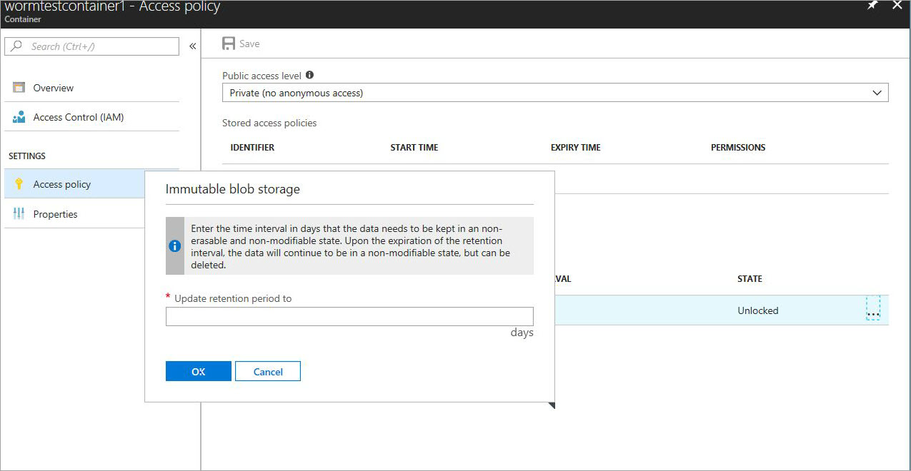
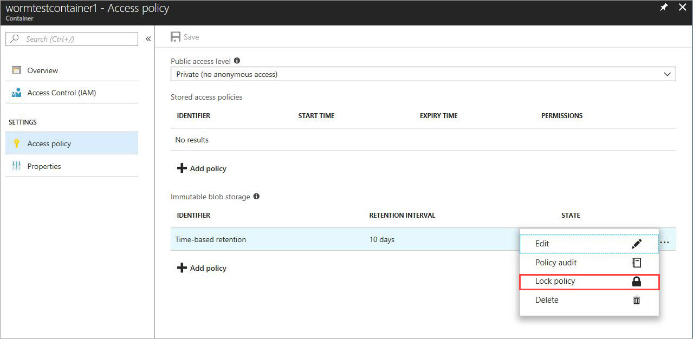

# Store business-critical data in Azure Blob storage

Immutable storage for Azure Blob (object) storage enables users to store business-critical data in a WORM (write once, read many) state. This state makes the data non-erasable and non-modifiable for a user-specified interval. Blobs can be created and read, but not modified or deleted, for the duration of the retention interval.

## Overview

Immutable storage helps financial institutions and related industries--particularly broker-dealer organizations--to store data securely. It can also be leveraged in any scenario to protect critical data against deletion.  

Typical applications include:

- **Regulatory compliance**: Immutable storage for Azure Blob storage helps organizations address SEC 17a-4(f), CFTC 1.31(d), FINRA, and other regulations.

- **Secure document retention**: Blob storage ensures that data can't be modified or deleted by any user, including users with account administrative privileges.

- **Legal hold**: Immutable storage for Azure Blob storage enables users to store sensitive information that's critical to litigation or a criminal investigation in a tamper-proof state for the desired duration.

Immutable storage enables:

- **Time-based retention policy support**: Users set policies to store data for a specified interval.

- **Legal hold policy support**: When the retention interval is not known, users can set legal holds to store data immutably until the legal hold is cleared.  When a legal hold is set, blobs can be created and read, but not modified or deleted. Each legal hold is associated with a user-defined alphanumeric tag that is used as an identifier string (such as a case ID).

- **Support for all blob tiers**: WORM policies are independent of the Azure Blob storage tier and apply to all the tiers: hot, cool, and archive. Users can transition data to the most cost-optimized tier for their workloads while maintaining data immutability.

- **Container-level configuration**: Users can configure time-based retention policies and legal hold tags at the container level. By using simple container-level settings, users can create and lock time-based retention policies, extend retention intervals, set and clear legal holds and more. These policies apply to all the blobs in the container, both existing and new.

- **Audit logging support**: Each container includes an audit log. It shows up to five time-based retention commands for locked time-based retention policies, with a maximum of three logs for retention interval extensions. For time-based retention, the log contains the user ID, command type, time stamps, and retention interval. For legal holds, the log contains the user ID, command type, time stamps, and legal hold tags. This log is retained for the lifetime of the container, in accordance with the SEC 17a-4(f) regulatory guidelines. The [Azure Activity Log](https://docs.microsoft.com/azure/monitoring-and-diagnostics/monitoring-overview-activity-logs) shows a more comprehensive log of all the control plane activities. It is the user's responsibility to store those logs persistently, as might be required for regulatory or other purposes.

Immutable storage is enabled in all Azure public regions.

## How it works

Immutable storage for Azure Blob storage supports two types of WORM or immutable policies: time-based retention and legal holds. For details on how to create these immutable policies, see the [Getting started](#Getting-started) section.

When a time-based retention policy or legal hold is applied on a container, all existing blobs move to the immutable (write and delete protected) state. All new blobs that are uploaded to the container will also move to the immutable state.

> [!IMPORTANT]
> A time-based retention policy must be *locked* for the blob to be in an immutable (write and delete protected) state for SEC 17a-4(f) and other regulatory compliance. We recommend that you lock the policy in a reasonable amount of time, typically within 24 hours. We don't recommend using the *unlocked* state for any purpose other than short-term feature trials.

When a time-based retention policy is applied on a container, all blobs in the container will stay in the immutable state for the duration of the *effective* retention period. The effective retention period for existing blobs is equal to the difference between the blob creation time and the user-specified retention interval.

For new blobs, the effective retention period is equal to the user-specified retention interval. Because users can extend the retention interval, immutable storage uses the most recent value of the user-specified retention interval to calculate the effective retention period.

> [!TIP]
> Example:
>
> A user creates a time-based retention policy with a retention interval of five years.
>
> The existing blob in that container, testblob1, was created one year ago. The effective retention period for testblob1 is four years.
>
> A new blob, testblob2, is now uploaded to the container. The effective retention period for this new blob is five years.

### Legal holds

When you set a legal hold, all existing and new blobs stay in the immutable state until the legal hold is cleared. For more information on how to set and clear legal holds, see the [Getting started](#Getting-started) section.

A container can have both a legal hold and a time-based retention policy at the same time. All blobs in that container stay in the immutable state until all legal holds are cleared, even if their effective retention period has expired. Conversely, a blob stays in an immutable state until the effective retention period expires, even though all legal holds have been cleared.

The following table shows the types of blob operations that are disabled for the different immutable scenarios. For more information, see the [Azure Blob Service API](https://docs.microsoft.com/rest/api/storageservices/blob-service-rest-api) documentation.

|Scenario  |Blob state  |Blob operations not allowed  |
|---------|---------|---------|
|Effective retention interval on the blob has not yet expired and/or legal hold is set     |Immutable: both delete and write-protected         |Delete Container, Delete Blob, Put Blob1, Put Block, Put Block List, Set Blob Metadata, Put Page, Set Blob Properties,  Snapshot Blob, Incremental Copy Blob, Append Block         |
|Effective retention interval on the blob has expired     |Write-protected only (delete operations are allowed)         |Put Blob, Put Block, Put Block List, Set Blob Metadata, Put Page, Set Blob Properties,  Snapshot Blob, Incremental Copy Blob, Append Block         |
|All legal holds cleared, and no time-based retention policy is set on the container     |Mutable         |None         |
|No WORM policy is created (time-based retention or legal hold)     |Mutable         |None         |

> [!NOTE]
> The first Put Blob, Put Block List and Put Block operations that are necessary to create a blob, are allowed in the first two scenarios from the preceding table. All subsequent operations are disallowed.
>
> Immutable storage is available only in GPv2 and Blob storage accounts. The account must be created through [Azure Resource Manager](https://docs.microsoft.com/azure/azure-resource-manager/resource-group-overview).

## Pricing

There is no additional charge for using this feature. Immutable data is priced in the same way as regular, mutable data. For pricing details on Azure Blob Storage, see the [Azure Storage pricing page](https://azure.microsoft.com/pricing/details/storage/blobs/).


## Getting started

The most recent releases of the [Azure portal](http://portal.azure.com) and [Azure CLI 2.0](https://docs.microsoft.com/cli/azure/install-azure-cli?view=azure-cli-latest) as well as the preview version of [Azure PowerShell](https://github.com/Azure/azure-powershell/releases/tag/Azure.Storage.v4.4.0-preview-May2018) support immutable storage for Azure Blob storage.

### Azure portal

1. Create a new container or select an existing container to store the blobs that need to be kept in the immutable state.
 The container must be in a GPv2 or blob storage account.
2. Select **Access policy** in the container settings. Then select **+ Add policy** under **Immutable blob storage**.

    

3. To enable time-based retention, select **Time-based retention** from the drop-down menu.

    

4. Enter the retention interval in days (minimum is one day).

    

    As you can see in the screenshot, the initial state of the policy is unlocked. You can test the feature with a smaller retention interval, and make changes to the policy before you lock it. Locking is essential for compliance with regulations like SEC 17a-4.

5. Lock the policy. Right-click the ellipsis (**...**), and the following menu appears:

    

    Select **Lock Policy**, and the policy state now appears as locked. After the policy is locked, it can't be deleted, and only extensions of the retention interval will be allowed.

6. To enable legal holds, select **+ Add Policy**. Select **Legal hold** from the drop-down menu.

    

7. Create a legal hold with one or more tags.

    

8. To clear a legal hold, simply remove the tag.

### Azure CLI 2.0

The feature is included in the following command groups:
`az storage container immutability-policy`  and `az storage container legal-hold`. Run `-h` on them to see the commands.

### PowerShell

[PowerShell version 4.4.0-preview](https://github.com/Azure/azure-powershell/releases/tag/Azure.Storage.v4.4.0-preview-May20180) supports immutable storage.
To enable the feature, follow these steps:

1. Ensure that you have the latest version of PowerShellGet installed: `Install-Module PowerShellGet –Repository PSGallery –Force`.
2. Remove any previous installation of Azure PowerShell.
3. Install AzureRM: `Install-Module AzureRM –Repository PSGallery –AllowClobber`. Azure can be installed similarly from this repository.
4. Install the preview version of Storage management plane cmdlets: `Install-Module -Name AzureRM.Storage -AllowPrerelease -Repository PSGallery -AllowClobber`.

The [Sample PowerShell code](#sample-powershell-code) section later in this article illustrates the feature usage.

## Client libraries

The following client libraries support immutable storage for Azure Blob storage:

- [.NET Client Library version 7.2.0-preview and later](https://www.nuget.org/packages/Microsoft.Azure.Management.Storage/7.2.0-preview)
- [Node.js Client Library version 4.0.0 and later](https://www.npmjs.com/package/azure-arm-storage)
- [Python Client Library version 2.0.0 Release Candidate 2 and later](https://pypi.org/project/azure-mgmt-storage/2.0.0rc2/)
- [Java Client Library](https://github.com/Azure/azure-rest-api-specs/tree/master/specification/storage/resource-manager/Microsoft.Storage/preview/2018-03-01-preview)

## Supported values

- The minimum retention interval is one day. The maximum is 400 years.
- For a storage account, the maximum number of containers with locked immutable policies is 1,000.
- For a storage account, the maximum number of containers with a legal hold setting is 1,000.
- For a container, the maximum number of legal hold tags is 10.
- The maximum length of a legal hold tag is 23 alphanumeric characters. The minimum length is three characters.
- For a container, the maximum number of allowable retention interval extensions for locked immutable policies is three.
- For a container with a locked immutable policy, a maximum of five time-based retention policy logs and a maximum of 10 legal hold policy logs are retained for the duration of the container.

## FAQ

**Does the feature apply to only block blobs, or to page and append blobs as well?**

Immutable storage can be used with any blob type, but we recommend that you use it mostly for block blobs. Unlike block blobs, page blobs and append blobs need to be created outside a WORM container, and then copied in. After you copy these blobs into a WORM container, no further  *appends* to an append blob or changes to a page blob are allowed.

**Do I need to always create a new storage account to use this feature?**

You can use immutable storage with any existing or newly created GPv2 or blob storage accounts. This feature is available only for Blob storage.

**What happens if I try to delete a container with a *locked* time-based retention policy or legal hold?**

The Delete Container operation will fail if at least one blob exists with a locked time-based retention policy or a legal hold. The Delete Container operation will succeed if there exists no blob with an active retention interval and there are no legal holds. You must delete the blobs before you can delete the container.

**What happens if I try to delete a storage account with a WORM container that has a *locked* time-based retention policy or legal hold?**

The storage account deletion will fail if there is at least one WORM container with a legal hold or a blob with an active retention interval.  You must delete all WORM containers before you can delete the storage account. For information on container deletion, see the preceding question.

**Can I move the data across different blob tiers (hot, cool, cold) when the blob is in the immutable state?**

Yes, you can use the Set Blob Tier command to move data across the blob tiers while keeping the data in the immutable state. Immutable storage is supported on hot, cool, and archive blob tiers.

**What happens if I fail to pay and my retention interval has not expired?**

In the case of non-payment, normal data retention policies will apply as stipulated in the terms and conditions of your contract with Microsoft.

**Do you offer a trial or grace period for just trying out the feature?**

Yes. When a time-based retention policy is first created, it's in an *unlocked* state. In this state, you can make any desired change to the retention interval, such as increase or decrease and even delete the policy. After the policy is locked, it stays locked forever, preventing deletion. Also, the retention interval can no longer be decreased when the policy is locked. We strongly recommend that you use the *unlocked* state only for trial purposes and lock the policy within a 24-hour period. These practices help you comply with SEC 17a-4(f) and other regulations.

**Is the feature available in national and government clouds?**

Immutable storage is currently available only in Azure public regions. If you're interested in a specific national cloud, email azurestoragefeedback@microsoft.com.

## Sample PowerShell code

The following sample PowerShell script is for reference. This script creates a new storage account and container. It then shows you how to set and clear legal holds, create and lock a time-based retention policy (also known as an immutability policy), and extend the retention interval.

Set up and test the Azure Storage account:

```powershell
$ResourceGroup = "<Enter your resource group>”
$StorageAccount = "<Enter your storage account name>"
$container = "<Enter your container name>"
$container2 = "<Enter another container name>”
$location = "<Enter the storage account location>"

# Log in to the Azure Resource Manager account
Login-AzureRMAccount
Register-AzureRmResourceProvider -ProviderNamespace "Microsoft.Storage"

# Create your Azure resource group
New-AzureRmResourceGroup -Name $ResourceGroup -Location $location

# Create your Azure storage account
New-AzureRmStorageAccount -ResourceGroupName $ResourceGroup -StorageAccountName `
    $StorageAccount -SkuName Standard_LRS -Location $location -Kind Storage

# Create a new container
New-AzureRmStorageContainer -ResourceGroupName $ResourceGroup `
    -StorageAccountName $StorageAccount -Name $container

# Create Container 2 with a storage account object
$accountObject = Get-AzureRmStorageAccount -ResourceGroupName $ResourceGroup `
    -StorageAccountName $StorageAccount
New-AzureRmStorageContainer -StorageAccount $accountObject -Name $container2

# Get a container
Get-AzureRmStorageContainer -ResourceGroupName $ResourceGroup `
    -StorageAccountName $StorageAccount -Name $container

# Get a container with an account object
$containerObject = Get-AzureRmStorageContainer -StorageAccount $accountObject -Name $container

# List containers
Get-AzureRmStorageContainer -ResourceGroupName $ResourceGroup `
    -StorageAccountName $StorageAccount

# Remove a container (add -Force to dismiss the prompt)
Remove-AzureRmStorageContainer -ResourceGroupName $ResourceGroup `
    -StorageAccountName $StorageAccount -Name $container2

# Remove a container with an account object
Remove-AzureRmStorageContainer -StorageAccount $accountObject -Name $container2

# Remove a container with a container object
$containerObject2 = Get-AzureRmStorageContainer -StorageAccount $accountObject -Name $container2
Remove-AzureRmStorageContainer -InputObject $containerObject2
```

Set and clear legal holds:

```powershell
# Set a legal hold
Add-AzureRmStorageContainerLegalHold -ResourceGroupName $ResourceGroup `
	-StorageAccountName $StorageAccount -Name $container -Tag <tag1>,<tag2>,...

# with an account object
Add-AzureRmStorageContainerLegalHold -StorageAccount $accountObject -Name $container -Tag <tag3>

# with a container object
Add-AzureRmStorageContainerLegalHold -Container $containerObject -Tag <tag4>,<tag5>,...

# Clear a legal hold
Remove-AzureRmStorageContainerLegalHold -ResourceGroupName $ResourceGroup `
	-StorageAccountName $StorageAccount -Name $container -Tag <tag2>

# with an account object
Remove-AzureRmStorageContainerLegalHold -StorageAccount $accountObject -Name $container -Tag <tag3>,<tag5>

# with a container object
Remove-AzureRmStorageContainerLegalHold -Container $containerObject -Tag <tag4>
```

Create or update immutability policies:
```powershell
# with an account name or container name
Set-AzureRmStorageContainerImmutabilityPolicy -ResourceGroupName $ResourceGroup `
	-StorageAccountName $StorageAccount -ContainerName $container -ImmutabilityPeriod 10

# with an account object
Set-AzureRmStorageContainerImmutabilityPolicy -StorageAccount $accountObject `
	-ContainerName $container -ImmutabilityPeriod 1 -Etag $policy.Etag

# with a container object
$policy = Set-AzureRmStorageContainerImmutabilityPolicy -Container `
	$containerObject -ImmutabilityPeriod 7

# with an immutability policy object
Set-AzureRmStorageContainerImmutabilityPolicy -ImmutabilityPolicy $policy -ImmutabilityPeriod 5
```

Retrieve immutability policies:
```powershell
# Get an immutability policy
Get-AzureRmStorageContainerImmutabilityPolicy -ResourceGroupName $ResourceGroup `
	-StorageAccountName $StorageAccount -ContainerName $container

# with an account object
Get-AzureRmStorageContainerImmutabilityPolicy -StorageAccount $accountObject `
	-ContainerName $container

# with a container object
Get-AzureRmStorageContainerImmutabilityPolicy -Container $containerObject
```

Lock immutability policies (add -Force to dismiss the prompt):
```powershell
# with an immutability policy object
$policy = Get-AzureRmStorageContainerImmutabilityPolicy -ResourceGroupName `
	$ResourceGroup -StorageAccountName $StorageAccount -ContainerName $container
$policy = Lock-AzureRmStorageContainerImmutabilityPolicy -ImmutabilityPolicy $policy -force

# with an account name or container name
$policy = Lock-AzureRmStorageContainerImmutabilityPolicy -ResourceGroupName `
	$ResourceGroup -StorageAccountName $StorageAccount -ContainerName $container `
	-Etag $policy.Etag

# with an account object
$policy = Lock-AzureRmStorageContainerImmutabilityPolicy -StorageAccount `
	$accountObject -ContainerName $container -Etag $policy.Etag

# with a container object
$policy = Lock-AzureRmStorageContainerImmutabilityPolicy -Container `
	$containerObject -Etag $policy.Etag -force
```

Extend immutability policies:
```powershell

# with an immutability policy object
$policy = Get-AzureRmStorageContainerImmutabilityPolicy -ResourceGroupName `
	$ResourceGroup -StorageAccountName $StorageAccount -ContainerName $container

$policy = Set-AzureRmStorageContainerImmutabilityPolicy -ImmutabilityPolicy `
	$policy -ImmutabilityPeriod 11 -ExtendPolicy

# with an account name or container name
$policy = Set-AzureRmStorageContainerImmutabilityPolicy -ResourceGroupName `
	$ResourceGroup -StorageAccountName $StorageAccount -ContainerName $container `
	-ImmutabilityPeriod 11 -Etag $policy.Etag -ExtendPolicy

# with an account object
$policy = Set-AzureRmStorageContainerImmutabilityPolicy -StorageAccount `
	$accountObject -ContainerName $container -ImmutabilityPeriod 12 -Etag `
	$policy.Etag -ExtendPolicy

# with a container object
$policy = Set-AzureRmStorageContainerImmutabilityPolicy -Container `
	$containerObject -ImmutabilityPeriod 13 -Etag $policy.Etag -ExtendPolicy
```

Remove an immutability policy (add -Force to dismiss the prompt):
```powershell
# with an immutability policy object
$policy = Get-AzureRmStorageContainerImmutabilityPolicy -ResourceGroupName `
	$ResourceGroup -StorageAccountName $StorageAccount -ContainerName $container
Remove-AzureRmStorageContainerImmutabilityPolicy -ImmutabilityPolicy $policy

# with an account name or container name
Remove-AzureRmStorageContainerImmutabilityPolicy -ResourceGroupName `
	$ResourceGroup -StorageAccountName $StorageAccount -ContainerName $container `
	-Etag $policy.Etag

# with an account object
Remove-AzureRmStorageContainerImmutabilityPolicy -StorageAccount $accountObject `
	-ContainerName $container -Etag $policy.Etag

# with a container object
Remove-AzureRmStorageContainerImmutabilityPolicy -Container $containerObject `
	-Etag $policy.Etag

```
