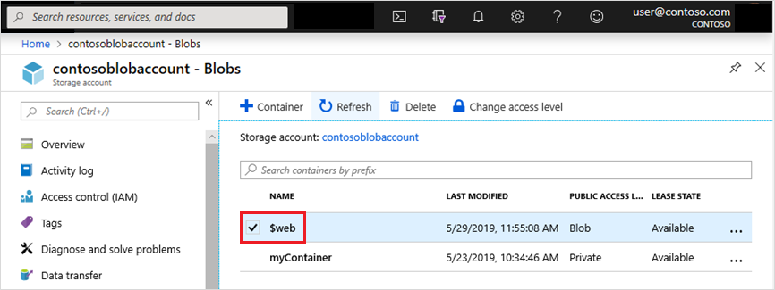
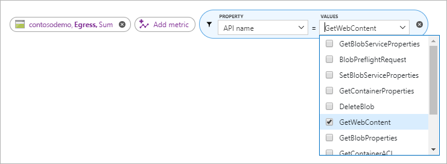

# Static website hosting in Azure Storage

You can serve static content (HTML, CSS, JavaScript, and image files) directly from a storage container named *$web*. Hosting your content in Azure Storage enables you to use serverless architectures that include [Azure Functions](/azure/azure-functions/functions-overview) and other Platform as a service (PaaS) services.

> [!NOTE]
> If your site depends on server-side code, use [Azure App Service](/azure/app-service/overview) instead.

## Setting up a static website

Static website hosting is a feature that you have to enable on the storage account. For step-by-step guidance, see [Host a static website in Azure Storage](storage-blob-static-website-how-to.md).

When you enable static website hosting, you'll select the name of your default file, and optionally provide a path to a custom 404 page. If a blob storage container named **$web** doesn't already exist in the account, one is created for you. You'll add the files of your site to this container.

Files in the **$web** container are case-sensitive, served through anonymous access requests and are available only through read operations.

## Uploading content

You can use any of these tools to upload content to the **$Web** container:

> [!div class="checklist"]
> * [Azure CLI](storage-blob-static-website-how-to.md#cli)
> * [Azure PowerShell module](storage-blob-static-website-how-to.md#powershell)
> * [AzCopy](../common/storage-use-azcopy-v10.md)
> * [Azure Storage Explorer](https://azure.microsoft.com/features/storage-explorer/)
> * [Azure Pipelines](https://azure.microsoft.com/services/devops/pipelines/)
> * [Visual Studio Code extension](https://code.visualstudio.com/tutorials/static-website/getting-started)

## Viewing content

Users can view site content from a browser by using the public URL of the website. You can find the URL by using the Azure portal, Azure CLI, or PowerShell. Use this table as a guide.

|Tool| Guidance |
|----|----|
|**Azure Portal** | [Find the website URL by using the Azure Portal](storage-blob-static-website-how-to.md#portal-find-url) |
|**Azure CLI** | [Find the website URL by using the Azure CLI](storage-blob-static-website-how-to.md#cli-find-url) |
|**Azure PowerShell module** | [Find the website URL by using PowerShell](storage-blob-static-website-how-to.md#powershell-find-url) |

The URL of your site contains a regional code. For example the URL `https://contosoblobaccount.z22.web.core.windows.net/` contains regional code `z22`.

While that code must remain the URL, it is for internal use only and you won't have to use that code in any other way.

The index document that you specify when you enable static website hosting, appears when users open the site unless users specify a specific file as part of the request (For example: `https://contosoblobaccount.z22.web.core.windows.net/otherfile.html1`).

If the server returns a 404 error, and you have not specified an error document when you enabled the website, then a default 404 page is returned to the user.

## Something here about that privacy setting

> [!NOTE]
> The default public access level for files is Private. Because the files are served through anonymous access requests, this setting is ignored. There's public access to all files, and RBAC permissions are ignored.

You can also view content from a browser by referring directly to files in the blob container, but you'll have to modify a security setting to enable that.

## CDN and SSL support

To make your static website files available over your custom domain and HTTPS, see [Using the Azure CDN to access blobs with custom domains over HTTPS](storage-https-custom-domain-cdn.md). As a part of this process, you need to *point your CDN to the web endpoint* as opposed to the blob endpoint. You may need to wait a few minutes before your content is visible as the CDN configuration is not immediately executed.

When you update your static website, be sure to clear cached content on the CDN edge servers by purging the CDN endpoint. For more information, see [Purge an Azure CDN endpoint](../../cdn/cdn-purge-endpoint.md).

> [!NOTE]
> HTTPS is supported natively through the account web endpoint, so the web endpoint is accessible via both HTTP and HTTPS. However, if the storage account is configured to require secure transfer over HTTPS, then users must use the HTTPS endpoint. For more information, see [Require secure transfer in Azure Storage](../common/storage-require-secure-transfer.md).
>
> The use of custom domains over HTTPS requires the use of Azure CDN at this time.
>
> Public account web endpoint over HTTPS: `https://<ACCOUNT_NAME>.<ZONE_NAME>.web.core.windows.net/<FILE_NAME>`

## Custom domain names

You can [configure a custom domain name for your Azure Storage account](storage-custom-domain-name.md) to make your static website available via a custom domain. For an in-depth look at hosting your domain on [Azure, see Host your domain in Azure DNS](../../dns/dns-delegate-domain-azure-dns.md).

## Pricing

Enabling static website hosting is free of charge. Customers are charged for the utilized blob storage and operations costs. For more details on prices for Azure Blob Storage, check out the [Azure Blob Storage Pricing Page](https://azure.microsoft.com/pricing/details/storage/blobs/).

## Metrics

To enable metrics on your static website pages, click on **Settings** > **Monitoring** > **Metrics**.

Metrics data are generated by hooking into different metrics APIs. The portal only displays API members used within a given time frame in order to only focus on members that return data. In order to ensure you are able to select the necessary API member, the first step is to expand the time frame.

Click on the time frame button and select **Last 24 hours** and then click **Apply**

Next, select **Blob** from the *Namespace* drop down.

Then select the **Egress** metric.

Select **Sum** from the *Aggregation* selector.

Next, click the **Add filter** button and choose **API name** from the *Property* selector.

Finally, check the box next to **GetWebContent** in the *Values* selector to populate the metrics report.

Once enabled, traffic statistics on files in the *$web* container are reported in the metrics dashboard.

**Is the web endpoint accessible via both HTTP and HTTPS?**

## Next steps
* [Using the Azure CDN to access blobs with custom domains over HTTPS](storage-https-custom-domain-cdn.md)
* [Configure a custom domain name for your blob or web endpoint](storage-custom-domain-name.md)
* [Azure Functions](/azure/azure-functions/functions-overview)
* [Azure App Service](/azure/app-service/overview)
* [Build your first serverless web app](https://docs.microsoft.com/azure/functions/tutorial-static-website-serverless-api-with-database)
* [Tutorial: Host your domain in Azure DNS](../../dns/dns-delegate-domain-azure-dns.md)
