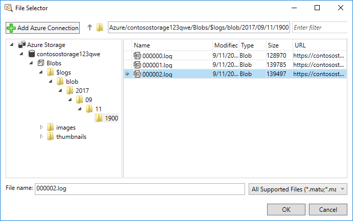

# Monitor and troubleshoot a cloud storage application

This tutorial is part four and the final part of a series. You learn how to monitor and troubleshoot a cloud storage application.

In part four of the series, you learn how to:

> [!div class="checklist"]
> * Turn on logging and metrics
> * Enable alerts for authorization errors
> * Run test traffic with incorrect SAS tokens
> * Download and analyze logs

[Azure storage analytics](../common/storage-analytics.md) provides logging and metric data for a storage account. This data provides insights into the health of your storage account. Before you can be visibility into your storage account, you need to set up data collection. This process involves turning on logging, configuring metrics, and enabling alerts.

Logging and metrics from storage accounts are enabled from the **Diagnostics** tab in the Azure portal. There are two types of metrics. **Aggregate** metrics collect ingress/egress, availability, latency, and success percentages. These metrics are aggregated for the blob, queue, table, and file services. **Per API** collects the same set of metrics for each storage operation in the Azure Storage service API. Storage logging enables you to record details for both successful and failed requests in your storage account. These logs enable you to see details of read, write, and delete operations against your Azure tables, queues, and blobs. They also enable you to see the reasons for failed requests such as timeouts, throttling, and authorization errors.

## Log in to the Azure portal

Log in to the [Azure portal](https://portal.azure.com)

## Turn on logging and metrics

From the left menu, select **Resource Groups**, select **myResourceGroup**, and then select your storage account in the resource list.

Under **Diagnostics** set **Status** to **On**. Ensure **Blob aggregate metrics**, **Blob per API metrics**, and **Blob logs** are enabled.

When complete, click **Save**


## Enable alerts

Alerts provide a way to email administrators or trigger a webhook based on a metric breaching a threshold. In this example, you enable an alert for the `SASClientOtherError` metric.

### Navigate to the storage account in the Azure portal

From the left menu, select **Resource Groups**, select **myResourceGroup**, and then select your storage account in the resource list.

Under the **Monitoring** section, select **Alert rules**.

Select **+ Add alert**, under **Add an alert rule**, fill in the required information. Choose `SASClientOtherError` from the **Metric** drop-down.


## Simulate an error

To simulate a valid alert, you can attempt to request a non-existent blob from your storage account. To do this, replace the `<incorrect-blob-name>` value with a value that does not exist. Run the following code sample a few times to simulate failed blob requests.

```azurecli-interactive
sasToken=$(az storage blob generate-sas \
    --account-name <storage-account-name> \
    --account-key <storage-account-key> \
    --container-name <container> \
    --name <incorrect-blob-name> \
    --permissions r \
    --expiry `date --date="next day" +%Y-%m-%d` \
    --output tsv)

curl https://<storage-account-name>.blob.core.windows.net/<container>/<incorrect-blob-name>?$sasToken
```

The following image is an example alert that is based off the simulated failure ran with the preceding example.

 

## Download and view logs

Storage logs store data in a set of blobs in a blob container named **$logs** in your storage account. This container does not show up if you list all the blob containers in your account but you can see its contents if you access it directly.

In this scenario, you use [Microsoft Message Analyzer](http://technet.microsoft.com/library/jj649776.aspx) to interact with your Azure storage account.

### Download Microsoft Message Analyzer

Download [Microsoft Message Analyzer](https://www.microsoft.com/en-us/download/details.aspx?id=44226) and install the application.

Launch the application and choose **File** > **Open** > **From Other File Sources**.

In the **File Selector** dialog, select **+ Add Azure Connection**. Enter in your **storage account name** and **account key** and click **OK**.


Once you are connected, expand the containers in the storage tree view to view the log blobs. Select the latest log and click **OK**.



On the **New Session** dialog, click **Start** to view your log.

Once the log opens, you can view the storage events. As you can see from the following image, there was an `SASClientOtherError` triggered on the storage account. For additional information on storage logging, visit [Storage Analytics](../common/storage-analytics.md).


[Storage Explorer](https://azure.microsoft.com/en-us/features/storage-explorer/) is another tool that can be used to interact with your storage accounts, including the **$logs** container and the logs that are contained in it.

## Next steps

In part four and the final part of the series, you learned how to monitor and troubleshoot your storage account, such as how to:

> [!div class="checklist"]
> * Turn on logging and metrics
> * Enable alerts for authorization errors
> * Run test traffic with incorrect SAS tokens
> * Download and analyze logs

Follow this link to see pre-built storage samples.

> [!div class="nextstepaction"]
> [Azure storage script samples](storage-samples-blobs-cli.md)