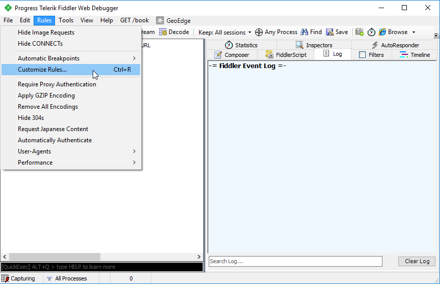
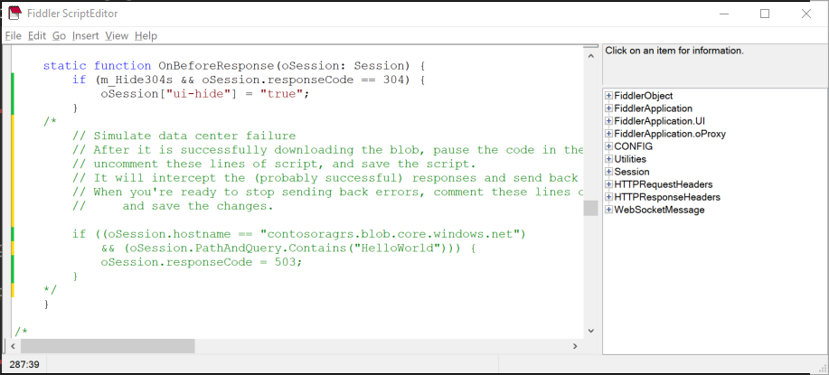

# Simulate a failure in accessing read-access redudant storage

This tutorial is part two of a series. In this tutorial you inject a failed response with Fiddler for requests to your storage account to simulate a failure.


In part two of the series, you learn how to:

> [!div class="checklist"]
> * Run and pause the application
> * Simulate a failure
> * Resume the application

## Prerequisites

To complete this tutorial:

* Install [Visual Studio 2017](https://www.visualstudio.com/downloads/) with the following workloads:
  - **ASP.NET and web development**
  - **Azure development**

  

* Download and install [Fiddler](https://www.telerik.com/download/fiddler)

[!INCLUDE [quickstarts-free-trial-note](../../../includes/quickstarts-free-trial-note.md)]

To complete this tutorial you must have completed the previous storage tutorial: [Make your application data highly available with Azure storage][previous-tutorial].

## Launch fiddler



Paste the following code sample under the `OnBeforeResponse` function. The new statement is commented out to ensure that the logic is not implemented immediately.

```javascript
         // Simulate data center failure
         // After it is successfully downloading the blob, pause the code in the sample,
         // uncomment these lines of script, and save the script.
         // It will intercept the (probably successful) responses and send back a 503 error. 
         // When you're ready to stop sending back errors, comment these lines of script out again 
         //     and save the changes.

         // if ((oSession.hostname == "contosoragrs.blob.core.windows.net") 
         // && (oSession.PathAndQuery.Contains("HelloWorld"))) {
         // oSession.responseCode = 503;  
         // }
```



## Start and pause the application

In Visual Studio press **F5** or select **Play** to start debugging the application. Once the application begins reading from the primary endpoint hit **Pause** or press **Ctrl** + **Alt** + **Break** to pause the application.

## Simulate failure

Navigate to Fiddler and select **Rules** and **Customize Rules...**.  Uncomment out the following lines and sekect **File** and **Save**.

```javascript
         if ((oSession.hostname == "contosoragrs.blob.core.windows.net") 
         && (oSession.PathAndQuery.Contains("HelloWorld"))) {
         oSession.responseCode = 503;  
         }
```

## Resume the application

Select **Continue** or press **F5** to resume debugging.

Once the application starts running again the requests to the primary endpoint begin to fail. The application attempts to reconnect to the primary endpoint 5 times. After the threshold it retrieves the image from the secondary read only endpoint. After 20 successful attempts at retrieving the image from the secondary endpoint the application attempts to connect to the primary endpoint before resuming the operations again the secondary endpoint.


## Remove simulated error

In Visual Studio press **F5** or select **Play** to start debugging the application. Once the application begins reading from the primary endpoint hit **Pause** or press **Ctrl** + **Alt** + **Break** to pause the application.

Navigate to Fiddler and select **Rules** and **Customize Rules...**.  Comment or remove the custom logic in the `OnBeforeResponse` function and select **File** and **Save**.

Select **Continue** or press **F5** to resume debugging.


## Next steps

In part two of the series, you learned about simulating a failure to test read access geo-redundant storage such as how to:

> [!div class="checklist"]
> * Run and pause the application
> * Simulate a failure
> * Resume the application

Follow this link to see pre-built storage samples.

> [!div class="nextstepaction"]
> [Azure storage script samples](storage-samples-blobs-cli.md)