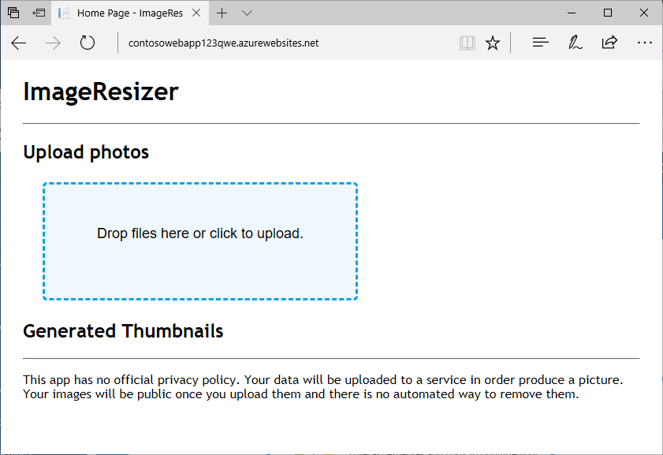
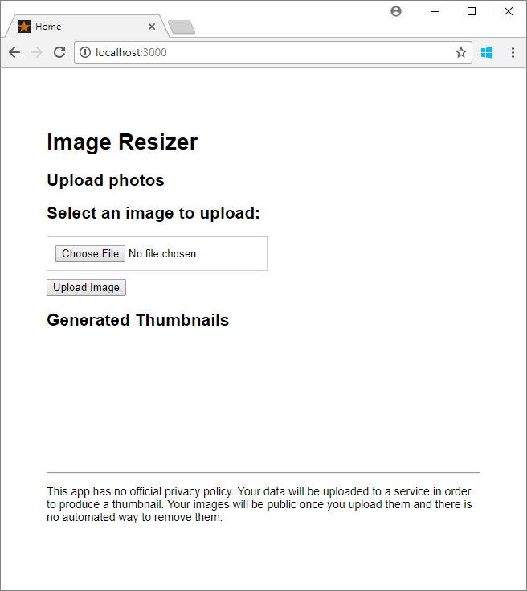
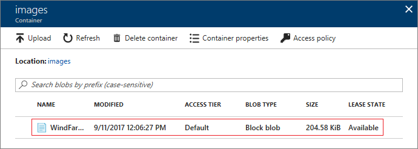

# Upload image data in the cloud with Azure Storage

This tutorial is part one of a series. This tutorial shows you how to deploy a web application that uses the Azure Storage Client Library to upload images to a storage account. When you're finished, you have a web app storing and displaying images from Azure storage.

# [\.NET](#tab/net)


# [Node.js](#tab/nodejs)


---

In part one of the series, you learn how to:

> [!div class="checklist"]
> * Create a storage account
> * Create a container and set permissions
> * Retrieve an access key
> * Configure application settings
> * Deploy a Web App to Azure
> * Interact with the web application

[!INCLUDE [cloud-shell-try-it.md](../../../includes/cloud-shell-try-it.md)]

If you choose to install and use the CLI locally, this tutorial requires that you are running the Azure CLI version 2.0.4 or later. Run `az --version` to find the version. If you need to install or upgrade, see [Install Azure CLI 2.0]( /cli/azure/install-azure-cli). 

## Create a resource group 

Create a resource group with the [az group create](/cli/azure/group#az_group_create) command. An Azure resource group is a logical container into which Azure resources are deployed and managed.
 
The following example creates a resource group named `myResourceGroup`.
 
```azurecli-interactive 
az group create --name myResourceGroup --location westcentralus 
``` 

## Create a storage account
 
The sample uploads images to a blob container in an Azure Storage account. A storage account provides a unique namespace to store and access your Azure storage data objects. Create a storage account in the resource group you created by using the [az storage account create](/cli/azure/storage/account#az_storage_account_create) command. 

> [!IMPORTANT] 
> In part 2 of the tutorial you use Event subscriptions for blob storage. Event subscriptions are currently only supported for Blob storage accounts in the West Central US and West US 2. Because of this restriction, you must create a Blob storage account that is used by the sample app to store images and thumbnails.   

In the following command, substitute your own globally unique name for the Blob storage account where you see the `<blob_storage_account>` placeholder.  

```azurecli-interactive 
az storage account create --name <blob_storage_account> \
--location westcentralus --resource-group myResourceGroup \
--sku Standard_LRS --kind blobstorage --access-tier hot 
``` 
 
## Create blob storage containers

The app uses two containers in the Blob storage account. Containers are similar to folders and are used to store blobs. The _images_ container is where the app uploads full-resolution images. In a later part of the series, an Azure function app uploads resized image thumbnails to the _thumbnails_ container. 

Get the storage account key by using the [az storage account keys list](/cli/azure/storage/account/keys#az_storage_account_keys_list) command. You then use this key to create two containers using the [az storage container create](/cli/azure/storage/container#az_storage_container_create) command.  
 
In this case, `<blob_storage_account>` is the name of the Blob storage account you created. The _images_ containers public access is set to `off`, the _thumbnails_ containers public access is set to `container`. The `container` public access setting allows the thumbnails to be viewable to people that visit the web page.
 
```azurecli-interactive 
blobStorageAccount=<blob_storage_account>

blobStorageAccountKey=$(az storage account keys list -g myResourceGroup \
-n $blobStorageAccount --query [0].value --output tsv) 

az storage container create -n images --account-name $blobStorageAccount \
--account-key $blobStorageAccountKey --public-access off 

az storage container create -n thumbnails --account-name $blobStorageAccount \
--account-key $blobStorageAccountKey --public-access container

echo "Make a note of your blob storage account key..." 
echo $blobStorageAccountKey 
``` 

Make a note of your blob storage account name and key. The sample app uses these settings to connect to the storage account to upload images. 

## Create an App Service plan 

An [App Service plan](../../app-service/azure-web-sites-web-hosting-plans-in-depth-overview.md) specifies the location, size, and features of the web server farm that hosts your app. 

Create an App Service plan with the [az appservice plan create](/cli/azure/appservice/plan#az_appservice_plan_create) command. 

The following example creates an App Service plan named `myAppServicePlan` in the **Free** pricing tier: 

```azurecli-interactive 
az appservice plan create --name myAppServicePlan --resource-group myResourceGroup --sku FREE 
``` 

## Create a web app 

The web app provides a hosting space for the sample app code that is deployed from the GitHub sample repository. Create a [web app](../../app-service/app-service-web-overview.md) in the `myAppServicePlan` App Service plan with the [az webapp create](/cli/azure/webapp#az_webapp_create) command.  
 
In the following command, replace `<web_app>` with a unique name (valid characters are `a-z`, `0-9`, and `-`). If `<web_app>` is not unique, you get the error message: _Website with given name `<web_app>` already exists._ The default URL of the web app is `https://<web_app>.azurewebsites.net`.  

```azurecli-interactive 
az webapp create --name <web_app> --resource-group myResourceGroup --plan myAppServicePlan 
``` 

## Deploy the sample app from the GitHub repository

# [\.NET](#tab/net)

App Service supports several ways to deploy content to a web app. In this tutorial, you deploy the web app from a [public GitHub sample repository](https://github.com/Azure-Samples/storage-blob-upload-from-webapp). Configure GitHub deployment to the web app with the [az webapp deployment source config](/cli/azure/webapp/deployment/source#az_webapp_deployment_source_config) command. Replace `<web_app>` with the name of the web app you created in the preceding step.

The sample project contains an [ASP.NET MVC](https://www.asp.net/mvc) app that accepts an image, saves it to a storage account, and displays images from a thumbnail container. The web application uses the [Microsoft.WindowsAzure.Storage](/dotnet/api/microsoft.windowsazure.storage?view=azure-dotnet), [Microsoft.WindowsAzure.Storage.Blob](/dotnet/api/microsoft.windowsazure.storage.blob?view=azure-dotnet), and the [Microsoft.WindowsAzure.Storage.Auth](/dotnet/api/microsoft.windowsazure.storage.auth?view=azure-dotnet) namespaces from the Azure storage Client Library to interact with Azure storage. 

# [Node.js](#tab/nodejs)
App Service supports several ways to deploy content to a web app. In this tutorial, you deploy the web app from a [public GitHub sample repository](https://github.com/Azure-Samples/storage-blob-upload-from-webapp-node). Configure GitHub deployment to the web app with the [az webapp deployment source config](/cli/azure/webapp/deployment/source#az_webapp_deployment_source_config) command. Replace `<web_app>` with the name of the web app you created in the preceding step.

---

```azurecli-interactive 
az webapp deployment source config --name <web_app> \
--resource-group myResourceGroup --branch master --manual-integration \
--repo-url https://github.com/Azure-Samples/storage-blob-upload-from-webapp
``` 

## Configure web app settings 

The sample web app uses the [Azure Storage Client Library](/dotnet/api/overview/azure/storage?view=azure-dotnet) to request access tokens, which are used to upload images. The storage account credentials used by the Storage SDK are set in the application settings for the web app. Add application settings to the deployed app with the [az webapp config appsettings set](/cli/azure/webapp/config/appsettings#az_webapp_config_appsettings_set) command. 

In the following command, `<blob_storage_account>` is the name of your Blob storage account and `<blob_storage_key>` is the associated key. Replace `<web_app>` with the name of the web app you created in the preceding step.     

```azurecli-interactive 
az webapp config appsettings set --name <web_app> --resource-group myResourceGroup \
--settings AzureStorageConfig__AccountName=<blob_storage_account> \
AzureStorageConfig__ImageContainer=images  \
AzureStorageConfig__ThumbnailContainer=thumbnails \
AzureStorageConfig__AccountKey=<blob_storage_key>  
``` 

After the web app is deployed and configured, you can test the image upload functionality in the app.   

## Upload an image 

To test the web app, browse to the URL of your published app. The default URL of the web app is `https://<web_app>.azurewebsites.net`. 
Select the **Upload photos** region to select and upload a file or drag and drop a file on the region. The image disappears if successfully uploaded.

# [\.NET](#tab/net)



In the sample code, the `UploadFiletoStorage` task in the `Storagehelper.cs` file is used to upload the images to the `images` container within the storage account using the [UploadFromStreamAsync](/dotnet/api/microsoft.windowsazure.storage.blob.cloudblockblob.uploadfromstreamasync?view=azure-dotnet) method. The following code sample contains the `UploadFiletoStorage` task. 

```csharp
public static async Task<bool> UploadFileToStorage(Stream fileStream, string fileName, AzureStorageConfig _storageConfig)
{
    // Create storagecredentials object by reading the values from the configuration (appsettings.json)
    StorageCredentials storageCredentials = new StorageCredentials(_storageConfig.AccountName, _storageConfig.AccountKey);

    // Create cloudstorage account by passing the storagecredentials
    CloudStorageAccount storageAccount = new CloudStorageAccount(storageCredentials, true);

    // Create the blob client.
    CloudBlobClient blobClient = storageAccount.CreateCloudBlobClient();

    // Get reference to the blob container by passing the name by reading the value from the configuration (appsettings.json)
    CloudBlobContainer container = blobClient.GetContainerReference(_storageConfig.ImageContainer);

    // Get the reference to the block blob from the container
    CloudBlockBlob blockBlob = container.GetBlockBlobReference(fileName);

    // Upload the file
    await blockBlob.UploadFromStreamAsync(fileStream);

    return await Task.FromResult(true);
}
```

The following classes and methods are used in the preceding task:

|Class  |Method  |
|---------|---------|
|[StorageCredentials](/dotnet/api/microsoft.windowsazure.storage.auth.storagecredentials?view=azure-dotnet)     |         |
|[CloudStorageAccount](/dotnet/api/microsoft.windowsazure.storage.cloudstorageaccount?view=azure-dotnet)    |  [CreateCloudBlobClient](/dotnet/api/microsoft.windowsazure.storage.cloudstorageaccount.createcloudblobclient?view=azure-dotnet#Microsoft_WindowsAzure_Storage_CloudStorageAccount_CreateCloudBlobClient)       |
|[CloudBlobClient](/dotnet/api/microsoft.windowsazure.storage.blob.cloudblobclient?view=azure-dotnet)     |[GetContainerReference](/dotnet/api/microsoft.windowsazure.storage.blob.cloudblobclient.getcontainerreference?view=azure-dotnet#Microsoft_WindowsAzure_Storage_Blob_CloudBlobClient_GetContainerReference_System_String_)         |
|[CloudBlobContainer](/dotnet/api/microsoft.windowsazure.storage.blob.cloudblobcontainer?view=azure-dotnet)    | [GetBlockBlobReference](/dotnet/api/microsoft.windowsazure.storage.blob.cloudblobcontainer.getblockblobreference?view=azure-dotnet#Microsoft_WindowsAzure_Storage_Blob_CloudBlobContainer_GetBlockBlobReference_System_String_)        |
|[CloudBlockBlob](/dotnet/api/microsoft.windowsazure.storage.blob.cloudblockblob?view=azure-dotnet)     | [UploadFromStreamAsync](/dotnet/api/microsoft.windowsazure.storage.blob.cloudblockblob.uploadfromstreamasync?view=azure-dotnet)        |

# [Node.js](#tab/nodejs)



In the sample code, the `post` route is responsible for uploading the image into a blob container. The route uses the modules to help process the upload:

- [multer](https://github.com/expressjs/multer) implements the upload strategy for the route handler
- [into-stream](https://github.com/sindresorhus/into-stream) converts the buffer into a stream as required by [createBlockBlobFromStream](http://azure.github.io/azure-sdk-for-node/azure-storage-legacy/latest/BlobService.html#createBlockBlobFromStream)

As the file is sent to the route, the contents of the file remain in memory until the file is uploaded to the blob container.

> [!IMPORTANT]
> Loading loading very large files into memory may have a negative effect on the performance of your web application. If you expect users to post large files you may want to consider staging files on the web server file system and then scheduling uploads into blob storage. Once the files are in blob storage then you can remove them off the server file system.

```javascript
const
      express = require('express')
    , router = express.Router()

    , multer = require('multer')
    , inMemoryStorage = multer.memoryStorage()
    , uploadStrategy = multer({ storage: inMemoryStorage }).single('image')

    , azureStorage = require('azure-storage')
    , blobService = azureStorage.createBlobService()

    , getStream = require('into-stream')
    , containerName = 'images'
;

const handleError = (err, res) => {
    res.status(500);
    res.render('error', { error: err });
};

const getBlobName = originalName => {
    const identifier = Math.random().toString().replace(/0\./, ''); // remove "0." from start of string
    return `${originalName}-${identifier}`;
};

router.post('/', uploadStrategy, (req, res) => {

    const
          blobName = getBlobName(req.file.originalname)
        , stream = getStream(req.file.buffer)
        , streamLength = req.file.buffer.length
    ;

    blobService.createBlockBlobFromStream(containerName, blobName, stream, streamLength, err => {

        if(err) {
            handleError(err);
            return;
        }

        res.render('success', { 
            message: 'File uploaded to Azure Blob storage.' 
        });
    });
});
```
---

## Verify the image is shown in the storage account

Sign in to the [Azure portal](https://portal.azure.com). From the left menu, select **Storage accounts**, then select the name of your storage account. Under **Overview**, select the **images** container.

Verify the image is shown in the container.



## Test thumbnail viewing

To test thumbnail viewing, you'll upload an image to the thumbnail container in order to ensure the application can read the thumbnail container.

Sign in to the [Azure portal](https://portal.azure.com). From the left menu, select **Storage accounts**, then select the name of your storage account. Select **Containers** under **Blob Service** and select the **thumbnails** container. Select **Upload** to open the **Upload blob** pane.

Choose a file using the file picker and select **Upload**.

Navigate back to your app to verify that the image uploaded to the **thumbnails** container is visible.

# [\.NET](#tab/net)


# [Node.js](#tab/nodejs)


---

In the **thumbnails** container in the Azure portal, select the image you uploaded and select **Delete** to delete the image. In part two of the series, you are automating the creation of the thumbnail images, so this test image is not needed.

CDN can be enabled to cache content from your Azure storage account. While not described in this tutorial, to learn how to enable CDN with your Azure storage account, you can visit: [Integrate an Azure storage account with Azure CDN](../../cdn/cdn-create-a-storage-account-with-cdn.md).

## Next steps

In part one of the series, you learned about configuring a web app interacting with storage such as how to:

> [!div class="checklist"]
> * Create a storage account
> * Create a container and set permissions
> * Retrieve an access key
> * Configure application settings
> * Deploy a Web App to Azure
> * Interact with the web application

Advance to part two of the series to learn about using Event Grid to trigger an Azure function to resize an image.

> [!div class="nextstepaction"]
> [Use Event Grid to trigger an Azure Function to resize an uploaded image](../../event-grid/resize-images-on-storage-blob-upload-event.md?toc=%2fazure%2fstorage%2fblobs%2ftoc.json)
