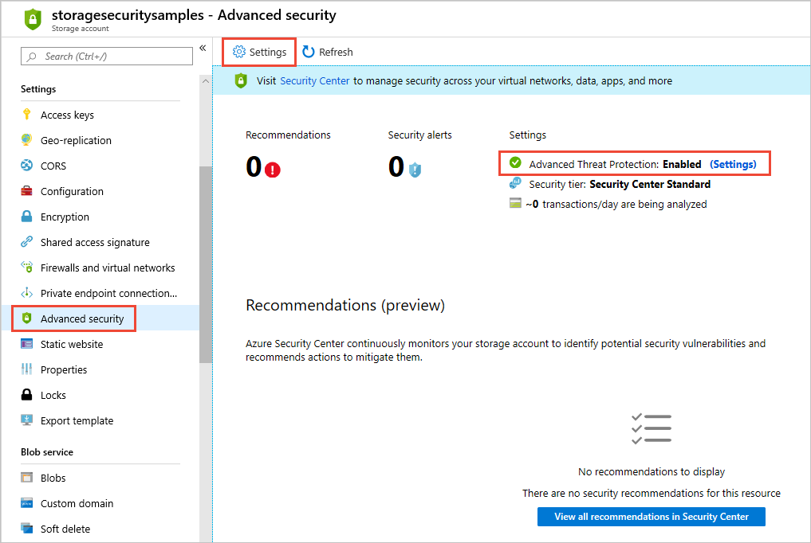

# Azure Storage Advanced Threat Protection

Azure Storage Advanced Threat Protection detects anomalies in account activity and notifies you of potentially harmful attempts to access your account. This layer of protection allows you to address threats without the need to be a security expert or manage security monitoring systems.

Threats are surfaced by defining security alerts that trigger when anomalies in activity occur. These alerts integrate with [Azure Security Center](https://azure.microsoft.com/services/security-center/) which include details of suspicious activity and recommendations on how to investigate and remediate threats. 

> [!NOTE]
> Azure Storage Advanced Threat Protection is currently available only for the Blob service. Security alerts are integrated with Azure Security Center and are sent via email to subscription administrators.

Azure Storage Advanced Threat Protection ingests diagnostic logs of read, write and delete requests to Blob service for threat detection.

## Set up Advanced Threat Protection in the portal

1. Launch the Azure portal at [https://portal.azure.com](https://portal.azure.com/).

2. Navigate to the configuration page of the Azure Storage account you want to protect. In the **Settings** page, select **Advanced Threat Protection**.

3. In the **Advanced Threat Protection** configuration blade
	* Turn **ON** Advanced *Threat Protection*
	* Click **Save** to save the new or updated Advanced Threat Protection policy.

## Explore anomalies

When storage activity anomalies occur, you receive an email notification with information about the suspicious security event. Details of the event include:

* nature of the anomaly
* storage account name
* storage type
* event time

The email also includes details on possible causes and recommended actions to investigate and mitigate the potential threat.

You can review and manage your current security alerts from Azure Security Center’s [Security alerts tile](../../security-center/security-center-managing-and-responding-alerts.md#managing-security-alerts). Clicking on a specific alert provides details and actions for investigating the current threat and addressing future threats.

## Protection alerts

Alerts are generated by unusual and potentially harmful attempts to access or exploit storage accounts. These events can trigger the following alerts:

* **Access from unusual location**: This alert is triggered when there's a change in the access pattern to a storage account. For instance, when someone has accessed a storage account from an unusual geographical location. In some cases, the alert detects a legitimate action (a new application or developer’s maintenance operation). In other cases, the alert detects a malicious action (former employee, external attacker, etc.).

* **Unusual data extraction**: This alert is triggered when there's a change in the data extraction pattern from a storage account. For instance, if someone has accessed an unusual amount of data in a storage account. In some cases, the alert detects a legitimate action (maintenance activity). In other cases, the alert detects a malicious action (data exfiltration/breach, unauthorized transfer of data).

* **Unusual anonymous access:** This alert is triggered when there's a change in the access pattern to a storage account. For instance, suppose someone has anonymously accessed a storage account. In some cases, the alert detects a legitimate access using public read access. In other cases, the alert detects unauthorized access that exploits public read access to a container and its blobs.

* **Unexpected delete:** This alert is triggered when one or more unexpected delete operations occur in a storage account, based on historical analysis of the storage account. For instance, suppose someone performed a *DeleteBlob* operation using a new application and from a new IP address. In some cases, the alert detects a legitimate action (the administrator used a different browser while traveling on business). In other cases, the alert detects a malicious action (an attacker deleting data). 
 
* **Access permission change:** This alert is triggered when there’s an unexpected change of access permission to a storage account. For instance, suppose someone changed the access permission to a storage account using a new application and from a new IP address. In some cases, the alert detects a legitimate action (the administrator used a different browser while traveling on business). In other cases, the alert detects a malicious action (e.g., an attacker increasing the privileges of an account they have gained access to). 

* **Upload Azure Cloud Service package:** This alert is triggered when there is an unexpected upload of an Azure Cloud Service package (*.cspkg* file) to a storage account. For instance, suppose a *.cspkg* file was uploaded from a new IP address. In some case, the alert detects a legitimate action. In other cases, the alert detects a malicious action (e.g., a Cloud Service package was uploaded in preparation for a deployment of a malicious service).    
   

## Next steps

* Learn more about [Logs in Azure Storage accounts ](/rest/api/storageservices/About-Storage-Analytics-Logging)

* Learn more about [Azure Security Center](../../security-center/security-center-intro.md)