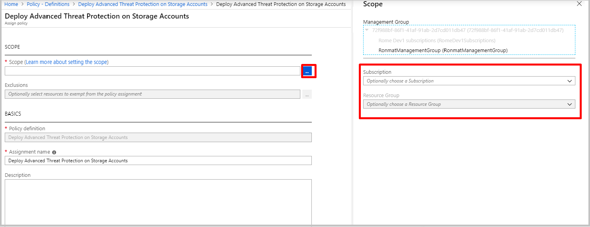
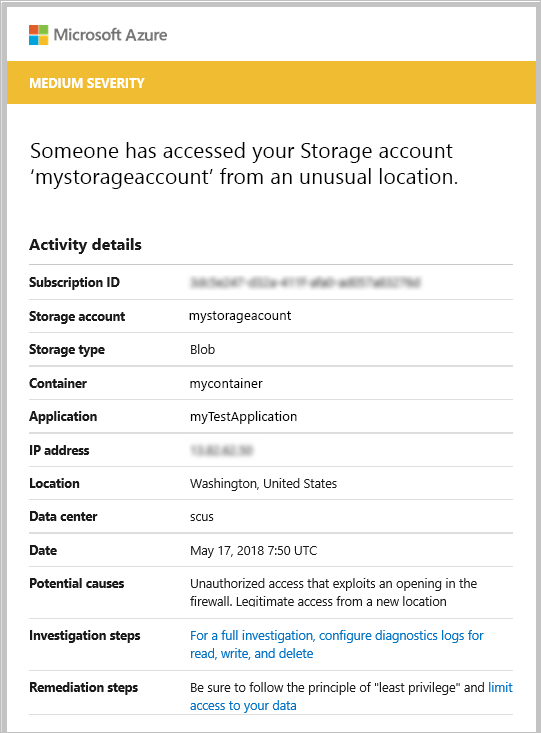

# Advanced Threat Protection for Azure Storage

Advanced Threat Protection for Azure Storage provides an additional layer of security intelligence that detects unusual and potentially harmful attempts to access or exploit storage accounts. This layer of protection allows you to address threats without the need to be a security expert or manage security monitoring systems. 

Security alerts are triggered when anomalies in activity occur.  These security alerts are integrated with [Azure Security Center](https://azure.microsoft.com/services/security-center/), and are also sent via email to subscription administrators, with details of suspicious activity and recommendations on how to investigate and remediate threats.

> [!NOTE]
> * Advanced Threat Protection for Azure Storage is currently available only for the Blob storage. 
> * Details about the new pricing is available in the [Azure Security Center](https://docs.microsoft.com/azure/security-center/security-center-pricing) pricing page, including an option for a trial period for the first 30 days without charge. 
> * ATP for Azure storage feature is currently not available in Azure government and sovereign cloud regions.

Advanced Threat Protection for Azure Storage ingests diagnostic logs of read, write, and delete requests to Blob storage for threat detection. To investigate the alerts from Advanced Threat Protection, you can view related storage activity using Storage Analytics Logging. For more information, see how to [configure Storage Analytics logging](storage-monitor-storage-account.md#configure-logging).

## Set up Advanced Threat Protection 

### Using the portal

1. Launch the Azure portal at [https://portal.azure.com](https://portal.azure.com/).

2. Navigate to the configuration page of the Azure Storage account you want to protect. In the **Settings** page, select **Advanced Threat Protection**.

3. In the **Advanced Threat Protection** configuration blade
	* Turn **ON** Advanced *Threat Protection*
	* Click **Save** to save the new or updated Advanced Threat Protection policy. (Prices in the image are for example purposes only.)

### Using Azure Security Center
When you subscribe to the Standard tier in Azure Security Center, Advanced Threat Protection is set up on your storage accounts. For more information see  [Upgrade to Security Center's Standard tier for enhanced security](https://docs.microsoft.com/azure/security-center/security-center-pricing). (Prices in the image are for example purposes only.)

### Using Azure Resource Manager templates

Use an Azure Resource Manager template to deploy an Azure Storage account with Advanced Threat Protection enabled.
For more information, see
[Storage account with Advanced Threat Protection](https://azure.microsoft.com/resources/templates/201-storage-advanced-threat-protection-create/).

### Using Azure Policy

Use an Azure Policy to enable Advanced Threat Protection across storage accounts under a specific subscription or resource group.

1. Lunch the Azure **Policy - Definitions** page.

1. Search for the **Deploy Advanced Threat Protection on Storage Accounts** policy.

     
  
1. Select an Azure subscription or resource group.

    

1. Assign the policy.

    

### Using REST API
Use Rest API commands to create, update, or get the Advanced Threat Protection setting for a specific storage account.

* [Advanced Threat Protection - Create](https://docs.microsoft.com/rest/api/securitycenter/advancedthreatprotection/create)
* [Advanced Threat Protection - Get](https://docs.microsoft.com/rest/api/securitycenter/advancedthreatprotection/get)

### Using Azure PowerShell

Use the following PowerShell cmdlets:

  * [Enable Advanced Threat Protection](https://docs.microsoft.com/powershell/module/az.security/enable-azsecurityadvancedthreatprotection)
  * [Get Advanced Threat Protection](https://docs.microsoft.com/powershell/module/az.security/get-azsecurityadvancedthreatprotection)
  * [Disable Advanced Threat Protection](https://docs.microsoft.com/powershell/module/az.security/disable-azsecurityadvancedthreatprotection)

## Explore security anomalies

When storage activity anomalies occur, you receive an email notification with information about the suspicious security event. Details of the event include:

* The nature of the anomaly
* The storage account name
* The event time
* The storage type
* The potential causes 
* The investigation steps
* The remediation steps

The email also includes details on possible causes and recommended actions to investigate and mitigate the potential threat.

You can review and manage your current security alerts from Azure Security Center’s [Security alerts tile](../../security-center/security-center-managing-and-responding-alerts.md#managing-security-alerts). Clicking on a specific alert provides details and actions for investigating the current threat and addressing future threats.

## Protection alerts

Alerts are generated by unusual and potentially harmful attempts to access or exploit storage accounts. These events can trigger the following alerts:

### Anomalous access pattern alerts

* **Access from unusual location**: This alert is triggered when there's a change in the access pattern to a storage account. For instance, when someone has accessed a storage account from an unusual geographical location.
Potential causes:
   * An attacker has accessed your storage account
   * A legitimate user has accessed your storage account from a new location
 
* **Application Anomaly**: This alert indicates that an unusual application has accessed this storage account. Potential causes:
   * An attacker has accessed your storage account using a new application.
   * A legitimate user has used a new application/browser to access your storage account.

* **Anonymous access**: This alert indicates that there is a change in the access pattern to a storage account. For example, this account has been accessed anonymously (i.e. without any authentication), which is unexpected compared to the recent access pattern on this account.
Potential causes:
   * An attacker has exploited public read access to a container.
   * A legitimate user or application has used public read access to a container.

### Anomalous extract/upload alerts

* **Data Exfiltration**: This alert indicates that an unusually large amount of data has been extracted compared to recent activity on this storage container. Potential causes:
   * An attacker has extracted a large amount of data from a container. (For example: data exfiltration/breach, unauthorized transfer of data)
   * A legitimate user or application has extracted an unusual amount of data from a container. (For example: maintenance activity)

* **Unexpected delete**: This alert indicates that one or more unexpected delete operations has occurred in a storage account, compared to recent activity on this account. Potential causes:
   * An attacker has deleted data from your storage account.
   * A legitimate user has performed an unusual deletion.

* **Upload Azure Cloud Service package**: This alert indicates that an Azure Cloud Service package (.cspkg file) has been uploaded to a storage account in an unusual way, compared to recent activity on this account. Potential causes: 
   * An attacker has been preparing to deploy malicious code from your storage account to an Azure cloud service.
   * A legitimate user has been preparing for a legitimate service deployment.

### Suspicious storage activities alerts

* **Access permission change**: This alert indicates that the access permissions of this storage container have been changed in an unusual way. Potential causes: 
   * An attacker has changed container permissions to weaken its security.
   * A legitimate user has changed container permissions.

* **Access Inspection**: This alert indicates that the access permissions of a storage account have been inspected in an unusual way, compared to recent activity on this account. Potential causes: 
   * An attacker has performed reconnaissance for a future attack.
   * A legitimate user has performed maintenance on the storage account.

* **Data Exploration**: This alert indicates that blobs or containers in a storage account have been enumerated in an unusual way, compared to recent activity on this account. Potential causes: 
   * An attacker has performed reconnaissance for a future attack.
   * A legitimate user or application logic has explored data within the storage account.

## Next steps

* Learn more about [Logs in Azure Storage accounts](/rest/api/storageservices/About-Storage-Analytics-Logging)

* Learn more about [Azure Security Center](../../security-center/security-center-intro.md)