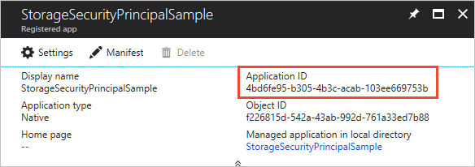

# Use Azure AD with storage applications (Preview)

Intro

## Get the preview client library for .NET

*point to nuget preview package*

## Authorize access by a security principal

### Endpoints for authorization with Azure AD

To authorize access by a security principal to storage resources with Azure AD, you need to include some well-known endpoints in your code.

#### Azure AD OAuth endpoint

The base Azure AD authority endpoint for OAuth 2.0 is as follows, where *tenant-id* is your Active Directory tenant ID (or directory ID):

`https://login.microsoftonline.com/<tenant-id>/oauth2/token`

The tenant ID identifies the Azure AD tenant to use for authentication. To retrieve the tenant ID, follow the steps outlined in **Get the tenant ID for your Azure Active Directory**.

#### Storage resource endpoint

Use the Azure Storage resource endpoint to acquire a token for authenticating requests to Azure Storage:

`https://storage.azure.com/`

### Register your application with a tenant

The first step in using Azure AD to authorize access to storage resources is registering your application in an Azure AD tenant. Registering your application enables you to call the Azure [Active Directory Authentication Library][../../active-directory/active-directory-authentication-libraries.md] (ADAL) from your code. The ADAL provides an API for authenticating with Azure AD from your application. Registering your application is required if you plan to authorize access using a security principal.

When you register your application, you supply information about your application to Azure AD. Azure AD then provides an application ID (also called a *client ID*) that you use to associate your application with Azure AD at runtime. To learn more about the application ID, see [Application and service principal objects in Azure Active Directory](../../active-directory/develop/active-directory-application-objects.md).

To register your Azure Storage application, follow the steps in the [Adding an Application](../../active-directory/develop/active-directory-integrating-applications.md#adding-an-application) section in [Integrating applications with Azure Active Directory][../../active-directory/active-directory-integrating-applications.md]. If you register your application as a Native Application, you can specify any valid URI for the **Redirect URI**. It does not need to be a real endpoint.


After you've registered your application, you'll see the application ID under **Settings**:



For more information about registering an application with Azure AD, see [Authentication Scenarios for Azure AD](../../active-directory/develop/active-directory-authentication-scenarios.md).

### Grant your registered app permissions to Azure Storage

Next, you need to grant your application permissions to call Azure Storage APIs. This step enables your application to authorize calls to Azure Storage with Azure AD.

1. In the left-hand navigation pane of the Azure portal, choose **All services**. Click **App Registrations**.
2. Search for the name of your application in the list of app registrations:

    

3. Click the application and click **Settings**. In the **API Access** section, select **Required permissions**.
4. In the **Required permissions** blade, click the **Add** button.
5. In **Select an API**, search for the Batch API. Search for each of these strings until you find the API:
    1. **MicrosoftAzureBatch**.
    2. **Microsoft Azure Batch**. Newer Azure AD tenants may use this name.
    3. **ddbf3205-c6bd-46ae-8127-60eb93363864** is the ID for the Batch API. 
6. Once you find the Batch API, select it and click **Select**.
7. In **Select permissions**, select the check box next to **Access Azure Batch Service** and click **Select**.
8. Click **Done**.

The **Required Permissions** windows now shows that your Azure AD application has access to both ADAL and the Batch service API. Permissions are granted to ADAL automatically when you first register your app with Azure AD.


### Get the tenant ID for your Azure Active Directory

The tenant ID identifies the Azure AD tenant that provides authentication services to your application. You need this value to request a token. To get the tenant ID, follow these steps:

1. In the Azure portal, select your Active Directory.
2. Click **Properties**.
3. Copy the GUID value provided for the **Directory ID**. This value is also called the tenant ID.


### Reference the ADAL client library in your code 

```dotnet
using Microsoft.IdentityModel.Clients.ActiveDirectory;
```


## Authorize access by an Azure VM Managed Service Identity (MSI)

