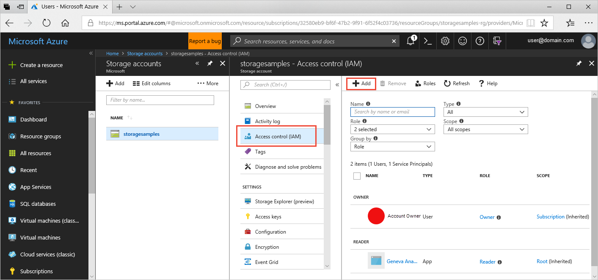

# Manage access rights to storage resources with RBAC (Preview)

Azure AD handles the authorization of access to secured resources through RBAC. Using RBAC, you can assign roles to users, groups, or service principals. Each role encompasses a set of permissions for a resource. Once the role is assigned to the user, group, or service principal, they have access to that resource. You can assign access rights using the Azure portal, Azure command-line tools, and Azure Management APIs. 

For more information on RBAC, see [Get started with Role-Based Access Control](https://docs.microsoft.com/azure/role-based-access-control/overview).

## RBAC roles for Azure Storage

In Azure Storage, you can grant access to the entire storage account, a container in the account, or a queue. Azure Storage offers these built-in RBAC roles for use with Azure AD:

- [Storage Account Contributor](https://docs.microsoft.com/en-us/azure/role-based-access-control/built-in-roles#storage-account-contributor)
- [Storage Account Key Operator Service Role](https://docs.microsoft.com/en-us/azure/role-based-access-control/built-in-roles#storage-account-key-operator-service-role)
- [Storage Blob Data Contributor (Preview)](https://docs.microsoft.com/en-us/azure/role-based-access-control/built-in-roles#storage-blob-data-contributor-preview)
- [Storage Blob Data Reader (Preview)](https://docs.microsoft.com/en-us/azure/role-based-access-control/built-in-roles#storage-blob-data-reader-preview)
- [Storage Queue Data Contributor (Preview)](https://docs.microsoft.com/en-us/azure/role-based-access-control/built-in-roles#storage-queue-data-contributor-preview)
- [Storage Queue Data Reader (Preview)](https://docs.microsoft.com/en-us/azure/role-based-access-control/built-in-roles#storage-queue-data-reader-preview)

For more information about how built-in roles are defined for Azure Storage, see [Understand role definitions](https://docs.microsoft.com/azure/role-based-access-control/role-definitions#management-and-data-operations-preview).

You can also define custom roles for use with Blob storage and Azure Queues. For more information, see [Create custom roles for Azure Role-Based Access Control](https://docs.microsoft.com/azure/role-based-access-control/custom-roles.md). 

## Assign a role to an Azure AD user, group, or service principal

You can assign an RBAC role to a user, group, or application service principal to grant fine-grained permissions to your blob and queue resources.

To assign a built-in role to a user in the Azure portal:

1. In the [Azure portal](https://azure.portal.com/), navigate to your storage account. If you don't already have a storage account created with the Azure Resource Manager model, then create a new storage account. For guidance on creating an Azure Resource Manager storage account, see [Create a storage account](storage-quickstart-create-account.md).
2. Select your storage account, then select **Access Control (IAM)** to display access control settings for the account. Click the **Add** button to add a new role.

    

3. In the **Add permissions** window, select the role that you want to assign to a user or users. Then locate the names of the users to whom you want to assign that role. For example, the following image shows the **Storage Blob Data Reader (Preview)** role assigned to a user.

    

4. Click **Save**. The users that you added appear listed under the role that you selected. These users or groups can now read data in Blob storage, according to how their permissions are scoped. 

    

## Next Steps

To learn more about RBAC, see [Get started with Role-Based Access Control in the Azure portal](../../role-based-access-control/overview.md).

