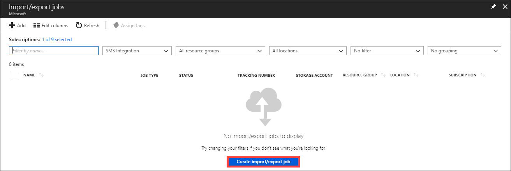
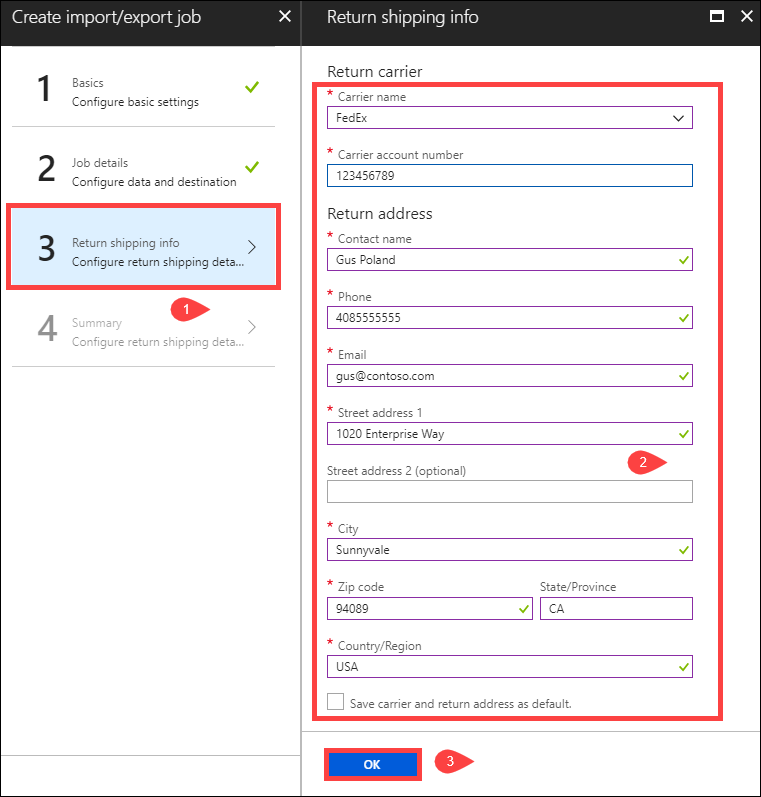
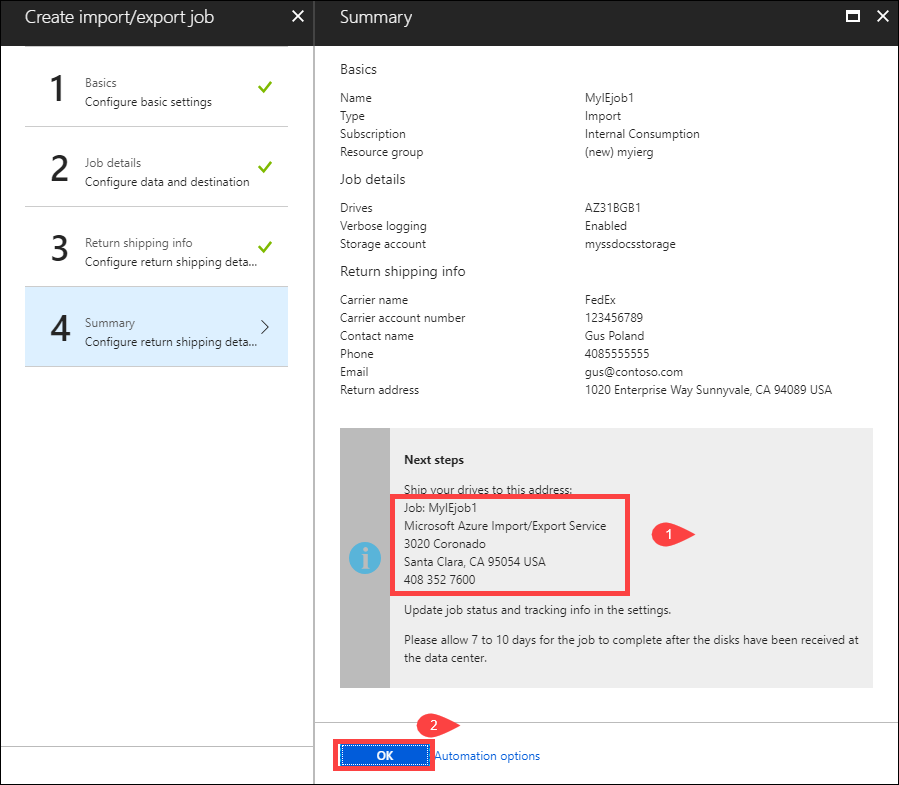

# Use the Azure Import/Export service to import data to Azure Blob Storage

This article provides step-by-step instructions on how to use the Azure Import/Export service to securely import large amounts of data to Azure Blob storage. To import data into Azure Blobs, the service requires you to ship encrypted disk drives containing your data to an Azure datacenter.  

## Prerequisites

Before you create an import job to transfer data into Azure Blob Storage, carefully review and complete the following list of prerequisites for this service.
You must:

* Have an active Azure subscription that can be used for the Import/Export service.
* Have at least one Azure Storage account with a storage container. See the list of [Supported storage accounts and storage types for Import/Export service](storage-import-export-requirements.md).
  * For information on creating a new storage account, see [How to Create a Storage Account](storage-account-create.md).
  * For information on storage container, go to [Create a storage container](../blobs/storage-quickstart-blobs-portal.md#create-a-container).
* Have adequate number of disks of [Supported types](storage-import-export-requirements.md#supported-disks).
* Have a Windows system running a [Supported OS version](storage-import-export-requirements.md#supported-operating-systems).
* Enable BitLocker on the Windows system. See [How to enable BitLocker](https://thesolving.com/storage/how-to-enable-bitlocker-on-windows-server-2012-r2/).
* [Download the latest WAImportExport version 1](https://www.microsoft.com/download/details.aspx?id=42659) on the Windows system. The latest version of the tool has security updates to allow an external protector for the BitLocker key, and the updated unlock mode feature.

  * Unzip to the default folder `waimportexportv1`. For example, `C:\WaImportExportV1`.
* Have a FedEx/DHL account. If you want to use a carrier other than FedEx/DHL, contact Azure Data Box Operations team at `adbops@microsoft.com`.  
  * The account must be valid, should have balance, and must have return shipping capabilities.
  * Generate a tracking number for the export job.
  * Every job should have a separate tracking number. Multiple jobs with the same tracking number are not supported.
  * If you do not have a carrier account, go to:
    * [Create a FedEX account](https://www.fedex.com/en-us/create-account.html), or
    * [Create a DHL account](http://www.dhl-usa.com/en/express/shipping/open_account.html).

## Step 1: Prepare the drives

This step generates a journal file. The journal file stores basic information such as drive serial number, encryption key, and storage account details.

Perform the following steps to prepare the drives.

1. Connect your disk drives to the Windows system via SATA connectors.
2. Create a single NTFS volume on each drive. Assign a drive letter to the volume. Do not use mountpoints.
3. Enable BitLocker encryption on the NTFS volume. If using a Windows Server system, use the instructions in [How to enable BitLocker on Windows Server 2012 R2](https://thesolving.com/storage/how-to-enable-bitlocker-on-windows-server-2012-r2/).
4. Copy data to encrypted volume. Use drag and drop or Robocopy or any such copy tool. A journal (*.jrn*) file is created in the same folder where you run the tool.

   If the drive is locked and you need to unlock the drive, the steps to unlock may be different depending on your use case.

   * If you have added data to a pre-encrypted drive (WAImportExport tool was not used for encryption), use the BitLocker key (a numerical password that you specify) in the popup to unlock the drive.

   * If you have added data to a drive that was encrypted by WAImportExport tool, use the following command to unlock the drive:

        `WAImportExport Unlock /externalKey:<BitLocker key (base 64 string) copied from journal (*.jrn*) file>`

5. Open a PowerShell or command line window with administrative privileges. To change directory to the unzipped folder, run the following command:

    `cd C:\WaImportExportV1`
6. To get the BitLocker key of the drive, run the following command:

    `manage-bde -protectors -get <DriveLetter>:`
7. To prepare the disk, run the following command. **Depending on the data size, this may take several hours to days.**

    ```powershell
    ./WAImportExport.exe PrepImport /j:<journal file name> /id:session#<session number> /t:<Drive letter> /bk:<BitLocker key> /srcdir:<Drive letter>:\ /dstdir:<Container name>/ /blobtype:<BlockBlob or PageBlob> /skipwrite
    ```

    A journal file is created in the same folder where you ran the tool. Two other files are also created - an *.xml* file (folder where you run the tool) and a *drive-manifest.xml* file (folder where data resides).

    The parameters used are described in the following table:

    |Option  |Description  |
    |---------|---------|
    |/j:     |The name of the journal file, with the .jrn extension. A journal file is generated per drive. We recommend that you use the disk serial number as the journal file name.         |
    |/id:     |The session ID. Use a unique session number for each instance of the command.      |
    |/t:     |The drive letter of the disk to be shipped. For example, drive `D`.         |
    |/bk:     |The BitLocker key for the drive. Its numerical password from output of `manage-bde -protectors -get D:`      |
    |/srcdir:     |The drive letter of the disk to be shipped followed by `:\`. For example, `D:\`.         |
    |/dstdir:     |The name of the destination container in Azure Storage.         |
    |/blobtype:     |This option specifies the type of blobs you want to import the data to. For block blobs, this is `BlockBlob` and for page blobs, it is `PageBlob`.         |
    |/skipwrite:     |The option that specifies that there is no new data required to be copied and existing data on the disk is to be prepared.          |
    |/enablecontentmd5:     |The option when enabled, ensures that MD5 is computed and set as `Content-md5` property on each blob. Use this option only if you want to use the `Content-md5` field after the data is uploaded to Azure. <br> This option does not affect the data integrity check (that occurs by default). The setting does increase the time taken to upload data to cloud.          |
8. Repeat the previous step for each disk that needs to be shipped. A journal file with the provided name is created for every run of the command line.

    > [!IMPORTANT]
    > * Together with the journal file, a `<Journal file name>_DriveInfo_<Drive serial ID>.xml` file is also created in the same folder where the tool resides. The .xml file is used in place of journal file when creating a job if the journal file is too big.

## Step 2: Create an import job

### [Portal](#tab/azure-portal)

Perform the following steps to create an import job in the Azure portal.

1. Log on to https://portal.azure.com/.
2. Go to **All services > Storage > Import/export jobs**.

    

3. Click **Create Import/export Job**.

    

4. In **Basics**:

   * Select **Import into Azure**.
   * Enter a descriptive name for the import job. Use the name to track the progress of your jobs.
       * The name may contain only lowercase letters, numbers, and hyphens.
       * The name must start with a letter, and may not contain spaces.
   * Select a subscription.
   * Enter or select a resource group.  

     

5. In **Job details**:

   * Upload the drive journal files that you obtained during the drive preparation step. If `waimportexport.exe version1` was used, upload one file for each drive that you prepared. If the journal file size exceeds 2 MB, then you can use the `<Journal file name>_DriveInfo_<Drive serial ID>.xml` also created with the journal file.
   * Select the destination storage account where data will reside.
   * The dropoff location is automatically populated based on the region of the storage account selected.

   

6. In **Return shipping info**:

   * Select the carrier from the dropdown list. If you want to use a carrier other than FedEx/DHL, choose an existing option from the dropdown. Contact Azure Data Box Operations team at `adbops@microsoft.com`  with the information regarding the carrier you plan to use.
   * Enter a valid carrier account number that you have created with that carrier. Microsoft uses this account to ship the drives back to you once your import job is complete. If you do not have an account number, create a [FedEx](https://www.fedex.com/us/oadr/) or [DHL](https://www.dhl.com/) carrier account.
   * Provide a complete and valid contact name, phone, email, street address, city, zip, state/province and country/region.

       > [!TIP]
       > Instead of specifying an email address for a single user, provide a group email. This ensures that you receive notifications even if an admin leaves.

     

7. In the **Summary**:

   * Review the job information provided in the summary. Make a note of the job name and the Azure datacenter shipping address to ship disks back to Azure. This information is used later on the shipping label.
   * Click **OK** to create the import job.

     

### [Azure CLI](#tab/azure-cli)

To get a list of the locations to which you can ship disks, use the [az import-export location list](/cli/azure/ext/import-export/import-export/location#ext_import_export_az_import_export_location_list) command.

```azurecli
az import-export location list
```

Get the details for your location by using the [az import-export location show](/cli/azure/ext/import-export/import-export/location#ext_import_export_az_import_export_location_show) command for your region.

```azurecli
az import-export location show --location "West US"
```

The following command uses [az import-export create](/cli/azure/ext/import-export/import-export#ext_import_export_az_import_export_create) to create an import job.

```azurecli
az import-export create \
    --resource-group myierg \
    --name MyIEjob1 \
    --location "West US" \
    --backup-drive-manifest true \
    --diagnostics-path waimportexport \
    --drive-list bit-locker-key=439675-460165-128202-905124-487224-524332-851649-442187 \
        drive-header-hash= drive-id=AZ31BGB1 manifest-file=\\DriveManifest.xml \
        manifest-hash=69512026C1E8D4401816A2E5B8D7420D \
    --type Import \
    --log-level Verbose \
    --return-address city=Sunnyvale country-or-region=USA email=gus@contoso.com \
        phone=4085555555 postal-code=94089 recipient-name="Gus Poland" state-or-province=CA \
        street-address1="1020 Enterprise way" \
    --storage-account myssdocsstorage
```

Use the [az import-export list](/cli/azure/ext/import-export/import-export#ext_import_export_az_import_export_list) command to see all the jobs for a resource group.

```azurecli
az import-export list --resource-group myierg
```

To update your job or cancel your job, use the [az import-export update](https://docs.microsoft.com/en-us/cli/azure/ext/import-export/import-export#ext_import_export_az_import_export_update) command.

```azurecli
az import-export update --resource-group myierg --name MyIEjob1 --cancel-requested true
```

---

## Step 3 (Optional): Configure customer managed key

Skip this step and go to the next step if you want to use the Microsoft managed key to protect your BitLocker keys for the drives. To configure your own key to protect the BitLocker key, follow the instructions in [Configure customer-managed keys with Azure Key Vault for Azure Import/Export in the Azure portal](storage-import-export-encryption-key-portal.md)

## Step 4: Ship the drives

[!INCLUDE [storage-import-export-ship-drives](../../../includes/storage-import-export-ship-drives.md)]

## Step 5: Update the job with tracking information

[!INCLUDE [storage-import-export-update-job-tracking](../../../includes/storage-import-export-update-job-tracking.md)]

## Step 6: Verify data upload to Azure

Track the job to completion. Once the job is complete, verify that your data has uploaded to Azure. Delete the on-premises data only after you have verified that upload was successful.

## Next steps

* [View the job and drive status](storage-import-export-view-drive-status.md)
* [Review Import/Export requirements](storage-import-export-requirements.md)
