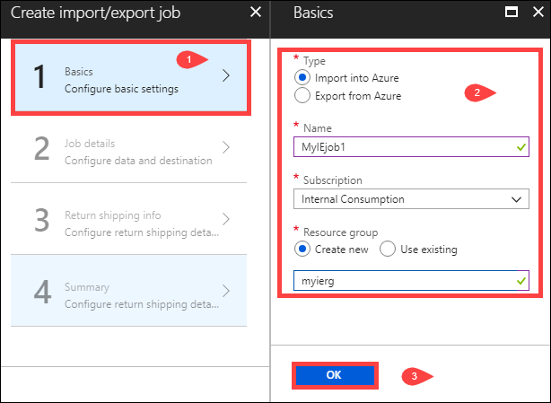
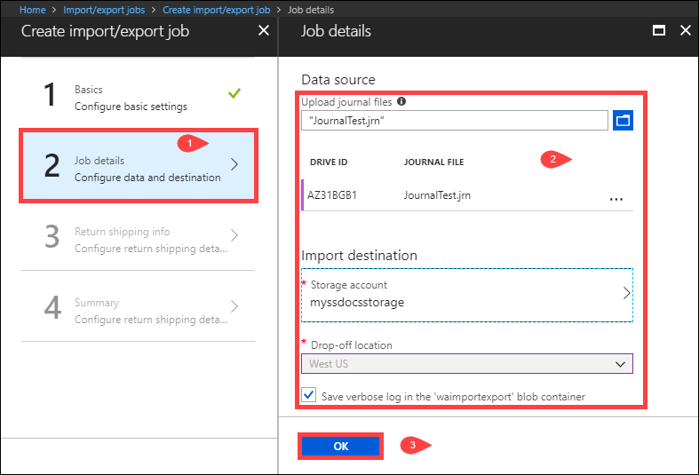

# Use Azure Import/Export service to import data to Azure Files

This article provides step-by-step instructions on how to use the Azure Import/Export service to securely import large amounts of data into Azure Files. To import data, the service requires you to ship supported disk drives containing your data to an Azure datacenter.  

The Import/Export service supports only import of Azure Files into Azure Storage. Exporting Azure Files is not supported.

## Prerequisites

Before you create an import job to transfer data into Azure Files, carefully review and complete the following list of prerequisites. You must:

- Have an active Azure subscription to use with Import/Export service.
- Have at least one Azure Storage account. See the list of [Supported storage accounts and storage types for Import/Export service](storage-import-export-requirements.md). For information on creating a new storage account, see [How to Create a Storage Account](storage-quickstart-create-account.md).
- Have adequate number of disks of [Supported types](storage-import-export-requirements.md#supported-disks). 
- Have a Windows system running a [Supported OS version](storage-import-export-requirements.md#supported-operating-systems).
- [Download the WAImportExport version 2](https://aka.ms/waiev2) on the Windows system. Unzip to the default folder `waimportexport`. For example, `C:\WaImportExport`.
- Have a FedEx/DHL account. If you want to use a carrier other than FedEx/DHL, contact Azure Data Box Operations team at `adbops@microsoft.com`.  
    - The account must be valid, should have balance, and must have return shipping capabilities.
    - Generate a tracking number for the export job.
    - Every job should have a separate tracking number. Multiple jobs with the same tracking number are not supported.
    - If you do not have a carrier account, go to:
        - [Create a FedEX account](https://www.fedex.com/en-us/create-account.html), or 
        - [Create a DHL account](http://www.dhl-usa.com/en/express/shipping/open_account.html).
 


## Step 1: Prepare the drives

This step generates a journal file. The journal file stores basic information such as drive serial number, encryption key, and storage account details.

Perform the following steps to prepare the drives.

1. Connect our disk drives to the Windows system via SATA connectors.
2. Create a single NTFS volume on each drive. Assign a drive letter to the volume. Do not use mountpoints.
3. Modify the *dataset.csv* file in the root folder where the tool resides. Depending on whether you want to import a file or folder or both, add entries in the *dataset.csv* file similar to the following examples.  

   - **To import a file**: In the following example, the data to copy resides in the F: drive. Your file *MyFile1.txt*  is copied to the root of the *MyAzureFileshare1*. If the *MyAzureFileshare1* does not exist, it is created in the Azure Storage account. Folder structure is maintained.

       ```
           BasePath,DstItemPathOrPrefix,ItemType,Disposition,MetadataFile,PropertiesFile
           "F:\MyFolder1\MyFile1.txt","MyAzureFileshare1/MyFile1.txt",file,rename,"None",None
    
       ```
   - **To import a folder**: All files and folders under *MyFolder2* are recursively copied to fileshare. Folder structure is maintained.

       ```
           "F:\MyFolder2\","MyAzureFileshare1/",file,rename,"None",None 
            
       ```
     Multiple entries can be made in the same file corresponding to folders or files that are imported. 

       ```
           "F:\MyFolder1\MyFile1.txt","MyAzureFileshare1/MyFile1.txt",file,rename,"None",None
           "F:\MyFolder2\","MyAzureFileshare1/",file,rename,"None",None 
                        
       ```
     Learn more about [preparing the dataset CSV file](storage-import-export-tool-preparing-hard-drives-import.md).
    

4. Modify the *driveset.csv* file in the root folder where the tool resides. Add entries in the *driveset.csv* file similar to the following examples. The driveset file has the list of disks and corresponding drive letters so that the tool can correctly pick the list of disks to be prepared.

    This example assumes that two disks are attached and basic NTFS volumes G:\ and H:\ are created. H:\is not encrypted while G: is already encrypted. The tool formats and encrypts the disk that hosts H:\ only (and not G:\).

   - **For a disk that is not encrypted**: Specify *Encrypt* to enable BitLocker encryption on the disk.

       ```
       DriveLetter,FormatOption,SilentOrPromptOnFormat,Encryption,ExistingBitLockerKey
       H,Format,SilentMode,Encrypt,
       ```
    
   - **For a disk that is already encrypted**: Specify *AlreadyEncrypted* and supply the BitLocker key.

       ```
       DriveLetter,FormatOption,SilentOrPromptOnFormat,Encryption,ExistingBitLockerKey
       G,AlreadyFormatted,SilentMode,AlreadyEncrypted,060456-014509-132033-080300-252615-584177-672089-411631
       ```

     Multiple entries can be made in the same file corresponding to multiple drives. Learn more about [preparing the driveset CSV file](storage-import-export-tool-preparing-hard-drives-import.md). 

5. Use the `PrepImport` option to copy and prepare data to the disk drive. For the first copy session to copy directories and/or files with a new copy session, run the following command:

       ```
       .\WAImportExport.exe PrepImport /j:<JournalFile> /id:<SessionId> [/logdir:<LogDirectory>] [/sk:<StorageAccountKey>] [/silentmode] [/InitialDriveSet:<driveset.csv>] DataSet:<dataset.csv>
       ```

   An import example is shown below.
  
       ```
       .\WAImportExport.exe PrepImport /j:JournalTest.jrn /id:session#1  /sk:************* /InitialDriveSet:driveset.csv /DataSet:dataset.csv /logdir:C:\logs
       ```
 
6. A journal file with name you provided with `/j:` parameter, is created for every run of the command line. Each drive you prepare has a journal file that must be uploaded when you create the import job. Drives without journal files are not processed.

    > [!IMPORTANT]
    > - Do not modify the data on the disk drives or the journal file after completing disk preparation.

For additional samples, go to [Samples for journal files](#samples-for-journal-files).

## Step 2: Create an import job 

Perform the following steps to create an import job in the Azure portal.
1. Log on to https://portal.azure.com/.
2. Go to **All services > Storage > Import/export jobs**. 

    

3. Click **Create Import/export Job**.

    

4. In **Basics**:

    - Select **Import into Azure**.
    - Enter a descriptive name for the import job. Use this name to track your jobs while they are in progress and once they are completed.
        -  This name may contain only lowercase letters, numbers, hyphens, and underscores.
        -  The name must start with a letter, and may not contain spaces. 
    - Select a subscription.
    - Select a resource group. 

        

3. In **Job details**:
    
    - Upload the journal files that you created during the preceding [Step 1: Prepare the drives](#step-1-prepare-the-drives). 
    - Select the storage account that the data will be imported into. 
    - The dropoff location is automatically populated based on the region of the storage account selected.
   
       

4. In **Return shipping info**:

    - Select the carrier from the drop-down list. If you want to use a carrier other than FedEx/DHL, choose an existing option from the dropdown. Contact Azure Data Box Operations team at `adbops@microsoft.com`  with the information regarding the carrier you plan to use.
    - Enter a valid carrier account number that you have created with that carrier. Microsoft uses this account to ship the drives back to you once your import job is complete. 
    - Provide a complete and valid contact name, phone, email, street address, city, zip, state/province and country/region.

        > [!TIP] 
        > Instead of specifying an email address for a single user, provide a group email. This ensures that you receive notifications even if an admin leaves.

       

   
5. In the **Summary**:

    - Provide the Azure datacenter shipping address for shipping disks back to Azure. Ensure that the job name and the full address are mentioned on the shipping label.
    - Click **OK** to complete import job creation.

        

## Step 3: Ship the drives to the Azure datacenter 

[!INCLUDE [storage-import-export-ship-drives](../../../includes/storage-import-export-ship-drives.md)]

## Step 4: Update the job with tracking information

[!INCLUDE [storage-import-export-update-job-tracking](../../../includes/storage-import-export-update-job-tracking.md)]

## Step 5: Verify data upload to Azure

Track the job to completion. Once the job is complete, verify that your data has uploaded to Azure. Delete the on-premises data only after you have verified that upload was successful.

## Samples for journal files

To **add more drives**, create a new driveset file and run the command as below. 

For subsequent copy sessions to the different disk drives than specified in *InitialDriveset .csv* file, specify a new driveset *.csv* file and provide it as a value to the parameter `AdditionalDriveSet`. Use the **same journal file** name and provide a **new session ID**. The format of AdditionalDriveset CSV file is same as InitialDriveSet format.

    ```
    WAImportExport.exe PrepImport /j:<JournalFile> /id:<SessionId> /AdditionalDriveSet:<driveset.csv>
    ```

An import example is shown below.

    ```
    WAImportExport.exe PrepImport /j:JournalTest.jrn /id:session#3  /AdditionalDriveSet:driveset-2.csv
    ```


To add additional data to the same driveset, use the PrepImport command for subsequent copy sessions to copy additional files/directory.

For subsequent copy sessions to the same hard disk drives specified in *InitialDriveset.csv* file, specify the **same journal file** name and provide a **new session ID**; there is no need to provide the storage account key.

    ```
    WAImportExport PrepImport /j:<JournalFile> /id:<SessionId> /j:<JournalFile> /id:<SessionId> [/logdir:<LogDirectory>] DataSet:<dataset.csv>
    ```

An import example is shown below.

    ```
    WAImportExport.exe PrepImport /j:JournalTest.jrn /id:session#2  /DataSet:dataset-2.csv
    ```

## Next steps

* [View the job and drive status](storage-import-export-view-drive-status.md)
* [Review Import/Export requirements](storage-import-export-requirements.md)


