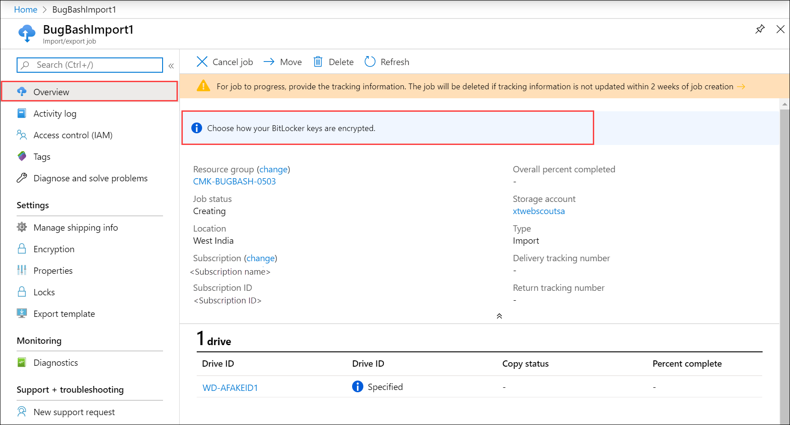
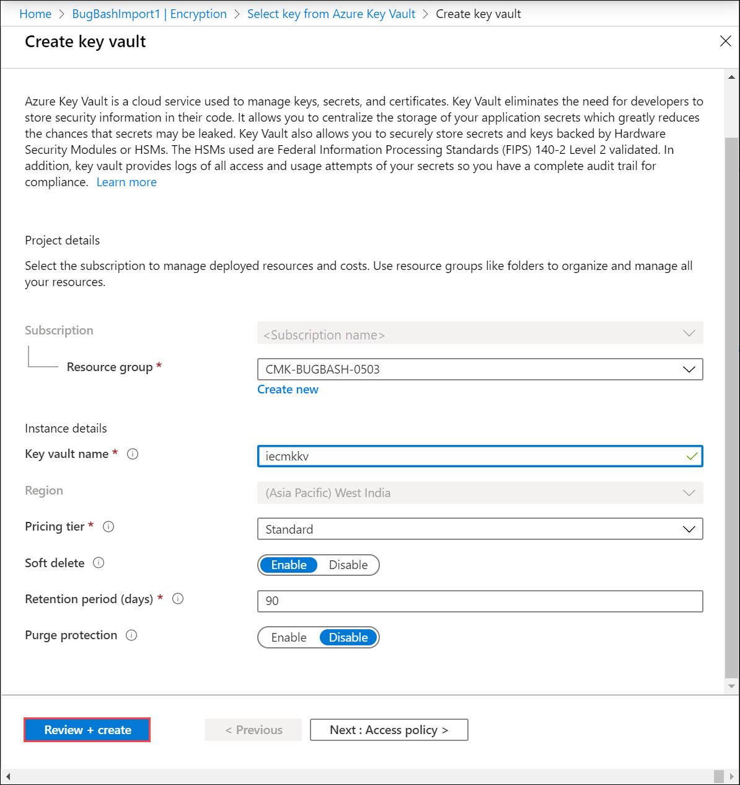
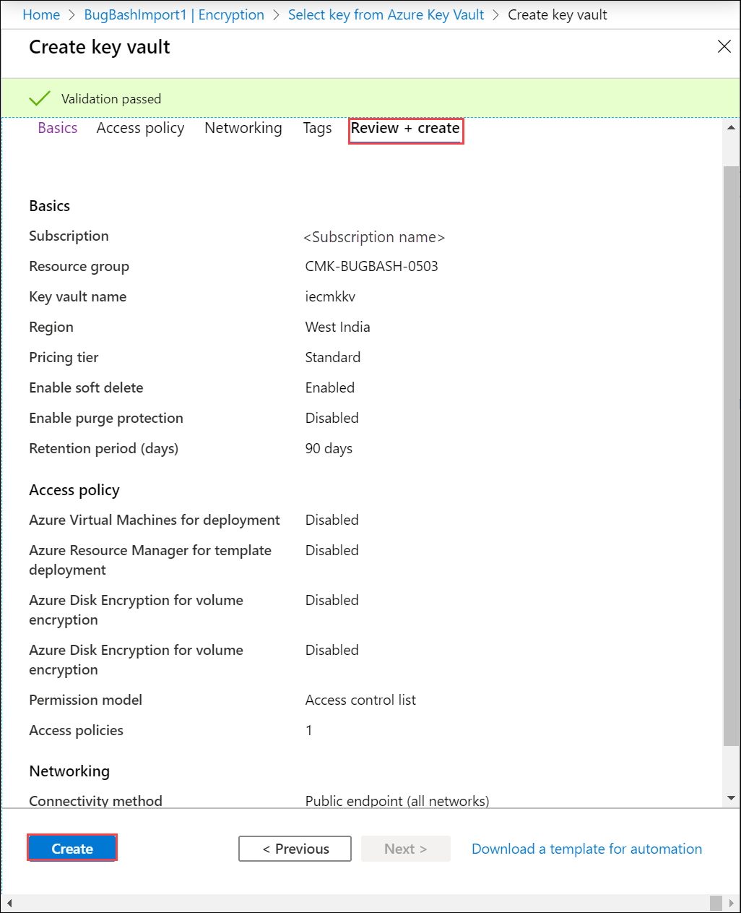
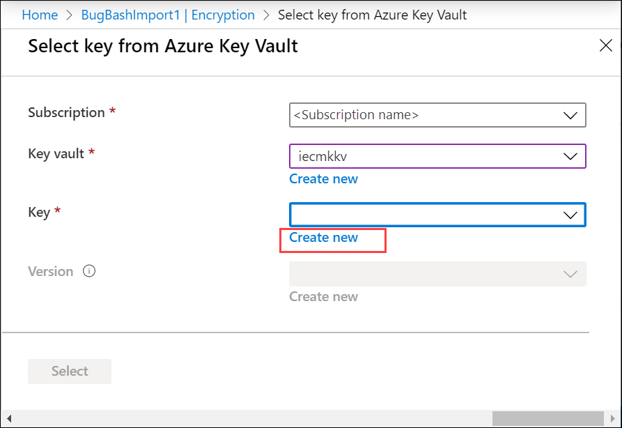

# Use customer-managed keys in Azure Key Vault for Import/Export service 

Azure Import/Export protects the BitLocker keys used to lock the drives via an encryption key. By default, BitLocker keys are encrypted with Microsoft-managed keys. For additional control over encryption keys, you can also provide customer-managed keys.

Customer-managed keys must be created and stored in an Azure Key Vault. The Import/Export service and the key vault must be in the same region, but they can be in different subscriptions. For more information about Azure Key Vault, see [What is Azure Key Vault?](../../key-vault/key-vault-overview.md)

This article shows how to use customer-managed keys with Import/Export service in the [Azure portal](https://portal.azure.com/). 

## Prerequisites

Before you begin, make sure:

1. You have created an import job as per the instructions in:

    - [Create an import job for blobs](storage-import-export-data-to-blobs.md).
    - [Create an import job for files](storage-import-export-data-to-files.md).

2. You have an existing Azure Key Vault with a key in it that you can use to protect your BitLocker key. To learn how to create a key vault using the Azure portal, see [Quickstart: Set and retrieve a secret from Azure Key Vault using the Azure portal](../../key-vault/quick-create-portal.md).
    
    - **Soft delete** and **Do not purge** are set on your existing Key Vault. These properties are not enabled by default. To enable these properties, see the sections titled **Enabling soft-delete** and **Enabling Purge Protection** in one of the following articles:

        - [How to use soft-delete with PowerShell](../../key-vault/key-vault-soft-delete-powershell.md).
        - [How to use soft-delete with CLI](../../key-vault/key-vault-soft-delete-cli.md).
    - The existing key vault should have an RSA key of 2048 size. For more information about keys, see **Key Vault keys** in [About Azure Key Vault keys, secrets, and certificates](../../key-vault/about-keys-secrets-and-certificates.md#key-vault-keys).
    - If you don't have an existing Azure Key Vault, you can also create it inline.

## Enable customer-managed keys

Configuring customer-managed key for your Import/Export service is optional. By default, the Import/Export service uses a Microsoft managed key to protect your BitLocker key. To enable customer-managed keys in the Azure portal, follow these steps:

1. Go to the **Overview** blade for your Import job.
2. In the right-pane, select **Choose how your BitLocker keys are encrypted**.

    

3. In the **Encryption** blade, you can view and copy the device BitLocker key. Under **Encryption type**, you can choose how you want to protect your BitLocker key. By default, a Microsoft managed key is used.

    

4. You have the option to specify a customer managed key. After you have selected the customer managed key, **Select key vault and a key**.

    

5. In the **Select key from Azure Key Vault** blade, the subscription is automatically populated. For **Key vault**, you can select an existing key vault from the dropdown list.

    

6. You can also select **Create new** to create a new key vault. In the **Create key vault blade**, enter the resource group and the key vault name. Accept all other defaults. Select **Review + Create**. 

    

7. Review the information associated with your key vault and select **Create**. Wait for a couple minutes for the key vault creation to complete.

    

7. In the **Select key from Azure Key Vault**, you can select a key in the existing key vault. 

8. If you created a new key vault, select **Create new**. 

    

9. Provide the name for your key, accept the other defaults, and select **Create**. 

    

10. Select the **Version** and then choose **Select**. You are notified that a key is created in your key vault.

    

In the **Encryption** blade, you can see the key vault and the key selected for your customer managed key.

## Disable customer-managed keys

When you disable customer-managed keys, your storage account is then encrypted with Microsoft-managed keys. To disable customer-managed keys, follow these steps:

1. Navigate to your storage account and display the **Encryption** settings.
1. Deselect the checkbox next to the **Use your own key** setting.

## Next steps

- [Azure Storage encryption for data at rest](storage-service-encryption.md)
- [What is Azure Key Vault](https://docs.microsoft.com/azure/key-vault/key-vault-overview)?
