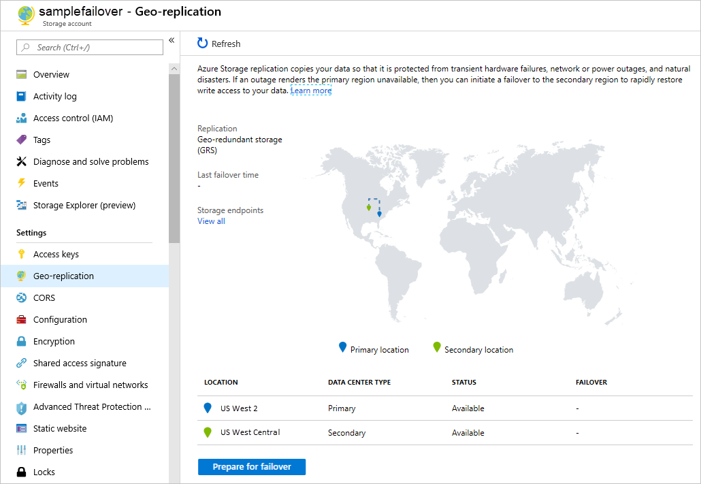
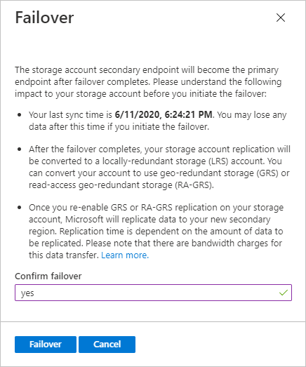

# Initiate a storage account failover (preview)

If the primary endpoint for your geo-redundant storage account becomes unavailable for any reason, you can initiate an account failover (preview). An account failover updates the secondary endpoint to become the primary endpoint for your storage account. Once the failover is complete, clients can begin writing to the new primary region. Forced failover enables you to maintain high availability for your applications.

This article shows how to initiate an account failover for your storage account using the Azure portal, PowerShell, or Azure CLI. To learn more about account failover, see [Disaster recovery and account failover (preview) in Azure Storage](storage-disaster-recovery-guidance.md).

> [!WARNING]
> An account failover typically results in some data loss. To understand the implications of an account failover and to prepare for data loss, review [Understand the account failover process](storage-disaster-recovery-guidance.md#understand-the-account-failover-process).

## Prerequisites

Before you can perform an account failover on your storage account, make sure that you have performed the following steps:

- Register for the account failover preview. For information about how to register, see [About the preview](storage-disaster-recovery-guidance.md#about-the-preview).
- Make sure that your storage account is configured to use either geo-redundant storage (GRS) or read-access geo-redundant storage (RA-GRS). For more information about geo-redundant storage, see [Geo-redundant storage (GRS): Cross-regional replication for Azure Storage](storage-redundancy-grs.md). 

## Important implications of account failover

When you initiate an account failover for your storage account, the DNS records for the secondary endpoint are updated so that the secondary endpoint becomes the primary endpoint. Make sure that you understand the potential impact to your storage account before you initiate a failover.

To estimate the extent of likely data loss before you initiate a failover, check the **Last Sync Time** property using the `Get-AzureRmStorageAccount` PowerShell cmdlet, and include the `-IncludeGeoReplicationStats` parameter. Then check the `GeoReplicationStats` property for your account. 

> [!Important]  
> Failing over a storage account with a Azure file share being used as a cloud endpoint in Azure File Sync is currently not supported. Doing so will cause sync to stop working and may also cause unexpected data loss in the case of newly tiered files.  

After the failover, your storage account type is automatically converted to locally redundant storage (LRS) in the new primary region. You can re-enable geo-redundant storage (GRS) or read-access geo-redundant storage (RA-GRS) for the account. Note that converting from LRS to GRS or RA-GRS incurs an additional cost. For additional information, see [Bandwidth Pricing Details](https://azure.microsoft.com/pricing/details/bandwidth/). 

After you re-enable GRS for your storage account, Microsoft begins replicating the data in your account to the new secondary region. Replication time is dependent on the amount of data being replicated.  

## Azure portal

To initiate an account failover from the Azure portal, follow these steps:

1. Navigate to your storage account.
2. Under **Settings**, select **Geo-replication**. The following image shows the geo-replication and failover status of a storage account.

    

3. Verify that your storage account is configured for geo-redundant storage (GRS) or read-access geo-redundant storage (RA-GRS). If it's not, then select **Configuration** under **Settings** to update your account to be geo-redundant. 
4. The **Last Sync Time** property indicates how far the secondary is behind from the primary. **Last Sync Time** provides an estimate of the extent of data loss that you will experience after the failover is completed.
5. Select **Prepare for failover (preview)**. 
6. Review the confirmation dialog. When you are ready, enter **Yes** to confirm and initiate the failover.

    

## PowerShell

To use PowerShell to initiate an account failover, you must first install the 6.0.1 preview module. Follow these steps to install the module:

1. Uninstall any previous installations of Azure PowerShell:

    - Remove any previous installations of Azure PowerShell from Windows using the **Apps & features** setting under **Settings**.
    - Remove all **Azure*** modules from `%Program Files%\WindowsPowerShell\Modules`.
    
1. Make sure that you have the latest version of PowerShellGet installed. Open a Windows PowerShell window, and run the following command to install the latest version:
 
    ```powershell
    Install-Module PowerShellGet –Repository PSGallery –Force
    ```
1. Close and reopen the PowerShell window after installing PowerShellGet. 

1. Install the latest version of Azure PowerShell:

    ```powershell
    Install-Module Az –Repository PSGallery –AllowClobber
    ```

1. Install an Azure Storage preview module that supports Azure AD:
   
    ```powershell
    Install-Module -Name AzureRM.Storage -AllowPrerelease
    ```
1. Close and reopen the PowerShell window.
 

To initiate an account failover from PowerShell, execute the following command:

```powershell
Invoke-AzureRmStorageAccountFailover -ResourceGroupName <resource-group-name> -Name <account-name> 
```

## Azure CLI

To use Azure CLI to initiate an account failover, execute the following commands:

```cli
az storage account show \ --name accountName \ --expand geoReplicationStats
az storage account failover \ --name accountName
```

## Next steps

- [Disaster recovery and account failover (preview) in Azure Storage](storage-disaster-recovery-guidance.md)
- [Designing highly available applications using RA-GRS](storage-designing-ha-apps-with-ragrs.md)
- [Tutorial: Build a highly available application with Blob storage](../blobs/storage-create-geo-redundant-storage.md) 
