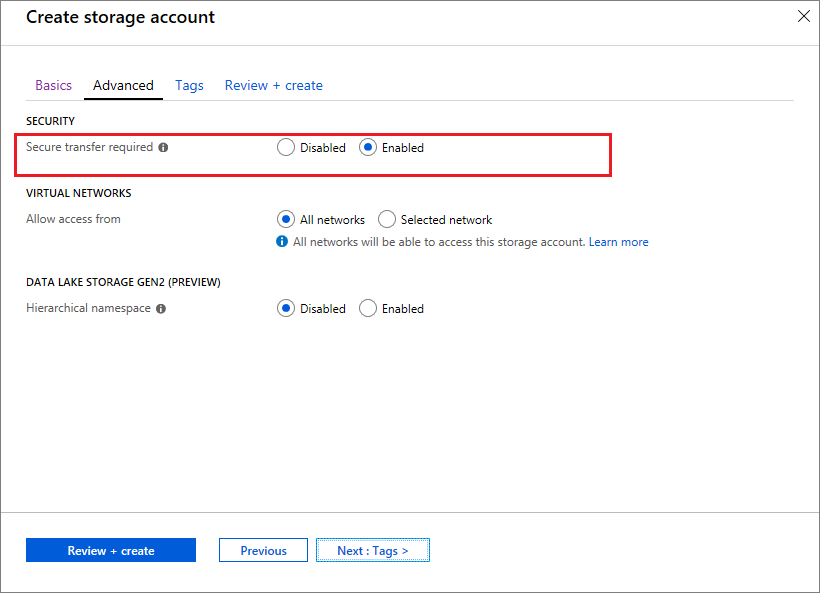
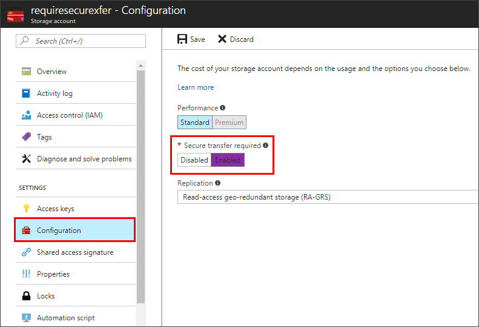

---
title: Require secure transfer in Azure Storage | Microsoft Docs
description: Learn about the "Secure transfer required" feature for Azure Storage, and how to enable it.
services: storage
documentationcenter: na
author: fhryo-msft
manager: Jason.Hogg
editor: fhryo-msft

ms.assetid:
ms.service: storage
ms.devlang: na
ms.topic: article
ms.tgt_pltfrm: na
ms.workload: storage
ms.date: 06/20/2017
ms.author: fryu
---
# Require secure transfer in Azure Storage

The "Secure transfer required" option enhances the security of your Azure Storage account by only allowing requests to the account from secure connections. For example, when calling REST APIs to access your storage account, you must connect by using HTTPS. "Secure transfer required" rejects requests using HTTP.

When you use the Azure Files service, any connection without encryption fails when "Secure transfer required" is enabled. This includes scenarios using SMB 2.1, SMB 3.0 without encryption, and some versions of the Linux SMB client. 

By default, the "Secure transfer required" option is disabled.

> [!NOTE]
> Because Azure Storage doesn't support HTTPS for custom domain names, this option is not applied when using a custom domain name.

## Enable "Secure transfer required" in the Azure portal

You can turn on the "Secure transfer required" setting when you create a storage account in the [Azure portal](https://portal.azure.com). You can also enable it for existing storage accounts.

### Require secure transfer for a new storage account

1. Open the **Create storage account** pane in the Azure portal.
1. Under **Secure transfer required**, select **Enabled**.

  

### Require secure transfer for an existing storage account

1. Select an existing storage account in the Azure portal.
1. In the storage account menu pane, under **SETTINGS**, select **Configuration**.
1. Under **Secure transfer required**, select **Enabled**.

  

## Enable "Secure transfer required" programmatically

To require secure transfer programmatically, use the setting _supportsHttpsTrafficOnly_ in storage account properties with REST API, tools, or libraries:

* [REST API](https://docs.microsoft.com/en-us/rest/api/storagerp/storageaccounts) (Version: 2016-12-01)
* [PowerShell](https://docs.microsoft.com/en-us/powershell/module/azurerm.storage/set-azurermstorageaccount?view=azurermps-4.1.0) (Version: 4.1.0)
* [CLI](https://pypi.python.org/pypi/azure-cli-storage/2.0.11) (Version: 2.0.11)
* [NodeJS](https://www.npmjs.com/package/azure-arm-storage/) (Version: 1.1.0)
* [.NET SDK](https://www.nuget.org/packages/Microsoft.Azure.Management.Storage/6.3.0-preview) (Version: 6.3.0)
* [Python SDK](https://pypi.python.org/pypi/azure-mgmt-storage/1.1.0) (Version: 1.1.0)
* [Ruby SDK](https://rubygems.org/gems/azure_mgmt_storage) (Version: 0.11.0)

### Enable "Secure transfer required" setting with REST API

To simplify testing with REST API, use [ArmClient](https://github.com/projectkudu/ARMClient) to call from the command line.

 Use the following command line to check the setting with the REST API:

```
# Login Azure and proceed with your credentials
> armclient login

> armclient GET  /subscriptions/{subscriptionId}/resourceGroups/{resourceGroupName}/providers/Microsoft.Storage/storageAccounts/{accountName}?api-version=2016-12-01
```

In the response, find the _supportsHttpsTrafficOnly_ setting. For example:

```Json

{
  "id": "/subscriptions/{subscriptionId}/resourceGroups/{resourceGroupName}/providers/Microsoft.Storage/storageAccounts/{accountName}",
  "kind": "Storage",
  ...
  "properties": {
    ...
    "supportsHttpsTrafficOnly": false
  },
  "type": "Microsoft.Storage/storageAccounts"
}

```

Use the following command line to enable the setting with the REST API:

```

# Login Azure and proceed with your credentials
> armclient login

> armclient PUT /subscriptions/{subscriptionId}/resourceGroups/{resourceGroupName}/providers/Microsoft.Storage/storageAccounts/{accountName}?api-version=2016-12-01 < Input.json

```

The following is an Input.json example:
```Json

{
  "location": "westus",
  "properties": {
    "supportsHttpsTrafficOnly": true
  }
}

```

## Next steps
Azure Storage provides a comprehensive set of security capabilities, which together enable developers to build secure applications. For more details, go to the [Storage Security Guide](storage-security-guide.md).
