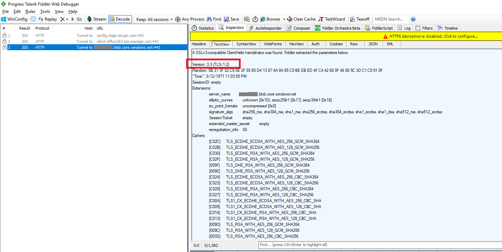

# Enable secure TLS for Azure Storage client

Transport Layer Security (TLS) and Secure Sockets Layer (SSL) are cryptographic protocols that provide communications security over a computer network. SSL 1.0, 2.0 and 3.0 have been found to be vulnerable. They have been prohibited by RFC. TLS 1.0 becomes insecure for using insecure Block cipher (DES CBC and RC2 CBC) and Stream cipher (RC4). PCI council also suggested the migration to higher TLS versions. For more details, you can see [Transport Layer Security (TLS)](https://en.wikipedia.org/wiki/Transport_Layer_Security#SSL_1.0.2C_2.0_and_3.0).

Azure Storage has stopped SSL 3.0 since 2015 and uses TLS 1.2 on public HTTPs endpoints but TLS 1.0 and TLS 1.1 are still supported for backward compatibility.

In order to ensure secure and compliant connection to Azure Storage, you need to enable TLS 1.2 or newer version in client side before sending requests to operate Azure Storage service.

## Enable TLS 1.2 in .NET client

For the client to negotiate TLS 1.2, the OS and the .NET Framework version both need to support TLS 1.2. See more details in [Support for TLS 1.2](https://docs.microsoft.com/dotnet/framework/network-programming/tls#support-for-tls-12).

The following sample shows how to enable TLS 1.2 in your .NET client.

```csharp

    static void EnableTls12()
    {
        // Enable TLS 1.2 before connecting to Azure Storage
        System.Net.ServicePointManager.SecurityProtocol = System.Net.SecurityProtocolType.Tls12;

        // Connect to Azure Storage
        CloudStorageAccount storageAccount = CloudStorageAccount.Parse("DefaultEndpointsProtocol=https;AccountName={yourstorageaccount};AccountKey={yourstorageaccountkey};EndpointSuffix=core.windows.net");
        CloudBlobClient blobClient = storageAccount.CreateCloudBlobClient();

        CloudBlobContainer container = blobClient.GetContainerReference("foo");
        container.CreateIfNotExists();
    }

```

## Enable TLS 1.2 in PowerShell client

The following sample shows how to enable TLS 1.2 in your PowerShell client.

```powershell

# Enable TLS 1.2 before connecting to Azure Storage
[System.Net.ServicePointManager]::SecurityProtocol = [System.Net.SecurityProtocolType]::Tls12;

$resourceGroup = "{YourResourceGropuName}"
$storageAccountName = "{YourStorageAccountNme}"
$prefix = "foo"

# Connect to Azure Storage
$storageAccount = Get-AzStorageAccount -ResourceGroupName $resourceGroup -Name $storageAccountName
$ctx = $storageAccount.Context
$listOfContainers = Get-AzStorageContainer -Context $ctx -Prefix $prefix
$listOfContainers

```

## Verify TLS 1.2 connection

You can use Fiddler to verify if TLS 1.2 is used actually. Open Fiddler to start capturing client network traffic then execute above sample. Then you can find the TLS version in the connection that the sample makes.

The following screenshot is a sample for the verification.



## See also

* [Transport Layer Security (TLS)](https://en.wikipedia.org/wiki/Transport_Layer_Security#SSL_1.0.2C_2.0_and_3.0)
* [PCI compliance on TLS](https://blog.pcisecuritystandards.org/migrating-from-ssl-and-early-tls)
* [Enable TLS in Java client](https://www.java.com/en/configure_crypto.html)
