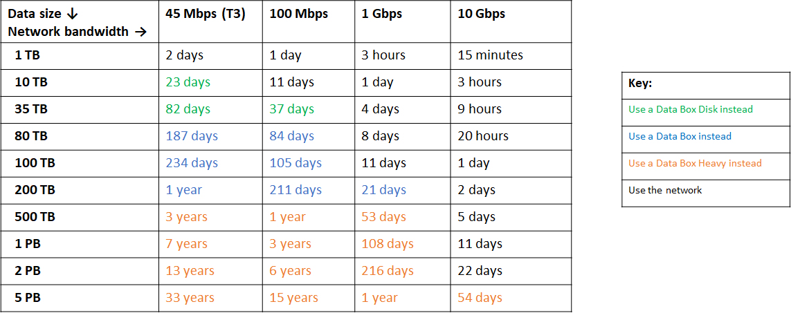

# Data transfer for large datasets with low or no network bandwidth
 
This article provides an overview of the data transfer solutions when you have limited to no network bandwidth in your environment and you are planning to transfer large data sets. The article also describes the recommended data transfer options and the respective key capability matrix for this scenario.

To understand an overview of all the available data transfer options, go to [Choose an Azure data transfer solution](storage-choose-data-transfer-solution).

## Offline transfer or network transfer

Large datasets imply that you have few TBs to few PBs of data. You have limited to no network bandwidth, your network is slow, or it is unreliable. Also:

- You are limited by costs of network transfer.
- Security or organizational policies do not allow outbound connections when dealing with sensitive data.

In all the above instances, use a physical device to do a one-time bulk data  transfer. Choose from Data Box Disk, Data Box, Data Box Heavy devices which are supplied by Microsoft, or Import/Export using your own disks.

To confirm whether a physical device is the right option, use the following table. It shows the projected time for network data transfer, for various available bandwidths. If network transfer is projected to be too slow, you should use a physical device.  

## Recommended options

The options available in this scenario are devices for Azure Data Box offline transfer or Azure Import/Export.

- **Azure Data Box family for offline transfers** – Use devices from Microsoft-supplied Data Box devices to move large amounts of data to Azure when you’re limited by time, network availability, or costs. Copy on-premises data using tools such as Robocopy. Depending on the data size intended for transfer, you can choose from Data Box Disk, Data Box, or Data Box Heavy.
- **Azure Import/Export** – Use Azure Import/Export service by shipping your own disk drives to securely import large amounts of data to Azure Blob storage and Azure Files. This service can also be used to transfer data from Azure Blob storage to disk drives and ship to your on-premises sites.

## Comparison of key capabilities

The following table summarizes the differences in key capabilities.

|                                     |    Data Box Disk   (preview)    |    Data Box                                      |    Data Box Heavy (preview)              |    Import/Export                       |
|-------------------------------------|---------------------------------|--------------------------------------------------|------------------------------------------|----------------------------------------|
|    Data size                        |    Up to 35 TBs                 |    Up to 80 TBs per device                       |    Up to 800 TB per device               |    Variable                            |
|    Data type                        |    Azure Blobs                  |    Azure Blobs Azure Files                    |    Azure Blobs Azure Files            |    Azure Blobs Azure Files          |
|    Form factor                      |    5 SSDs per order             |    1 X 50-lbs. desktop-sized device per order    |    1 X ~500-lbs. large device per order    |    Up to 10 HDDs/SSDs per order        |
|    Initial setup time               |    Low  (15 mins)            |    Low to moderate   (<30 mins)               |    Moderate (1-2 hours)               |    Moderate to difficult (variable) |
|    Send data to Azure               |    Yes                          |    Yes                                           |    Yes                                   |    Yes                                 |
|    Export data from Azure           |    No                           |    No                                            |    No                                    |    Yes                                 |
|    Encryption                       |    AES 128-bit                  |    AES 256-bit                                   |    AES 256-bit                           |    AES 128-bit                         |
|    Hardware                         |     Microsoft supplied          |    Microsoft supplied                            |    Microsoft supplied                    |    Customer supplied                   |
|    Network interface                |    USB 3.1/SATA                 |    RJ 45, SFP+                                   |    RJ45, QSFP+                           |    SATA II/SATA III                    |
|    Partner integration              |    Some                         |    [High](https://azuremarketplace.microsoft.com/campaigns/databox/azure-data-box)                                          |    [High](https://azuremarketplace.microsoft.com/campaigns/databox/azure-data-box)                                  |    Some                                |
|    Shipping                         |    Microsoft managed            |    Microsoft managed                             |    Microsoft managed                     |    Customer managed                    |
| Use when data moves         |Within a commerce boundary|Within a commerce boundary|Within a commerce boundary|Across geographic boundaries, e.g. US to EU|
|    Pricing                          |    [Pricing](https://azure.microsoft.com/pricing/details/storage/databox/disk/)                    |   [Pricing](https://azure.microsoft.com/pricing/details/storage/databox/)                                      |  [Pricing](https://azure.microsoft.com/pricing/details/storage/databox/heavy/)                               |   [Pricing](https://azure.microsoft.com/pricing/details/storage-import-export/)                            |

## Next steps

- Understand how to

    - [Transfer data with Data Box Disk](https://docs.microsoft.com/azure/databox/data-box-disk-quickstart-portal).
    - [Transfer data with Data Box](https://docs.microsoft.com/azure/databox/data-box-quickstart-portal).
    - [Transfer data with Import/Export](/azure/storage/common/storage-import-export-data-to-blobs).