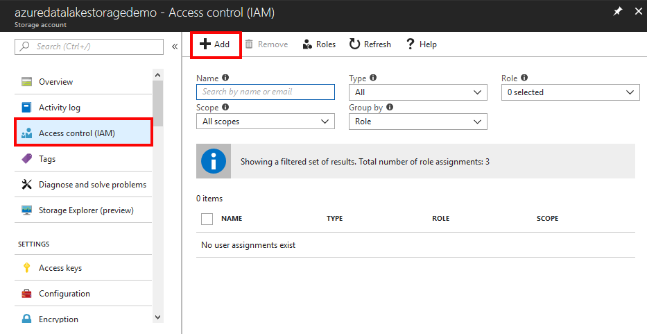
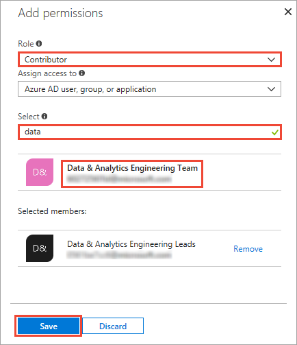
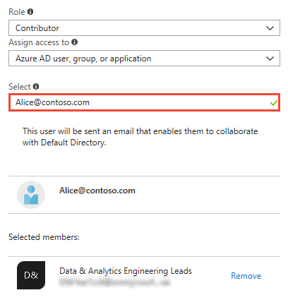
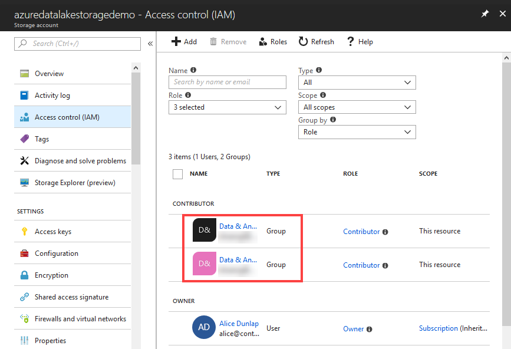
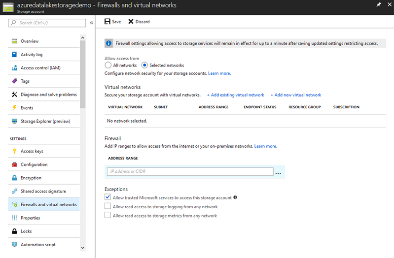
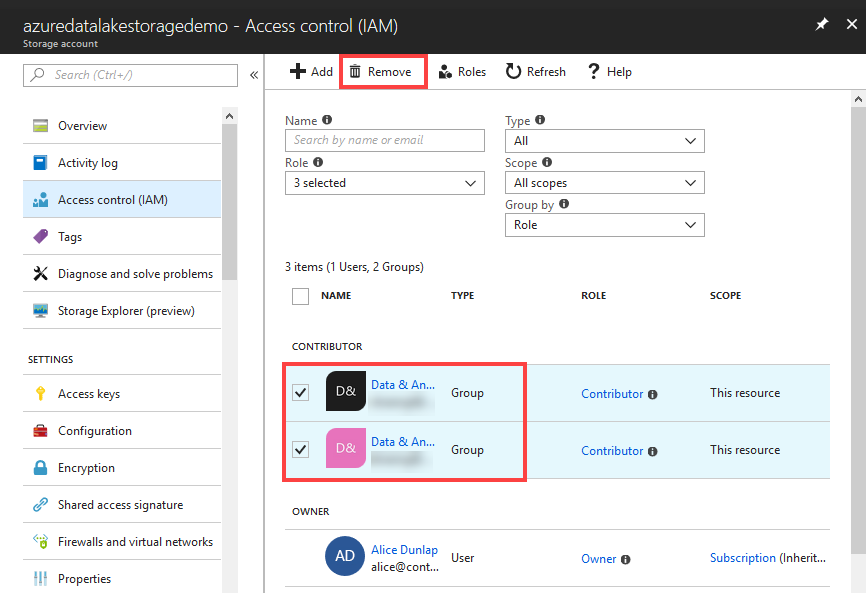

# Securing data in Azure Data Lake Storage Gen2

Azure Data Lake Storage Gen2 supports [authentication and authorization with Azure Active Directory (AD)](../common/storage-auth-aad.md). Using Azure AD you can grant groups of users access to data in the data lake file system using [role-based access control (RBAC)](../common/storage-auth-aad-rbac.md).

Securing data in Data Lake Storage is a three-step process:

1. Start by creating security groups. Azure AD security groups implement [role-based access control (RBAC)](/role-based-access-control/role-assignments-portal.md) which allow you to control security for your storage account.
2. Assign a role to files through Azure AD security groups to the Data Lake Storage account. This controls access to the Data Lake Storage account from the portal and management operations from the portal or APIs
3. Additionally, you can also set an individual IP address, IP range or virtual network for clients that can access the data in Data Lake Storage.

This article provides instructions on how to use the Azure portal to perform the above tasks.

## Prerequisites
Before you begin this tutorial, you must have the following:

* **An Azure subscription**. See [Get Azure free trial](https://azure.microsoft.com/pricing/free-trial/).
* **An Azure Data Lake Storage Gen2 account**. For instructions on how to create one, see [Create Azure Data Lake Storage Account](create-account.md)

## Create security groups in Azure Active Directory
For instructions on how to create Azure AD security groups and how to add users to the group, see [Managing security groups in Azure Active Directory](/active-directory/active-directory-groups-create-azure-portal.md).

> [!NOTE] 
> You can add both users and other groups to a group in Azure AD using the Azure portal. However, in order to add a service principal to a group, use [Azure AD’s PowerShell module](/active-directory/active-directory-accessmanagement-groups-settings-v2-cmdlets.md).
> 
> ```powershell
> # Get the desired group and service principal and identify the correct object IDs
> Get-AzureADGroup -SearchString "<group name>"
> Get-AzureADServicePrincipal -SearchString "<SPI name>"
> 
> # Add the service principal to the group
> Add-AzureADGroupMember -ObjectId <Group object ID> -RefObjectId <SPI object ID>
> ```
 
## Assign users or security groups to Data Lake Storage accounts
When you assign users or security groups to Data Lake Storage accounts, you control access to the management operations on the account using the Azure portal and Azure Resource Manager APIs. 

1. Open the Data Lake Storage account you want to configure.

2. Click **Access Control (IAM)** to list the subscription owners.

    

3. Click **Add** to add a new permission **Add permissions**.
4. Select a **Role** for the user/group. Select the [security group](../common/storage-auth-aad-rbac.md) you created earlier in Azure Active Directory. If you have a lot of users and groups, use the **Select** text box to filter on the group name.

    
   
	The **Owner** and **Contributor** role provide access to a variety of administration functions on the data lake account. For users who  interact with data, but still need to view account management information, you can add them to the **Reader** role. The scope of these roles is limited to the management operations related to the Data Lake Storage account.

4. If you want to add a group/user that is not listed in the **Add permissions** screen, you can invite them by typing their email address in the **Select** text box and then selecting them from the list.
   
	
   
5. Once you click **Save**, you should see the security group added to the account.
   
    

6. Your user/security group now has access to the Data Lake Storage account. If you want to provide access to specific users, you can add them to the security group. Similarly, if you want to revoke access for a user, you can remove them from the security group. You can also assign multiple security groups to an account. 

## Allow IPs or a virtual network for data access
Data Lake Storage enables you to further lock down access to your data store at network level. You can enable firewall, specify an IP address, or define an IP address range for your trusted clients. Once enabled, only clients that have the IP addresses within defined range can connect to the store.



## Remove security groups for a Data Lake Storage account
When you remove security groups from  Data Lake Storage accounts, you are only changing access to the management operations on the account using the Azure Portal and Azure Resource Manager APIs.

1. In your Data Lake Store account blade, click **Access Control (IAM)**. 

2. In the **Access Control (IAM)** blade, click the security group(s) you want to remove. Click **Remove**.

    

## Next steps
* [Set up clusters in HDInsight with Hadoop, Spark, Kafka, and more](quickstart-create-connect-hdi-cluster.md)