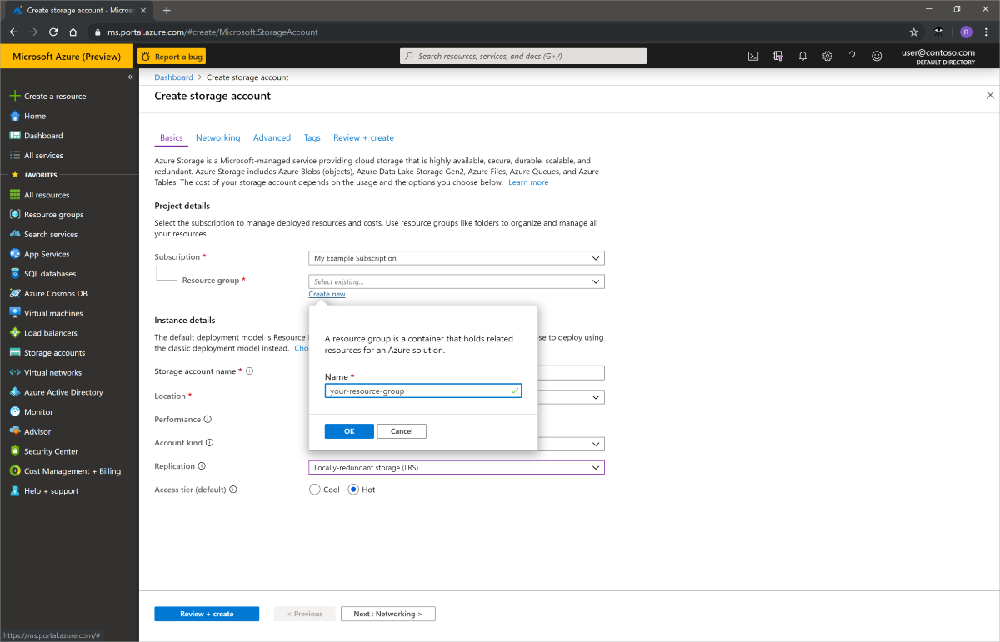
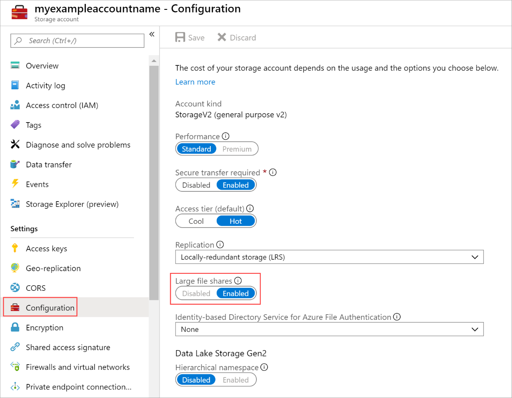

# Enable large file shares

Originally, file shares could only scale up to 5 TiB, now, with large file shares, they can scale up to 100 TiB. In order to scale up to 100 TiB, you must enable your storage account to use large file shares. You can either enable an existing account or create a new account to use large file shares.

## Prerequisites

If you don't have an Azure subscription, create a [free account](https://azure.microsoft.com/free/) before you begin.

## Restrictions

Large file share enabled accounts support LRS or ZRS. For now, large file share enabled accounts do not support GZRS, GRS, or RA-GRS. Enabling large file shares on an account is an irreversible process, once it is enabled your account cannot be converted to GZRS, GRS, or RA-GRS.

## Create a new storage account

Sign in to the [Azure portal](https://portal.azure.com).

1. In the Azure portal, select **All services**. In the list of resources, type **Storage Accounts**. As you begin typing, the list filters based on your input. Select **Storage Accounts**.
1. On the **Storage Accounts** window that appears, choose **Add**.
1. Select the subscription in which to create the storage account.
1. Under the **Resource group** field, select **Create new**. Enter a name for your new resource group, as shown in the following image.

    

1. Next, enter a name for your storage account. The name you choose must be unique across Azure. The name also must be between 3 and 24 characters in length, and can include numbers and lowercase letters only.
1. Select a location for your storage account, make sure it is [one of the regions supported for LFS](storage-files-planning.md#regional-availability).
1. Set the replication to Locally-redundant storage.
1. Leave these fields set to their default values:

   |Field  |Value  |
   |---------|---------|
   |Deployment model     |Resource Manager         |
   |Performance     |Standard         |
   |Account kind     |StorageV2 (general-purpose v2)         |
   |Access tier     |Hot         |

1. Select **Advanced** and select **Enabled** for **Large file shares**.
1. Select **Review + Create** to review your storage account settings and create the account.
1. Select **Create**.

## Enable on existing account

You can also enable large file shares on existing accounts. If you do this, then the account will no longer be able to use GZRS, GRS, or RA-GRS. This choice is irreversible on this account.

1. Open the [Azure portal](https://portal.azure.com) and navigate to the storage account you want to enable large file shares on.
1. Open the storage account and select **Configuration**.
1. Select **Enabled** on **Large file shares**, then select save.
1. Select **Overview** and select **Refresh**.

You've now enabled large file shares on your storage account.

If you receive the following error: "Large file shares are not available for the account yet." Then Please reach out to support.

## Create a large file share

Creating a large file share is almost identical to creating a standard file share. The main difference is that you can set a quota up to 100 TiB.

1. From your storage account, select **File shares**.
1. Select **+ File Share**.
1. Enter a name for your file share and the quota size you'd like, up to 100 TiB, then select **Create**. 

## Update existing file share