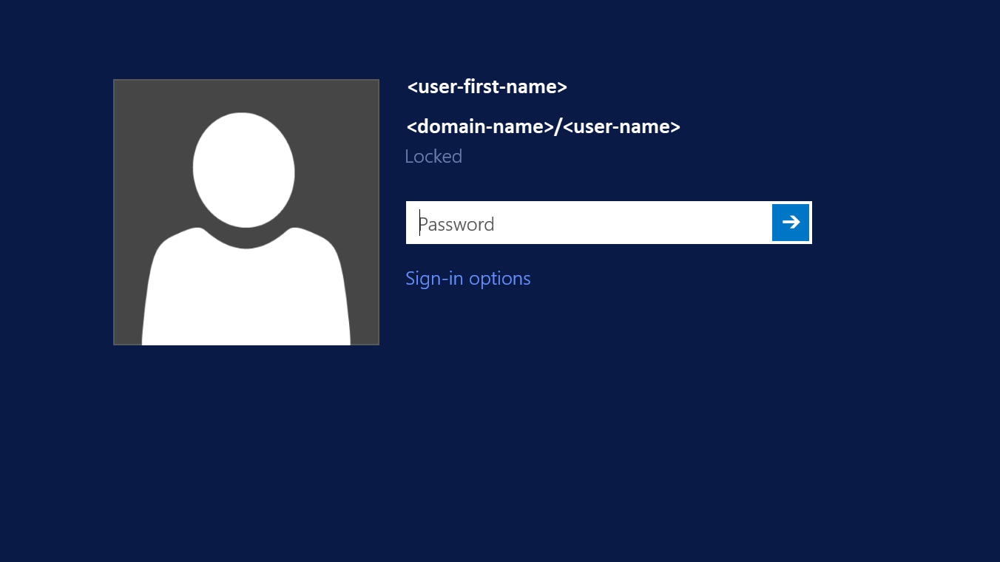

## 4. Mount a file share from a domain-joined VM

The following process verifies that your file share and access permissions were set up correctly and that you can access an Azure File share from a domain-joined VM. Be aware that the share level RBAC role assignment can take some time to be in effect. 

Sign in to the VM by using the Azure AD identity to which you have granted permissions, as shown in the following image. If you have enabled on-premises AD DS authentication for Azure Files, use your AD DS credentials. For Azure AD DS authentication, sign in with Azure AD credentials.



Use the following command to mount the Azure file share. Remember to replace the placeholder values with your own values. Because you've been authenticated, you don't need to provide the storage account key, the on-premises AD DS credentials, or the Azure AD DS credentials. Single sign-on experience is supported for authentication with either on-premises AD DS or Azure AD DS. If you run into issues mounting with AD DS credentials, refer to [Troubleshoot Azure Files problems in Windows](https://docs.microsoft.com/azure/storage/files/storage-troubleshoot-windows-file-connection-problems) for guidance.

```
net use <desired-drive-letter>: \\<storage-account-name>.file.core.windows.net\<share-name>
```

## Next steps

[5. Update the password of your storage account identity in AD DS](storage-files-identity-ad-ds-update-password.md)