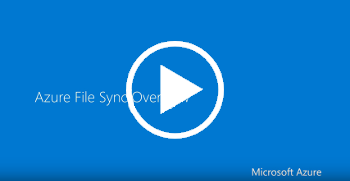

# What is Azure Files?
Azure Files offers fully managed file shares in the cloud that are accessible via the industry standard [Server Message Block (SMB) protocol](https://msdn.microsoft.com/library/windows/desktop/aa365233.aspx). Azure file shares can be mounted concurrently by cloud or on-premises deployments of Windows, Linux, and macOS. Additionally, Azure file shares can be cached on Windows Servers with Azure File Sync for fast access near where the data is being used.

## Videos
| Introducing Azure File Sync | Azure Files with Sync (Ignite 2019) |
|-|-|
|  |[!VIDEO https://www.youtube.com/embed/6E2p28XwovU]|

Here are some videos on the common use cases of Azure Files:
| Replace your file server with a serverless Azure File Share | Getting started with FSLogix profile containers on Azure Files in Windows Virtual Desktop leveraging AD authentication |
|-|-|
| [!VIDEO https://sec.ch9.ms/ch9/3358/0addac01-3606-4e30-ad7b-f195f3ab3358/ITOpsTalkAzureFiles_high.mp4]|[!VIDEO https://www.youtube.com/embed/9S5A1IJqfOQ] |

## Why Azure Files is useful
Azure file shares can be used to:

* **Replace or supplement on-premises file servers**:  
    Azure Files can be used to completely replace or supplement traditional on-premises file servers or NAS devices. Popular operating systems such as Windows, macOS, and Linux can directly mount Azure file shares wherever they are in the world. Azure file shares can also be replicated with Azure File Sync to Windows Servers, either on-premises or in the cloud, for performance and distributed caching of the data where it's being used. With the recent release of [Azure Files AD Authentication](storage-files-active-directory-overview.md), Azure file shares can continue to work with AD hosted on-premises for access control. 

* **"Lift and shift" applications**:  
    Azure Files makes it easy to "lift and shift" applications to the cloud that expect a file share to store file application or user data. Azure Files enables both the "classic" lift and shift scenario, where both the application and its data are moved to Azure, and the "hybrid" lift and shift scenario, where the application data is moved to Azure Files, and the application continues to run on-premises. 

* **Simplify cloud development**:  
    Azure Files can also be used in numerous ways to simplify new cloud development projects. For example:
    * **Shared application settings**:  
        A common pattern for distributed applications is to have configuration files in a centralized location where they can be accessed from many application instances. Application instances can load their configuration through the File REST API, and humans can access them as needed by mounting the SMB share locally.

    * **Diagnostic share**:  
        An Azure file share is a convenient place for cloud applications to write their logs, metrics, and crash dumps. Logs can be written by the application instances via the File REST API, and developers can access them by mounting the file share on their local machine. This enables great flexibility, as developers can embrace cloud development without having to abandon any existing tooling they know and love.

    * **Dev/Test/Debug**:  
        When developers or administrators are working on VMs in the cloud, they often need a set of tools or utilities. Copying such utilities and tools to each VM can be a time consuming exercise. By mounting an Azure file share locally on the VMs, a developer and administrator can quickly access their tools and utilities, no copying required.

## Key benefits
* **Shared access**. Azure file shares support the industry standard SMB protocol, meaning you can seamlessly replace your on-premises file shares with Azure file shares without worrying about application compatibility. Being able to share a file system across multiple machines, applications/instances is a significant advantage with Azure Files for applications that need shareability. 
* **Fully managed**. Azure file shares can be created without the need to manage hardware or an OS. This means you don't have to deal with patching the server OS with critical security upgrades or replacing faulty hard disks.
* **Scripting and tooling**. PowerShell cmdlets and Azure CLI  can be used to create, mount, and manage Azure file shares as part of the administration of Azure applications.You can create and manage Azure file shares using Azure portal and Azure Storage Explorer. 
* **Resiliency**. Azure Files has been built from the ground up to be always available. Replacing on-premises file shares with Azure Files means you no longer have to wake up to deal with local power outages or network issues. 
* **Familiar programmability**. Applications running in Azure can access data in the share via file [system I/O APIs](https://msdn.microsoft.com/library/system.io.file.aspx). Developers can therefore leverage their existing code and skills to migrate existing applications. In addition to System IO APIs, you can use [Azure Storage Client Libraries](https://msdn.microsoft.com/library/azure/dn261237.aspx) or the [Azure Storage REST API](/rest/api/storageservices/file-service-rest-api).

## Next Steps
* [Create Azure file Share](storage-how-to-create-file-share.md)
* [Connect and mount on Windows](storage-how-to-use-files-windows.md)
* [Connect and mount on Linux](storage-how-to-use-files-linux.md)
* [Connect and mount on macOS](storage-how-to-use-files-mac.md)
