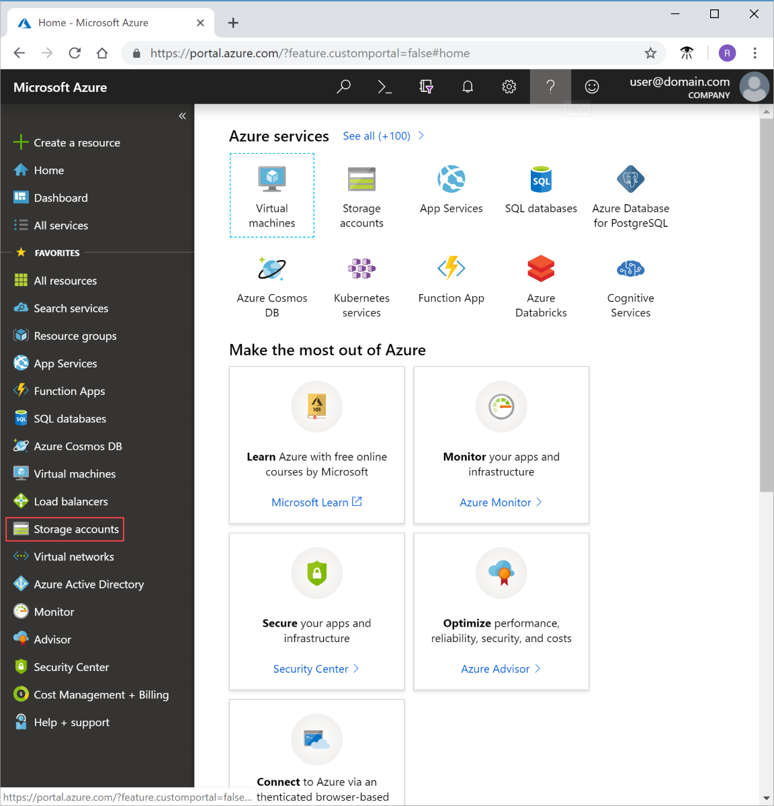
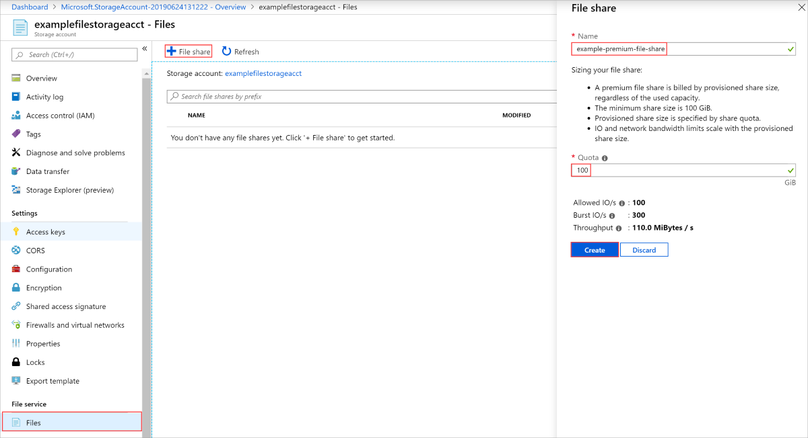

# How to create an Azure premium file share

The FileStorage (preview) storage account type represents a new tier for Azure Files, allowing you to create file shares with premium performance characteristics. These file shares are designed for high performance and enterprise scale applications, providing consistent low latency, high IOPS, and high throughput shares.

This article shows you how to create this new account type using the [Azure portal](https://portal.azure.com/).

## Prerequisites

To access Azure Storage, you'll need an Azure subscription. If you don't already have a subscription, then create a [free account](https://azure.microsoft.com/free/?WT.mc_id=A261C142F) before you begin.

## Create a premium file share using the Azure portal

### Sign in to Azure

Sign in to the [Azure portal](https://portal.azure.com/).

### Create a FileStorage (preview) storage account

Now you're ready to create your storage account.

Every storage account must belong to an Azure resource group. A resource group is a logical container for grouping your Azure services. When you create a storage account, you have the option to either create a new resource group, or use an existing resource group. This article shows how to create a new resource group.

1. In the Azure portal, select **Storage Accounts** on the left menu.

    

1. On the **Storage Accounts** window that appears, choose **Add**.
1. Select the subscription in which to create the storage account.
1. Under the **Resource group** field, select **Create new**. Enter a name for your new resource group, as shown in the following image.

1. Next, enter a name for your storage account. The name you choose must be unique across Azure. The name also must be between 3 and 24 characters in length, and can include numbers and lowercase letters only.
1. Select a location for your storage account, or use the default location.
1. For **Performance** select **Premium**.
1. Select **Account kind** and choose **FileStorage (preview)**.
1. Leave **Replication** set to its default value of **Locally-redundant storage (LRS)**.

    

1. Select **Review + Create** to review your storage account settings and create the account.
1. Select **Create**.

Once your storage account resource has been created, navigate to it.

### Create a premium file share

1. In the left menu for the storage account, scroll to the **File service** section, then select **Files (preview)**.
1. Select **+File share** to create a premium file share.
1. Enter a name and a desired quota for your file share, then select **Create**.

> [!NOTE]
> Provisioned share sizes is specified by the share quota, file shares are billed on the provisioned size, refer to the pricing page for more details.

   

### Clean up resources

If you would like to clean up the resources created in this article, you can simply delete the resource group. Deleting the resource group also deletes the associated storage account as well as any other resources associated with the resource group.

## Create a premium file share using PowerShell

### Create an account using PowerShell

First, install the latest version of the [PowerShellGet](https://docs.microsoft.com/powershell/gallery/installing-psget) module.

Then, sign in to your Azure subscription, create a resource group, and then create a storage account.

### Sign in to your Azure Subscription

Use the `Login-AzAccount` command and follow the on-screen directions to authenticate.

```powershell
Login-AzAccount
```

### Create a resource group

To create a new resource group with PowerShell, use the [New-AzResourceGroup](/powershell/module/az.resources/new-azresourcegroup) command:

```powershell
# put resource group in a variable so you can use the same group name going forward,
# without hardcoding it repeatedly
$resourceGroup = "storage-quickstart-resource-group"
$location = "westus2"
New-AzResourceGroup -Name $resourceGroup -Location $location
```

### Create a filestorage (preview) storage account

To create a FileStorage (preview) storage account from PowerShell, use the [New-AzStorageAccount](/powershell/module/az.storage/New-azStorageAccount) command:

```powershell
New-AzureRmStorageAccount -ResourceGroupName $resourceGroup -Name "fileshowto" -SkuName "Premium_LRS" -Location "westus" -Kind "FileStorage"
```

## Create a premium file share

Now that you have a FileStorage account, you can create a premium file share. Use the [New-AzStorageShare](/powershell/module/az.storage/New-AzStorageShare) cmdlet to create one.

```powershell
New-AzStorageShare `
   -Name myshare `
   -Context $storageAcct.Context
```

### Clean up resources

To remove the resource group and its associated resources, including the new storage account, use the [Remove-AzResourceGroup](/powershell/module/az.resources/remove-azresourcegroup) command: 

```powershell
Remove-AzResourceGroup -Name $resourceGroup
```

## Create a premium file share using Azure CLI

To start Azure Cloud Shell, sign in to the [Azure portal](https://portal.azure.com).

If you want to log into your local installation of the CLI, run the login command:

```cli
az login
```

### Add the CLI extension for Azure premium files

To interact with premium files using the CLI, you'll have to add an extension to your shell.

To do that, enter the following command by using either the Cloud Shell or a local shell: `az extension add --name storage-preview`

### Create a resource group

To create a new resource group with Azure CLI, use the [az group create](/cli/azure/group) command.

```azurecli-interactive
az group create `
    --name files-howto-resource-group `
    --location westus2
```

### Create a FileStorage (preview) storage account

To create a FileStorage (preview) storage account from the Azure CLI, use the [az storage account create](/cli/azure/storage/account) command.

```azurecli-interactive
az storage account create `
    --name fileshowto `
    --resource-group files-howto-resource-group `
    --location westus `
    --sku Premium_LRS `
    --kind FileStorage
```

### Get the storage account key

Storage account keys control access to resources in a storage account, in this article, we use the key in order to create a premium file share. The keys are automatically created when you create a storage account. You can get the storage account keys for your storage account by using the [az storage account keys list](/cli/azure/storage/account/keys) command:

```azurecli-interactive 
STORAGEKEY=$(az storage account keys list \
    --resource-group "myResourceGroup" \
    --account-name $STORAGEACCT \
    --query "[0].value" | tr -d '"')
```

### Create a premium file share

Now that you have a FileStorage account, you can create a premium file share. Use the [az storage share create](/cli/azure/storage/share) command to create one.

```azurecli-interactive
az storage share create \
    --account-name $STORAGEACCT \
    --account-key $STORAGEKEY \
    --name "myshare" 
```

### Clean up resources

To remove the resource group and its associated resources, including the new storage account, use the [az group delete](/cli/azure/group) command.

```azurecli-interactive
az group delete --name myResourceGroup
```

## Next steps

In this article, you've created a premium files storage account. To learn about the performance this account offers, continue to the performance tier section of the planning guide.

> [!div class="nextstepaction"]
> [File share performance tiers](storage-files-planning.md#file-share-performance-tiers)