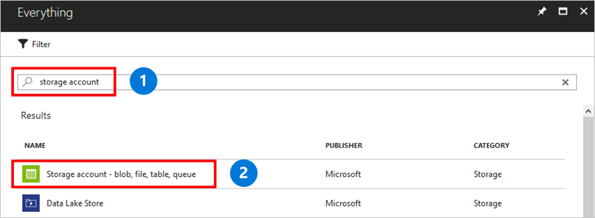
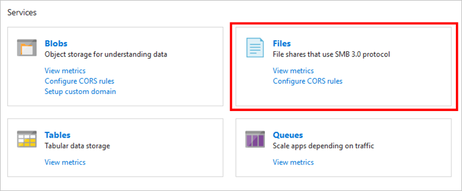
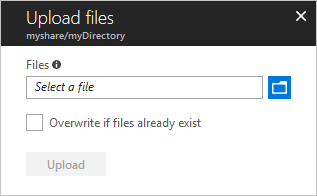

# Managing Azure file shares with the Azure portal 
[Azure Files](storage-files-introduction.md) is Microsoft's easy to use cloud file system. Azure File shares can be mounted in Windows and Windows Server. This guide walks you through the basics of working with Azure file shares using the [Azure portal](https://portal.azure.com). Learn how to:
- Create a resource group and a storage account
- Create an Azure file share within the storage
- Create a directory within the share, and upload and download files to it
- Work with share snapshots

If you don't have an Azure subscription, you can create a [free account](https://azure.microsoft.com/free/?WT.mc_id=A261C142F) before you begin.

## Create a resource group
A resource group is a logical container into which Azure resources are deployed and managed. If you don't already have an Azure resource group, you can create a new one by clicking the resource groups item on the left-hand navigation bar.

On the main resource group pane, click the **add** button to create a new resource group. 

In the resulting create resource group pane, enter the name of the resource group we will use in this guide, **myResourceGroup**.

 

## Create a storage account
A storage account is a shared pool of storage in which you can deploy Azure file share, or other storage resources such as blobs or queues. A storage account can contain an unlimited number of shares, and a share can store an unlimited number of files, up to the capacity limits of the storage account.

In the resource group pane, click the entry for the **myResourceGroup** you created in the previous section (you may have to click the refresh button in the resource group pane). In the resulting resource group contents pane, you add a new storage account by clicking the add button and searching for "storage account" the resulting search box (you may have to hit the "enter" key to execute a search).

Click the create button on the storage account information pane. This opens the create storage account pane, where you fill in the following information:

- **Name**: This is the name of the storage account. A storage account name must be globally unique, so in this guide we use the name `mystorageaccount<random number>` (where `<random number>` is a number of your choosing).
- **Deployment model**: This allows you to select whether you want an Azure Resource Manager storage account deployment or a classic storage account deployment for legacy reasons. Since this is a new deployment, leave this selector on the default *Resource Manager* selection. To learn more about the differences between Azure Resource Manager and classic deployment, see [Understand deployment models and the state of your resources](../../azure-resource-manager/resource-manager-deployment-model.md).
- **Account kind**: This allows you to select the version of the storage account to be deployed. The default value is *Storage (general purpose v1)*, however we recommend all new accounts be deployed with the *StorageV2 (general purpose v2)*. All new Azure storage features will be added to the v2 version of the storage account. To learn more about the differences between *Storage (general purpose v2)*, *Storage (general purpose v1)*, and *Blob storage* accounts, see [Understanding Azure storage accounts](../common/storage-account-options.md?toc=%2fazure%2fstorage%2ffiles%2ftoc.json).
- **Performance**: This selects the default storage media type for the storage account. *Standard storage*, the default option, is backed by by classic rotational hard disks (HDDs), while *premium storage* is instead backed by solid state disks (SSDs), for higher performance. Azure Files currently only supports standard storage; even if you select premium storage, your file share will be stored on standard storage.
- **Replication**: This refers to the redundancy setting of the storage account. For this purpose of this guide, select *Locally-redundant storage (LRS)*, which is the cheapest option. To learn more about redundancy options supported by Azure Files, see the [Data redundancy](storage-files-planning.md#data-redundancy) section of the Planning for an Azure Files deployment guide.
- **Access tier (default)**: This selects the default access tier for new created storage accounts. Azure Files currently only supports the *Hot* access tier; even if you select the *Cold* access tier, your file share will be billed according to the *Hot* access tier.
- **Secure transfer required**: This will require all access to your storage account is encrypted in-transit. For the purposes of Azure Files, this will ensure that only HTTPS connections and mounts with SMB 3.0 with encryption are allowed. The default option is *Disabled*, but we recommend you always select *Enabled* unless you have a specific requirement for HTTP or SMB 2.1/SMB 3.0 without encryption. To learn more about this option, see [Understanding encryption in-transit](../common/storage-require-secure-transfer.md?toc=%2fazure%2fstorage%2ffiles%2ftoc.json)
- **Subscription**: The subscription to create the storage account in. If you have access to only one subscription, there is nothing to do here. If you have access to multiple subscriptions, ensure that the selected subscription matches the one you created the resource group in.
- **Resource group**: The resource group to create the storage account in. By default, *Create new* is selected giving you an empty text box in which to enter the name of the new resource group name. Since we've already created a resource group, select *Use existing* and select *myResourceGroup* (which is the name of the resource group we created in the previous step) from the list.
- **Location**: The Azure region in which to create the storage account. This need not match the Azure region you selected when creating the resource group. For the purposes of this guide, select *East US*.
- **Virtual networks**: Virtual networks allow you to limit access to the storage resources in your storage account from unauthorized IP addresses or services. For the purposes of this guide, leave this option set to *Disabled*. To learn more about Virtual networks, see [Understanding Azure storage firewalls and virtual networks](../common/storage-network-security?toc=%2fazure%2fstorage%2ffiles%2ftoc.json).

Click the **Create** button to crate the storage account. 

## Create a file share
Now you can create your first Azure file share. You can do this by navigating into the storage account you created in your resource group (you may need to click the refresh button to see the storage account in the resource group).

Inside the storage account, select **Files** section.

Click the **new file share** button.

 
In the resulting new file share drop-down, fill in the following information:

- **Name**: The name of the file share. For the purposes of this guide, use the name `myshare`.
- **Quota**: The maximum size of the file share, in GiB. This is an optional field; leaving it blank will set the quota to the [maximum size of a file share](storage-files-scale-targets.md).

Click **OK** to create the Azure file share.

## Manipulating the contents of the Azure file share
Now that you have created an Azure file share, you can mount the file share with SMB on [Windows](storage-how-to-use-files-windows.md), [Linux](storage-how-to-use-files-linux.md), or [macOS](storage-how-to-use-files-mac.md). Alternatively, you can manipulate your Azure file share with the Azure PowerShell module. This is advantageous over mounting the file share with SMB, because all requests made with PowerShell are made with the File REST API enabling you to create, modify, and delete files and directories in your file share from:

- The Azure portal.
- Clients which cannot mount SMB shares, such as on-premises clients which do not have port 445 unblocked.
- Serverless scenarios, such as in [Azure Functions](../../azure-functions/functions-overview.md).

### Create directory
To create a new directory named *myDirectory* at the root of your Azure file share, click the **Add directory** button on pane for your Azure file share.

In resulting new directory drop, fill in the following information:

- **Name**: The name of the directory to be created. For the purposes of this guide, use *myDirectory*.

Click the **OK** to create the directory.

Now that directory has been created, click into the new directory.

### Upload a file 
To demonstrate uploading a file, you first need to create or select a file to be uploaded. You may do this by whatever means you see fit. Once you've selected the file you would like to, click the **Upload** button on the directory you've selected.

The resulting upload pane will open to the right-hand size of the screen. To pop open the file upload dialog, click the button on the side of the *Select a file* textbox. 

Select the file you would like to upload in the opened file upload dialog. The file upload dialog will look differently depending on the operating system and browser you are using (this screenshot is a file upload dialog on Windows). Click **Open** on the file upload dialog.

Click the **Upload** button to upload the file to your file share.

Depending on the file uploaded, this may take some time. When the file is finished uploading, it will appear in the directory.

### Download a file
You can download a copy of the file you uploaded by right clicking on the file. After clicking the download button, the exact experience will depend on the operating system and browser you are using.

 

## Create and modify share snapshots (preview)
One additional useful task you can do with an Azure file share is to create share snapshots (preview). A snapshot preserves a point in time for an Azure file share. Share snapshots are similar to operating system technologies you may already be familiar with such as:
- [Volume Shadow Copy Service (VSS)](https://docs.microsoft.com/previous-versions/windows/it-pro/windows-server-2008-R2-and-2008/ee923636) for Windows file systems such as NTFS and ReFS
- [Logical Volume Manager (LVM)](https://en.wikipedia.org/wiki/Logical_Volume_Manager_(Linux)#Basic_functionality) snapshots for Linux systems
- [Apple File System (APFS)](https://developer.apple.com/library/content/documentation/FileManagement/Conceptual/APFS_Guide/Features/Features.html) snapshots for macOS. 

You can create a snapshot for a share by clicking on the **Snapshot** button at the root of the file share.

On the drop-down menu for snapshots, click **Create a snapshot**. 

### List and browse a share snapshot
You can browse the contents of the share snapshot by right-clicking on the share and selecting **View snapshots**. 

The resulting pane will show the snapshots for this share. Click on a share snapshot to browse it.

### Restore from a share snapshot
To exercise a restoring a file from a share snapshot, navigate back to the live Azure file share, and right-click on the file we uploaded above, and click **Delete**.

[Navigate to the share snapshot](#list-and-browse-a-share-snapshot) and to the specific file we deleted (`myDirectory\SampleUpload.txt`). Right-click on the file, and click **Restore**.

A pop-up will appear giving you a choice between restoring the file as a copy or overwriting the original file. Since we have deleted the original file, we can select **Overwrite original file** to restore the file as it was before we deleted it. Click **OK** to restore the file to the Azure file share.

You can verify that `SampleUpload.txt` has been successfully restored to the live Azure file share.

### Delete a share snapshot
To delete a share snapshot, [navigate to the share snapshot](#list-and-browse-a-share-snapshot). Click the checkbox next to the name of the share snapshot (1), and select the **Delete** button (2).

## Clean up resources
When you are done, you can delete the resource group, which will delete the storage account, Azure file share inside the storage account, and any other resources you may have deployed inside the resource group.

Navigate to the resource group, and select the **Delete resource group**.

To confirm the resource group deletion, type the resource group name (*myResourceGroup*) in the resulting confirmation dialog. 

Click the **Delete** button to finish the delete operation.

## Next steps
- [Managing file shares with the Azure PowerShell](storage-how-to-use-files-powershell.md)
- [Managing file shares with Azure CLI](storage-quickstart-files-cli.md)
- [Planning for an Azure Files deployment](storage-files-planning.md)