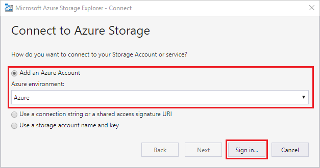
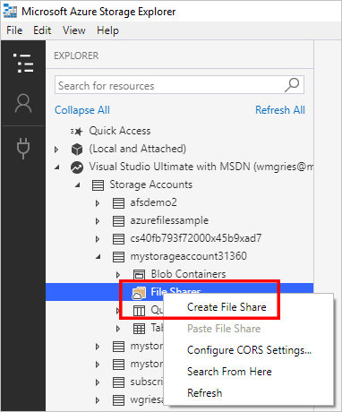
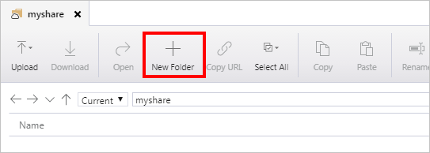

# Quickstart: Create and manage Azure file shares with Azure Storage Explorer
This guide walks you through the basics of working with [Azure file shares](storage-files-introduction.md) with the Azure Storage Explorer. Azure file shares are just like other file shares, but stored in the cloud and backed by the Azure platform. Azure File shares support the industry standard SMB protocol and enable file sharing across multiple machines, applications, and instances. 

The Azure Storage Explorer is a popular client tool that's available for Windows, macOS, and Linux. You can use Storage Explorer to manage Azure file shares and other storage resources.

## Prerequisites
This quickstart requires Storage Explorer to be installed. To download and install it, go to [Azure Storage Explorer](https://azure.microsoft.com/features/storage-explorer/).

If you don't have an Azure subscription, you can create a [free account](https://azure.microsoft.com/free/?WT.mc_id=A261C142F) before you begin.

## Create a storage account
You can't use Storage Explorer to create new resources. For the purposes of this demo, create the storage account in the [Azure portal](https://portal.azure.com/). 

[!INCLUDE [storage-files-create-storage-account-portal](../../../includes/storage-files-create-storage-account-portal.md)]

## Connect Storage Explorer to Azure resources
When you first start Storage Explorer, the **Microsoft Azure Storage Explorer - Connect** window appears. Storage Explorer provides several ways to connect to storage accounts: 

- **Sign in by using your Azure account**: You can sign in by using the user credentials for your organization or your Microsoft account. 
- **Connect to a specific storage account by using a connection string or SAS token**: A connection string is a special string that contains a storage account name and storage account key/SAS token. With the token, Storage Explorer directly accesses the storage account (rather than simply seeing all the storage accounts in an Azure account). To learn more about connection strings, see [Configure Azure storage connection strings](../common/storage-configure-connection-string.md?toc=%2fazure%2fstorage%2ffiles%2ftoc.json).
- **Connect to a specific storage account by using a storage account name and key**: Use the storage account name and the key for your storage account to connect to Azure storage.

For the purposes of this quickstart, sign in by using your Azure account. Select **Add an Azure Account**, and then select **Sign in**. Follow the prompts to sign in to your Azure account.

### Create a file share
To create your first Azure file share in the `storageacct<random number>`  storage account:

1. Expand the storage account that you created.
2. Right-click **File Shares**, and then select **Create File Share**.  
    

3. For the file share, enter *myshare*, and then press Enter.

> [!IMPORTANT]  
> Share names can contain only lowercase letters, numbers, and single hyphens (but they can't start with a hyphen). For complete details about naming file shares and files, see [Naming and referencing shares, directories, files, and metadata](https://docs.microsoft.com/rest/api/storageservices/Naming-and-Referencing-Shares--Directories--Files--and-Metadata).

After the file share is created, a tab for your file share opens in the right pane. 

## Use your Azure file share
Now that you have created an Azure file share, you can mount the file share with SMB on [Windows](storage-how-to-use-files-windows.md), [Linux](storage-how-to-use-files-linux.md), or [macOS](storage-how-to-use-files-mac.md). Alternatively, you can work with your Azure file share by using Azure Storage Explorer. The advantage of using Azure Storage Explorer instead of mounting the file share by using SMB is that all requests that are made with Azure Storage Explorer are made by using the File REST API. You can use the File REST API to create, modify, and delete files and directories on clients that don't have SMB access.

### Create a directory
Adding a directory provides a hierarchical structure for managing your file share. You can create multiple levels in your directory. But, you must ensure that parent directories exist before you create subdirectories. For example, for the path myDirectory/mySubDirectory, you must create the directory *myDirectory* first. Then, you can create *mySubDirectory*. 

1. On the tab for the file share, on the top menu, select the **New Folder** button. The **Create New Directory** pane opens.
    

2. For the directory name, enter *myDirectory*, and then select **OK**. 

The *myDirectory* directory is listed on the tab for the *myshare* file share.

### Upload a file 
You can upload a file from your local machine to the new directory in your file share. You can upload an entire folder or a single file.

1. In the top menu, select **Upload**. This gives you the option to upload a folder or a file.
2. Select **Upload File**, and then select a file to upload from your local machine.
3. In **Upload to a directory**, enter *myDirectory*, and then select **Upload**. 

When you are finished, the file appears in the list in the *myDirectory* pane.

### Download a file
To download a copy of a file from your file share, right-click the file, and then select **Download**. Choose where you want to put the file on your local machine, and then select **Save**.

The progress of the download appears in the **Activities** pane at the bottom of the window.

## Clean up resources
You can't use Storage Explorer to remove resources. To clean up from this quickstart, you can use the [Azure portal](https://portal.azure.com/). 

[!INCLUDE [storage-files-clean-up-portal](../../../includes/storage-files-clean-up-portal.md)]

## Next steps
- [Manage file shares with the Azure portal](storage-how-to-use-files-portal.md)
- [Manage file shares with Azure PowerShell](storage-how-to-use-files-powershell.md)
- [Manage file shares with Azure CLI](storage-how-to-use-files-cli.md)
- [Plan for an Azure Files deployment](storage-files-planning.md)