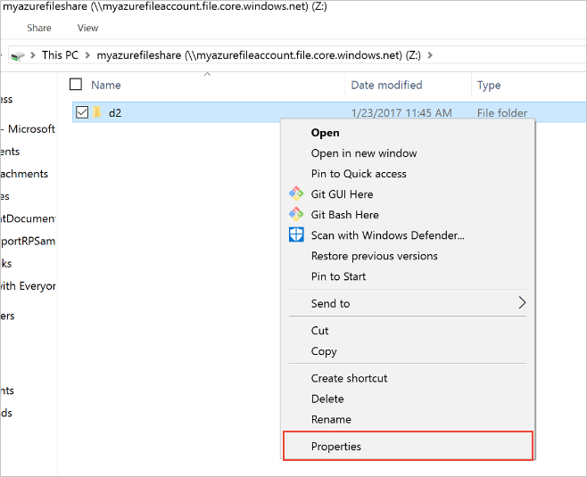
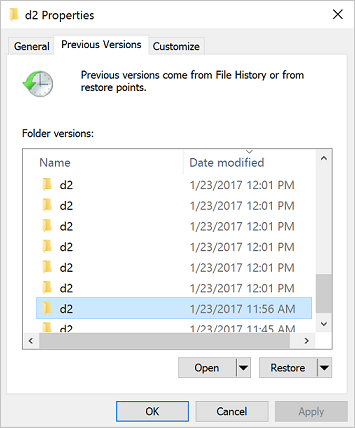
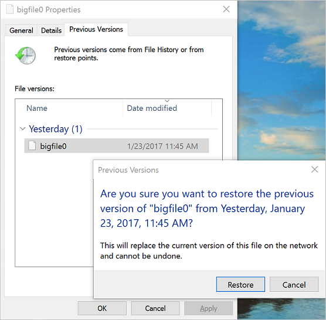

# Use an Azure file share with Windows
[Azure Files](storage-files-introduction.md) is Microsoft's easy-to-use cloud file system. Azure file shares can be seamlessly used in Windows and Windows Server. This article discusses the considerations for using an Azure file share with Windows and Windows Server.

In order to use an Azure file share outside of the Azure region it is hosted in, such as on-premises or in a different Azure region, the OS must support SMB 3.0. 

You can use Azure file shares on a Windows installation that is running either in an Azure VM or on-premises. The following table illustrates which OS versions support accessing file shares in which environment:

| Windows version        | SMB version | Mountable in Azure VM | Mountable on-premises |
|------------------------|-------------|-----------------------|-----------------------|
| Windows Server 2019 | SMB 3.0 | Yes | Yes |
| Windows 10<sup>1</sup> | SMB 3.0 | Yes | Yes |
| Windows Server semi-annual channel<sup>2</sup> | SMB 3.0 | Yes | Yes |
| Windows Server 2016 | SMB 3.0 | Yes | Yes |
| Windows 8.1 | SMB 3.0 | Yes | Yes |
| Windows Server 2012 R2 | SMB 3.0 | Yes | Yes |
| Windows Server 2012 | SMB 3.0 | Yes | Yes |
| Windows 7<sup>3</sup> | SMB 2.1 | Yes | No |
| Windows Server 2008 R2<sup>3</sup> | SMB 2.1 | Yes | No |

<sup>1</sup>Windows 10, versions 1507, 1607, 1709, 1803, 1809, 1903, and 1909.  
<sup>2</sup>Windows Server, versions 1809, 1903, and 1909.  
<sup>3</sup>Regular Microsoft support for Windows 7 and Windows Server 2008 R2 has ended. It is possible to purchase additional support for security updates only through the [Extended Security Update (ESU) program](https://support.microsoft.com/help/4497181/lifecycle-faq-extended-security-updates). We strongly recommend migrating off of these operating systems.

> [!Note]  
> We always recommend taking the most recent KB for your version of Windows.

## Prerequisites 
* **Storage account name**: To mount an Azure file share, you will need the name of the storage account.

* **Storage account key**: To mount an Azure file share, you will need the primary (or secondary) storage key. SAS keys are not currently supported for mounting.

* **Ensure port 445 is open**: The SMB protocol requires TCP port 445 to be open; connections will fail if port 445 is blocked. You can check to see if your firewall is blocking port 445 with the `Test-NetConnection` cmdlet. You can learn about [various ways to workaround blocked port 445 here](https://docs.microsoft.com/azure/storage/files/storage-troubleshoot-windows-file-connection-problems#cause-1-port-445-is-blocked).

    The following PowerShell code assumes you have the Azure PowerShell module installed, see [Install Azure PowerShell module](https://docs.microsoft.com/powershell/azure/install-az-ps) for more information. Remember to replace `<your-storage-account-name>` and `<your-resource-group-name>` with the relevant names for your storage account.

    ```powershell
    $resourceGroupName = "<your-resource-group-name>"
    $storageAccountName = "<your-storage-account-name>"

    # This command requires you to be logged into your Azure account, run Login-AzAccount if you haven't
    # already logged in.
    $storageAccount = Get-AzStorageAccount -ResourceGroupName $resourceGroupName -Name $storageAccountName

    # The ComputerName, or host, is <storage-account>.file.core.windows.net for Azure Public Regions.
    # $storageAccount.Context.FileEndpoint is used because non-Public Azure regions, such as sovereign clouds
    # or Azure Stack deployments, will have different hosts for Azure file shares (and other storage resources).
    Test-NetConnection -ComputerName ([System.Uri]::new($storageAccount.Context.FileEndPoint).Host) -Port 445
    ```

    If the connection was successful, you should see the following output:

    ```
    ComputerName     : <storage-account-host-name>
    RemoteAddress    : <storage-account-ip-address>
    RemotePort       : 445
    InterfaceAlias   : <your-network-interface>
    SourceAddress    : <your-ip-address>
    TcpTestSucceeded : True
    ```

    > [!Note]  
    > The above command returns the current IP address of the storage account. This IP address is not guaranteed to remain the same, and may change at any time. Do not hardcode this IP address into any scripts, or into a firewall configuration. 

## Using an Azure file share with Windows
To use an Azure file share with Windows, you must either mount it, which means assigning it a drive letter or mount point path, or access it via its [UNC path](https://msdn.microsoft.com/library/windows/desktop/aa365247.aspx). 

This article uses the storage account key to access the file share. A storage account key is an administrator key for a storage account, including administrator permissions to all files and folders within the file share you're accessing, and for all file shares and other storage resources (blobs, queues, tables, etc.) contained within your storage account. If this is not sufficient for your workload, [Azure File Sync](storage-sync-files-planning.md) may be used, or you may use [identity-based authentication over SMB](storage-files-active-directory-overview.md).

A common pattern for lifting and shifting line-of-business (LOB) applications that expect an SMB file share to Azure is to use an Azure file share as an alternative for running a dedicated Windows file server in an Azure VM. One important consideration for successfully migrating a line-of-business application to use an Azure file share is that many line-of-business applications run under the context of a dedicated service account with limited system permissions rather than the VM's administrative account. Therefore, you must ensure that you mount/save the credentials for the Azure file share from the context of the service account rather than your administrative account.

### Mount the Azure file share

The Azure portal provides you with a script that you can use to mount your file share. We recommend using this provided script.

To get this script:

1. Sign in to the [Azure portal](https://portal.azure.com/).
1. Navigate to the storage account that contains the file share you'd like to mount.
1. Select **File shares**.
1. Select the file share you'd like to mount.

    :::image type="content" source="media/storage-how-to-use-files-windows/select-file-shares.png" alt-text="example":::

1. Select **Connect**.

    :::image type="content" source="media/storage-how-to-use-files-windows/file-share-connect-icon.png" alt-text="Screenshot of the connect icon for your file share.":::

1. Select the drive letter to mount the share to.
1. Copy the provided script.

    :::image type="content" source="media/storage-how-to-use-files-windows/files-portal-mounting-cmdlet-resize.png" alt-text="Example text":::

1. Paste the script into a shell on the host you'd like to mount the file share to, and run it.

You have now mounted your Azure file share.

### Mount the Azure file share with File Explorer
> [!Note]  
> Note that the following instructions are shown on Windows 10 and may differ slightly on older releases. 

1. Open File Explorer. This can be done by opening from the Start Menu, or by pressing Win+E shortcut.

1. Navigate to the **This PC** item on the left-hand side of the window. This will change the menus available in the ribbon. Under the Computer menu, select **Map network drive**.
    
    

1. Select the drive letter and enter the UNC path, the UNC path format is `\\<storageAccountName>.file.core.windows.net\<fileShareName>`. For example: `\\anexampleaccountname.file.core.windows.net\example-share-name`.
    
    

1. Use the storage account name prepended with `AZURE\` as the username and a storage account key as the password.
    
    

1. Use Azure file share as desired.
    
    

1. When you are ready to dismount the Azure file share, you can do so by right-clicking on the entry for the share under the **Network locations** in File Explorer and selecting **Disconnect**.

### Accessing share snapshots from Windows
If you have taken a share snapshot, either manually or automatically through a script or service like Azure Backup, you can view previous versions of a share, a directory, or a particular file from file share on Windows. You can take a share snapshot from the [Azure portal](storage-how-to-use-files-portal.md), [Azure PowerShell](storage-how-to-use-files-powershell.md), and [Azure CLI](storage-how-to-use-files-cli.md).

#### List previous versions
Browse to the item or parent item that needs to be restored. Double-click to go to the desired directory. Right-click and select **Properties** from the menu.



Select **Previous Versions** to see the list of share snapshots for this directory. The list might take a few seconds to load, depending on the network speed and the number of share snapshots in the directory.



You can select **Open** to open a particular snapshot. 


#### Restore from a previous version
Select **Restore** to copy the contents of the entire directory recursively at the share snapshot creation time to the original location.

  

## Securing Windows/Windows Server
In order to mount an Azure file share on Windows, port 445 must be accessible. Many organizations block port 445 because of the security risks inherent with SMB 1. SMB 1, also known as CIFS (Common Internet File System), is a legacy file system protocol included with Windows and Windows Server. SMB 1 is an outdated, inefficient, and most importantly insecure protocol. The good news is that Azure Files does not support SMB 1, and all supported versions of Windows and Windows Server make it possible to remove or disable SMB 1. We always [strongly recommend](https://aka.ms/stopusingsmb1) removing or disabling the SMB 1 client and server in Windows before using Azure file shares in production.

The following table provides detailed information on the status of SMB 1 each version of Windows:

| Windows version                           | SMB 1 default status | Disable/Remove method       | 
|-------------------------------------------|----------------------|-----------------------------|
| Windows Server 2019                       | Disabled             | Remove with Windows feature |
| Windows Server, versions 1709+            | Disabled             | Remove with Windows feature |
| Windows 10, versions 1709+                | Disabled             | Remove with Windows feature |
| Windows Server 2016                       | Enabled              | Remove with Windows feature |
| Windows 10, versions 1507, 1607, and 1703 | Enabled              | Remove with Windows feature |
| Windows Server 2012 R2                    | Enabled              | Remove with Windows feature | 
| Windows 8.1                               | Enabled              | Remove with Windows feature | 
| Windows Server 2012                       | Enabled              | Disable with Registry       | 
| Windows Server 2008 R2                    | Enabled              | Disable with Registry       |
| Windows 7                                 | Enabled              | Disable with Registry       | 

### Auditing SMB 1 usage
> Applies to Windows Server 2019, Windows Server semi-annual channel (versions 1709 and 1803), Windows Server 2016, Windows 10 (versions 1507, 1607, 1703, 1709, and 1803), Windows Server 2012 R2, and Windows 8.1

Before removing SMB 1 in your environment, you may wish to audit SMB 1 usage to see if any clients will be broken by the change. If any requests are made against SMB shares with SMB 1, an audit event will be logged in the event log under `Applications and Services Logs > Microsoft > Windows > SMBServer > Audit`. 

> [!Note]  
> To enable auditing support on Windows Server 2012 R2 and Windows 8.1, install at least [KB4022720](https://support.microsoft.com/help/4022720/windows-8-1-windows-server-2012-r2-update-kb4022720).

To enable auditing, execute the following cmdlet from an elevated PowerShell session:

```powershell
Set-SmbServerConfiguration –AuditSmb1Access $true
```

### Removing SMB 1 from Windows Server
> Applies to Windows Server 2019, Windows Server semi-annual channel (versions 1709 and 1803), Windows Server 2016, Windows Server 2012 R2

To remove SMB 1 from a Windows Server instance, execute the following cmdlet from an elevated PowerShell session:

```powershell
Remove-WindowsFeature -Name FS-SMB1
```

To complete the removal process, restart your server. 

> [!Note]  
> Starting with Windows 10 and Windows Server version 1709, SMB 1 is not installed by default and has separate Windows features for the SMB 1 client and SMB 1 server. We always recommend leaving both the SMB 1 server (`FS-SMB1-SERVER`) and the SMB 1 client (`FS-SMB1-CLIENT`) uninstalled.

### Removing SMB 1 from Windows client
> Applies to Windows 10 (versions 1507, 1607, 1703, 1709, and 1803) and Windows 8.1

To remove SMB 1 from your Windows client, execute the following cmdlet from an elevated PowerShell session:

```powershell
Disable-WindowsOptionalFeature -Online -FeatureName SMB1Protocol
```

To complete the removal process, restart your PC.

### Disabling SMB 1 on legacy versions of Windows/Windows Server
> Applies to Windows Server 2012, Windows Server 2008 R2, and Windows 7

SMB 1 cannot be completely removed on legacy versions of Windows/Windows Server, but it can be disabled through the Registry. To disable SMB 1, create a new registry key `SMB1` of type `DWORD` with a value of `0` under `HKEY_LOCAL_MACHINE > SYSTEM > CurrentControlSet > Services > LanmanServer > Parameters`.

You can easily accomplish this with the following PowerShell cmdlet as well:

```powershell
Set-ItemProperty -Path "HKLM:\SYSTEM\CurrentControlSet\Services\LanmanServer\Parameters" SMB1 -Type DWORD -Value 0 –Force
```

After creating this registry key, you must restart your server to disable SMB 1.

### SMB resources
- [Stop using SMB 1](https://blogs.technet.microsoft.com/filecab/2016/09/16/stop-using-smb1/)
- [SMB 1 Product Clearinghouse](https://blogs.technet.microsoft.com/filecab/2017/06/01/smb1-product-clearinghouse/)
- [Discover SMB 1 in your environment with DSCEA](https://blogs.technet.microsoft.com/ralphkyttle/2017/04/07/discover-smb1-in-your-environment-with-dscea/)
- [Disabling SMB 1 through Group Policy](https://blogs.technet.microsoft.com/secguide/2017/06/15/disabling-smbv1-through-group-policy/)

## Next steps
See these links for more information about Azure Files:
- [Planning for an Azure Files deployment](storage-files-planning.md)
- [FAQ](../storage-files-faq.md)
- [Troubleshooting on Windows](storage-troubleshoot-windows-file-connection-problems.md)      
