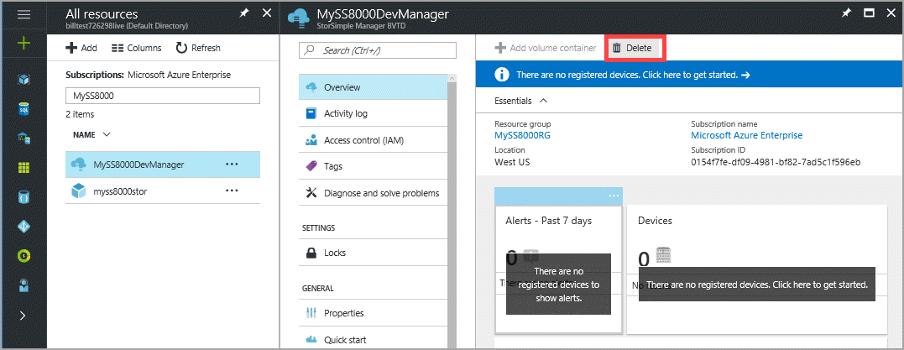
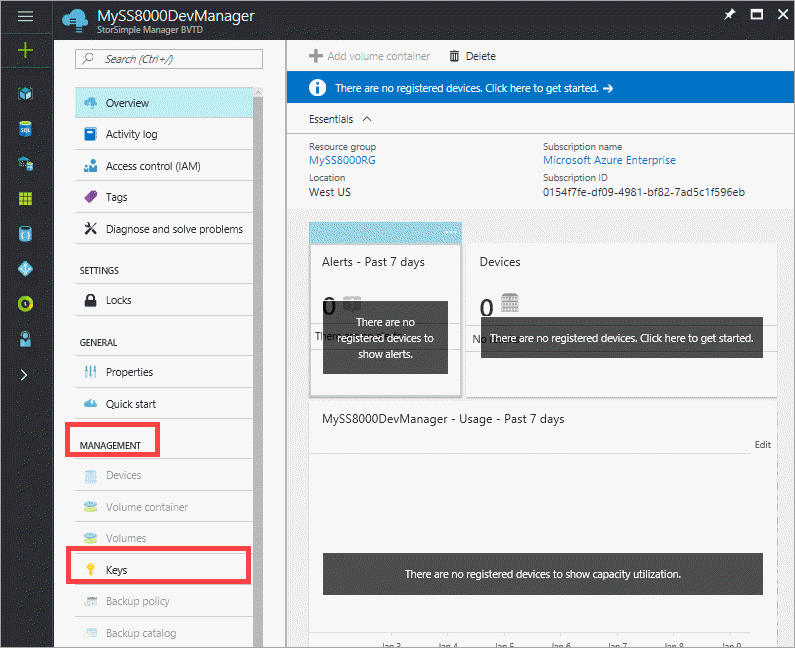
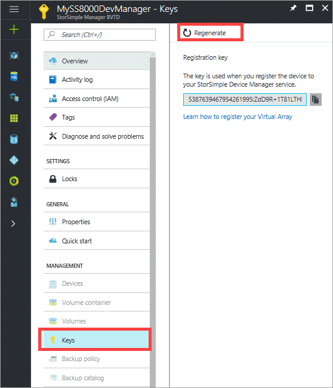
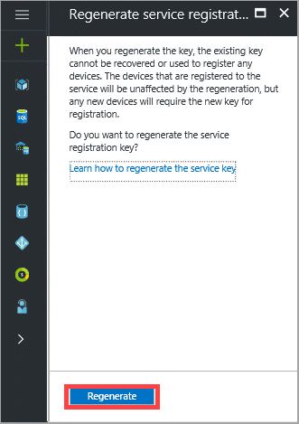

# Deploy the StorSimple Device Manager service for StorSimple 8000 series devices

## Overview

The StorSimple Device Manager service runs in Microsoft Azure and connects to multiple StorSimple devices. After you create the service, you can use it to manage all the devices that are connected to the StorSimple Device Manager service from a single, central location, thereby minimizing administrative burden.

This tutorial describes the steps required for the creation, deletion, migration of the service and the management of the service registration key. The information contained in this article is applicable only to StorSimple 8000 series devices. For more information on StorSimple Virtual Arrays, go to [deploy a StorSimple Device Manager service for your StorSimple Virtual Array](storsimple-virtual-array-manage-service.md).

## Create a service
To create a StorSimple Device Manager service, you need to have:

* A subscription with an Enterprise Agreement
* An active Microsoft Azure storage account
* The billing information that is used for access management

Only the subscriptions with an Enterprise Agreement are allowed. Microsoft Sponsorship subscriptions that were allowed in the Azure classic portal are not supported in the Azure portal. You will see the following message when using an unsupported subscription:

You can also choose to generate a default storage account when you create the service.

A single service can manage multiple devices. However, a device cannot span multiple services. A large enterprise can have multiple service instances to work with different subscriptions, organizations, or even deployment locations. 

> [!NOTE]
> You need separate instances of StorSimple Device Manager service to manage StorSimple 8000 series devices and StorSimple Virtual Arrays.

Perform the following steps to create a service.

[!INCLUDE [storsimple-create-new-service](../../includes/storsimple-8000-create-new-service.md)]

For each StorSimple Device Manager service, the following attributes exist:

* **Name** – The name that was assigned to your StorSimple Device Manager service when it was created. **The service name cannot be changed after the service is created. This is also true for other entities such as devices, volumes, volume containers, and backup policies that cannot be renamed in the Azure portal.**
* **Status** – The status of the service, which can be **Active**, **Creating**, or **Online**.
* **Location** – The geographical location in which the StorSimple device will be deployed.
* **Subscription** – The billing subscription that is associated with your service.

## Move a service from classic portal to Azure portal
StorSimple 8000 series can be now managed in the Azure portal. If you have an existing service to manage the StorSimple devices, we recommend that you move your service to the Azure portal. The Azure classic portal for the StorSimple Manager service is not available after September 30, 2017. If you want to move, review the impact of migration as documented in the [Considerations for transition](#considerations-for-transition). 

> [!NOTE]
> Starting October 5, 2017, your classic StorSimple device managers will automatically move to the new Azure portal. This is a phased rollout, and we will update you about the move via email and portal notifications. If you have any questions, see [FAQ: Move to Azure portal]().

### Considerations for transition

Review the impact of migrating to the new Azure portal before you move the service.

> [!NOTE]
> The existing Azure Service Management (ASM) PowerShell cmdlets are not supported after you move to the new Azure portal. Update the scripts to manage your devices through the Azure Resource Manager SDK. For scripts using Resource Manager SDK, refer the [storsimpledevicemgmttools github](https://github.com/anoobbacker/storsimpledevicemgmttools).
> The new Azure portal supports devices running Update 3.0 or later. If your device is not up to date, we strongly recommend that you apply Update 5 as soon as possible.

#### Before you transition

* Your device is running Update 3.0 or later. If your device is running an older version, install the latest updates. For more information, go to [Install Update 5](storsimple-8000-install-update-5.md). If using a StorSimple Cloud Appliance (8010/8020), create a new cloud appliance with Update 5.0.

* Once you are transitioned to the new Azure portal, you cannot use the Azure classic portal to manage your StorSimple device.

* The transition is non-disruptive and there is no downtime for the device.

* All the StorSimple Device Managers under the specified subscription are transitioned.

#### During the transition

* You cannot manage your device from the portal.
* Operations such as tiering and scheduled backups continue to occur.
* Do not delete the old StorSimple Device Managers while the transition is in progress.

#### After the transition

* You can no longer manage your devices from the classic portal.

* The existing Azure Service Management (ASM) PowerShell cmdlets are not supported. Update the scripts to manage your devices through the Azure Resource Manager. For more information, go to the [script samples using Azure Resource Manager SDK](https://github.com/anoobbacker/storsimpledevicemgmttools).

* Your service and device configuration are retained. All your volumes and backups are also transitioned to the Azure portal.

### Begin transition

Perform the following steps to transition your service to the Azure portal.

1. Go to your existing StorSimple Manager service in the new Azure portal.
    
    

2. You see a notification that informs you that the StorSimple Device Manager service is now available in the Azure portal. In the Azure portal, the service is referred to as the StorSimple Device Manager service.

The option to migrate to the Azure portal is available in phases. If you do not see an option to migrate to Azure portal but you want to move, you can [submit a request](https://aka.ms/ss8000-cx-signup).

    

    1. Ensure that you have reviewed the full impact of migration.
    2. Review the list of StorSimple Device Managers that will be moved from the classic portal.

3. Click **Migrate**. The transition begins and takes a few minutes to complete.

Once the transition is complete, you can manage your devices via the StorSimple Device Manager service in the Azure portal.

In the Azure portal, only the StorSimple devices running Update 3.0 and higher are supported. The devices that are running older versions have limited support. After you have migrated to the Azure portal, use the following table to understand which operations are supported on devices running versions prior to Update 3.0.

| Operation                                                                                                                       | Supported      |
|---------------------------------------------------------------------------------------------------------------------------------|----------------|
| Register a device                                                                                                               | Yes            |
| Configure device settings such as general, network, and security                                                                | Yes            |
| Scan, download, and install updates                                                                                             | Yes            |
| Deactivate device                                                                                                               | Yes            |
| Delete device                                                                                                                   | Yes            |
| Create, modify, and delete a volume container                                                                                   | No             |
| Create, modify, and delete a volume                                                                                             | No             |
| Create, modify, and delete a backup policy                                                                                      | No             |
| Take a manual backup                                                                                                            | No             |
| Take a scheduled backup                                                                                                         | Not applicable |
| Restore from a backupset                                                                                                        | No             |
| Clone to a device running Update 3.0 and later   The source device is running version prior to Update 3.0.                                | Yes            |
| Clone to a device running versions prior to Update 3.0                                                                          | No             |
| Failover as source device   (from a device running version prior to Update 3.0 to a device running Update 3.0 and later)                                                               | Yes            |
| Failover as target device   (to a device running software version prior to Update 3.0)                                                                                   | No             |
| Clear an alert                                                                                                                  | Yes            |
| View backup policies, backup catalog, volumes, volume containers, monitoring charts, jobs, and alerts created in classic portal | Yes            |
| Turn on and off device controllers                                                                                              | Yes            |

## Delete a service

Before you delete a service, make sure that no connected devices are using it. If the service is in use, deactivate the connected devices. The deactivate operation will sever the connection between the device and the service, but preserve the device data in the cloud.

> [!IMPORTANT]
> After a service is deleted, the operation cannot be reversed. Any device that was using the service needs to be reset to factory defaults before it can be used with another service. In this scenario, the local data on the device, as well as the configuration, is lost.

Perform the following steps to delete a service.

### To delete a service

1. Search for the service you want to delete. Click **Resources** icon and then input the appropriate terms to search. In the search results, click the service you want to delete.

    

2. This takes you to the StorSimple Device Manager service blade. Click **Delete**.

    

3. Click **Yes** in the confirmation notification. It may take a few minutes for the service to be deleted.

    

## Get the service registration key

After you have successfully created a service, you will need to register your StorSimple device with the service. To register your first StorSimple device, you will need the service registration key. To register additional devices with an existing StorSimple service, you need both the registration key and the service data encryption key (which is generated on the first device during registration). For more information about the service data encryption key, see [StorSimple security](storsimple-8000-security.md). You can get the registration key by accessing **Keys** on your StorSimple Device Manager blade.

Perform the following steps to get the service registration key.

[!INCLUDE [storsimple-8000-get-service-registration-key](../../includes/storsimple-8000-get-service-registration-key.md)]

Keep the service registration key in a safe location. You will need this key, as well as the service data encryption key, to register additional devices with this service. After obtaining the service registration key, you must configure your device through the Windows PowerShell for StorSimple interface.

For details on how to use this registration key, see [Step 3: Configure and register the device through Windows PowerShell for StorSimple](storsimple-8000-deployment-walkthrough-u2.md#step-3-configure-and-register-the-device-through-windows-powershell-for-storsimple).

## Regenerate the service registration key
You need to regenerate a service registration key if you are required to perform key rotation or if the list of service administrators has changed. When you regenerate the key, the new key is used only for registering subsequent devices. The devices that were already registered are unaffected by this process.

Perform the following steps to regenerate a service registration key.

### To regenerate the service registration key
1. In the **StorSimple Device Manager** blade, go to **Management &gt;** **Keys**.
    
    

2. In the **Keys** blade, click **Regenerate**.

    
3. In the **Regenerate service registration key** blade, review the action required when the keys are regenerated. All the subsequent devices that are registered with this service use the new registration key. Click **Regenerate** to confirm. You are notified after the regeneration is complete.

    

4. A new service registration key will appear.

5. Copy this key and save it for registering any new devices with this service.

## Change the service data encryption key
Service data encryption keys are used to encrypt confidential customer data, such as storage account credentials, that are sent from your StorSimple Manager service to the StorSimple device. You will need to change these keys periodically if your IT organization has a key rotation policy on the storage devices. The key change process can be slightly different depending on whether there is a single device or multiple devices managed by the StorSimple Manager service. For more information, go to [StorSimple security and data protection](storsimple-8000-security.md).

Changing the service data encryption key is a 3-step process:

1. Using Windows PowerShell scripts for Azure Resource Manager, authorize a device to change the service data encryption key.
2. Using Windows PowerShell for StorSimple, initiate the service data encryption key change.
3. If you have more than one StorSimple device, update the service data encryption key on the other devices.

### Step 1: Use Windows PowerShell script to Authorize a device to change the service data encryption key
Typically, the device administrator will request that the service administrator authorize a device to change service data encryption keys. The service administrator will then authorize the device to change the key.

This step is performed using the Azure Resource Manager based script. The service administrator can select a device that is eligible to be authorized. The device is then authorized to start the service data encryption key change process. 

For more information about using the script, go to [Authorize-ServiceEncryptionRollover.ps1](https://github.com/anoobbacker/storsimpledevicemgmttools/blob/master/Authorize-ServiceEncryptionRollover.ps1)

#### Which devices can be authorized to change service data encryption keys?
A device must meet the following criteria before it can be authorized to initiate service data encryption key changes:

* The device must be online to be eligible for service data encryption key change authorization.
* You can authorize the same device again after 30 minutes if the key change has not been initiated.
* You can authorize a different device, provided that the key change has not been initiated by the previously authorized device. After the new device has been authorized, the old device cannot initiate the change.
* You cannot authorize a device while the rollover of the service data encryption key is in progress.
* You can authorize a device when some of the devices registered with the service have rolled over the encryption while others have not. 

### Step 2: Use Windows PowerShell for StorSimple to initiate the service data encryption key change
This step is performed in the Windows PowerShell for StorSimple interface on the authorized StorSimple device.

> [!NOTE]
> No operations can be performed in the Azure portal of your StorSimple Manager service until the key rollover is completed.
> 
> 

If you are using the device serial console to connect to the Windows PowerShell interface, perform the following steps.

#### To initiate the service data encryption key change
1. Select option 1 to log on with full access.
2. At the command prompt, type:
   
     `Invoke-HcsmServiceDataEncryptionKeyChange`
3. After the cmdlet has successfully completed, you will get a new service data encryption key. Copy and save this key for use in step 3 of this process. This key will be used to update all the remaining devices registered with the StorSimple Manager service.
   
   > [!NOTE]
   > This process must be initiated within four hours of authorizing a StorSimple device.
   > 
   > 
   
   This new key is then sent to the service to be pushed to all the devices that are registered with the service. An alert will then appear on the service dashboard. The service will disable all the operations on the registered devices, and the device administrator will then need to update the service data encryption key on the other devices. However, the I/Os (hosts sending data to the cloud) will not be disrupted.
   
   If you have a single device registered to your service, the rollover process is now complete and you can skip the next step. If you have multiple devices registered to your service, proceed to step 3.

### Step 3: Update the service data encryption key on other StorSimple devices
These steps must be performed in the Windows PowerShell interface of your StorSimple device if you have multiple devices registered to your StorSimple Manager service. The key that you obtained in Step 2 must be used to update all the remaining StorSimple device registered with the StorSimple Manager service.

Perform the following steps to update the service data encryption on your device.

#### To update the service data encryption key on physical devices
1. Use Windows PowerShell for StorSimple to connect to the console. Select option 1 to log on with full access.
2. At the command prompt, type:
    `Invoke-HcsmServiceDataEncryptionKeyChange – ServiceDataEncryptionKey`
3. Provide the service data encryption key that you obtained in [Step 2: Use Windows PowerShell for StorSimple to initiate the service data encryption key change](#to-initiate-the-service-data-encryption-key-change).

#### To update the service data encryption key on all the 8010/8020 cloud appliances
1. Download and setup [Update-CloudApplianceServiceEncryptionKey.ps1](https://github.com/anoobbacker/storsimpledevicemgmttools/blob/master/Update-CloudApplianceServiceEncryptionKey.ps1) PowerShell script. 
2. Open PowerShell and at the command prompt, type: 
    `Update-CloudApplianceServiceEncryptionKey.ps1 -SubscriptionId [subscription] -TenantId [tenantid] -ResourceGroupName [resource group] -ManagerName [device manager]`

This script will ensure that service data encryption key is set on all the 8010/8020 cloud appliances under the device manager.

## Next steps
* Learn more about the [StorSimple deployment process](storsimple-8000-deployment-walkthrough-u2.md).
* Learn more about [managing your StorSimple storage account](storsimple-8000-manage-storage-accounts.md).
* Learn more about how to [use the StorSimple Device Manager service to administer your StorSimple device](storsimple-8000-manager-service-administration.md).
