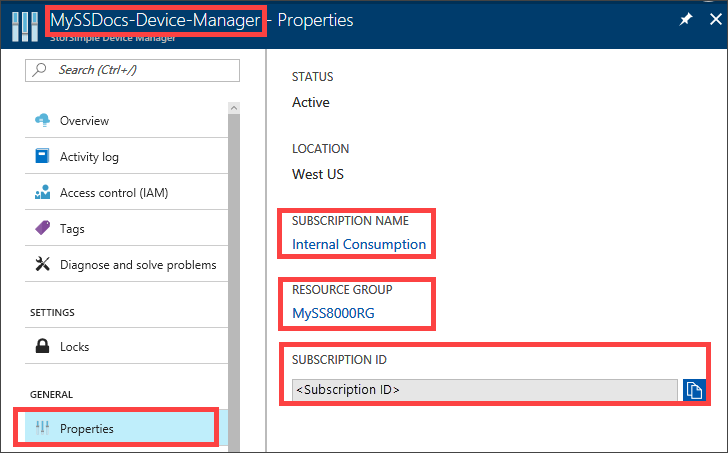
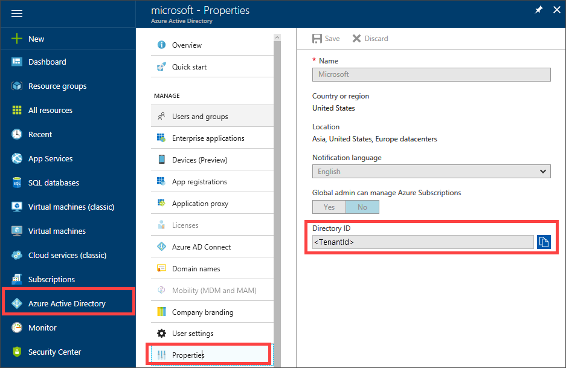

# Migrate data from StorSimple 5000-7000 series to 8000 series device

> [!IMPORTANT]
> - Migration is currently an assisted operation. If you intend to migrate data from your StorSimple 5000-7000 series device to an 8000 series device, you need to schedule migration with Microsoft Support. Microsoft Support will then enable your subscription for migration. For more information, see how to [Open a Support ticket](storsimple-8000-contact-microsoft-support.md).
>
> - Before you contact Microsoft Support, be sure to reivew and complete the [Migration prerequisites](#migration-prerequisites) indicated in the article.

## Overview

This article introduces the migration feature that allows the StorSimple 5000-7000 series customers to migrate their data to StorSimple 8000 series physical device or an 8010/8020 cloud appliance. This article also links to a downloadable step-by-step walkthrough of the steps required to migrate data from a 5000-7000 series legacy device to an 8000 series physical or cloud appliance.

This article is applicable for both the on-premises 8000 series device as well as the StorSimple Cloud Appliance.


## Migration feature versus host-side migration

You can move your data using the migration feature or by performing a host-side migration. This section describes the specifics of each method including the pros and cons. Use this information to figure out which method you want to pursue to migrate your data.

The migration feature simulates a disaster recovery (DR) process from 7000/5000 series to 8000 series. This feature allows you to migrate the data from 5000/7000 series format to 8000 series format on Azure. The migration process is initiated using the StorSimple Migration tool. The tool starts the download and the conversion of backup metadata on the 8000 series device and then uses the latest backup to expose the volumes on the device.

|      | Pros                                                                                                                                     |Cons                                                                                                                                                              |
|------|-------------------------------------------------------------------------------------------------------------------------------------------|-------------------------------------------------------------------------------------------------------------------------------------------------------------|
| 1.   | The migration process preserves the history of backups that were taken on 5000/7000 series.                                               | When users try to access the data, this migration will download the data from Azure thus incurring data download costs.                                     |
| 2.   | No data is migrated on the host side.                                                                                                     | The process needs downtime between the start of the backup and latest backup being surfaced on the 8000 series (can be estimated using the migration tool). |
| 3.   | This process preserves all the policies, bandwidth templates, encryption, and other settings on 8000 series devices.                      | User access will bring back only the data accessed by the users and will not rehydrate the entire dataset.                                                  |
| 4.   | This process requires additional time to convert all the older backups in Azure which is done asynchronously without impacting production | Migration can only be done at a cloud configuration level.  Individual volumes in a cloud configuration cannot be migrated separately                       |

A host-side migration allows setting up of 8000 series independently and copying the data from 5000/7000 series device to 8000 series device. This is equivalent to migrating data from one storage device to another. A variety of tools such as Diskboss, robocopy are used to copy the data.

|      | Pros                                                                                                                      |Cons                                                                                                                                                                                                      |
|------|---------------------------------------------------------------------------------------------------------------------------|-----------------------------------------------------------------------------------------------------------------------------------------------------------------------------------------------------|
| 1.   | Migration can be approached in a phased manner on a volume-by-volume basis.                                               | Previous backups (taken on 5000/7000 series) will not be available on the 8000 series device.                                                                                                       |
| 2.   | Allows for consolidation of data into one storage account on Azure.                                                       | First backup to the cloud on 8000 series will take a longer time as all the data on 8000 series needs to be backed up to Azure.                                                                     |
| 3.   | Following a successful migration, all the data is local on the appliance. There are no latencies when accessing the data. | Azure storage consumption will increase until the data is deleted from the 5000/7000 device.                                                                                                        |
| 4.   |                                                                                                                           | If the 7000/5000 series device has a large amount of data, during migration this data needs to be downloaded from azure which will incur costs and latencies related to downloading data from Azure |

This article focuses only on the migration feature from 5000/7000 to 8000 series device. For more information on host-side migration, go to [Migration from other storage devices](http://download.microsoft.com/download/9/4/A/94AB8165-CCC4-430B-801B-9FD40C8DA340/Migrating Data to StorSimple Volumes_09-02-15.pdf).

## Migration prerequisites

Here are the migration prerequisites for your legacy 5000 or 7000 series device and the 8000 series StorSimple device.

> [!IMPORTANT]
> Review and complete the migration prerequisites before you file a service request with Microsoft Support.

### For the 5000/7000 series device (source)

Before you begin migration, ensure that:

* You have your 5000 or 7000 series source device; the device can be live or down.

    > [!IMPORTANT]
    > We recommend that you have serial access to this device throughout the migration process. Should there be any device issues, serial access can help with troubleshooting.

* Your 5000 or 7000 series source device is running software version v2.1.1.518. Earlier versions are not supported.
* To verify the version that your 5000 or 7000 series is running, look at the top-right corner of your Web UI. This should display the software version that your device is running. For migration, your 5000 or 7000 series should be running v2.1.1.518.

    

    * If your live device is not running v2.1.1.518, please upgrade your system to the required minimal version. For detailed instructions, refer to [Upgrade your system to v2.1.1.518](http://onlinehelp.storsimple.com/111_Appliance/6_System_Upgrade_Guides/Current_(v2.1.1)/000_Software_Patch_Upgrade_Guide_v2.1.1.518).
    * If you are running v2.1.1.518, go to web UI to see if there are any notifications for registry restore failures. If registry restore had failed, run registry restore. For more information, go to how to [Run registry restore](http://onlinehelp.storsimple.com/111_Appliance/2_User_Guides/1_Current_(v2.1.1)/1_Web_UI_User_Guide_WIP/2_Configuration/4_Cloud_Accounts/1_Cloud_Credentials#Restoring_Backup_Registry).
    * If you have a down device that was not running v2.1.1.518, perform a failover to a replacement device that is running v2.1.1.518. For detailed instructions, refer to DR of your 5000/7000 series StorSimple device.
    * Back up the data for your device by taking a cloud snapshot.
    * Check for any other active backup jobs that are running on the source device. This includes the jobs on the StorSimple Data Protection Console host. Wait for the current jobs to complete.


### For the 8000 series physical device (target)

Before you begin migration, ensure that:

* Your target 8000 series device is registered and running. For more information, see how to [Deploy your StorSimple device with StorSimple Manager service](storsimple-8000-deployment-walkthrough-u2.md).
* Your 8000 series device has the latest StorSimple 8000 Series Update 5 installed and is running 6.3.9600.17845 or later version. If your device does not have the latest updates installed, you need to install the latest updates before you can proceed with migration. For more information, see how to [Install latest update on your 8000 series device](storsimple-8000-install-update-5.md).
* Your Azure subscription is enabled for migration. If your subscription is not enabled, contact Microsoft Support to enable your subscription for migration.

### For the 8010/8020 cloud appliance (target)

Before you begin migration, ensure:

* Your target cloud appliance is registered and running. For more information, see how to [Deploy and manage StorSimple Cloud Appliance](storsimple-8000-cloud-appliance-u2.md).
* Your cloud appliance is running the latest StorSimple 8000 Series Update 5 software version 6.3.9600.17845. If your cloud appliance is not running Update 5, create a new Update 5 cloud appliance before you proceed with migration. For more information, see how to [Create a 8010/8020 cloud appliance](storsimple-8000-cloud-appliance-u2.md).

### For the computer running StorSimple Migration tool

StorSimple Migration tool is a UI-based tool that enables you to migrate data from a StorSimple 5000-7000 series to an 8000 series device. To install the StorSimple Migration tool, use a computer that meets the following requirements.

The computer has Internet connectivity and:

* Is running the following operating system
    * Windows 10.
    * Windows Server 2012 R2 (or higher) to install StorSimple Migration tool.
* Has .NET 4.5.2 installed.
* Has a minimum of 5 GB of free space to install and use the tool.

> [!TIP]
> If your StorSimple device is connected to a Windows Server host, you can install the migration tool on the Windows Server host computer.

#### To install StorSimple Migration tool

Perform the following steps to install StorSimple Migration tool on your computer.

1. Copy the folder _StorSimple8000SeriesMigrationTool_ to your Windows computer. Make sure that the drive where the software is copied has sufficient space.

    Open the tool config file _StorSimple8000SeriesMigrationTool.exe.config_ in the folder. Here is the snippet of the file.
    
    ```
        <add key="UserName" value="username@xyz.com" />
        <add key="SubscriptionName" value="YourSubscriptionName" />
        <add key="SubscriptionId" value="YourSubscriptionId" />
        <add key="TenantId" value="YourTenantId" />
        <add key="ResourceName" value="YourResourceName" />
        <add key="ResourceGroupName" value="YourResourceGroupName" />

    ```
2. Edit the values corresponding to the keys and replace with:

    * `UserName` – User name to log in to Azure portal.
    * `SubscriptionName and SubscriptionId` –  Name and ID for your Azure subscription. In your StorSimple Device Manager service landing page, under **General**, click **Properties**. Copy the Subscription name and Subscription ID associated with your service.
    * `ResourceName` – Name of your StorSimple Device Manager service in the Azure portal. Also shown under service properties.
    * `ResourceGroup` – Name of the resource group associated with your StorSimple Device Manager service in the Azure portal. Also shown under service properties.
    
    * `TenantId` –  Azure Active Directory Tenant ID in Azure portal. Log in to Microsoft Azure as an administrator. In the Microsoft Azure portal, click **Azure Active Directory**. Under **Manage**, click **Properties**. The tenant ID is shown in the **Directory ID** box.
    

3.	Save the changes made to the config file.
4.	Run the _StorSimple8000SeriesMigrationTool.exe_ to launch the tool. When prompted for credentials, provide the credentials associated with your subscription in Azure portal. 
5.	The StorSimple Migration tool UI is displayed.
  

## Next steps
Download the step-by-step instructions on how to [Migrate data from a StorSimple 5000-7000 series to an 8000 series device](https://gallery.technet.microsoft.com/Azure-StorSimple-50007000-c1a0460b).
